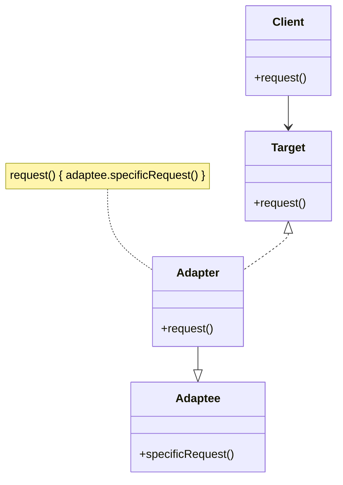
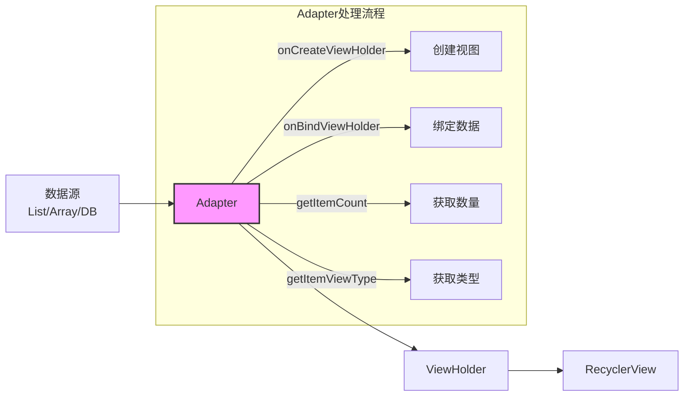
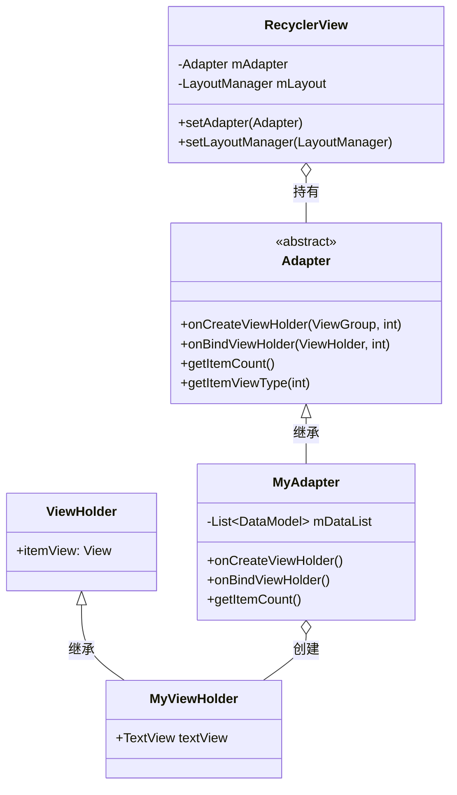

# Adapter模式在RecyclerView中的应用

## Adapter设计模式简介

Adapter（适配器）模式是一种结构型设计模式，它允许不兼容的接口一起工作。适配器模式的核心思想是通过一个中间层，将一个类的接口转换成客户端所期望的另一个接口，使原本由于接口不匹配而无法在一起工作的类能够协同工作。



## RecyclerView中的Adapter模式

在RecyclerView中，Adapter模式扮演着至关重要的角色，它是连接数据源与视图展示的桥梁。



### 核心职责

1. **数据转换**：将原始数据模型转换为RecyclerView可以显示的视图
2. **数据绑定**：将数据内容绑定到ViewHolder的视图组件上
3. **视图创建**：负责创建Item的视图（ViewHolder）
4. **类型管理**：处理不同类型的Item视图

### 源码分析

RecyclerView.Adapter的核心方法：

```java
// 创建ViewHolder
public abstract VH onCreateViewHolder(ViewGroup parent, int viewType);

// 绑定数据到ViewHolder
public abstract void onBindViewHolder(VH holder, int position);

// 获取数据项数量
public abstract int getItemCount();

// 获取数据项的类型（可选重写）
public int getItemViewType(int position) {
    return 0;
}
```

### 适配过程

1. **数据源** → **Adapter** → **ViewHolder** → **RecyclerView**

在这个过程中：
- 数据源可以是任何格式（List、数组、数据库结果等）
- Adapter将这些数据转换为RecyclerView能够理解的格式
- ViewHolder持有视图引用，提高性能
- RecyclerView负责展示和回收利用视图



## Adapter模式的优势

在RecyclerView的实现中，使用Adapter模式带来以下优势：

1. **解耦数据与视图**：
   - 数据源可以独立变化而不影响视图层
   - 视图可以独立修改而不影响数据层

2. **提高灵活性**：
   - 支持异构列表（不同类型的Item）
   - 可以动态更改数据源类型而不影响RecyclerView

3. **优化性能**：
   - 通过ViewHolder模式减少findViewById()调用
   - 支持局部更新数据，避免全局刷新

## 实现示例

一个典型的RecyclerView.Adapter实现：

```java
public class MyAdapter extends RecyclerView.Adapter<MyAdapter.ViewHolder> {
    private List<MyDataModel> mDataList;
    
    // ViewHolder定义
    public static class ViewHolder extends RecyclerView.ViewHolder {
        // 视图组件
        public TextView textView;
        
        public ViewHolder(View itemView) {
            super(itemView);
            textView = itemView.findViewById(R.id.text_view);
        }
    }
    
    // 构造函数
    public MyAdapter(List<MyDataModel> dataList) {
        mDataList = dataList;
    }
    
    // 创建ViewHolder
    @Override
    public ViewHolder onCreateViewHolder(ViewGroup parent, int viewType) {
        View view = LayoutInflater.from(parent.getContext())
                .inflate(R.layout.item_layout, parent, false);
        return new ViewHolder(view);
    }
    
    // 绑定数据到ViewHolder
    @Override
    public void onBindViewHolder(ViewHolder holder, int position) {
        MyDataModel data = mDataList.get(position);
        holder.textView.setText(data.getText());
    }
    
    // 获取数据项数量
    @Override
    public int getItemCount() {
        return mDataList.size();
    }
}
```

## 总结

Adapter模式是RecyclerView架构中的关键设计模式，它实现了数据源和视图之间的解耦，使RecyclerView具有极高的灵活性和可扩展性。通过将数据转换和绑定的责任委托给Adapter，RecyclerView可以专注于视图的高效展示和回收复用。

在下一节中，我们将介绍观察者模式在RecyclerView中的应用，尤其是数据变化通知机制的实现。 