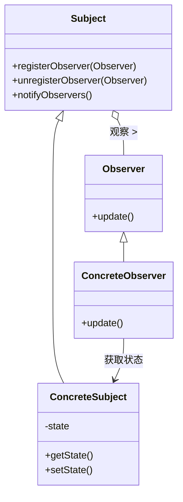
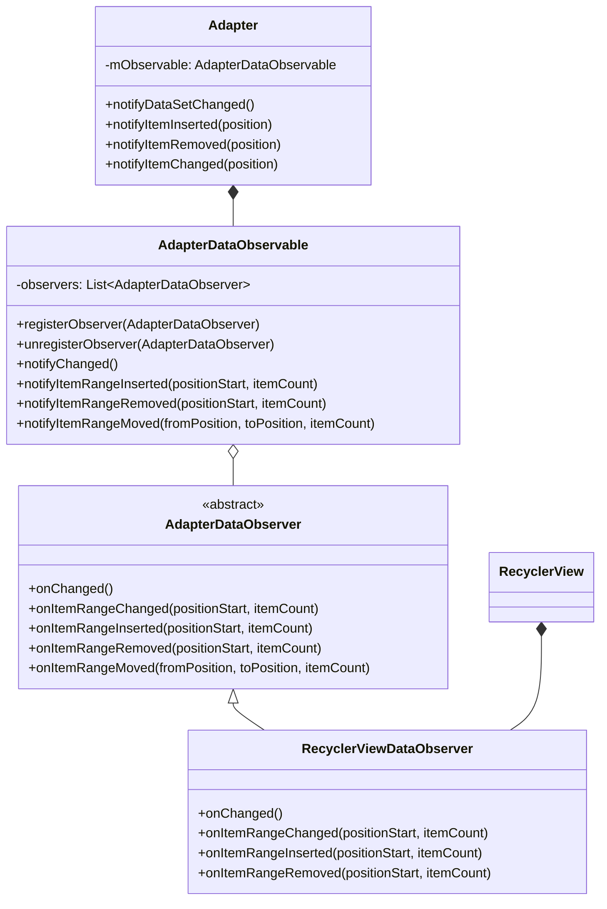
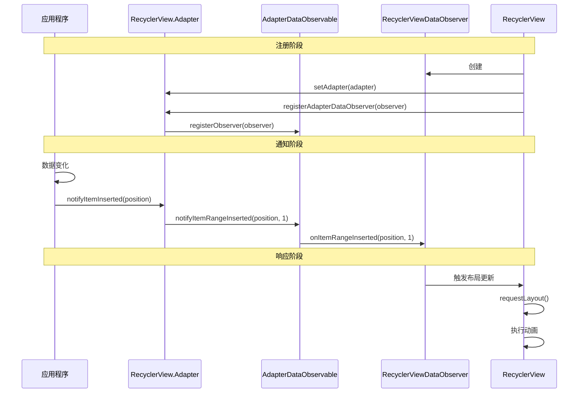

# 观察者模式在RecyclerView中的应用

## 观察者设计模式简介

观察者模式（Observer Pattern）是一种行为型设计模式，它定义了对象之间的一对多依赖关系，当一个对象（被观察者/主题）状态发生变化时，所有依赖于它的对象（观察者）都会得到通知并自动更新。

观察者模式的核心组成部分：
- **Subject（主题/被观察者）**：维护观察者列表，提供添加和删除观察者的方法
- **Observer（观察者）**：定义接收通知时的更新接口
- **ConcreteSubject（具体主题）**：实现主题接口，当状态变化时通知观察者
- **ConcreteObserver（具体观察者）**：实现观察者接口，定义收到通知时的具体行为



## RecyclerView中的观察者模式

在RecyclerView的实现中，观察者模式主要用于数据变化的通知机制，即当Adapter中的数据发生变化时，通知RecyclerView进行相应的视图更新。



### 核心实现类

1. **AdapterDataObservable**：被观察者，维护观察者（AdapterDataObserver）列表
2. **AdapterDataObserver**：抽象观察者，定义数据变化时的回调方法
3. **RecyclerViewDataObserver**：具体观察者，RecyclerView内部实现，接收数据变化通知并触发视图更新

### 源码分析

#### AdapterDataObservable 类

```java
static class AdapterDataObservable extends Observable<AdapterDataObserver> {
    // 通知所有观察者整个数据集已更改
    public void notifyChanged() {
        for (int i = mObservers.size() - 1; i >= 0; i--) {
            mObservers.get(i).onChanged();
        }
    }
    
    // 通知所有观察者数据项已插入
    public void notifyItemRangeInserted(int positionStart, int itemCount) {
        for (int i = mObservers.size() - 1; i >= 0; i--) {
            mObservers.get(i).onItemRangeInserted(positionStart, itemCount);
        }
    }
    
    // 通知所有观察者数据项已移除
    public void notifyItemRangeRemoved(int positionStart, int itemCount) {
        for (int i = mObservers.size() - 1; i >= 0; i--) {
            mObservers.get(i).onItemRangeRemoved(positionStart, itemCount);
        }
    }
    
    // 其他通知方法...
}
```

#### AdapterDataObserver 抽象类

```java
public abstract static class AdapterDataObserver {
    public void onChanged() {
        // 默认空实现
    }
    
    public void onItemRangeChanged(int positionStart, int itemCount) {
        // 默认空实现
    }
    
    public void onItemRangeChanged(int positionStart, int itemCount, @Nullable Object payload) {
        onItemRangeChanged(positionStart, itemCount);
    }
    
    public void onItemRangeInserted(int positionStart, int itemCount) {
        // 默认空实现
    }
    
    public void onItemRangeRemoved(int positionStart, int itemCount) {
        // 默认空实现
    }
    
    public void onItemRangeMoved(int fromPosition, int toPosition, int itemCount) {
        // 默认空实现
    }
}
```

#### RecyclerView.Adapter 中的实现

```java
private final AdapterDataObservable mObservable = new AdapterDataObservable();

// 注册观察者
public void registerAdapterDataObserver(@NonNull AdapterDataObserver observer) {
    mObservable.registerObserver(observer);
}

// 注销观察者
public void unregisterAdapterDataObserver(@NonNull AdapterDataObserver observer) {
    mObservable.unregisterObserver(observer);
}

// 通知数据集变化
public final void notifyDataSetChanged() {
    mObservable.notifyChanged();
}

// 通知数据项插入
public final void notifyItemInserted(int position) {
    mObservable.notifyItemRangeInserted(position, 1);
}

// 其他通知方法...
```

## 观察者模式的工作流程

在RecyclerView中，观察者模式的工作流程如下：

1. **注册阶段**：
   - 当RecyclerView设置Adapter时，会创建RecyclerViewDataObserver并注册到Adapter
   - `mAdapter.registerAdapterDataObserver(mObserver);`

2. **通知阶段**：
   - 当应用程序调用Adapter的notify方法时（如notifyDataSetChanged()）
   - Adapter内部的AdapterDataObservable通知所有已注册的观察者

3. **响应阶段**：
   - RecyclerViewDataObserver接收到通知
   - 触发RecyclerView的布局和绘制流程
   - 可能会触发ItemAnimator执行相应的动画



## 观察者模式优势

在RecyclerView中使用观察者模式带来以下优势：

1. **松耦合**：
   - Adapter不需要直接引用RecyclerView
   - 可以实现一对多的通知（一个Adapter可以被多个RecyclerView使用）

2. **精细化更新**：
   - 支持局部更新（插入、删除、移动、更改）
   - 减少不必要的全局刷新，提高性能

3. **动画支持**：
   - 细粒度的数据变化通知支持精确的动画效果
   - 提升用户体验

## 实际应用示例

```java
// 在Activity或Fragment中
MyAdapter adapter = new MyAdapter(dataList);
recyclerView.setAdapter(adapter);

// 添加数据并通知
dataList.add(newItem);
adapter.notifyItemInserted(dataList.size() - 1);

// 删除数据并通知
dataList.remove(position);
adapter.notifyItemRemoved(position);

// 更新数据并通知
dataList.set(position, updatedItem);
adapter.notifyItemChanged(position);
```

## 总结

观察者模式是RecyclerView架构中不可或缺的设计模式，它实现了Adapter和RecyclerView之间的松耦合通信机制。通过观察者模式，RecyclerView能够精确地响应数据变化，执行必要的视图更新和动画效果，既提高了性能，又增强了用户体验。

在下一节中，我们将介绍RecyclerView的核心类结构，深入了解各个组件的具体实现。 