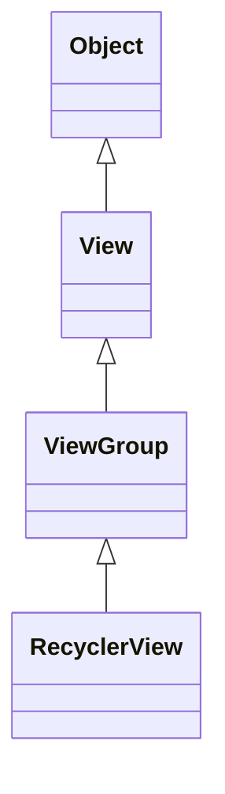
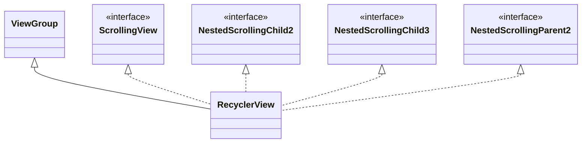
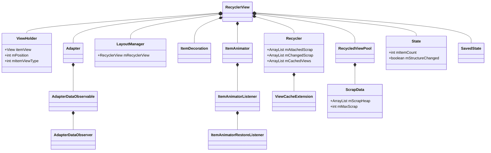

# RecyclerView类结构分析

RecyclerView是Android支持库中的一个核心UI组件，它的内部结构复杂而精巧。本节将深入分析RecyclerView的类结构，以便更好地理解其工作原理。

## RecyclerView继承关系

RecyclerView的继承关系如下：

```
java.lang.Object
  ↳ android.view.View
      ↳ android.view.ViewGroup
          ↳ androidx.recyclerview.widget.RecyclerView
```

以下是使用mermaid图表表示的继承关系：



作为ViewGroup的子类，RecyclerView具备了视图容器的所有基本功能，同时它还实现了多个接口以支持更复杂的功能：

```java
public class RecyclerView extends ViewGroup implements ScrollingView, 
        NestedScrollingChild2, NestedScrollingChild3, NestedScrollingParent2 {
    // ...
}
```

以下是RecyclerView实现的接口关系图：



- **ScrollingView**：表明这是一个可滚动的视图
- **NestedScrollingChild2/3**：支持嵌套滚动的子视图功能
- **NestedScrollingParent2**：支持嵌套滚动的父视图功能


## 核心成员变量

RecyclerView类中包含大量成员变量，以下是一些关键的成员变量：

```java
// 布局管理器
LayoutManager mLayout;

// 适配器
RecyclerView.Adapter mAdapter;

// 视图回收器
final Recycler mRecycler = new Recycler();

// 子视图辅助类
final ChildHelper mChildHelper;

// 项目动画器
ItemAnimator mItemAnimator;

// 项目装饰器列表
private final ArrayList<ItemDecoration> mItemDecorations = new ArrayList<>();

// 状态
final State mState = new State();

// 适配器观察者
private RecyclerViewDataObserver mObserver;

// 视图缓存扩展
ViewCacheExtension mViewCacheExtension;

// 回收视图池
RecycledViewPool mRecyclerPool;

// 嵌套滚动相关
private NestedScrollingChildHelper mScrollingChildHelper;
private final int[] mScrollOffset = new int[2];
private final int[] mScrollConsumed = new int[2];

// 触摸事件处理
private final int[] mNestedOffsets = new int[2];
private VelocityTracker mVelocityTracker;
private int mScrollState = SCROLL_STATE_IDLE;
```


## 内部类结构

RecyclerView定义了许多重要的内部类，它们共同构成了RecyclerView的功能体系：

1. **ViewHolder**：视图持有者，缓存Item视图的所有子View引用
   ```java
   public abstract static class ViewHolder {
       View itemView;
       int mPosition;
       int mOldPosition;
       long mItemId;
       int mItemViewType;
       int mPreLayoutPosition;
       // ...
   }
   ```

2. **Adapter**：数据适配器，为RecyclerView提供数据和视图的抽象类
   ```java
   public abstract static class Adapter<VH extends ViewHolder> {
       private final AdapterDataObservable mObservable = new AdapterDataObservable();
       // ...
   }
   ```

3. **LayoutManager**：布局管理器，负责Item的测量和布局的抽象类
   ```java
   public abstract static class LayoutManager {
       RecyclerView mRecyclerView;
       // ...
   }
   ```

4. **ItemDecoration**：项目装饰器，用于绘制Item间的分割线或其他装饰的抽象类
   ```java
   public abstract static class ItemDecoration {
       // ...
   }
   ```

5. **ItemAnimator**：项目动画器，处理Item的添加、移除、移动等动画的抽象类
   ```java
   public abstract static class ItemAnimator {
       // ...
   }
   ```

6. **Recycler**：回收器，管理废弃视图的回收和复用
   ```java
   public final class Recycler {
       final ArrayList<ViewHolder> mAttachedScrap = new ArrayList<>();
       ArrayList<ViewHolder> mChangedScrap = null;
       final ArrayList<ViewHolder> mCachedViews = new ArrayList<ViewHolder>();
       // ...
   }
   ```

7. **RecycledViewPool**：回收视图池，用于在多个RecyclerView间共享回收的视图
   ```java
   public static class RecycledViewPool {
       static class ScrapData {
           final ArrayList<ViewHolder> mScrapHeap = new ArrayList<>();
           int mMaxScrap = DEFAULT_MAX_SCRAP;
       }
       SparseArray<ScrapData> mScrap = new SparseArray<>();
       // ...
   }
   ```

8. **State**：状态类，保存RecyclerView的当前状态
   ```java
   public class State {
       int mTargetPosition = RecyclerView.NO_POSITION;
       private SparseArray<Object> mData;
       int mItemCount = 0;
       int mPreviousLayoutItemCount = 0;
       int mDeletedInvisibleItemCountSincePreviousLayout = 0;
       boolean mStructureChanged = false;
       boolean mInPreLayout = false;
       boolean mTrackOldChangeHolders = false;
       boolean mIsMeasuring = false;
       // ...
   }
   ```

9. **AdapterDataObserver**：数据观察者，监听Adapter数据变化的抽象类
   ```java
   public abstract static class AdapterDataObserver {
       // ...
   }
   ```

10. **SavedState**：保存状态类，用于保存和恢复RecyclerView的状态
    ```java
    protected static class SavedState extends AbsSavedState {
        Parcelable mLayoutState;
        // ...
    }
    ```

## 嵌套类的关系图

以下是RecyclerView主要嵌套类之间的关系：

```
RecyclerView
  │
  ├── ViewHolder
  │
  ├── Adapter<VH>
  │    └── AdapterDataObservable
  │         └── AdapterDataObserver
  │
  ├── LayoutManager
  │
  ├── ItemDecoration
  │
  ├── ItemAnimator
  │    └── ItemAnimatorListener
  │         └── ItemAnimatorRestoreListener
  │
  ├── Recycler
  │    └── ViewCacheExtension
  │
  ├── RecycledViewPool
  │    └── ScrapData
  │
  ├── State
  │
  └── SavedState
```

以下是使用mermaid图表表示的内部类结构关系：



## 总结

RecyclerView的类结构设计遵循了高内聚、低耦合的原则，将不同的功能职责分离到不同的类中，形成了一个灵活而高效的UI组件。这种模块化的设计使得RecyclerView具有极高的可定制性和可扩展性，开发者可以通过自定义这些组件来实现各种复杂的列表效果。

在下一节中，我们将详细介绍RecyclerView中的主要接口和抽象类的设计理念和实现细节。 