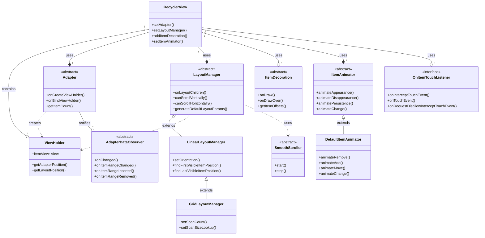
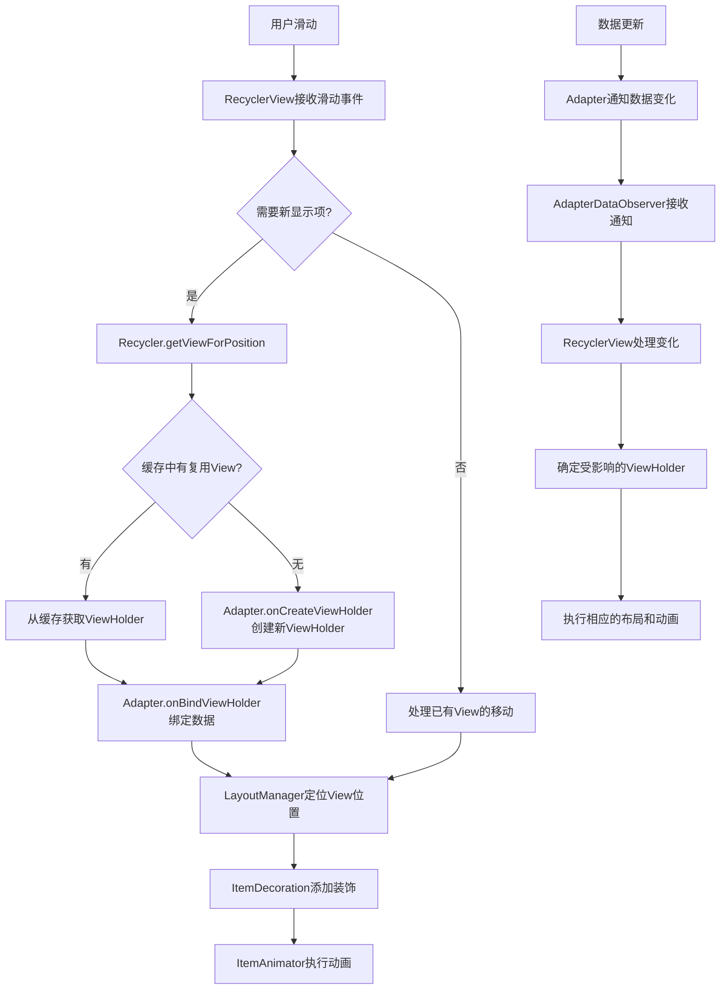
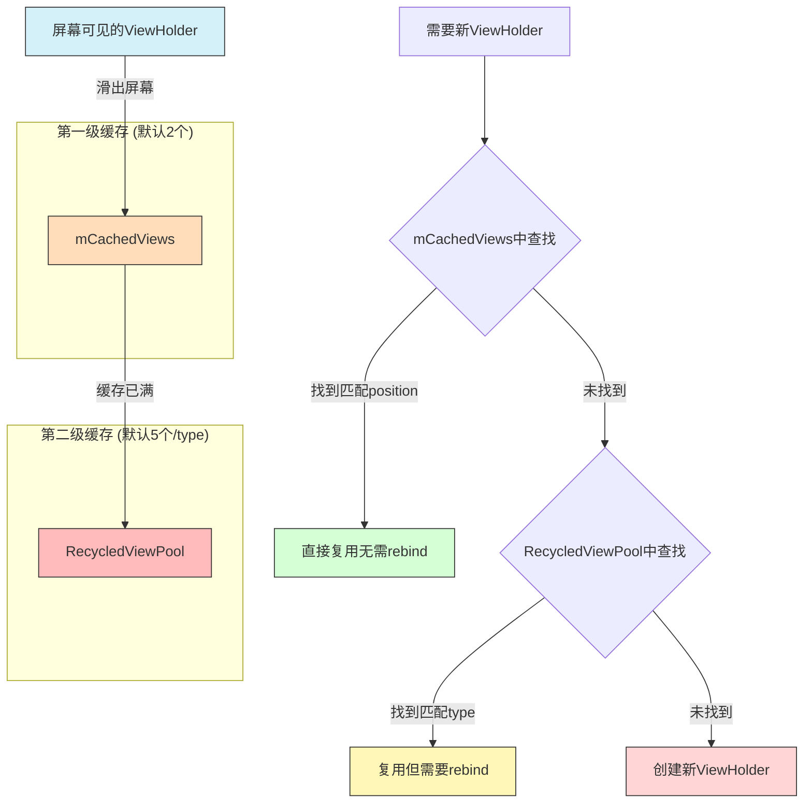

# RecyclerView主要接口和抽象类

RecyclerView的设计遵循了良好的面向接口编程原则，通过定义清晰的接口和抽象类，实现了高度的灵活性和可扩展性。本节将介绍RecyclerView中的主要接口和抽象类，分析它们的设计理念和使用方式。

## RecyclerView架构图

下面的类图展示了RecyclerView的主要组件及其关系：



## 主要接口

### 1. Adapter相关接口

#### RecyclerView.Adapter

`RecyclerView.Adapter`是一个抽象类而非接口，但它定义了适配器的核心行为：

```java
public abstract static class Adapter<VH extends ViewHolder> {
    // 创建ViewHolder
    public abstract VH onCreateViewHolder(@NonNull ViewGroup parent, int viewType);
    
    // 绑定数据到ViewHolder
    public abstract void onBindViewHolder(@NonNull VH holder, int position);
    
    // 获取数据项数量
    public abstract int getItemCount();
    
    // 其他非抽象方法...
}
```

#### AdapterDataObserver

`AdapterDataObserver`是观察者模式中的观察者接口，用于监听Adapter数据变化：

```java
public abstract static class AdapterDataObserver {
    public void onChanged() {}
    public void onItemRangeChanged(int positionStart, int itemCount) {}
    public void onItemRangeChanged(int positionStart, int itemCount, @Nullable Object payload) {}
    public void onItemRangeInserted(int positionStart, int itemCount) {}
    public void onItemRangeRemoved(int positionStart, int itemCount) {}
    public void onItemRangeMoved(int fromPosition, int toPosition, int itemCount) {}
}
```

### 2. 布局相关接口

#### LayoutManager

`LayoutManager`是一个抽象类，负责测量和定位RecyclerView中的子视图：

```java
public abstract class LayoutManager {
    // 创建布局参数
    public abstract RecyclerView.LayoutParams generateDefaultLayoutParams();
    
    // 是否支持垂直滚动
    public boolean canScrollVertically() { return false; }
    
    // 是否支持水平滚动
    public boolean canScrollHorizontally() { return false; }
    
    // 布局子视图
    public void onLayoutChildren(Recycler recycler, State state) {}
    
    // 其他方法...
}
```

#### LayoutManager.LayoutPrefetchRegistry

用于预取视图的接口：

```java
public interface LayoutPrefetchRegistry {
    void addPosition(int layoutPosition, int pixelDistance);
}
```

### 3. 触摸事件相关接口

#### OnItemTouchListener

用于拦截和处理RecyclerView的触摸事件：

```java
public interface OnItemTouchListener {
    boolean onInterceptTouchEvent(@NonNull RecyclerView rv, @NonNull MotionEvent e);
    void onTouchEvent(@NonNull RecyclerView rv, @NonNull MotionEvent e);
    void onRequestDisallowInterceptTouchEvent(boolean disallowIntercept);
}
```

#### ItemTouchHelper.Callback

用于支持拖拽和滑动手势的回调接口：

```java
public abstract static class Callback {
    public abstract int getMovementFlags(RecyclerView recyclerView, ViewHolder viewHolder);
    public abstract boolean onMove(RecyclerView recyclerView, ViewHolder viewHolder, ViewHolder target);
    public abstract void onSwiped(ViewHolder viewHolder, int direction);
    // 其他方法...
}
```

### 4. 装饰和动画相关接口

#### ItemDecoration

用于在Item视图之上绘制装饰内容：

```java
public abstract static class ItemDecoration {
    public void onDraw(Canvas c, RecyclerView parent, State state) {}
    public void onDrawOver(Canvas c, RecyclerView parent, State state) {}
    public void getItemOffsets(Rect outRect, View view, RecyclerView parent, State state) {}
}
```

#### ItemAnimator

负责处理Item添加、移除、移动和变化的动画效果：

```java
public abstract class ItemAnimator {
    public abstract boolean animateDisappearance(@NonNull ViewHolder viewHolder, 
                                               @NonNull ItemHolderInfo preLayoutInfo, 
                                               @Nullable ItemHolderInfo postLayoutInfo);
    public abstract boolean animateAppearance(@NonNull ViewHolder viewHolder, 
                                            @Nullable ItemHolderInfo preLayoutInfo, 
                                            @NonNull ItemHolderInfo postLayoutInfo);
    public abstract boolean animatePersistence(@NonNull ViewHolder viewHolder, 
                                             @NonNull ItemHolderInfo preLayoutInfo, 
                                             @NonNull ItemHolderInfo postLayoutInfo);
    public abstract boolean animateChange(@NonNull ViewHolder oldHolder, 
                                        @NonNull ViewHolder newHolder, 
                                        @NonNull ItemHolderInfo preLayoutInfo, 
                                        @NonNull ItemHolderInfo postLayoutInfo);
    // 其他方法...
}
```

#### ItemAnimator.ItemAnimatorListener

监听动画状态变化：

```java
interface ItemAnimatorListener {
    void onAnimationFinished(@NonNull ViewHolder item);
}
```

### 5. 滚动和预加载相关接口

#### NestedScrollingChild

支持嵌套滚动的子视图接口：

```java
public interface NestedScrollingChild {
    boolean startNestedScroll(int axes);
    void stopNestedScroll();
    boolean hasNestedScrollingParent();
    boolean dispatchNestedScroll(int dxConsumed, int dyConsumed, int dxUnconsumed, 
                                int dyUnconsumed, @Nullable int[] offsetInWindow);
    boolean dispatchNestedPreScroll(int dx, int dy, 
                                   @Nullable int[] consumed, @Nullable int[] offsetInWindow);
    boolean dispatchNestedFling(float velocityX, float velocityY, boolean consumed);
    boolean dispatchNestedPreFling(float velocityX, float velocityY);
}
```

#### RecyclerView.SmoothScroller

平滑滚动到指定位置的接口：

```java
public abstract static class SmoothScroller {
    public abstract void start(RecyclerView recyclerView, RecyclerView.LayoutManager layoutManager);
    public abstract void stop();
    // 其他方法...
}
```

## 主要抽象类

### 1. ViewHolder

`ViewHolder`是RecyclerView中最基础的组件之一，它持有Item视图的引用：

```java
public abstract static class ViewHolder {
    public final View itemView;
    int mPosition = NO_POSITION;
    int mOldPosition = NO_POSITION;
    long mItemId = NO_ID;
    int mItemViewType = INVALID_TYPE;
    int mPreLayoutPosition = NO_POSITION;
    // 其他字段和方法...
}
```

### 2. DefaultItemAnimator

默认的Item动画实现：

```java
public class DefaultItemAnimator extends SimpleItemAnimator {
    @Override
    public boolean animateRemove(ViewHolder holder) { /* 实现 */ }
    @Override
    public boolean animateAdd(ViewHolder holder) { /* 实现 */ }
    @Override
    public boolean animateMove(ViewHolder holder, int fromX, int fromY, int toX, int toY) { /* 实现 */ }
    @Override
    public boolean animateChange(ViewHolder oldHolder, ViewHolder newHolder, 
                               int fromX, int fromY, int toX, int toY) { /* 实现 */ }
    @Override
    public void runPendingAnimations() { /* 实现 */ }
    @Override
    public void endAnimation(ViewHolder item) { /* 实现 */ }
    @Override
    public void endAnimations() { /* 实现 */ }
    @Override
    public boolean isRunning() { /* 实现 */ }
}
```

### 3. 布局管理器的具体实现

#### LinearLayoutManager

线性布局管理器：

```java
public class LinearLayoutManager extends RecyclerView.LayoutManager {
    // 垂直方向
    public static final int VERTICAL = OrientationHelper.VERTICAL;
    // 水平方向
    public static final int HORIZONTAL = OrientationHelper.HORIZONTAL;
    // 实现LayoutManager的抽象方法...
}
```

#### GridLayoutManager

网格布局管理器：

```java
public class GridLayoutManager extends LinearLayoutManager {
    // 跨度查找器接口
    public abstract static class SpanSizeLookup {
        public abstract int getSpanSize(int position);
        // 其他方法...
    }
    // 实现和重写的方法...
}
```

## RecyclerView工作流程

下图展示了RecyclerView的主要工作流程和各组件之间的交互：



## 接口设计原则

RecyclerView的接口设计体现了以下几个核心原则：

### 1. 单一职责原则（SRP）

每个接口或抽象类都有明确的职责：
- Adapter负责提供数据
- LayoutManager负责布局
- ItemDecoration负责装饰
- ItemAnimator负责动画

### 2. 开闭原则（OCP）

系统设计对扩展开放，对修改关闭：
- 可以扩展自定义的LayoutManager、ItemDecoration等
- 核心功能不需要修改就能适应不同的需求

### 3. 依赖倒置原则（DIP）

高层模块不依赖低层模块，都依赖于抽象：
- RecyclerView依赖于抽象的Adapter和LayoutManager
- 不同组件通过接口而非具体实现进行交互

### 4. 接口隔离原则（ISP）

接口精简，只包含必要的方法：
- OnItemTouchListener只定义了触摸相关的方法
- AdapterDataObserver只关心数据变化的通知

## RecyclerView缓存机制

RecyclerView 的高效表现很大程度上归功于其复杂的缓存机制，下图展示了其缓存层次结构：



## 总结

RecyclerView通过精心设计的接口和抽象类，实现了高度可定制和可扩展的列表功能。这些接口和抽象类各自负责不同的职责，通过组合形成了一个强大而灵活的UI组件。

开发者可以通过实现这些接口或继承这些抽象类，定制RecyclerView的各个方面的行为，满足不同应用场景的需求，而无需修改RecyclerView的核心代码。这种设计使RecyclerView成为Android中最灵活的UI组件之一。

在接下来的章节中，我们将深入分析RecyclerView的核心组件，包括Adapter、LayoutManager等，了解它们的具体实现和工作原理。 