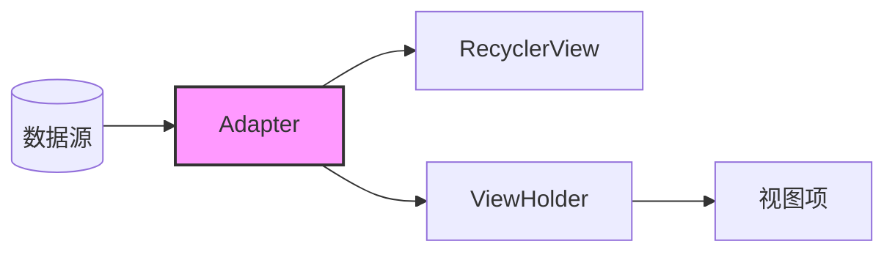
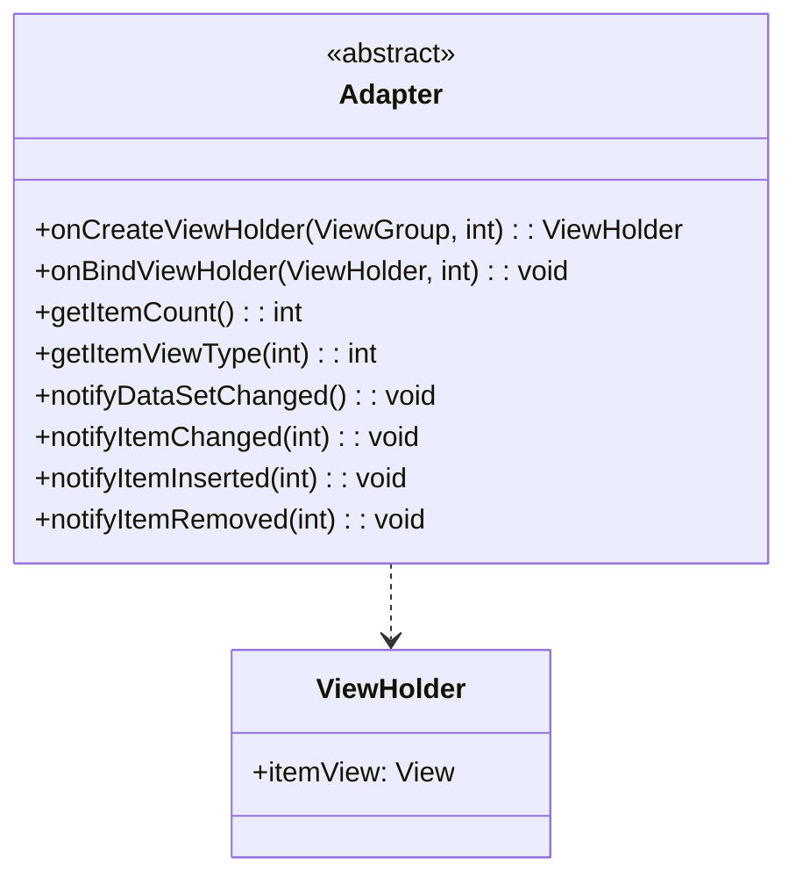
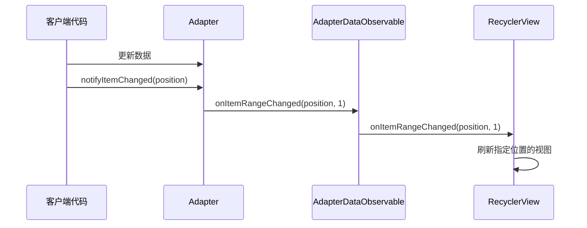

# RecyclerView Adapter接口设计

## 概述

Adapter是RecyclerView框架中的核心组件之一，它负责将数据集与RecyclerView中显示的视图项进行绑定。Adapter的设计遵循了适配器设计模式，其接口设计灵活而强大，能够适应各种不同的数据展示需求。	



## Adapter接口的设计原理

### 1. 接口定义

在RecyclerView框架中，Adapter被定义为一个抽象类：

```java
public abstract static class Adapter<VH extends ViewHolder> {
    // 核心方法...
}
```

这里采用了泛型设计，`VH`代表ViewHolder类型，这使得Adapter能够与不同类型的ViewHolder配合使用。

### 2. 核心方法

Adapter接口设计中最重要的几个方法包括：



#### 创建ViewHolder
```java
public abstract VH onCreateViewHolder(@NonNull ViewGroup parent, int viewType);
```
该方法负责创建视图持有者，它接收视图类型参数，使得可以在同一个RecyclerView中显示不同类型的视图。

#### 绑定数据
```java
public abstract void onBindViewHolder(@NonNull VH holder, int position);
```
该方法负责将数据与ViewHolder绑定，实现数据到视图的转换。

#### 获取数据集大小
```java
public abstract int getItemCount();
```
告诉RecyclerView数据集中有多少个条目，这是布局过程中的关键信息。

#### 获取条目类型（可选）
```java
public int getItemViewType(int position) {
    return 0;
}
```
默认返回0，表示所有条目类型相同，可重写此方法以支持多类型视图。

### 3. 数据变更通知机制

Adapter设计中的另一个重要特性是数据变更通知机制：



```java
public final void notifyDataSetChanged()
public final void notifyItemChanged(int position)
public final void notifyItemInserted(int position)
public final void notifyItemRemoved(int position)
public final void notifyItemRangeChanged(int positionStart, int itemCount)
// 等等...
```

这些方法允许Adapter通知RecyclerView数据发生了变化，从而触发视图的刷新。相比于ListView中的notifyDataSetChanged()，RecyclerView提供了更加细粒度的通知方法，这对于优化性能和实现动画效果非常重要。

### 4. 注册与分发观察者

Adapter内部维护了一个观察者列表，用于处理数据变更通知：

```java
private final AdapterDataObservable mObservable = new AdapterDataObservable();

public void registerAdapterDataObserver(@NonNull AdapterDataObserver observer) {
    mObservable.registerObserver(observer);
}

public void unregisterAdapterDataObserver(@NonNull AdapterDataObserver observer) {
    mObservable.unregisterObserver(observer);
}
```

这些方法使RecyclerView能够监听Adapter的数据变化。

## Adapter接口的特性与优势

1. **解耦数据与视图**：通过Adapter模式，数据源与视图表现被完全分离，这提高了代码的可维护性和灵活性。

2. **支持异构视图**：getItemViewType方法允许在一个RecyclerView中显示多种不同类型的视图，这在复杂的界面设计中非常有用。

3. **高效的局部刷新**：细粒度的通知方法使得RecyclerView只需要更新发生变化的部分，而不必重新布局整个列表。

4. **可扩展性**：开发者可以通过继承Adapter类，实现各种自定义功能，如添加头部/尾部、空视图处理等。

## 实现示例

以下是一个简单的Adapter实现示例：

```java
public class MyAdapter extends RecyclerView.Adapter<MyAdapter.MyViewHolder> {
    private List<String> mDataset;

    // ViewHolder类定义
    public static class MyViewHolder extends RecyclerView.ViewHolder {
        public TextView textView;
        
        public MyViewHolder(View v) {
            super(v);
            textView = v.findViewById(R.id.text_view);
        }
    }

    // 构造器
    public MyAdapter(List<String> dataset) {
        mDataset = dataset;
    }

    // 创建新视图
    @Override
    public MyAdapter.MyViewHolder onCreateViewHolder(ViewGroup parent, int viewType) {
        View v = LayoutInflater.from(parent.getContext())
                .inflate(R.layout.my_text_view, parent, false);
        return new MyViewHolder(v);
    }

    // 替换视图的内容
    @Override
    public void onBindViewHolder(MyViewHolder holder, int position) {
        holder.textView.setText(mDataset.get(position));
    }

    // 返回数据集大小
    @Override
    public int getItemCount() {
        return mDataset.size();
    }
}
```

## 总结

RecyclerView的Adapter接口设计体现了灵活性、高效性和可扩展性的特点。它通过适配器模式将数据与视图分离，并提供了细粒度的数据变更通知机制，使得RecyclerView能够高效地展示各种复杂的列表内容。开发者可以根据自己的需求，灵活地实现各种自定义功能，这也是RecyclerView相比于ListView等早期控件的重要优势之一。 