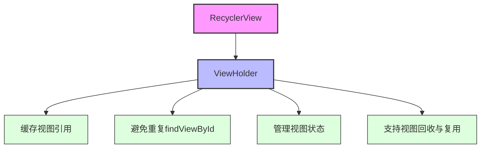
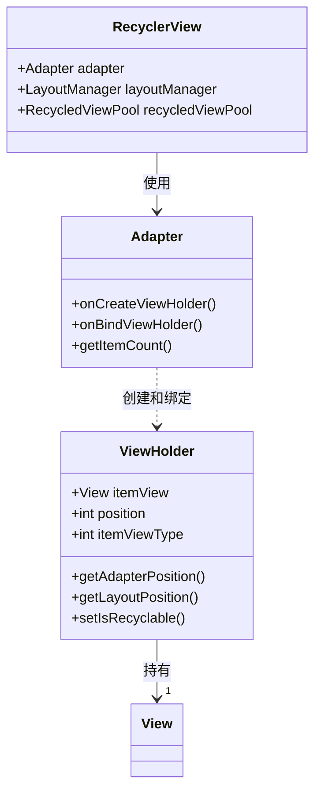
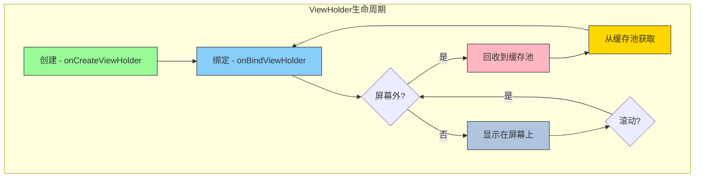

# ViewHolder模式

## 概述

ViewHolder模式是Android中用于优化列表视图性能的一种架构模式。在RecyclerView中，ViewHolder模式被作为强制性的架构模式来实现，这与早期的ListView有所不同，ListView中ViewHolder模式只是一种推荐的最佳实践。



## ViewHolder的设计思想

ViewHolder模式的核心思想是**缓存视图引用**，避免重复调用`findViewById()`方法，从而提高滚动性能。在RecyclerView中，这一模式被进一步强化，成为整个视图回收与复用机制的基础。



## RecyclerView中的ViewHolder实现

### 1. 基础结构

在RecyclerView框架中，ViewHolder被定义为一个静态抽象类：

```java
public abstract static class ViewHolder {
    @NonNull
    public final View itemView;
    
    // 其他成员变量与方法...
}
```

每个ViewHolder实例都持有一个itemView引用，这是列表项的根视图。开发者需要继承此类并添加对应于布局中各个视图元素的引用字段。

### 2. 核心属性

ViewHolder类中包含了许多重要的内部属性，这些属性用于支持RecyclerView的视图回收与复用机制：

```java
int mPosition = NO_POSITION;          // 在数据集中的位置
int mOldPosition = NO_POSITION;       // 用于动画
long mItemId = NO_ID;                 // 条目ID
int mItemViewType = INVALID_TYPE;     // 视图类型
int mPreLayoutPosition = NO_POSITION; // 预布局位置

// 标记位，用于表示ViewHolder的各种状态
static final int FLAG_BOUND = 1 << 0;            // 表示该ViewHolder已绑定到某个位置
static final int FLAG_UPDATE = 1 << 1;           // 表示该ViewHolder需要更新
static final int FLAG_INVALID = 1 << 2;          // 表示该ViewHolder的数据已失效
static final int FLAG_REMOVED = 1 << 3;          // 表示该ViewHolder已从数据集中移除
static final int FLAG_NOT_RECYCLABLE = 1 << 4;   // 表示该ViewHolder不可回收
// 其他标记位...

int mFlags;                           // 当前ViewHolder的标记状态
```

这些属性使RecyclerView能够追踪每个ViewHolder的状态，并据此决定如何处理（绑定、回收、动画等）。

### 3. 关键方法

ViewHolder类提供了一些重要的方法，支持RecyclerView的各种功能：

```java
// 获取在Adapter中的位置
public final int getAdapterPosition()

// 获取在布局中的位置（考虑了动画等因素）
public final int getLayoutPosition()

// 设置是否可回收
public final void setIsRecyclable(boolean recyclable)

// 判断是否可回收
public final boolean isRecyclable()

// 获取条目类型
public final int getItemViewType()
```

这些方法使开发者和RecyclerView框架能够获取和控制ViewHolder的状态。

## ViewHolder模式的优势



### 1. 性能优化

在传统ListView中，如果不使用ViewHolder模式，每次绑定视图时都需要调用findViewById()，这是一个相对耗时的操作。ViewHolder通过缓存这些视图引用，避免了重复查找，显著提升了滚动性能。

### 2. 架构清晰

ViewHolder将视图持有与数据绑定逻辑分离，使得代码结构更加清晰。每个ViewHolder对应一种视图类型，负责管理该类型视图的所有引用和基本交互。

### 3. 支持高级功能

在RecyclerView中，ViewHolder不仅仅是视图引用的容器，它还持有位置、类型等信息，这些信息支持了复杂的动画效果、不同类型视图的管理等高级功能。

### 4. 事件处理

ViewHolder可以作为事件处理的入口点，实现更加模块化的点击和交互逻辑：

```java
public class MyViewHolder extends RecyclerView.ViewHolder {
    private TextView textView;
    
    public MyViewHolder(View itemView, final OnItemClickListener listener) {
        super(itemView);
        textView = itemView.findViewById(R.id.text_view);
        
        itemView.setOnClickListener(new View.OnClickListener() {
            @Override
            public void onClick(View v) {
                if (listener != null) {
                    int position = getAdapterPosition();
                    if (position != RecyclerView.NO_POSITION) {
                        listener.onItemClick(position);
                    }
                }
            }
        });
    }
}
```

## ViewHolder模式实现示例

以下是一个完整的ViewHolder实现示例：

```java
public class ProductAdapter extends RecyclerView.Adapter<ProductAdapter.ProductViewHolder> {
    
    private List<Product> productList;
    private OnProductClickListener listener;
    
    // ViewHolder类定义
    public static class ProductViewHolder extends RecyclerView.ViewHolder {
        private ImageView productImage;
        private TextView productName;
        private TextView productPrice;
        private Button addToCartButton;
        
        public ProductViewHolder(View itemView, final OnProductClickListener listener) {
            super(itemView);
            
            // 初始化视图引用
            productImage = itemView.findViewById(R.id.product_image);
            productName = itemView.findViewById(R.id.product_name);
            productPrice = itemView.findViewById(R.id.product_price);
            addToCartButton = itemView.findViewById(R.id.add_to_cart_button);
            
            // 设置点击事件
            itemView.setOnClickListener(new View.OnClickListener() {
                @Override
                public void onClick(View v) {
                    int position = getAdapterPosition();
                    if (position != RecyclerView.NO_POSITION && listener != null) {
                        listener.onProductClick(position);
                    }
                }
            });
            
            addToCartButton.setOnClickListener(new View.OnClickListener() {
                @Override
                public void onClick(View v) {
                    int position = getAdapterPosition();
                    if (position != RecyclerView.NO_POSITION && listener != null) {
                        listener.onAddToCartClick(position);
                    }
                }
            });
        }
        
        // 绑定数据的方法
        public void bind(Product product) {
            productName.setText(product.getName());
            productPrice.setText(String.format("$%.2f", product.getPrice()));
            Glide.with(productImage.getContext())
                 .load(product.getImageUrl())
                 .into(productImage);
        }
    }
    
    // 接口定义
    public interface OnProductClickListener {
        void onProductClick(int position);
        void onAddToCartClick(int position);
    }
    
    // 构造函数
    public ProductAdapter(List<Product> productList, OnProductClickListener listener) {
        this.productList = productList;
        this.listener = listener;
    }
    
    @Override
    public ProductViewHolder onCreateViewHolder(ViewGroup parent, int viewType) {
        View itemView = LayoutInflater.from(parent.getContext())
                .inflate(R.layout.item_product, parent, false);
        return new ProductViewHolder(itemView, listener);
    }
    
    @Override
    public void onBindViewHolder(ProductViewHolder holder, int position) {
        Product product = productList.get(position);
        holder.bind(product);
    }
    
    @Override
    public int getItemCount() {
        return productList.size();
    }
}
```

## 与ListView中ViewHolder模式的对比

| 特性 | ListView中的ViewHolder | RecyclerView中的ViewHolder |
|------|------------------------|----------------------------|
| 实现方式 | 可选的最佳实践 | 强制性的架构组件 |
| 与适配器的关系 | 独立的内部类 | 与Adapter类型参数绑定 |
| 功能 | 主要用于缓存视图引用 | 除缓存视图外，还管理位置、类型、状态等信息 |
| 事件处理 | 通常在Adapter中实现 | 可以在ViewHolder中封装 |
| 代码结构 | 较为松散 | 严格的面向对象设计 |

## 总结

ViewHolder模式在RecyclerView中得到了全面强化，从一个简单的性能优化技巧发展为整个架构的核心组件。它不仅仅是视图引用的容器，还是状态管理、事件处理和视图回收复用机制的重要载体。这种设计使得RecyclerView能够高效处理大量数据，同时支持丰富的动画效果和复杂的视图类型管理。

在实际开发中，合理设计ViewHolder类，可以大大提高代码的可维护性和扩展性，这也是RecyclerView成为Android现代列表视图首选控件的重要原因之一。 