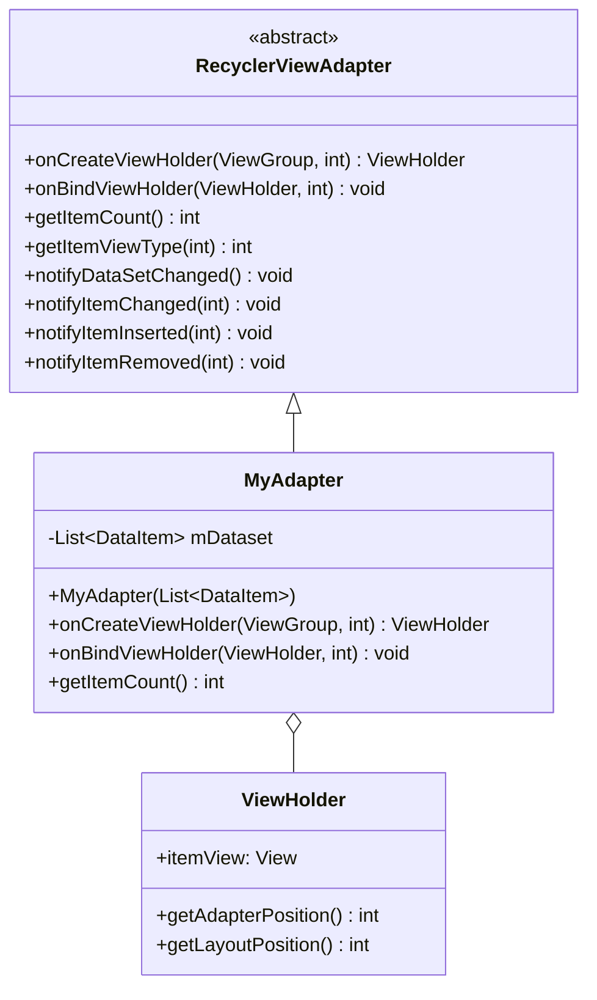
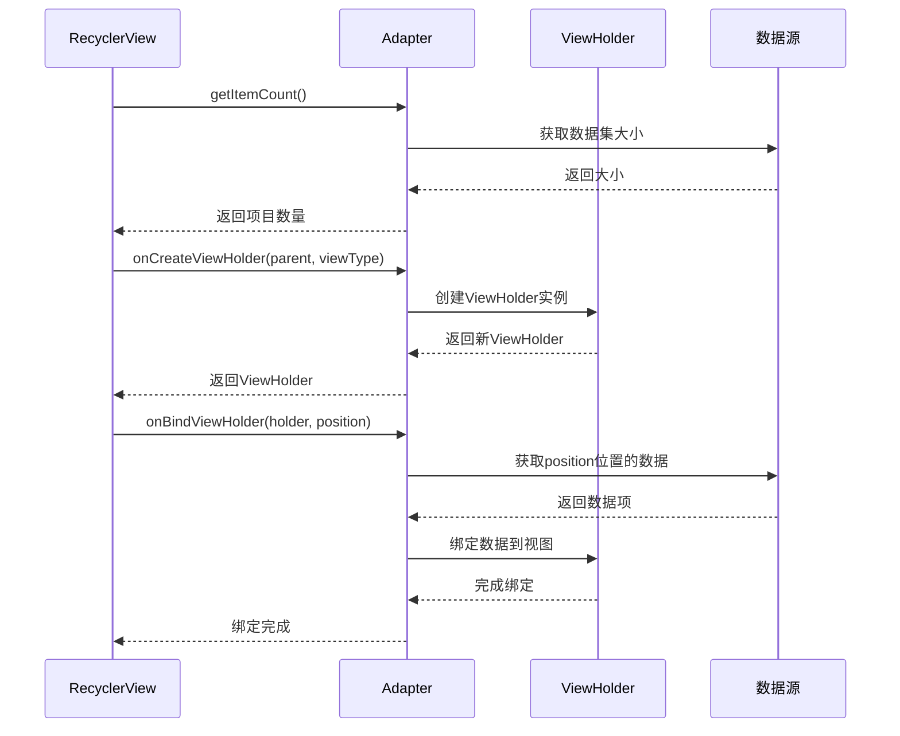
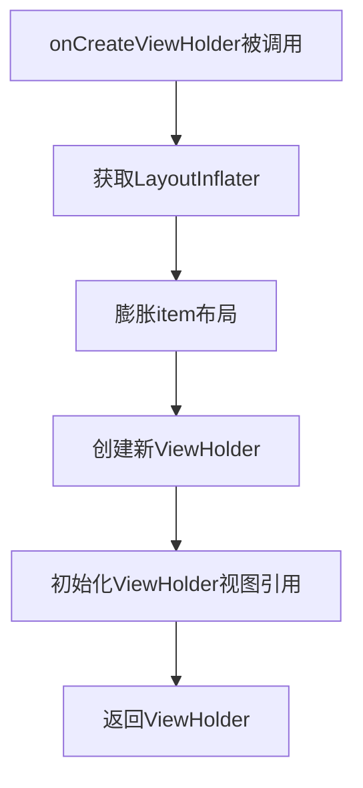
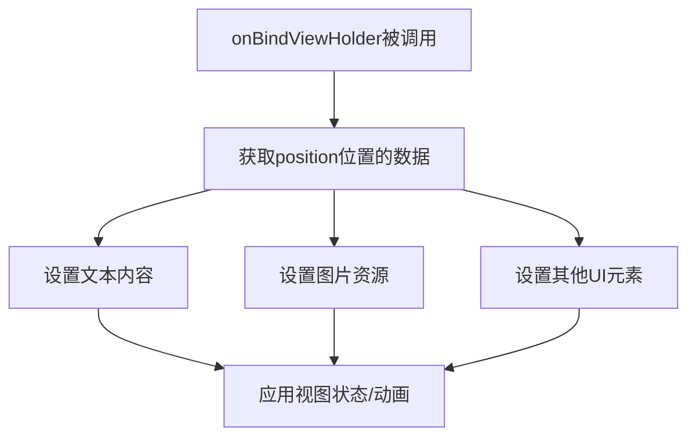
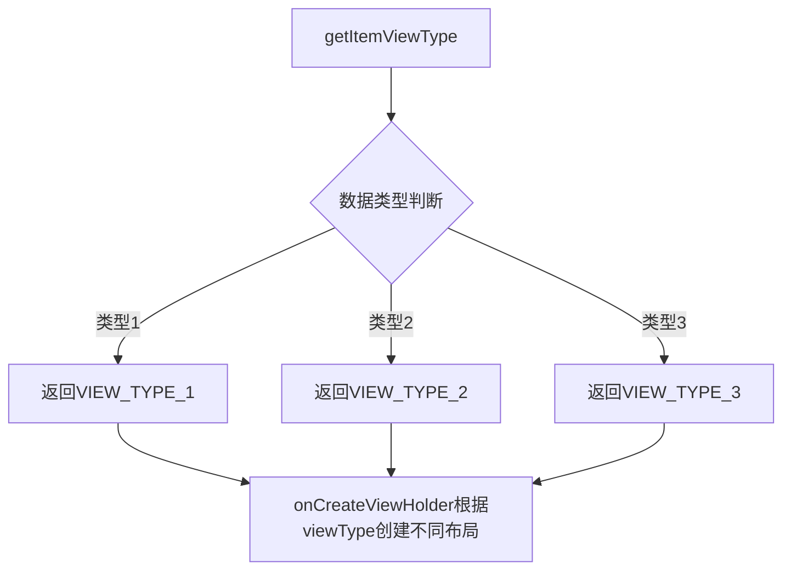
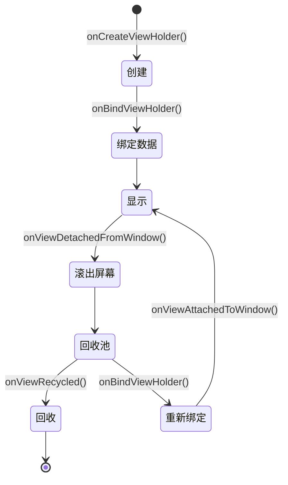
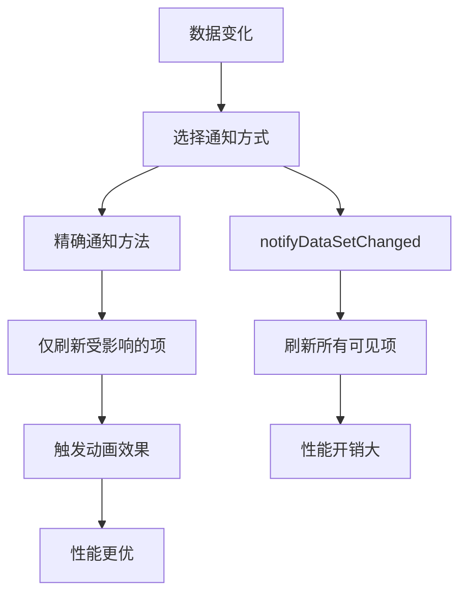
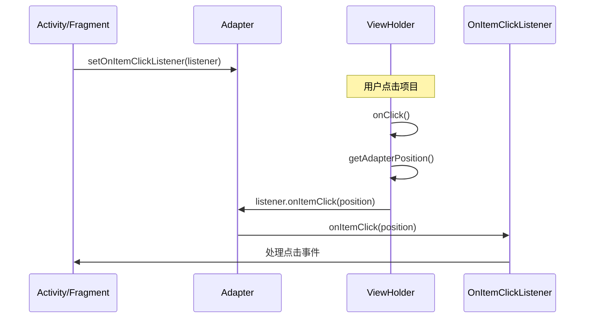
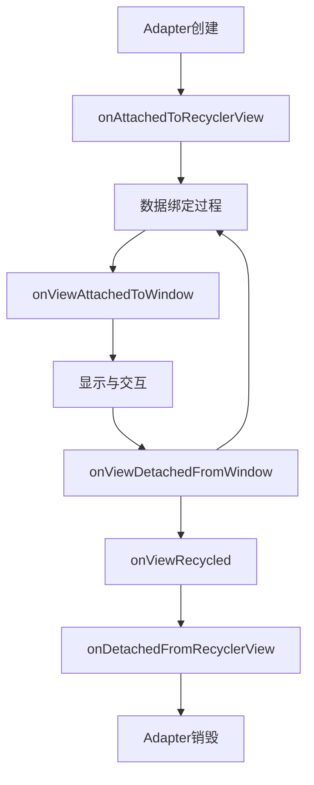
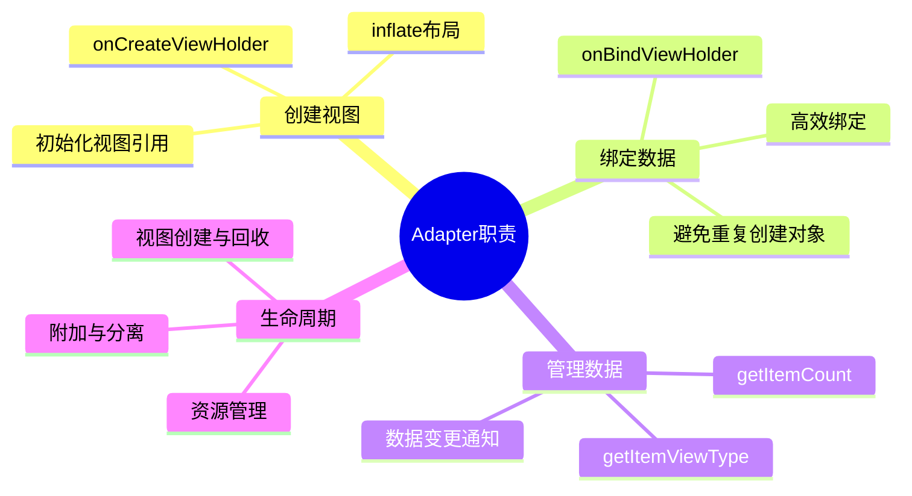

# RecyclerView的Adapter详解

Adapter（适配器）是RecyclerView架构中的核心组件之一，它位于数据源和视图之间，负责将数据模型转换为RecyclerView可以展示的视图项。本文将深入介绍Adapter的工作原理、职责和实现方式。


## Adapter的核心职责

RecyclerView.Adapter的主要职责包括：

1. **创建ViewHolder**：实例化item布局并创建ViewHolder
2. **数据绑定**：将数据源中的数据绑定到ViewHolder上
3. **提供数据计数**：告知RecyclerView数据集的大小
4. **处理视图类型**：支持多种类型的视图项
5. **通知数据变化**：当底层数据发生变化时通知RecyclerView



## Adapter的工作流程



## Adapter的基本实现

一个典型的RecyclerView.Adapter实现如下：

```java
public class MyAdapter extends RecyclerView.Adapter<MyAdapter.ViewHolder> {
    private List<DataItem> mDataset;
    
    // ViewHolder类，持有item视图的引用
    public static class ViewHolder extends RecyclerView.ViewHolder {
        public TextView textView;
        public ImageView imageView;
        
        public ViewHolder(View view) {
            super(view);
            textView = view.findViewById(R.id.text_view);
            imageView = view.findViewById(R.id.image_view);
        }
    }
    
    // 构造函数，接收数据集
    public MyAdapter(List<DataItem> dataset) {
        mDataset = dataset;
    }
    
    // 创建新的ViewHolder
    @Override
    public ViewHolder onCreateViewHolder(ViewGroup parent, int viewType) {
        View view = LayoutInflater.from(parent.getContext())
                .inflate(R.layout.item_layout, parent, false);
        return new ViewHolder(view);
    }
    
    // 绑定数据到ViewHolder
    @Override
    public void onBindViewHolder(ViewHolder holder, int position) {
        DataItem item = mDataset.get(position);
        holder.textView.setText(item.getTitle());
        holder.imageView.setImageResource(item.getImageResId());
    }
    
    // 返回数据集大小
    @Override
    public int getItemCount() {
        return mDataset.size();
    }
}
```

## 关键方法解析

### 1. onCreateViewHolder()

```java
public ViewHolder onCreateViewHolder(ViewGroup parent, int viewType)
```

此方法在需要创建新的ViewHolder时被调用。它应该：
- 膨胀item的布局
- 创建并返回包含该布局的ViewHolder

性能注意事项：
- 这个方法的调用次数是有限的，通常只在初始填充和滚动时创建足够的ViewHolder
- 不应在此方法中执行耗时操作或数据绑定



### 2. onBindViewHolder()

```java
public void onBindViewHolder(ViewHolder holder, int position)
```

此方法在ViewHolder需要显示特定位置的数据时被调用。它应该：
- 从数据源中获取对应position的数据
- 将数据填充到ViewHolder的视图中

性能注意事项：
- 此方法会频繁调用，应保持高效
- 避免在此方法中创建新对象
- 考虑使用异步加载图片等重资源



### 3. getItemCount()

```java
public int getItemCount()
```

返回适配器数据集中的项目总数，RecyclerView用它来确定何时没有更多项目可显示。


### 4. getItemViewType()

```java
public int getItemViewType(int position)
```

如果RecyclerView需要显示多种类型的项目，可以覆盖此方法返回不同的视图类型。默认实现返回0。



## ViewHolder生命周期



## 数据变更通知机制

Adapter提供了一系列方法来通知RecyclerView数据已经改变：

1. **notifyDataSetChanged()**：整个数据集已改变，刷新所有可见项
2. **notifyItemChanged(int position)**：特定位置的数据已更新
3. **notifyItemInserted(int position)**：在特定位置插入了新项
4. **notifyItemRemoved(int position)**：从特定位置移除了项
5. **notifyItemRangeChanged(int start, int count)**：一系列项已更新
6. **notifyItemRangeInserted(int start, int count)**：插入了一系列项
7. **notifyItemRangeRemoved(int start, int count)**：移除了一系列项
8. **notifyItemMoved(int fromPosition, int toPosition)**：项位置发生变化



使用这些方法而非notifyDataSetChanged()可以触发RecyclerView的动画效果，并优化性能。

## 处理Item点击事件

与ListView不同，RecyclerView没有内置的项目点击监听器。常见的实现方式有：

1. **在ViewHolder中设置点击监听器**：

```java
public class ViewHolder extends RecyclerView.ViewHolder {
    // ...
    
    public ViewHolder(View view) {
        super(view);
        // ...
        
        view.setOnClickListener(new View.OnClickListener() {
            @Override
            public void onClick(View v) {
                int position = getAdapterPosition();
                if (position != RecyclerView.NO_POSITION) {
                    // 处理点击事件
                }
            }
        });
    }
}
```

2. **通过接口回调**：

```java
public class MyAdapter extends RecyclerView.Adapter<MyAdapter.ViewHolder> {
    private OnItemClickListener listener;
    
    // 定义接口
    public interface OnItemClickListener {
        void onItemClick(int position);
    }
    
    // 设置监听器的方法
    public void setOnItemClickListener(OnItemClickListener listener) {
        this.listener = listener;
    }
    
    // 在ViewHolder中使用
    public class ViewHolder extends RecyclerView.ViewHolder {
        // ...
        
        public ViewHolder(final View itemView) {
            super(itemView);
            // ...
            
            itemView.setOnClickListener(new View.OnClickListener() {
                @Override
                public void onClick(View v) {
                    if (listener != null) {
                        int position = getAdapterPosition();
                        if (position != RecyclerView.NO_POSITION) {
                            listener.onItemClick(position);
                        }
                    }
                }
            });
        }
    }
}
```



## Adapter的生命周期方法



除了上述核心方法外，Adapter还提供了几个生命周期回调：

1. **onAttachedToRecyclerView(RecyclerView recyclerView)**：当Adapter附加到RecyclerView时调用
2. **onDetachedFromRecyclerView(RecyclerView recyclerView)**：当Adapter从RecyclerView分离时调用
3. **onViewAttachedToWindow(VH holder)**：当ViewHolder的视图被附加到窗口时调用
4. **onViewDetachedFromWindow(VH holder)**：当ViewHolder的视图从窗口分离时调用
5. **onViewRecycled(VH holder)**：当ViewHolder被回收时调用，适合清理资源

这些方法提供了在不同阶段执行操作的机会，比如在视图回收时释放资源。

## 总结

Adapter是RecyclerView框架中的关键组件，通过明确的职责分离和优化的数据绑定机制，它实现了高效的列表展示。理解Adapter的工作原理和正确使用其API，是开发高性能RecyclerView的基础。



在下一篇文章中，我们将详细介绍Adapter接口设计和ViewHolder模式的实现细节。 