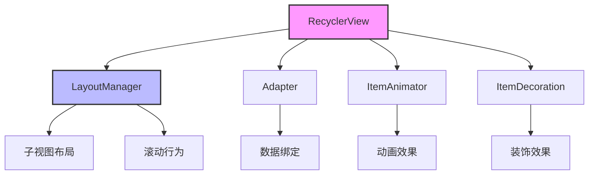
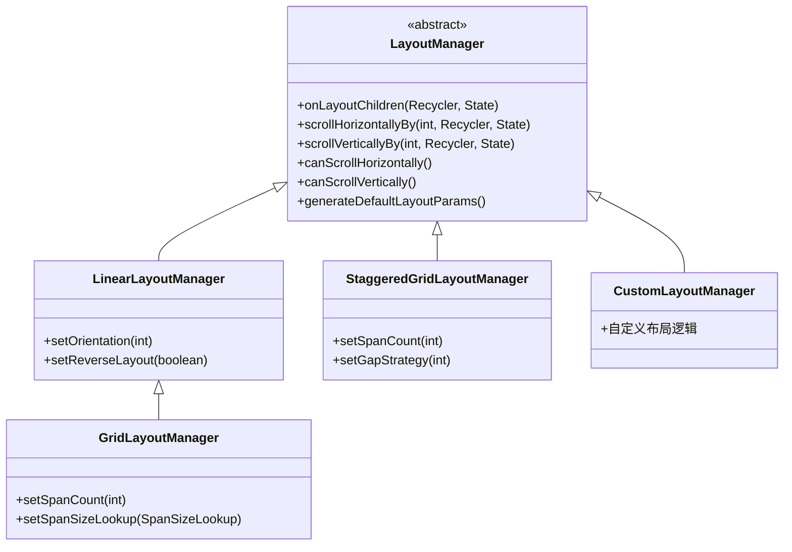
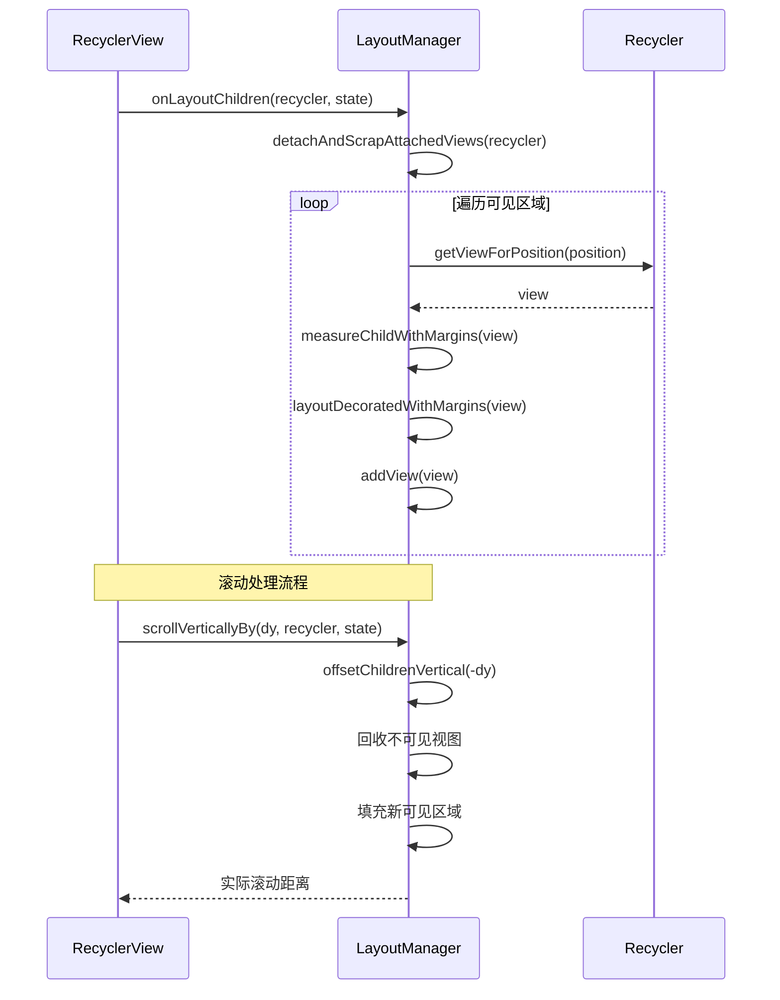
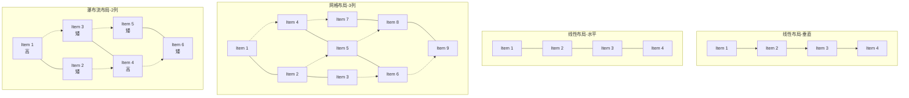
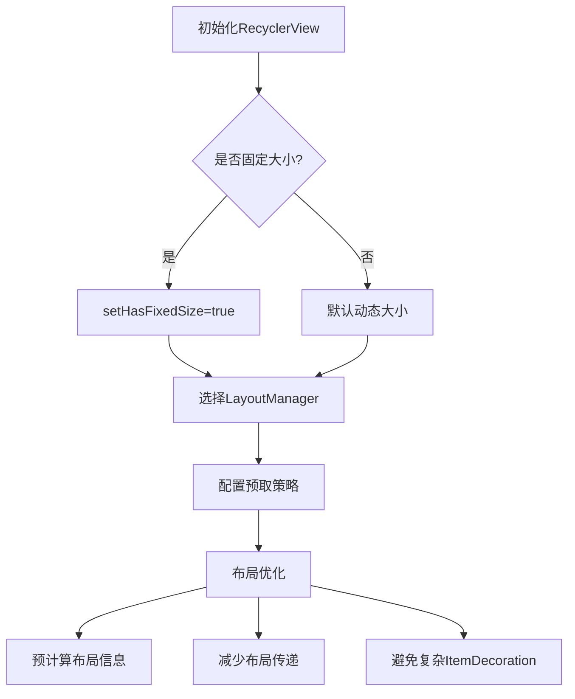
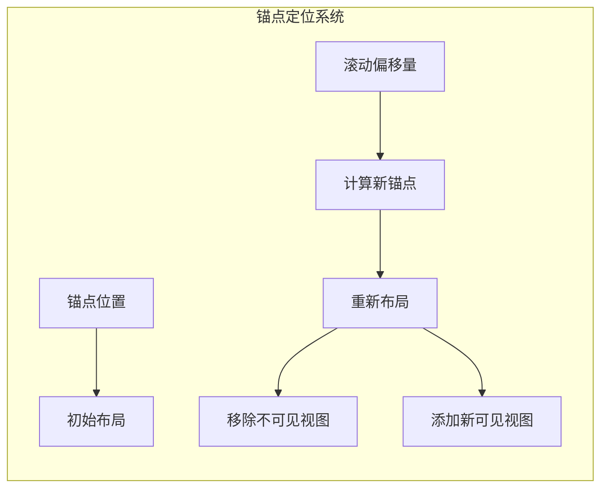

# RecyclerView布局策略

## 概述

RecyclerView的一大亮点是其灵活的布局系统。不同于ListView固定的垂直线性布局，RecyclerView通过抽象布局管理器（LayoutManager）的概念，实现了布局逻辑与视图回收逻辑的分离，使开发者可以自由定义各种布局方式而不必修改RecyclerView核心代码。



## 布局策略的设计思想

### 1. 关注点分离

RecyclerView的设计理念是将不同职责划分给不同组件：
- RecyclerView：主视图容器，负责整体协调
- Adapter：数据适配器，负责数据到视图的绑定
- LayoutManager：布局管理器，负责子视图的排列方式
- ItemAnimator：动画控制器，负责子视图的动画效果
- ItemDecoration：装饰器，负责绘制分割线等装饰

这种设计使得布局逻辑完全独立，可以被替换或自定义。

### 2. 抽象与实现分离

RecyclerView通过抽象类LayoutManager定义了布局管理器的基本接口，而具体实现由子类完成。这种设计使得系统可以提供通用的布局实现（如线性、网格、瀑布流），同时允许开发者自定义特殊的布局需求。



## 布局策略的核心机制

### 1. 布局过程抽象

LayoutManager抽象类定义了布局过程的关键方法：

```java
// 测量过程
public void onMeasure(Recycler recycler, State state, int widthSpec, int heightSpec)

// 布局过程
public void onLayoutChildren(Recycler recycler, State state)

// 滚动过程
public int scrollVerticallyBy(int dy, Recycler recycler, State state)
public int scrollHorizontallyBy(int dx, Recycler recycler, State state)
```

这些方法构成了布局策略的核心，通过它们，LayoutManager控制子视图的位置、大小和滚动行为。



### 2. 子视图管理

LayoutManager负责决定何时添加、移除和重新布局子视图：

```java
// 添加子视图
public void addView(View child)
public void addView(View child, int index)

// 移除子视图
public void removeView(View child)
public void removeViewAt(int index)

// 移动子视图
public void moveView(int fromIndex, int toIndex)

// 分离与重用子视图
public void detachView(View child)
public void attachView(View child, int index)
```

这些方法使LayoutManager能够精确控制子视图的生命周期。

### 3. 与Recycler的交互

LayoutManager与Recycler紧密合作，负责子视图的获取和回收：

```java
// 从Recycler获取视图
View getViewForPosition(int position)

// 将不再可见的视图返回给Recycler
recycler.recycleView(view)
```

这种合作确保了视图的高效回收和复用。

## 常见布局策略



### 1. 线性布局策略

LinearLayoutManager实现了传统的线性布局，类似于ListView，但支持水平和垂直两个方向：

```java
// 创建垂直线性布局
LinearLayoutManager layoutManager = new LinearLayoutManager(context);
recyclerView.setLayoutManager(layoutManager);

// 创建水平线性布局
LinearLayoutManager layoutManager = new LinearLayoutManager(context, LinearLayoutManager.HORIZONTAL, false);
recyclerView.setLayoutManager(layoutManager);
```

内部实现特点：
- 一次只布局可见的子视图
- 支持回收和复用不可见的子视图
- 支持平滑滚动和定位

### 2. 网格布局策略

GridLayoutManager扩展了LinearLayoutManager，实现了网格布局：

```java
// 创建3列网格布局
GridLayoutManager layoutManager = new GridLayoutManager(context, 3);
recyclerView.setLayoutManager(layoutManager);
```

内部实现特点：
- 管理子视图的跨度（span）
- 支持不均匀的网格（如头部横跨多列）
- 继承了LinearLayoutManager的基本特性

### 3. 瀑布流布局策略

StaggeredGridLayoutManager实现了高度可变的瀑布流布局：

```java
// 创建2列垂直瀑布流
StaggeredGridLayoutManager layoutManager = new StaggeredGridLayoutManager(2, StaggeredGridLayoutManager.VERTICAL);
recyclerView.setLayoutManager(layoutManager);
```

内部实现特点：
- 管理多个竖直或水平的"跨度组"（span groups）
- 允许子视图有不同的大小
- 动态计算每个子视图的位置

## 自定义布局策略

当标准布局管理器不满足需求时，开发者可以通过继承LayoutManager类创建自定义布局：

```java
public class CustomLayoutManager extends RecyclerView.LayoutManager {
    
    @Override
    public RecyclerView.LayoutParams generateDefaultLayoutParams() {
        return new RecyclerView.LayoutParams(
                ViewGroup.LayoutParams.WRAP_CONTENT,
                ViewGroup.LayoutParams.WRAP_CONTENT);
    }
    
    @Override
    public void onLayoutChildren(RecyclerView.Recycler recycler, RecyclerView.State state) {
        // 清空当前布局
        detachAndScrapAttachedViews(recycler);
        
        // 布局逻辑...
        for (int i = 0; i < getItemCount(); i++) {
            // 仅布局可见的部分
            if (isPositionVisible(i)) {
                View view = recycler.getViewForPosition(i);
                addView(view);
                measureChildWithMargins(view, 0, 0);
                
                // 计算并设置子视图位置
                layoutDecoratedWithMargins(view, left, top, right, bottom);
            }
        }
    }
    
    // 其他必要的方法...
}
```

自定义LayoutManager需要实现的关键功能：
1. 生成默认LayoutParams
2. 测量与布局子视图
3. 处理滚动
4. 管理子视图的回收与复用

## 布局策略的选择与优化

### 选择合适的布局策略

| 布局需求 | 推荐的LayoutManager |
|---------|-------------------|
| 简单列表 | LinearLayoutManager |
| 规则网格 | GridLayoutManager |
| 不规则网格 | StaggeredGridLayoutManager |
| 轮播图 | LinearLayoutManager + PagerSnapHelper |
| 自定义布局 | 继承LayoutManager实现 |

### 布局优化技巧

1. **预取**：使用LayoutManager的预取功能提前准备即将可见的视图
   ```java
   linearLayoutManager.setInitialPrefetchItemCount(4); // 水平列表初始预取数量
   ```

2. **固定大小**：当所有子视图大小相同时，启用此选项以提高性能
   ```java
   recyclerView.setHasFixedSize(true);
   ```

3. **定位优化**：针对大数据集的滚动定位优化
   ```java
   // 平滑滚动到指定位置
   linearLayoutManager.smoothScrollToPosition(recyclerView, null, position);
   
   // 立即滚动到指定位置（大跨度滚动更高效）
   linearLayoutManager.scrollToPositionWithOffset(position, offset);
   ```

4. **布局预计算**：对复杂自定义布局预计算布局信息，避免多次测量



## 布局策略的高级特性

### 1. 跨度查找表（SpanSizeLookup）

GridLayoutManager提供了SpanSizeLookup机制，允许不同位置的子视图占用不同数量的跨度：

```java
GridLayoutManager layoutManager = new GridLayoutManager(context, 3);
layoutManager.setSpanSizeLookup(new GridLayoutManager.SpanSizeLookup() {
    @Override
    public int getSpanSize(int position) {
        if (position == 0) {
            return 3; // 第一个条目占据3格
        }
        return 1; // 其他条目占据1格
    }
});
```

### 2. 方向辅助（OrientationHelper）

LayoutManager内部使用OrientationHelper来统一处理水平和垂直方向的度量与布局：

```java
// 内部使用
OrientationHelper mOrientationHelper = OrientationHelper.createHorizontalHelper(this);

// 使用辅助类获取维度信息
int totalSpace = mOrientationHelper.getTotalSpace();
int decoratedMeasurement = mOrientationHelper.getDecoratedMeasurement(view);
```

这种设计使得代码可以用相同的逻辑处理不同方向的布局。

### 3. 锚点定位系统

LinearLayoutManager使用"锚点"（Anchor）来定位视图，这是一个优化复杂滚动的关键机制：

```java
// 内部数据结构
class AnchorInfo {
    int mPosition;        // 锚点位置
    int mCoordinate;      // 锚点坐标
    boolean mLayoutFromEnd; // 是否从尾部布局
    // ...
}
```



锚点系统使得布局过程更加高效，特别是在大数据集的快速滚动时。

## 总结

RecyclerView的布局策略设计是其灵活性和高性能的关键。通过将布局逻辑与其他组件分离，RecyclerView可以适应各种复杂的视图展示需求，同时保持高效的视图回收和复用机制。

开发者可以利用内置的布局管理器满足大多数常见需求，或通过自定义LayoutManager实现特殊的布局效果。深入理解布局策略的工作原理，有助于开发更高效、更流畅的列表界面。 