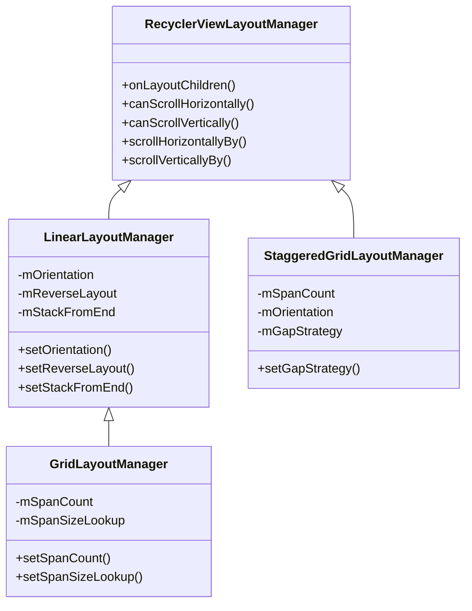
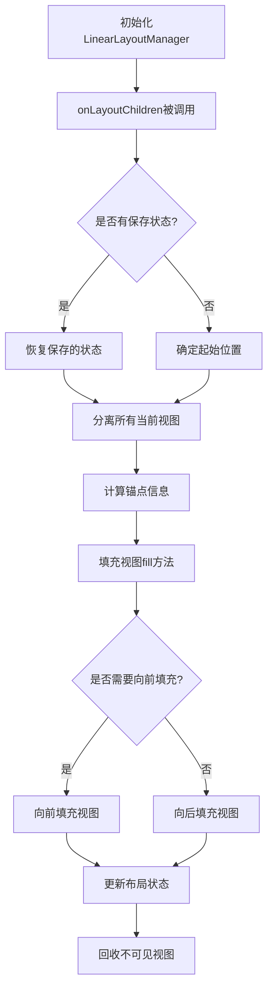
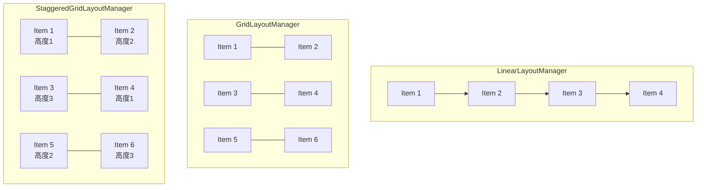
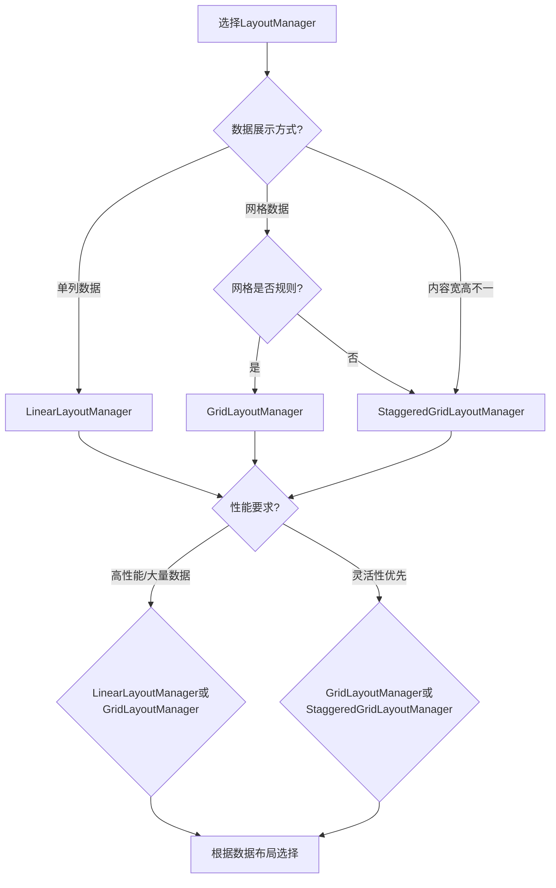

# 常见LayoutManager分析

## 概述

RecyclerView通过LayoutManager提供了丰富的布局方式，适应各种应用场景。本文将深入分析Android SDK中提供的三种标准LayoutManager实现：LinearLayoutManager、GridLayoutManager和StaggeredGridLayoutManager，解析它们的特性、内部实现以及适用场景。



## LinearLayoutManager

LinearLayoutManager是最基础的布局管理器，实现了类似ListView的线性布局。

### 1. 特性与用法

LinearLayoutManager支持垂直和水平两个方向的线性布局：

```java
// 默认垂直方向
LinearLayoutManager layoutManager = new LinearLayoutManager(context);

// 指定水平方向
LinearLayoutManager layoutManager = new LinearLayoutManager(
        context, LinearLayoutManager.HORIZONTAL, false);

// 反转布局（从下到上或从右到左）
LinearLayoutManager layoutManager = new LinearLayoutManager(
        context, LinearLayoutManager.VERTICAL, true);
```

主要API：
- `setOrientation(int orientation)`: 设置布局方向
- `setReverseLayout(boolean reverseLayout)`: 设置是否反转布局
- `setStackFromEnd(boolean stackFromEnd)`: 设置是否从尾部开始堆叠视图
- `findFirstVisibleItemPosition()`: 查找第一个可见项的位置
- `findLastVisibleItemPosition()`: 查找最后一个可见项的位置
- `scrollToPositionWithOffset(int position, int offset)`: 滚动到指定位置和偏移



### 2. 源码分析

LinearLayoutManager继承自RecyclerView.LayoutManager，实现了许多关键布局方法：

#### 布局流程

```java
@Override
public void onLayoutChildren(RecyclerView.Recycler recycler, RecyclerView.State state) {
    // 1. 保存当前信息用于恢复
    // 2. 分离所有当前附加的视图
    detachAndScrapAttachedViews(recycler);
    // 3. 确定锚点信息（起始布局位置）
    updateAnchorInfoForLayout(recycler, state, mAnchorInfo);
    // 4. 从锚点开始向两端填充视图
    fill(recycler, mLayoutState, state, false);
    // 5. 处理布局完成后的工作
}
```

#### 核心填充算法

LinearLayoutManager使用"fill"方法执行核心布局：

```java
// 填充算法的简化逻辑
int fill(Recycler recycler, LayoutState layoutState, State state, boolean stopOnFocusable) {
    // 计算可用空间
    final int availableSpace = layoutState.mAvailable;
    // 循环填充视图直到用完可用空间或没有更多数据
    while (layoutState.hasMore(state) && layoutState.mAvailable > 0) {
        // 1. 获取下一个视图
        View view = layoutState.next(recycler);
        // 2. 测量视图
        measureChildWithMargins(view, 0, 0);
        // 3. 放置视图
        layoutChunk(layoutState, view);
        // 4. 更新可用空间和其他状态
        layoutState.mAvailable -= layoutState.mScrollingOffset;
    }
    return start - layoutState.mAvailable;
}
```

#### 滚动处理

LinearLayoutManager通过scrollBy方法处理滚动：

```java
int scrollBy(int delta, RecyclerView.Recycler recycler, RecyclerView.State state) {
    // 1. 根据滚动方向和空间更新LayoutState
    updateLayoutState(layoutDirection, Math.abs(delta), true, state);
    // 2. 根据滚动填充视图（移除不可见视图并添加新可见视图）
    final int consumed = fill(recycler, mLayoutState, state, false);
    // 3. 更新子视图的位置偏移
    offsetChildrenBy(scrolled);
    return scrolled;
}
```

### 3. 性能特点

LinearLayoutManager的性能优势：
- 仅布局可见区域的视图，内存占用低
- 高效的视图回收机制，滚动性能好
- 子视图查找和定位速度快

## GridLayoutManager

GridLayoutManager继承自LinearLayoutManager，在其基础上实现了网格布局功能。

### 1. 特性与用法

GridLayoutManager支持可自定义列数的网格布局：

```java
// 创建3列网格
GridLayoutManager layoutManager = new GridLayoutManager(context, 3);

// 创建5行水平网格
GridLayoutManager layoutManager = new GridLayoutManager(
        context, 5, GridLayoutManager.HORIZONTAL, false);

// 设置不同位置的跨度大小
layoutManager.setSpanSizeLookup(new GridLayoutManager.SpanSizeLookup() {
    @Override
    public int getSpanSize(int position) {
        if (position == 0) {
            return 3; // 第一个位置占3列
        }
        return 1; // 其他位置占1列
    }
});
```

主要API：
- `setSpanCount(int spanCount)`: 设置跨度数（列数或行数）
- `setSpanSizeLookup(SpanSizeLookup spanSizeLookup)`: 设置位置跨度查找器
- `getSpanCount()`: 获取当前跨度数

### 2. 源码分析

GridLayoutManager通过扩展LinearLayoutManager实现网格布局：

#### 继承结构

```java
public class GridLayoutManager extends LinearLayoutManager {
    // 跨度相关属性
    int mSpanCount = DEFAULT_SPAN_COUNT;
    SpanSizeLookup mSpanSizeLookup = new DefaultSpanSizeLookup();
    // ...
}
```

#### 网格计算逻辑

GridLayoutManager重写了多个方法来实现网格计算：

```java
// 计算布局方向上的总跨度
int getSpaceForSpanRange(int startSpan, int endSpan) {
    if (mOrientation == VERTICAL && isLayoutRTL()) {
        return mCachedBorders[mSpanCount - endSpan] - mCachedBorders[mSpanCount - startSpan - 1];
    } else {
        return mCachedBorders[endSpan] - mCachedBorders[startSpan];
    }
}

// 根据位置计算应该占用的跨度数
public int getSpanSize(int position) {
    return mSpanSizeLookup.getSpanSize(position);
}

// 测量子视图尺寸
@Override
void measureChild(View view, int otherDirParentSpecMode, boolean alreadyMeasured) {
    // 计算子视图占用的格子大小
    final LayoutParams lp = (LayoutParams) view.getLayoutParams();
    final int spanSize = lp.mSpanSize;
    
    // 根据spanSize计算子视图尺寸
    // ...
}
```

#### 跨度查找器

SpanSizeLookup是GridLayoutManager中的一个重要组件，决定了每个位置的项目应该占用多少个跨度：

```java
public abstract static class SpanSizeLookup {
    // 缓存机制
    boolean mCacheSpanIndices = false;
    final SparseIntArray mSpanIndexCache = new SparseIntArray();
    
    // 获取指定位置的跨度大小
    public abstract int getSpanSize(int position);
    
    // 获取指定位置的跨度索引
    public int getSpanIndex(int position, int spanCount) {
        // 计算该位置项目在当前行/列的起始位置
    }
    
    // 获取指定位置所在的组
    public int getSpanGroupIndex(int adapterPosition, int spanCount) {
        // 计算该位置项目属于第几行/列
    }
}
```

### 3. 性能特点

GridLayoutManager相比LinearLayoutManager：
- 计算复杂度更高，需要处理跨度分配
- SpanSizeLookup的缓存机制对性能很重要
- 适合展示规则的网格数据，如图片库、产品目录等

## StaggeredGridLayoutManager

StaggeredGridLayoutManager实现了高度可变的瀑布流布局，不同于GridLayoutManager的规则网格。

### 1. 特性与用法

StaggeredGridLayoutManager支持子视图高度不一的瀑布流布局：

```java
// 创建2列垂直瀑布流
StaggeredGridLayoutManager layoutManager = 
    new StaggeredGridLayoutManager(2, StaggeredGridLayoutManager.VERTICAL);

// 创建3行水平瀑布流
StaggeredGridLayoutManager layoutManager = 
    new StaggeredGridLayoutManager(3, StaggeredGridLayoutManager.HORIZONTAL);

// 设置项目占满一行/列
LayoutParams lp = (StaggeredGridLayoutManager.LayoutParams) view.getLayoutParams();
lp.setFullSpan(true);
```

主要API：
- `setGapStrategy(int gapStrategy)`: 设置间隙处理策略
- `setFullSpan(boolean fullSpan)`: 设置项目是否占满一行/列
- `findFirstVisibleItemPositions(int[] into)`: 查找每列第一个可见项位置
- `findLastVisibleItemPositions(int[] into)`: 查找每列最后一个可见项位置

### 2. 源码分析

StaggeredGridLayoutManager直接继承自RecyclerView.LayoutManager，与LinearLayoutManager是并列关系：

#### 数据结构

```java
public class StaggeredGridLayoutManager extends RecyclerView.LayoutManager {
    // 跨度数组，每个元素代表一列（垂直模式）或一行（水平模式）
    private Span[] mSpans;
    
    // 跨度组，用于管理多个跨度
    private class Span {
        ArrayList<View> mViews = new ArrayList<>();
        int mCachedStart = INVALID_LINE;
        int mCachedEnd = INVALID_LINE;
        int mDeletedSize = 0;
        
        // 添加视图到此跨度
        void append(View view) { /* ... */ }
        
        // 前置视图到此跨度
        void prependView(View view) { /* ... */ }
        
        // 获取此跨度的起始坐标
        int getStartLine() { /* ... */ }
        
        // 获取此跨度的结束坐标
        int getEndLine() { /* ... */ }
    }
    
    // 保存布局状态
    final LazySpanLookup mLazySpanLookup = new LazySpanLookup();
    
    // 锚点信息
    private AnchorInfo mAnchorInfo = new AnchorInfo();
}
```

#### 布局算法

StaggeredGridLayoutManager的布局算法比LinearLayoutManager更复杂：

```java
@Override
public void onLayoutChildren(RecyclerView.Recycler recycler, RecyclerView.State state) {
    // 1. 更新锚点信息
    updateAnchorInfoForLayout(state, mAnchorInfo);
    
    // 2. 清除现有视图
    detachAndScrapAttachedViews(recycler);
    
    // 3. 从锚点开始布局
    if (mAnchorInfo.mLayoutFromEnd) {
        // 从末尾向前布局
        updateLayoutStateToFillEnd(mAnchorInfo);
        fill(recycler, mLayoutState, state);
        // ... 继续向前布局
    } else {
        // 从开始向后布局
        updateLayoutStateToFillStart(mAnchorInfo);
        fill(recycler, mLayoutState, state);
        // ... 继续向后布局
    }
    
    // 4. 处理间隙和其他后续工作
    if (getGapStrategy() != GAP_HANDLING_NONE) {
        handleInvalidGaps();
    }
}
```

#### 间隙处理策略

StaggeredGridLayoutManager有专门的间隙处理机制，避免因为视图高度不一导致的布局空洞：

```java
// 间隙处理策略
public static final int GAP_HANDLING_NONE = 0;
public static final int GAP_HANDLING_MOVE_ITEMS_BETWEEN_SPANS = 1;
public static final int GAP_HANDLING_LAZY = 2;

// 处理无效间隙
private void handleInvalidGaps() {
    // 找出所有潜在的间隙位置
    // 通过移动项目或延迟处理来填补间隙
}
```

### 3. 性能特点

StaggeredGridLayoutManager的特点：
- 计算复杂度最高，需要维护每个跨度的状态
- 内存占用较大，需要存储额外的跨度信息
- 布局更加灵活，适合展示不规则内容，如图片流、新闻卡片等
- 对于频繁数据变更的场景可能表现不佳

## 三种LayoutManager的对比



| 特性 | LinearLayoutManager | GridLayoutManager | StaggeredGridLayoutManager |
|------|-------------------|-----------------|-------------------------|
| 布局模式 | 线性（垂直/水平） | 规则网格 | 不规则网格（瀑布流） |
| 实现复杂度 | 低 | 中 | 高 |
| 灵活性 | 低 | 中 | 高 |
| 性能 | 最优 | 良好 | 一般 |
| 内存占用 | 低 | 中 | 高 |
| 适用场景 | 简单列表、聊天记录 | 图片库、应用网格 | 图片流、内容卡片 |
| 代码实现 | 简单 | 中等 | 复杂 |

## 选择合适的LayoutManager



### 1. 场景匹配

- **LinearLayoutManager**：适合单列数据展示，如聊天记录、通知列表、简单设置页等
- **GridLayoutManager**：适合规则网格展示，如应用抽屉、照片库、产品目录等
- **StaggeredGridLayoutManager**：适合不规则内容展示，如社交媒体图片流、新闻卡片等

### 2. 性能考量

- 对于大量数据（1000+项）：优先考虑LinearLayoutManager或GridLayoutManager
- 频繁变更数据的场景：谨慎使用StaggeredGridLayoutManager
- 需要快速滚动的场景：LinearLayoutManager性能最佳

### 3. 布局复杂性

- 简单一致的布局：LinearLayoutManager足够
- 需要部分项目占据多列/行：GridLayoutManager配合SpanSizeLookup
- 高度不确定的动态内容：StaggeredGridLayoutManager

## 总结

Android SDK提供的三种标准LayoutManager满足了大多数应用场景的需求：

- LinearLayoutManager提供简单高效的线性布局
- GridLayoutManager提供规则的网格布局
- StaggeredGridLayoutManager提供灵活的瀑布流布局

通过对这些LayoutManager的深入分析，我们可以更好地理解它们的工作原理，选择最适合自己应用场景的实现，并针对性地进行优化。对于特殊需求，还可以基于这些标准实现创建自定义的LayoutManager。 