# RecyclerView的LayoutManager详解

LayoutManager是RecyclerView架构中负责测量和定位视图项的核心组件，它决定了列表中子视图的排列方式和行为。本文将深入介绍LayoutManager的工作原理、职责和实现方式。

## LayoutManager的核心职责

RecyclerView.LayoutManager的主要职责包括：

1. **布局子视图**：决定每个子视图的位置和尺寸
2. **管理子视图的回收**：确定哪些视图超出可见范围应被回收
3. **测量RecyclerView及其子视图**：确定所需的尺寸
4. **处理滚动行为**：实现垂直、水平或双向滚动
5. **管理获取与移除子视图**：控制添加和删除子视图的时机和方式
6. **确定布局方向**：定义子视图的排列顺序
7. **处理子视图的焦点移动**：支持键盘导航

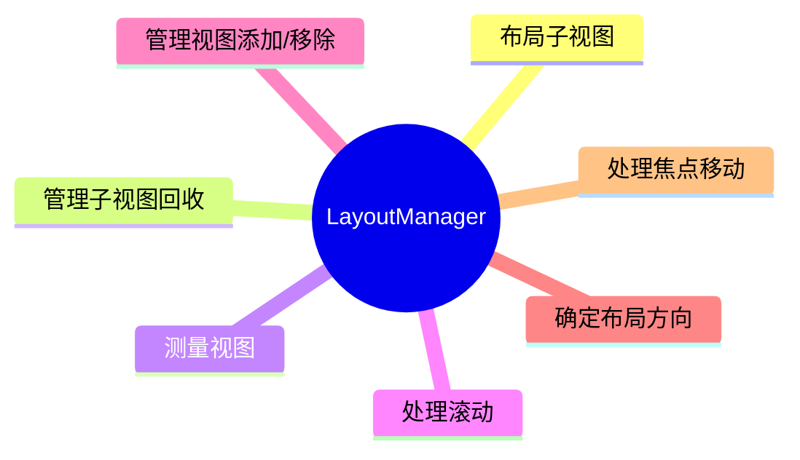

## 标准LayoutManager实现

Android支持库提供了三种标准的LayoutManager实现：

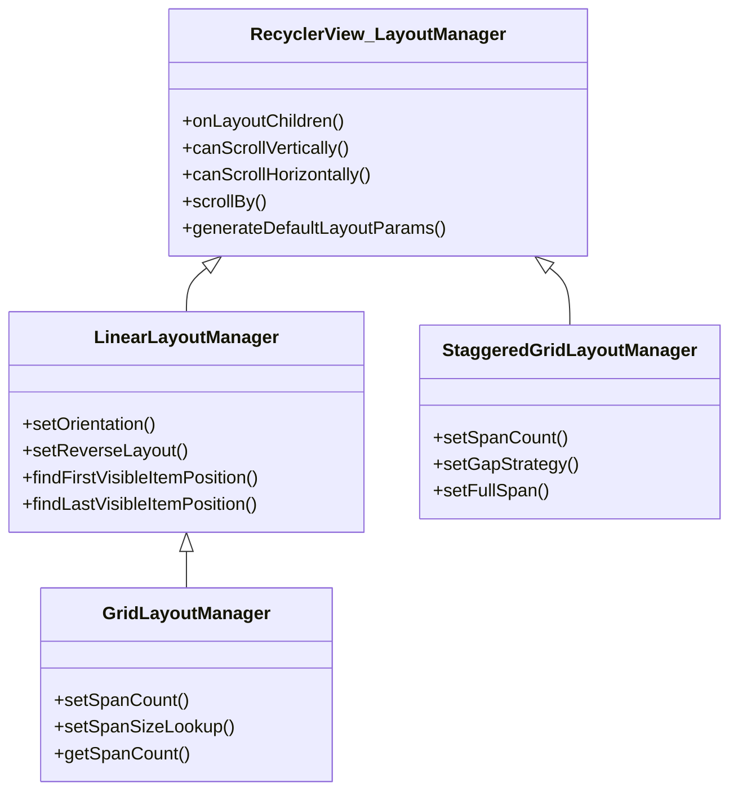

### 1. LinearLayoutManager

线性布局管理器，将子视图排列在一条直线上，可以是垂直或水平方向。

```java
// 垂直线性布局
LinearLayoutManager layoutManager = new LinearLayoutManager(context);
recyclerView.setLayoutManager(layoutManager);

// 水平线性布局
LinearLayoutManager layoutManager = new LinearLayoutManager(
        context, LinearLayoutManager.HORIZONTAL, false);
recyclerView.setLayoutManager(layoutManager);
```

主要特性：
- 支持垂直和水平方向布局
- 可以反转布局方向
- 支持从特定位置开始布局 (scrollToPosition)
- 支持平滑滚动 (smoothScrollToPosition)


### 2. GridLayoutManager

网格布局管理器，将子视图排列在网格中，每行（或每列）有固定数量的子视图。

```java
// 网格布局，每行3列
GridLayoutManager layoutManager = new GridLayoutManager(context, 3);
recyclerView.setLayoutManager(layoutManager);
```

主要特性：
- 支持垂直和水平网格
- 可以自定义跨度（span）
- 支持不均匀网格（一些项目可以跨越多个单元格）
- 继承自LinearLayoutManager，拥有其所有特性


### 3. StaggeredGridLayoutManager

瀑布流布局管理器，创建一个错落有致的网格，其中每个子视图的大小可以不同。

```java
// 垂直瀑布流，3列
StaggeredGridLayoutManager layoutManager = new StaggeredGridLayoutManager(
        3, StaggeredGridLayoutManager.VERTICAL);
recyclerView.setLayoutManager(layoutManager);
```

主要特性：
- 支持垂直和水平瀑布流
- 子视图可以有不同的高度（垂直模式）或宽度（水平模式）
- 自动填充空白区域
- 支持跨越所有跨度的全宽项目


## LayoutManager的工作原理

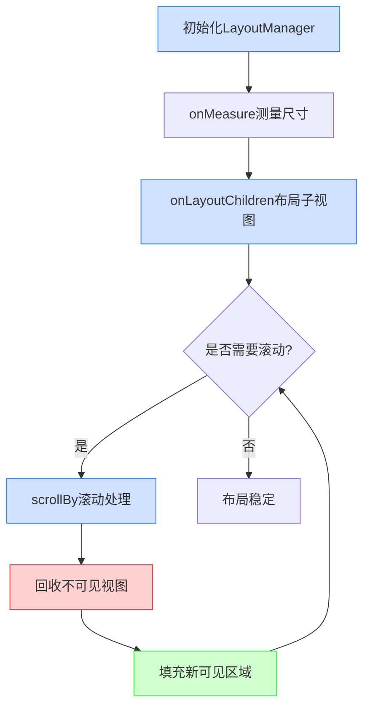

### 1. 布局过程

LayoutManager的布局过程主要发生在`onLayoutChildren()`方法中：

```java
public void onLayoutChildren(RecyclerView.Recycler recycler, RecyclerView.State state)
```

此方法在以下情况被调用：
- RecyclerView首次布局
- 适配器数据更改
- 布局配置发生变化（如方向变更）

一个简化的LinearLayoutManager布局流程：
1. 保存当前可见视图的信息（用于稍后复用）
2. 移除并缓存所有当前附加的视图
3. 确定布局方向和起始填充位置
4. 从当前位置向前/后填充视图，直到填满可见区域
5. 对可见子视图进行测量和定位

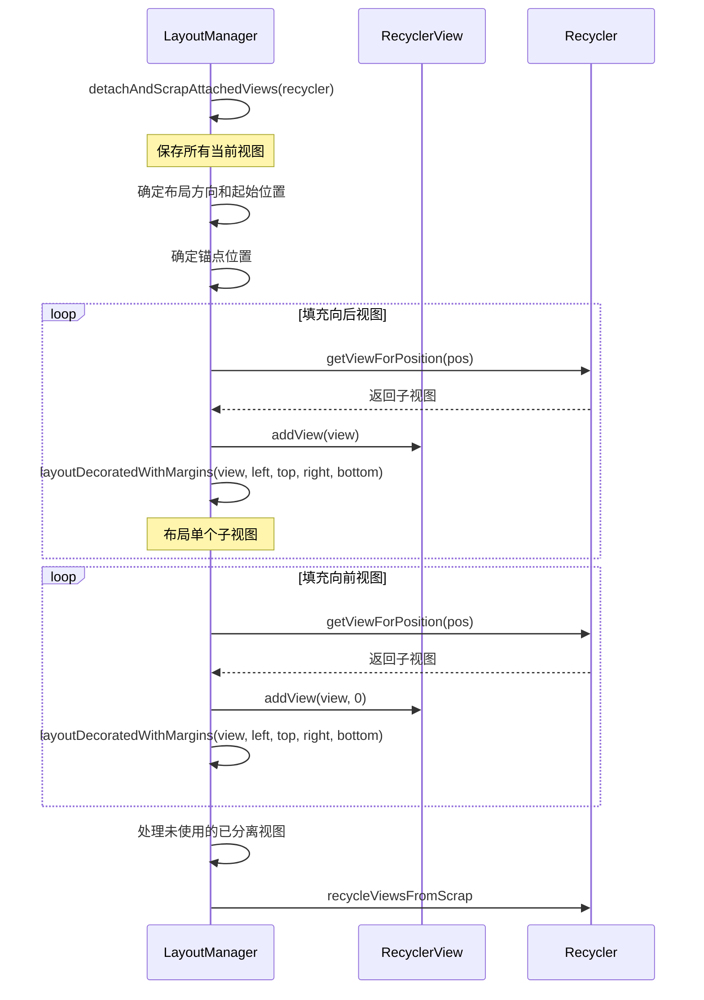

### 2. 滚动处理

滚动处理主要在以下方法中进行：

```java
public int scrollVerticallyBy(int dy, RecyclerView.Recycler recycler, RecyclerView.State state)
public int scrollHorizontallyBy(int dx, RecyclerView.Recycler recycler, RecyclerView.State state)
```

滚动处理的关键步骤：
1. 确定实际可滚动距离（考虑边界限制）
2. 物理移动所有子视图（偏移位置）
3. 回收滚出可见区域的视图
4. 填充新滚入可见区域的视图

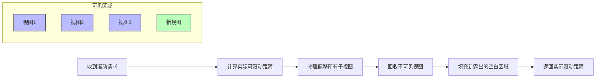

### 3. 回收与填充

这两个过程是LayoutManager与Recycler交互的核心：

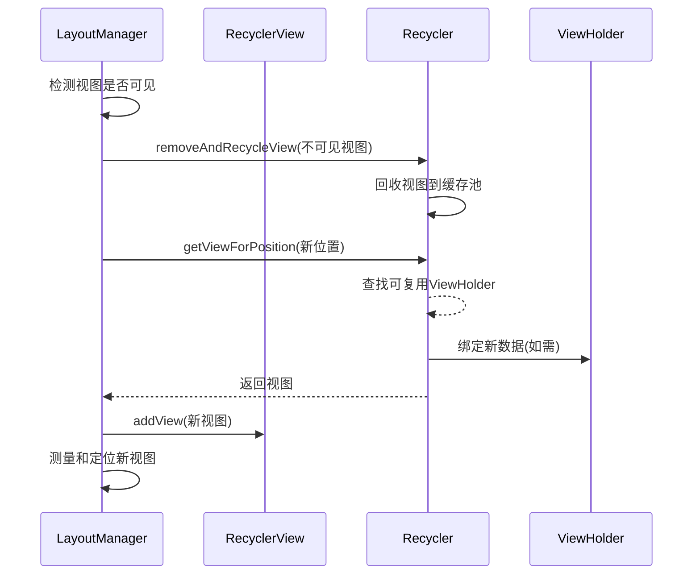

- **回收过程**：识别不再可见的视图，将其从RecyclerView中分离并传递给Recycler
- **填充过程**：从Recycler请求视图（新的或复用的），并将其添加到RecyclerView

```java
// 回收视图的示例代码
void recycleViewsOutOfBounds(RecyclerView.Recycler recycler) {
    final int childCount = getChildCount();
    // 从末尾开始，更高效
    for (int i = childCount - 1; i >= 0; i--) {
        View child = getChildAt(i);
        if (!Rect.intersects(mVisibleRect, getViewRect(child))) {
            removeAndRecycleViewAt(i, recycler);
        }
    }
}

// 填充视图的示例代码
void fillGap(RecyclerView.Recycler recycler) {
    while (hasMoreItems() && hasSpace()) {
        View view = recycler.getViewForPosition(mCurrentPosition);
        addView(view);
        measureChildWithMargins(view, 0, 0);
        layoutChild(view, mCurrentPosition);
        mCurrentPosition++;
    }
}
```

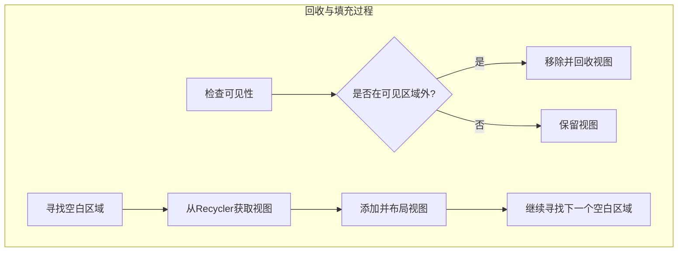

## 自定义LayoutManager

自定义LayoutManager需要覆盖几个关键方法：

### 必须实现的方法

```java
// 生成布局参数
public RecyclerView.LayoutParams generateDefaultLayoutParams()

// 测量和布局子视图
public void onLayoutChildren(RecyclerView.Recycler recycler, RecyclerView.State state)
```

### 滚动相关方法

```java
// 是否支持垂直滚动
public boolean canScrollVertically()

// 是否支持水平滚动
public boolean canScrollHorizontally()

// 处理垂直滚动
public int scrollVerticallyBy(int dy, RecyclerView.Recycler recycler, RecyclerView.State state)

// 处理水平滚动
public int scrollHorizontallyBy(int dx, RecyclerView.Recycler recycler, RecyclerView.State state)
```

### 其他有用方法

```java
// 平滑滚动支持
public void smoothScrollToPosition(RecyclerView recyclerView, RecyclerView.State state, int position)

// 支持定位到指定位置
public void scrollToPosition(int position)

// 访问子视图
public int getChildCount()
public View getChildAt(int index)
public int getPosition(View view)

// 添加和移除视图
public void addView(View child)
public void removeAndRecycleView(View child, RecyclerView.Recycler recycler)
```

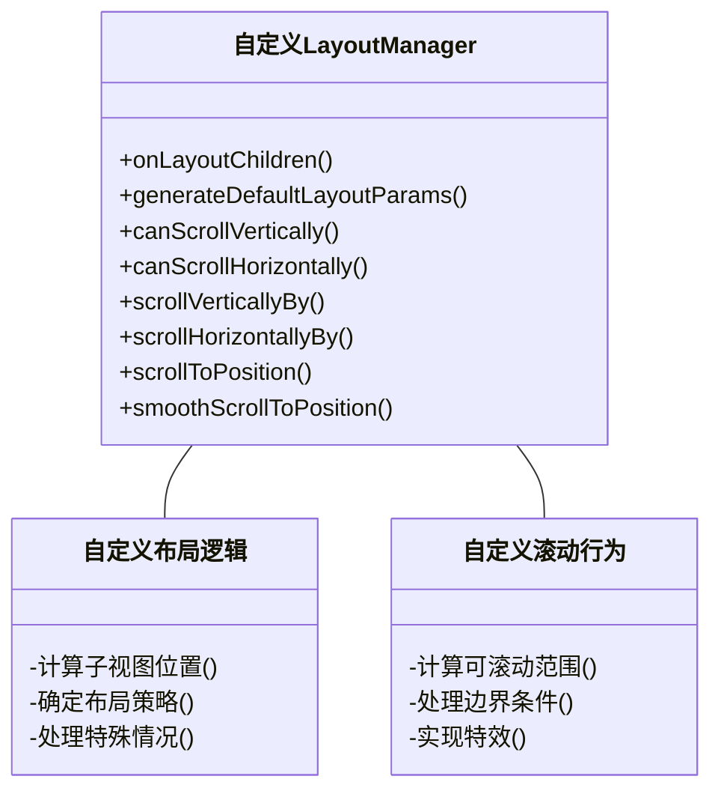

## 性能考虑

实现高效LayoutManager的关键点：

1. **有效回收视图**：只回收确实已经不可见的视图
2. **预加载**：在可见区域之外的一定范围预先布局视图，使滚动更平滑
3. **批量处理**：尽量减少测量和布局操作的次数
4. **延迟布局**：使用state.isPreLayout()和state.willRunSimpleAnimations()区分不同布局阶段
5. **高效计算**：避免在滚动计算中创建大量对象

```mermaid
graph TD
    A[性能优化策略] --> B[有效回收]
    A --> C[预加载机制]
    A --> D[批量处理]
    A --> E[延迟布局]
    A --> F[高效计算]
    
    B --> B1[精确计算可见性]
    B --> B2[避免过早回收]
    
    C --> C1[滚动方向预加载]
    C --> C2[合理的预加载距离]
    
    D --> D1[最小化布局调用]
    D --> D2[减少requestLayout()]
    
    E --> E1[区分布局阶段]
    E --> E2[动画优化]
    
    F --> F1[避免创建临时对象]
    F --> F2[复用计算结果]
```

## 与其他组件的交互

LayoutManager与RecyclerView生态系统中的其他组件紧密合作：

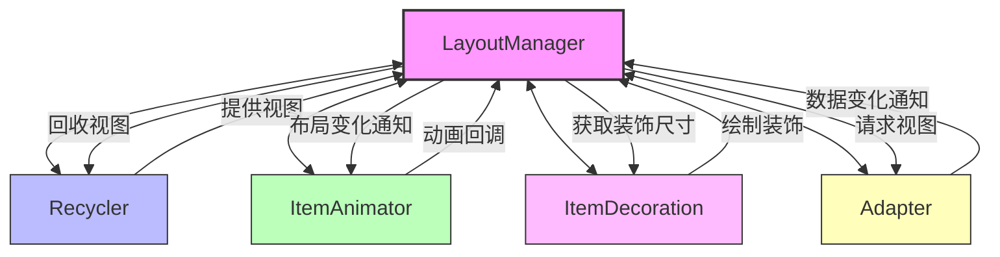

- **与Recycler交互**：通过getViewForPosition获取视图，通过removeAndRecycleView回收视图
- **与ItemAnimator合作**：实现平滑的项目添加、移除和移动动画
- **与ItemDecoration协调**：确保装饰正确绘制，并在布局时考虑装饰的空间
- **响应适配器更改**：当数据集更改时，可能需要重新布局或更新特定区域

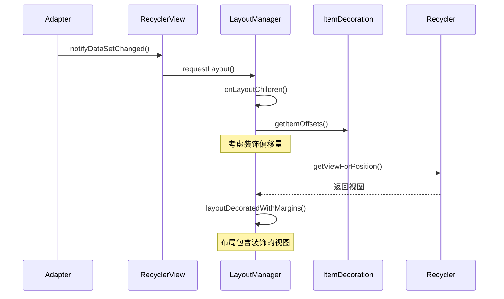

## 总结

LayoutManager是RecyclerView架构中控制视图排列的关键组件。通过提供不同的LayoutManager实现，RecyclerView可以轻松展现各种复杂的列表布局，从简单的线性列表到复杂的瀑布流网格。理解LayoutManager的工作原理，对于开发高性能、自定义视图布局至关重要。

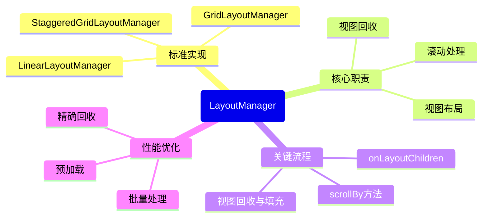

在下一篇文章中，我们将深入探讨布局策略和常见LayoutManager的具体实现细节。 