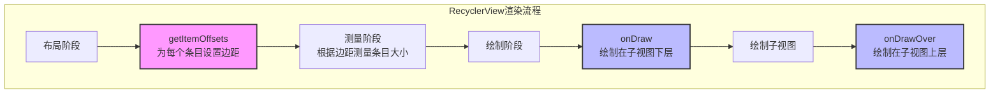
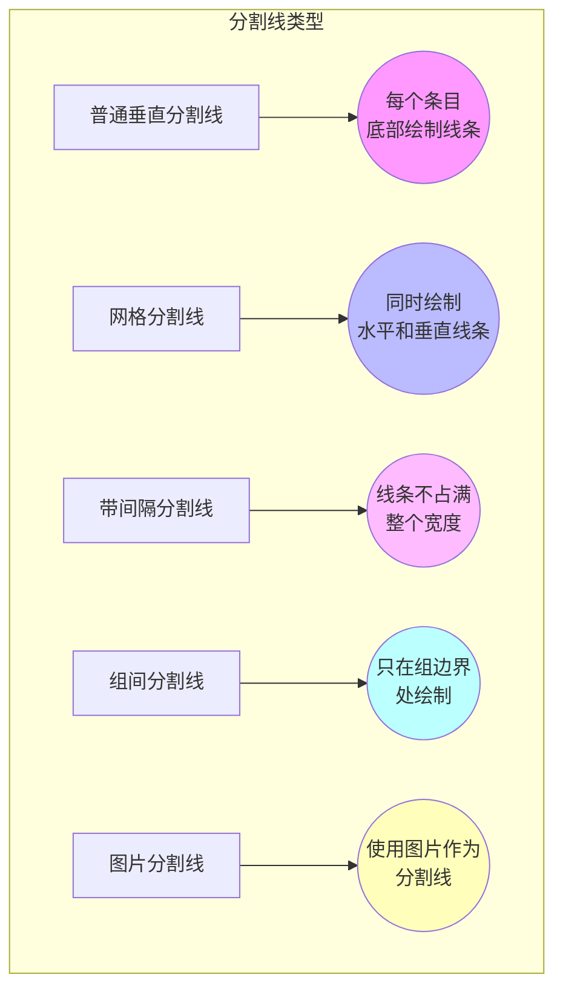
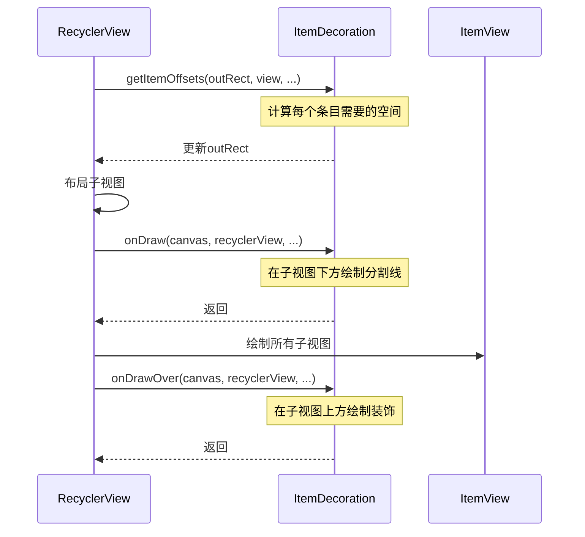

# RecyclerView自定义分割线

## 概述

在RecyclerView中，分割线（Divider）是通过ItemDecoration（条目装饰器）来实现的。不同于ListView自带的分割线属性，RecyclerView需要通过自定义ItemDecoration来添加分割线，这种设计虽然增加了实现的复杂度，但也带来了极大的灵活性，开发者可以实现各种复杂的分割线和装饰效果。

## ItemDecoration的基本原理

RecyclerView.ItemDecoration是一个抽象类，提供了三个关键方法：

```java
// 绘制在子视图下层的装饰
public void onDraw(Canvas c, RecyclerView parent, State state) {}

// 绘制在子视图上层的装饰
public void onDrawOver(Canvas c, RecyclerView parent, State state) {}

// 为子视图添加边距
public void getItemOffsets(Rect outRect, View view, RecyclerView parent, State state) {}
```

其中，`getItemOffsets`方法用于为每个条目指定边距偏移，而`onDraw`和`onDrawOver`方法则用于实际绘制分割线。



## 创建基本分割线

### 1. 垂直列表分割线

以下是一个简单的垂直列表分割线实现：

```java
public class DividerItemDecoration extends RecyclerView.ItemDecoration {
    private static final int DEFAULT_DIVIDER_HEIGHT = 1;
    
    private final Paint mPaint;
    private final int mDividerHeight;
    
    public DividerItemDecoration(int color) {
        this(color, DEFAULT_DIVIDER_HEIGHT);
    }
    
    public DividerItemDecoration(int color, int dividerHeight) {
        mPaint = new Paint();
        mPaint.setColor(color);
        mPaint.setStyle(Paint.Style.FILL);
        mDividerHeight = dividerHeight;
    }
    
    @Override
    public void getItemOffsets(Rect outRect, View view, RecyclerView parent, RecyclerView.State state) {
        // 设置底部偏移为分割线高度
        outRect.bottom = mDividerHeight;
    }
    
    @Override
    public void onDraw(Canvas canvas, RecyclerView parent, RecyclerView.State state) {
        int left = parent.getPaddingLeft();
        int right = parent.getWidth() - parent.getPaddingRight();
        
        int childCount = parent.getChildCount();
        for (int i = 0; i < childCount; i++) {
            View child = parent.getChildAt(i);
            
            // 获取布局参数
            RecyclerView.LayoutParams params = (RecyclerView.LayoutParams) child.getLayoutParams();
            
            // 计算分割线顶部位置（子视图底部 + 底部margin - 外部设置的偏移）
            int top = child.getBottom() + params.bottomMargin;
            // 计算分割线底部位置
            int bottom = top + mDividerHeight;
            
            // 绘制分割线
            canvas.drawRect(left, top, right, bottom, mPaint);
        }
    }
}
```

使用方法：

```java
DividerItemDecoration divider = new DividerItemDecoration(Color.GRAY);
recyclerView.addItemDecoration(divider);
```



### 2. 网格列表分割线

对于GridLayoutManager，需要同时绘制垂直和水平分割线：

```java
public class GridDividerItemDecoration extends RecyclerView.ItemDecoration {
    private final Paint mPaint;
    private final int mDividerWidth;
    private final int mDividerHeight;
    
    public GridDividerItemDecoration(int color, int dividerWidth, int dividerHeight) {
        mPaint = new Paint();
        mPaint.setColor(color);
        mPaint.setStyle(Paint.Style.FILL);
        mDividerWidth = dividerWidth;
        mDividerHeight = dividerHeight;
    }
    
    @Override
    public void getItemOffsets(Rect outRect, View view, RecyclerView parent, RecyclerView.State state) {
        // 设置右侧和底部偏移
        outRect.right = mDividerWidth;
        outRect.bottom = mDividerHeight;
        
        // 对于左边界的项目，不设置左偏移
        if (parent.getChildAdapterPosition(view) % ((GridLayoutManager)parent.getLayoutManager()).getSpanCount() == 0) {
            outRect.left = 0;
        } else {
            outRect.left = mDividerWidth;
        }
    }
    
    @Override
    public void onDraw(Canvas canvas, RecyclerView parent, RecyclerView.State state) {
        drawHorizontal(canvas, parent);
        drawVertical(canvas, parent);
    }
    
    private void drawHorizontal(Canvas canvas, RecyclerView parent) {
        int childCount = parent.getChildCount();
        
        for (int i = 0; i < childCount; i++) {
            View child = parent.getChildAt(i);
            
            RecyclerView.LayoutParams params = (RecyclerView.LayoutParams) child.getLayoutParams();
            
            int left = child.getLeft() - params.leftMargin;
            int right = child.getRight() + params.rightMargin + mDividerWidth;
            int top = child.getBottom() + params.bottomMargin;
            int bottom = top + mDividerHeight;
            
            canvas.drawRect(left, top, right, bottom, mPaint);
        }
    }
    
    private void drawVertical(Canvas canvas, RecyclerView parent) {
        int childCount = parent.getChildCount();
        
        for (int i = 0; i < childCount; i++) {
            View child = parent.getChildAt(i);
            
            RecyclerView.LayoutParams params = (RecyclerView.LayoutParams) child.getLayoutParams();
            
            int left = child.getRight() + params.rightMargin;
            int right = left + mDividerWidth;
            int top = child.getTop() - params.topMargin;
            int bottom = child.getBottom() + params.bottomMargin;
            
            canvas.drawRect(left, top, right, bottom, mPaint);
        }
    }
}
```


## 高级自定义分割线

### 1. 带有间隔的分割线

以下实现可以为垂直列表添加带有左右间隔的分割线：

```java
public class InsetDividerItemDecoration extends RecyclerView.ItemDecoration {
    private final Paint mPaint;
    private final int mDividerHeight;
    private final int mLeftInset;
    private final int mRightInset;
    
    public InsetDividerItemDecoration(int color, int dividerHeight, int leftInset, int rightInset) {
        mPaint = new Paint();
        mPaint.setColor(color);
        mPaint.setStyle(Paint.Style.FILL);
        mDividerHeight = dividerHeight;
        mLeftInset = leftInset;
        mRightInset = rightInset;
    }
    
    @Override
    public void getItemOffsets(Rect outRect, View view, RecyclerView parent, RecyclerView.State state) {
        outRect.bottom = mDividerHeight;
    }
    
    @Override
    public void onDraw(Canvas canvas, RecyclerView parent, RecyclerView.State state) {
        int left = parent.getPaddingLeft() + mLeftInset;
        int right = parent.getWidth() - parent.getPaddingRight() - mRightInset;
        
        int childCount = parent.getChildCount();
        for (int i = 0; i < childCount; i++) {
            View child = parent.getChildAt(i);
            
            // 跳过最后一个项目的分割线
            if (parent.getChildAdapterPosition(child) == parent.getAdapter().getItemCount() - 1) {
                continue;
            }
            
            RecyclerView.LayoutParams params = (RecyclerView.LayoutParams) child.getLayoutParams();
            
            int top = child.getBottom() + params.bottomMargin;
            int bottom = top + mDividerHeight;
            
            canvas.drawRect(left, top, right, bottom, mPaint);
        }
    }
}
```


### 2. 组间分割线

以下实现可以为分组列表添加组间分割线：

```java
public class GroupDividerItemDecoration extends RecyclerView.ItemDecoration {
    private final Paint mPaint;
    private final int mDividerHeight;
    private final GroupAdapter mAdapter;
    
    public GroupDividerItemDecoration(int color, int dividerHeight, GroupAdapter adapter) {
        mPaint = new Paint();
        mPaint.setColor(color);
        mPaint.setStyle(Paint.Style.FILL);
        mDividerHeight = dividerHeight;
        mAdapter = adapter;
    }
    
    @Override
    public void getItemOffsets(Rect outRect, View view, RecyclerView parent, RecyclerView.State state) {
        int position = parent.getChildAdapterPosition(view);
        
        // 如果是组的第一个项目，添加顶部偏移
        if (mAdapter.isFirstInGroup(position)) {
            outRect.top = mDividerHeight;
        } else {
            outRect.top = 0;
        }
    }
    
    @Override
    public void onDraw(Canvas canvas, RecyclerView parent, RecyclerView.State state) {
        int left = parent.getPaddingLeft();
        int right = parent.getWidth() - parent.getPaddingRight();
        
        int childCount = parent.getChildCount();
        for (int i = 0; i < childCount; i++) {
            View child = parent.getChildAt(i);
            int position = parent.getChildAdapterPosition(child);
            
            if (mAdapter.isFirstInGroup(position)) {
                RecyclerView.LayoutParams params = (RecyclerView.LayoutParams) child.getLayoutParams();
                
                int bottom = child.getTop() - params.topMargin;
                int top = bottom - mDividerHeight;
                
                canvas.drawRect(left, top, right, bottom, mPaint);
            }
        }
    }
    
    // 假设的接口，用于确定项目是否是组的第一个
    public interface GroupAdapter {
        boolean isFirstInGroup(int position);
    }
}
```

### 3. 带有图片的自定义分割线

以下实现使用图片作为分割线：

```java
public class ImageDividerItemDecoration extends RecyclerView.ItemDecoration {
    private final Drawable mDivider;
    
    public ImageDividerItemDecoration(Context context, @DrawableRes int drawableResId) {
        mDivider = ContextCompat.getDrawable(context, drawableResId);
    }
    
    @Override
    public void getItemOffsets(Rect outRect, View view, RecyclerView parent, RecyclerView.State state) {
        outRect.bottom = mDivider.getIntrinsicHeight();
    }
    
    @Override
    public void onDraw(Canvas canvas, RecyclerView parent, RecyclerView.State state) {
        int left = parent.getPaddingLeft();
        int right = parent.getWidth() - parent.getPaddingRight();
        
        int childCount = parent.getChildCount();
        for (int i = 0; i < childCount; i++) {
            View child = parent.getChildAt(i);
            
            RecyclerView.LayoutParams params = (RecyclerView.LayoutParams) child.getLayoutParams();
            
            int top = child.getBottom() + params.bottomMargin;
            int bottom = top + mDivider.getIntrinsicHeight();
            
            mDivider.setBounds(left, top, right, bottom);
            mDivider.draw(canvas);
        }
    }
}
```

## 标准分割线的扩展使用

Android Support Library提供了DividerItemDecoration类，可以快速实现垂直或水平的分割线：

```java
// 创建垂直分割线
DividerItemDecoration divider = new DividerItemDecoration(context, DividerItemDecoration.VERTICAL);
// 可选：设置自定义分割线Drawable
divider.setDrawable(ContextCompat.getDrawable(context, R.drawable.divider));
recyclerView.addItemDecoration(divider);
```

但这个标准实现的灵活性有限，很多情况下需要自定义ItemDecoration。

## 常见问题与解决方案

### 1. 最后一项的分割线处理

很多情况下，我们不想为列表的最后一项添加分割线。解决方法是在onDraw方法中检查当前项是否为最后一项：

```java
@Override
public void onDraw(Canvas canvas, RecyclerView parent, RecyclerView.State state) {
    // ...
    for (int i = 0; i < childCount; i++) {
        View child = parent.getChildAt(i);
        
        // 跳过最后一项
        if (parent.getChildAdapterPosition(child) == parent.getAdapter().getItemCount() - 1) {
            continue;
        }
        
        // 绘制分割线
        // ...
    }
}
```

### 2. 特定条目类型的分割线处理

有时我们需要为不同类型的条目设置不同的分割线，可以在getItemOffsets和onDraw方法中检查条目类型：

```java
@Override
public void getItemOffsets(Rect outRect, View view, RecyclerView parent, RecyclerView.State state) {
    int position = parent.getChildAdapterPosition(view);
    int itemType = parent.getAdapter().getItemViewType(position);
    
    if (itemType == MyAdapter.TYPE_NORMAL) {
        outRect.bottom = mNormalDividerHeight;
    } else if (itemType == MyAdapter.TYPE_HEADER) {
        outRect.bottom = mHeaderDividerHeight;
    } else {
        outRect.bottom = 0; // 无分割线
    }
}
```

### 3. 处理布局变更时的重绘问题

当RecyclerView的布局发生变化时（如插入/删除条目），可能需要重新计算分割线。一种解决方法是监听适配器的数据变化：

```java
public class DynamicDividerItemDecoration extends RecyclerView.ItemDecoration {
    // ...
    
    private final RecyclerView.AdapterDataObserver mObserver = new RecyclerView.AdapterDataObserver() {
        @Override
        public void onChanged() {
            // 数据变化时，请求RecyclerView重新绘制
            mRecyclerView.invalidateItemDecorations();
        }
        
        // 其他方法...
    };
    
    public void attachToRecyclerView(RecyclerView recyclerView) {
        if (mRecyclerView != null) {
            mRecyclerView.getAdapter().unregisterAdapterDataObserver(mObserver);
        }
        
        mRecyclerView = recyclerView;
        if (recyclerView != null) {
            recyclerView.getAdapter().registerAdapterDataObserver(mObserver);
        }
    }
    
    public void detachFromRecyclerView() {
        if (mRecyclerView != null) {
            mRecyclerView.getAdapter().unregisterAdapterDataObserver(mObserver);
            mRecyclerView = null;
        }
    }
}
```

## 性能优化

自定义分割线涉及大量绘制操作，需要注意性能优化：

1. **减少对象创建**：避免在onDraw方法中创建对象，如Paint、Rect等，应在构造函数中创建并复用。

2. **限制绘制范围**：只绘制可见区域的分割线，不要遍历所有条目。

3. **简化绘制逻辑**：过于复杂的绘制逻辑可能导致性能问题，尝试简化实现。

4. **使用Drawable而非自定义绘制**：在可能的情况下，使用预定义的Drawable资源而非动态绘制。



## 总结

RecyclerView的ItemDecoration机制提供了极大的灵活性，使开发者可以实现各种自定义分割线效果。通过合理使用getItemOffsets和onDraw方法，可以创建从简单线条到复杂装饰的各种视觉效果。

自定义分割线的关键在于正确理解RecyclerView的布局流程和绘制机制，特别是要注意子视图的位置和边距计算，以及适应不同LayoutManager的布局特性。通过合理的实现，可以在保证性能的同时，提供良好的视觉体验。