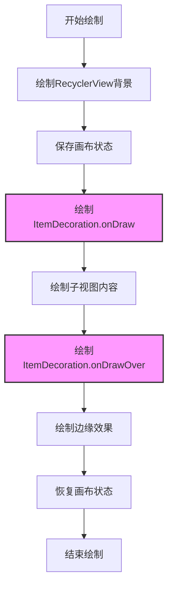
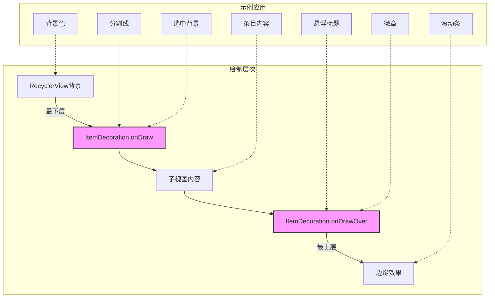
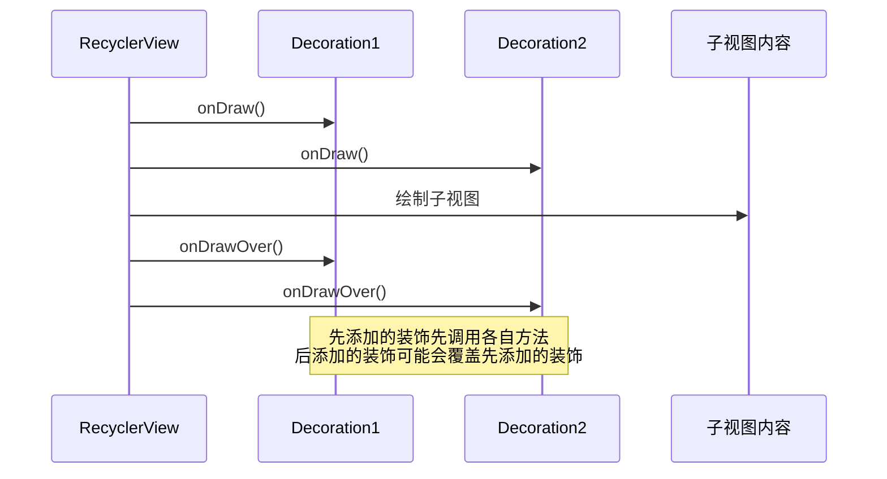

# RecyclerView ItemDecoration绘制顺序

## 概述

在RecyclerView中，ItemDecoration（条目装饰器）可以为条目添加各种视觉效果，如分割线、高亮背景、徽章等。要合理使用ItemDecoration，理解其绘制顺序非常重要，这决定了装饰元素与条目内容的层叠关系。本文将深入探讨ItemDecoration的绘制顺序机制，帮助开发者创建符合预期的视觉效果。

## RecyclerView的绘制流程

要理解ItemDecoration的绘制顺序，首先需要了解RecyclerView的整体绘制流程。RecyclerView的draw方法按照以下顺序执行：

1. 绘制RecyclerView自身的背景
2. 保存画布状态
3. 绘制条目装饰的底层部分（onDraw）
4. 绘制条目内容
5. 绘制条目装饰的顶层部分（onDrawOver）
6. 绘制边缘效果（如滚动条、边缘发光等）
7. 恢复画布状态



下面是RecyclerView的draw方法的简化逻辑：

```java
@Override
public void draw(Canvas canvas) {
    super.draw(canvas);  // 绘制背景

    final int count = mItemDecorations.size();
    if (count > 0) {
        // 绘制ItemDecoration的onDraw部分
        for (int i = 0; i < count; i++) {
            mItemDecorations.get(i).onDraw(canvas, this, mState);
        }
    }

    // 调用默认实现绘制子视图
    // ...

    if (count > 0) {
        // 绘制ItemDecoration的onDrawOver部分
        for (int i = 0; i < count; i++) {
            mItemDecorations.get(i).onDrawOver(canvas, this, mState);
        }
    }
}
```

## ItemDecoration的绘制方法

ItemDecoration类提供了两个用于绘制的关键方法：

### 1. onDraw方法

```java
public void onDraw(Canvas c, RecyclerView parent, RecyclerView.State state)
```

onDraw方法在RecyclerView的子视图绘制之前调用，这意味着onDraw中绘制的内容会被子视图覆盖。这个方法适合绘制以下内容：

- 条目背景
- 分割线
- 选中状态的背景高亮
- 子视图下方的任何装饰

### 2. onDrawOver方法

```java
public void onDrawOver(Canvas c, RecyclerView parent, RecyclerView.State state)
```

onDrawOver方法在RecyclerView的子视图绘制之后调用，这意味着onDrawOver中绘制的内容会覆盖子视图。这个方法适合绘制以下内容：

- 徽章（如未读消息数）
- 选中状态的边框
- 悬浮的标题（如联系人列表的字母索引）
- 子视图上方的任何装饰



## 多个ItemDecoration的绘制顺序

当向RecyclerView添加多个ItemDecoration时，它们的绘制顺序由添加顺序决定：

```java
// 装饰1将先绘制
recyclerView.addItemDecoration(decoration1);
// 装饰2后绘制，可能覆盖装饰1的部分内容
recyclerView.addItemDecoration(decoration2);
```

具体来说，绘制顺序如下：

1. decoration1.onDraw()
2. decoration2.onDraw()
3. 子视图内容
4. decoration1.onDrawOver()
5. decoration2.onDrawOver()



这意味着：
- 在onDraw阶段，先添加的装饰会先绘制，可能被后添加的装饰覆盖
- 在onDrawOver阶段，先添加的装饰会先绘制，可能被后添加的装饰覆盖

## 管理绘制顺序的策略

### 1. 添加顺序控制

最简单的控制方式是调整addItemDecoration的调用顺序：

```java
// 背景装饰（最底层）
recyclerView.addItemDecoration(backgroundDecoration);
// 分割线装饰（中间层）
recyclerView.addItemDecoration(dividerDecoration);
// 徽章装饰（最顶层）
recyclerView.addItemDecoration(badgeDecoration);
```

### 2. 移除与重新添加

有时需要动态改变绘制顺序，可以移除并重新添加装饰：

```java
// 移除特定装饰
recyclerView.removeItemDecoration(specificDecoration);
// 添加到最上层
recyclerView.addItemDecoration(specificDecoration);
```

### 3. 在单个装饰内控制

更复杂的情况是在一个ItemDecoration中包含多种装饰效果，并控制它们的层级：

```java
public class ComplexItemDecoration extends RecyclerView.ItemDecoration {
    @Override
    public void onDraw(Canvas canvas, RecyclerView parent, RecyclerView.State state) {
        // 1. 先绘制背景（最底层）
        drawItemBackgrounds(canvas, parent);
        // 2. 再绘制分割线（次底层）
        drawDividers(canvas, parent);
    }
    
    @Override
    public void onDrawOver(Canvas canvas, RecyclerView parent, RecyclerView.State state) {
        // 1. 先绘制选中边框（次顶层）
        drawSelectionBorders(canvas, parent);
        // 2. 再绘制徽章（最顶层）
        drawBadges(canvas, parent);
    }
    
    // 具体的绘制方法...
}
```

## 特定场景的绘制顺序问题

### 1. 悬浮标题实现

悬浮标题（如联系人列表的字母索引）是一个典型的需要控制绘制顺序的场景：

```java
public class StickyHeaderDecoration extends RecyclerView.ItemDecoration {
    @Override
    public void onDrawOver(Canvas canvas, RecyclerView parent, RecyclerView.State state) {
        // 找到第一个可见项
        View firstVisibleView = parent.getChildAt(0);
        int firstVisiblePosition = parent.getChildAdapterPosition(firstVisibleView);
        
        // 获取当前分组标题
        String currentHeader = getHeaderForPosition(firstVisiblePosition);
        
        // 计算下一个标题的位置
        int nextHeaderPosition = getNextHeaderPosition(firstVisiblePosition);
        
        // 绘制悬浮标题
        if (nextHeaderPosition != -1 && isTopToNext(firstVisibleView, parent, nextHeaderPosition)) {
            // 当下一个标题即将出现时，向上推当前标题
            drawPushedHeader(canvas, parent, currentHeader, nextHeaderPosition);
        } else {
            // 正常绘制悬浮标题
            drawHeader(canvas, parent, currentHeader);
        }
    }
    
    // 具体实现方法...
}
```

悬浮标题必须使用onDrawOver来确保它绘制在内容之上。

### 2. 选中效果与分割线

当需要同时显示条目选中效果和分割线时，绘制顺序十分重要：

```java
// 先添加选中效果装饰
recyclerView.addItemDecoration(new SelectionDecoration(selectedPosition));
// 再添加分割线装饰
recyclerView.addItemDecoration(new DividerDecoration());
```

这样分割线会覆盖选中效果的边缘，通常这是期望的视觉效果。如果希望选中效果覆盖分割线，则应调整添加顺序。

### 3. 处理ItemDecoration的重叠区域

当多个ItemDecoration的绘制区域重叠时，可能需要特殊处理：

```java
public class CombinedItemDecoration extends RecyclerView.ItemDecoration {
    @Override
    public void onDraw(Canvas canvas, RecyclerView parent, RecyclerView.State state) {
        // 绘制背景，但避开选中项
        for (int i = 0; i < parent.getChildCount(); i++) {
            View child = parent.getChildAt(i);
            int position = parent.getChildAdapterPosition(child);
            
            if (position != selectedPosition) {
                drawBackground(canvas, child, parent);
            }
        }
        
        // 为选中项绘制特殊背景
        if (selectedPosition >= 0) {
            View selectedView = findViewByPosition(parent, selectedPosition);
            if (selectedView != null) {
                drawSelectedBackground(canvas, selectedView, parent);
            }
        }
    }
    
    // 具体实现方法...
}
```

## 性能考量

控制绘制顺序时，也需要考虑性能问题：

1. **避免重复绘制**：多个ItemDecoration绘制相同区域可能导致性能浪费
2. **合并相似装饰**：考虑将功能相近的装饰合并到一个ItemDecoration中
3. **限制绘制范围**：只在必要的区域进行绘制
4. **减少透明度计算**：半透明绘制需要额外的合成计算

示例：合并多个装饰以提高性能

```java
// 不推荐：使用多个独立装饰
recyclerView.addItemDecoration(new BackgroundDecoration());
recyclerView.addItemDecoration(new DividerDecoration());
recyclerView.addItemDecoration(new SelectionDecoration());

// 推荐：合并为一个装饰
recyclerView.addItemDecoration(new CombinedDecoration());
```

## 源码解析

让我们更深入地看看RecyclerView是如何管理ItemDecoration的绘制顺序的：

```java
public class RecyclerView extends ViewGroup {
    private final ArrayList<ItemDecoration> mItemDecorations = new ArrayList<>();
    
    // 添加装饰
    public void addItemDecoration(ItemDecoration decor) {
        addItemDecoration(decor, -1);
    }
    
    public void addItemDecoration(ItemDecoration decor, int index) {
        if (mItemDecorations.isEmpty()) {
            setWillNotDraw(false);
        }
        if (index < 0) {
            mItemDecorations.add(decor);
        } else {
            mItemDecorations.add(index, decor);
        }
        markItemDecorInsetsDirty();
        requestLayout();
    }
    
    // 移除装饰
    public void removeItemDecoration(ItemDecoration decor) {
        mItemDecorations.remove(decor);
        if (mItemDecorations.isEmpty()) {
            setWillNotDraw(eatRequestLayout || mClipToPadding);
        }
        markItemDecorInsetsDirty();
        requestLayout();
    }
    
    // 绘制过程
    @Override
    public void draw(Canvas canvas) {
        super.draw(canvas);
        
        // 绘制装饰的onDraw部分
        for (int i = 0; i < mItemDecorations.size(); i++) {
            mItemDecorations.get(i).onDraw(canvas, this, mState);
        }
        
        // 绘制子视图...
        
        // 绘制装饰的onDrawOver部分
        for (int i = 0; i < mItemDecorations.size(); i++) {
            mItemDecorations.get(i).onDrawOver(canvas, this, mState);
        }
    }
}
```

从源码可以看出，RecyclerView使用ArrayList存储所有的ItemDecoration，并按照添加顺序依次调用它们的onDraw和onDrawOver方法。

## 实际应用示例

### 1. 分组列表的悬浮标题与分割线

```java
// 标题装饰（需要在分割线之上）
StickyHeaderDecoration headerDecoration = new StickyHeaderDecoration(adapter);
recyclerView.addItemDecoration(headerDecoration);

// 分割线装饰
DividerItemDecoration dividerDecoration = new DividerItemDecoration(context, DividerItemDecoration.VERTICAL);
recyclerView.addItemDecoration(dividerDecoration);
```


### 2. 网格图片库的选中效果与间距

```java
// 间距装饰（底层）
GridSpacingItemDecoration spacingDecoration = new GridSpacingItemDecoration(spanCount, spacing, includeEdge);
recyclerView.addItemDecoration(spacingDecoration);

// 选中效果装饰（顶层）
SelectionOverlayDecoration selectionDecoration = new SelectionOverlayDecoration(selectedPosition);
recyclerView.addItemDecoration(selectionDecoration);
```


### 3. 聊天列表的日期分隔与消息气泡

```java
// 日期分隔装饰
DateSeparatorDecoration dateSeparatorDecoration = new DateSeparatorDecoration(context, chatMessages);
recyclerView.addItemDecoration(dateSeparatorDecoration);

// 消息气泡装饰
ChatBubbleDecoration bubbleDecoration = new ChatBubbleDecoration(context, currentUserId);
recyclerView.addItemDecoration(bubbleDecoration);
```


## 总结

ItemDecoration的绘制顺序是实现复杂视觉效果的关键。通过理解onDraw和onDrawOver的调用时机，以及多个装饰的添加顺序，开发者可以精确控制各种装饰元素的层叠关系。

在实际应用中，应根据装饰的视觉特性选择适当的绘制方法和添加顺序，并考虑合并相似功能的装饰以提高性能。通过合理利用ItemDecoration的绘制顺序机制，可以为RecyclerView创建丰富多样的视觉效果，提升用户体验。 