# RecyclerView的ItemDecoration详解

ItemDecoration是RecyclerView中的一个核心组件，它允许开发者为列表或网格中的项目添加特殊的绘制内容（如分割线）和布局偏移（如间距）。本文将详细介绍ItemDecoration的工作原理、使用方法和实现细节。

## ItemDecoration的核心职责

在RecyclerView中，"子视图"（Child Views）是指RecyclerView容器内的每一个列表项（item）视图。这些是由适配器创建并由LayoutManager排列的独立视图，代表列表中的每一个条目。

ItemDecoration主要有三个核心职责：

1. **绘制在子视图之下**：可以为每个item添加背景、边框等装饰
2. **绘制在子视图之上**：可以添加前景效果、标记、徽章等装饰
3. **添加偏移量**：为item提供边距、间距，影响布局但不影响item本身的尺寸

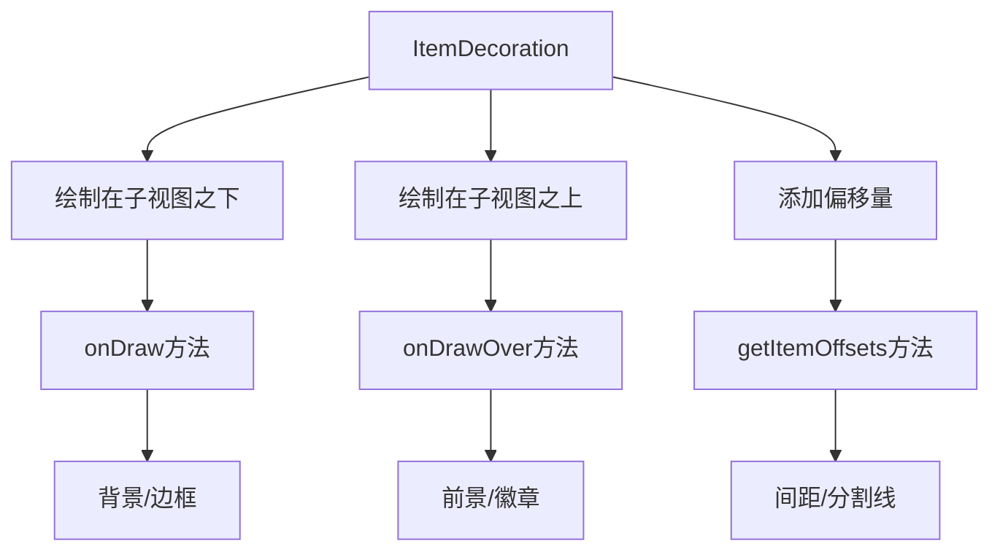

这些功能允许开发者实现分割线、网格线、组标题、突出显示效果等常见UI元素，而无需修改item视图本身。

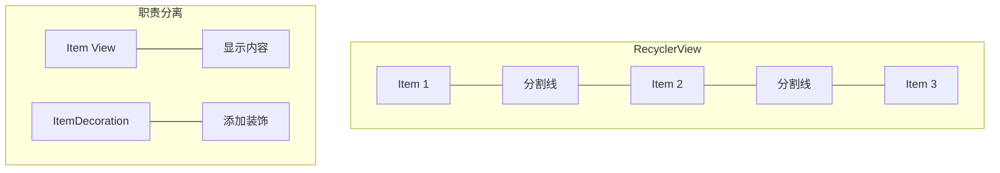

## ItemDecoration的基本实现

ItemDecoration是一个抽象类，要实现自定义装饰，需要覆盖以下三个关键方法：

```java
public abstract class ItemDecoration {
    // 绘制在子视图之下的内容
    public void onDraw(Canvas c, RecyclerView parent, RecyclerView.State state) {
        onDraw(c, parent);
    }
    
    @Deprecated
    public void onDraw(Canvas c, RecyclerView parent) {
    }
    
    // 绘制在子视图之上的内容
    public void onDrawOver(Canvas c, RecyclerView parent, RecyclerView.State state) {
        onDrawOver(c, parent);
    }
    
    @Deprecated
    public void onDrawOver(Canvas c, RecyclerView parent) {
    }
    
    // 为子视图添加偏移量
    public void getItemOffsets(Rect outRect, View view, RecyclerView parent, RecyclerView.State state) {
        getItemOffsets(outRect, ((RecyclerView.LayoutParams) view.getLayoutParams()).getViewLayoutPosition(),
                parent);
    }
    
    @Deprecated
    public void getItemOffsets(Rect outRect, int itemPosition, RecyclerView parent) {
        outRect.set(0, 0, 0, 0);
    }
}
```

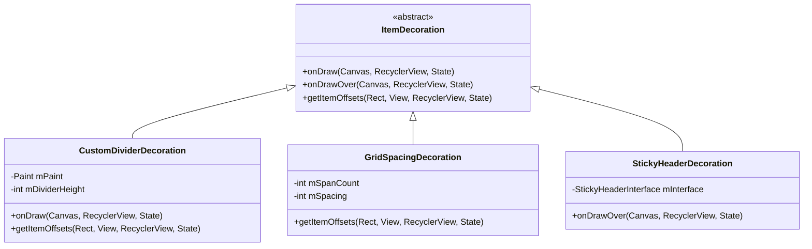

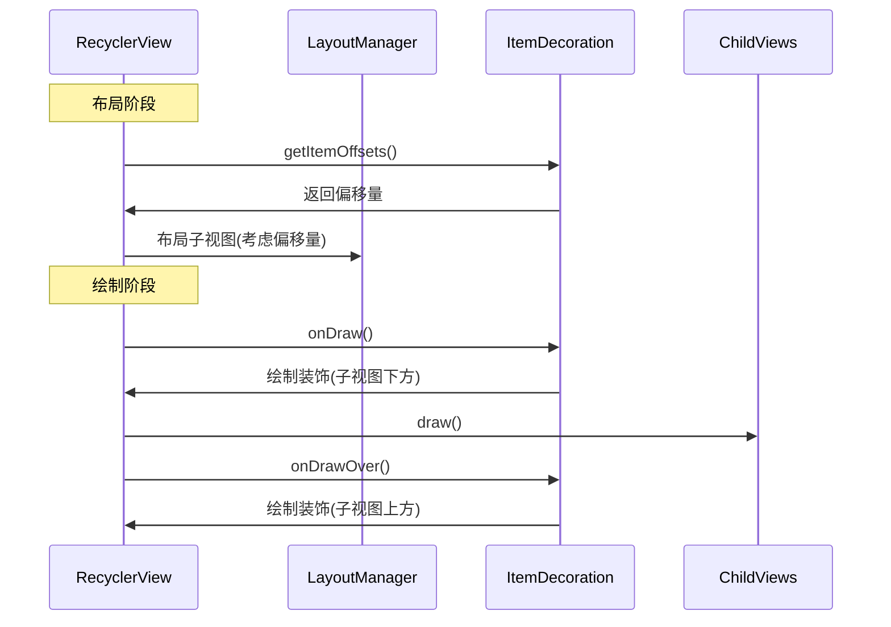

## 主要方法解析

### 1. getItemOffsets()

```java
public void getItemOffsets(Rect outRect, View view, RecyclerView parent, RecyclerView.State state)
```

- **目的**：设置每个item周围的偏移量，实际上是在实现项目之间的间距
- **调用时机**：在测量和布局每个子视图之前调用
- **参数**：
  - `outRect`：用于填充偏移量的矩形对象
  - `view`：当前处理的子视图
  - `parent`：父RecyclerView
  - `state`：RecyclerView的当前状态信息

示例：为所有项目添加垂直间距

```java
public class VerticalSpaceItemDecoration extends RecyclerView.ItemDecoration {
    private final int verticalSpace;

    public VerticalSpaceItemDecoration(int verticalSpace) {
        this.verticalSpace = verticalSpace;
    }

    @Override
    public void getItemOffsets(Rect outRect, View view, RecyclerView parent, 
                              RecyclerView.State state) {
        outRect.bottom = verticalSpace;
        
        // 第一个item也添加顶部间距
        if (parent.getChildAdapterPosition(view) == 0) {
            outRect.top = verticalSpace;
        }
    }
}
```

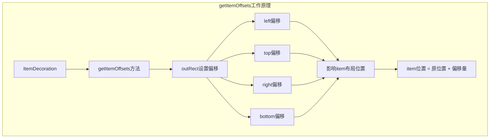

### 2. onDraw()

```java
public void onDraw(Canvas c, RecyclerView parent, RecyclerView.State state)
```

- **目的**：在子视图之下绘制内容
- **调用时机**：在RecyclerView的onDraw方法中，绘制子视图之前调用
- **参数**：
  - `c`：用于绘制的Canvas对象
  - `parent`：父RecyclerView
  - `state`：RecyclerView的当前状态信息

示例：绘制水平分割线

```java
public class DividerItemDecoration extends RecyclerView.ItemDecoration {
    private Drawable mDivider;

    public DividerItemDecoration(Context context) {
        mDivider = ContextCompat.getDrawable(context, R.drawable.divider);
    }

    @Override
    public void onDraw(Canvas c, RecyclerView parent, RecyclerView.State state) {
        int left = parent.getPaddingLeft();
        int right = parent.getWidth() - parent.getPaddingRight();

        int childCount = parent.getChildCount();
        for (int i = 0; i < childCount; i++) {
            View child = parent.getChildAt(i);
            
            RecyclerView.LayoutParams params = (RecyclerView.LayoutParams) child.getLayoutParams();
            
            int top = child.getBottom() + params.bottomMargin;
            int bottom = top + mDivider.getIntrinsicHeight();
            
            mDivider.setBounds(left, top, right, bottom);
            mDivider.draw(c);
        }
    }
}
```

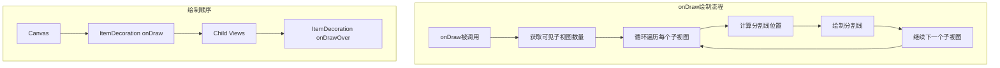

### 3. onDrawOver()

```java
public void onDrawOver(Canvas c, RecyclerView parent, RecyclerView.State state)
```

- **目的**：在子视图之上绘制内容
- **调用时机**：在RecyclerView的onDraw方法中，绘制子视图之后调用
- **参数**：同onDraw方法

示例：为选中项绘制高亮边框

```java
public class SelectedItemDecoration extends RecyclerView.ItemDecoration {
    private Paint mPaint;
    private int mSelectedPosition = -1;

    public SelectedItemDecoration(Context context) {
        mPaint = new Paint();
        mPaint.setColor(ContextCompat.getColor(context, R.color.selected_item_border));
        mPaint.setStyle(Paint.Style.STROKE);
        mPaint.setStrokeWidth(5);
    }

    public void setSelectedPosition(int position) {
        mSelectedPosition = position;
    }

    @Override
    public void onDrawOver(Canvas c, RecyclerView parent, RecyclerView.State state) {
        if (mSelectedPosition < 0) return;
        
        View selectedView = null;
        for (int i = 0; i < parent.getChildCount(); i++) {
            View child = parent.getChildAt(i);
            int position = parent.getChildAdapterPosition(child);
            if (position == mSelectedPosition) {
                selectedView = child;
                break;
            }
        }
        
        if (selectedView != null) {
            c.drawRect(
                selectedView.getLeft() - 2.5f,
                selectedView.getTop() - 2.5f,
                selectedView.getRight() + 2.5f,
                selectedView.getBottom() + 2.5f,
                mPaint
            );
        }
    }
}
```

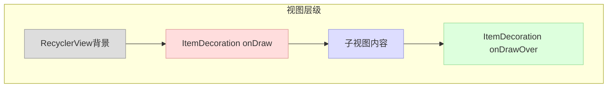

## 常见应用场景

### 1. 分割线

分割线是ItemDecoration最常见的应用场景，Android提供了DividerItemDecoration辅助类：

```java
DividerItemDecoration dividerItemDecoration = new DividerItemDecoration(
        context, LinearLayoutManager.VERTICAL);
recyclerView.addItemDecoration(dividerItemDecoration);
```

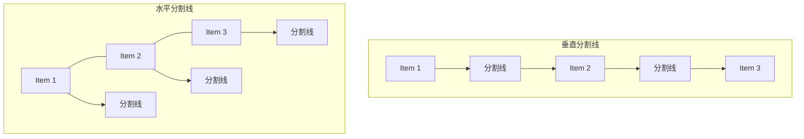

### 2. 网格线

在GridLayoutManager中添加网格线：

```java
public class GridDividerItemDecoration extends RecyclerView.ItemDecoration {
    private Paint mPaint;
    private int mDividerWidth;

    public GridDividerItemDecoration(Context context, int dividerWidth) {
        mPaint = new Paint();
        mPaint.setColor(ContextCompat.getColor(context, R.color.grid_divider));
        mDividerWidth = dividerWidth;
    }

    @Override
    public void getItemOffsets(Rect outRect, View view, RecyclerView parent, RecyclerView.State state) {
        outRect.right = mDividerWidth;
        outRect.bottom = mDividerWidth;
    }

    @Override
    public void onDraw(Canvas c, RecyclerView parent, RecyclerView.State state) {
        for (int i = 0; i < parent.getChildCount(); i++) {
            View child = parent.getChildAt(i);
            
            // 绘制右侧分割线
            c.drawRect(
                child.getRight(),
                child.getTop(),
                child.getRight() + mDividerWidth,
                child.getBottom(),
                mPaint
            );
            
            // 绘制底部分割线
            c.drawRect(
                child.getLeft(),
                child.getBottom(),
                child.getRight() + mDividerWidth,
                child.getBottom() + mDividerWidth,
                mPaint
            );
        }
    }
}
```

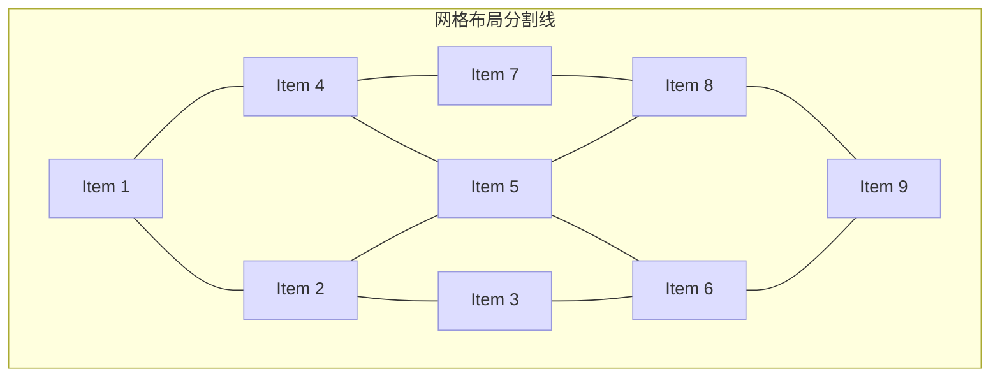

### 3. 组标题（粘性标题）

粘性标题是一个复杂但常见的UI需求，可以通过ItemDecoration实现：

```java
public class StickyHeaderItemDecoration extends RecyclerView.ItemDecoration {
    private StickyHeaderInterface mListener;
    private int mStickyHeaderHeight;

    public StickyHeaderItemDecoration(StickyHeaderInterface listener) {
        mListener = listener;
    }

    @Override
    public void onDrawOver(Canvas c, RecyclerView parent, RecyclerView.State state) {
        View topChild = parent.getChildAt(0);
        if (topChild == null) return;

        int topChildPosition = parent.getChildAdapterPosition(topChild);
        if (topChildPosition == RecyclerView.NO_POSITION) return;

        View currentHeader = mListener.getHeaderViewForItem(topChildPosition, parent);
        fixLayoutSize(parent, currentHeader);
        
        int contactPoint = currentHeader.getBottom();
        View childInContact = getChildInContact(parent, contactPoint);
        
        if (childInContact != null && mListener.isHeader(parent.getChildAdapterPosition(childInContact))) {
            moveHeader(c, currentHeader, childInContact);
            return;
        }
        
        drawHeader(c, currentHeader);
    }

    private View getChildInContact(RecyclerView parent, int contactPoint) {
        View childInContact = null;
        for (int i = 0; i < parent.getChildCount(); i++) {
            View child = parent.getChildAt(i);
            if (child.getBottom() > contactPoint) {
                if (child.getTop() <= contactPoint) {
                    childInContact = child;
                    break;
                }
            }
        }
        return childInContact;
    }

    private void moveHeader(Canvas c, View currentHeader, View nextHeader) {
        c.save();
        c.translate(0, nextHeader.getTop() - currentHeader.getHeight());
        currentHeader.draw(c);
        c.restore();
    }

    private void drawHeader(Canvas c, View header) {
        c.save();
        c.translate(0, 0);
        header.draw(c);
        c.restore();
    }

    private void fixLayoutSize(RecyclerView parent, View view) {
        // 测量并布局标题视图
        // ...
    }

    public interface StickyHeaderInterface {
        boolean isHeader(int position);
        View getHeaderViewForItem(int position, RecyclerView parent);
    }
}
```

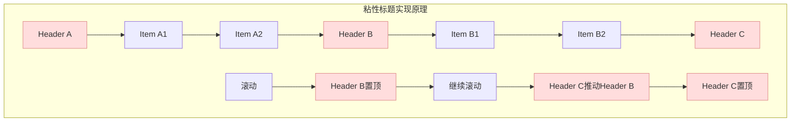

## 添加多个ItemDecoration

RecyclerView支持添加多个ItemDecoration，它们会按照添加顺序被调用：

```java
recyclerView.addItemDecoration(new SpaceItemDecoration(16));
recyclerView.addItemDecoration(new DividerItemDecoration(context, LinearLayoutManager.VERTICAL));
recyclerView.addItemDecoration(new StickyHeaderItemDecoration(stickyHeaderListener));
```

多个装饰的绘制顺序：
1. 所有装饰的getItemOffsets()方法被调用，计算总偏移量
2. 按添加顺序调用每个装饰的onDraw()方法
3. 绘制所有子视图
4. 按添加顺序调用每个装饰的onDrawOver()方法

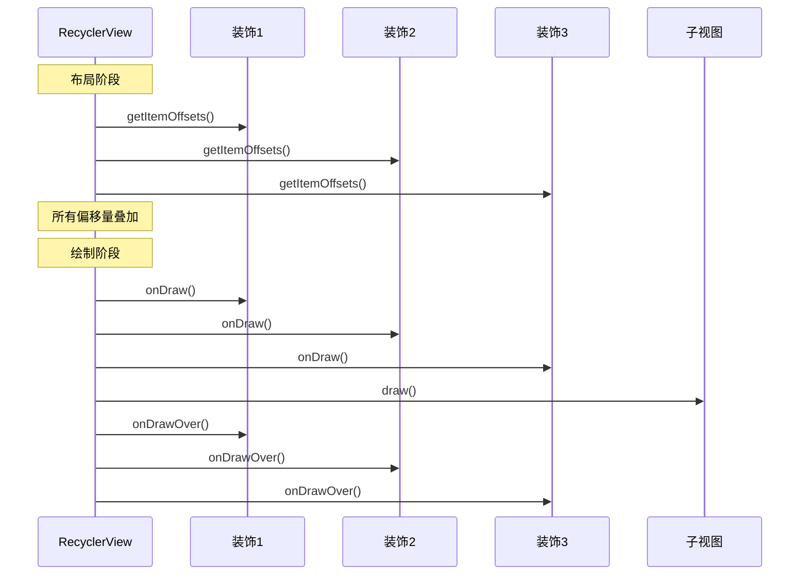

## 性能考虑

实现高效的ItemDecoration需要注意以下几点：

1. **减少对象创建**：避免在onDraw()和onDrawOver()方法中创建新对象
2. **高效计算**：尽量使用简单的计算，避免复杂的数学运算
3. **避免过度绘制**：只绘制可见区域内的装饰内容
4. **合理使用canvas操作**：使用canvas的剪裁和变换功能，减少重复计算
5. **缓存常用值**：缓存频繁使用的尺寸和颜色值
6. **使用硬件加速**：当绘制复杂内容时，确保使用硬件加速提高性能

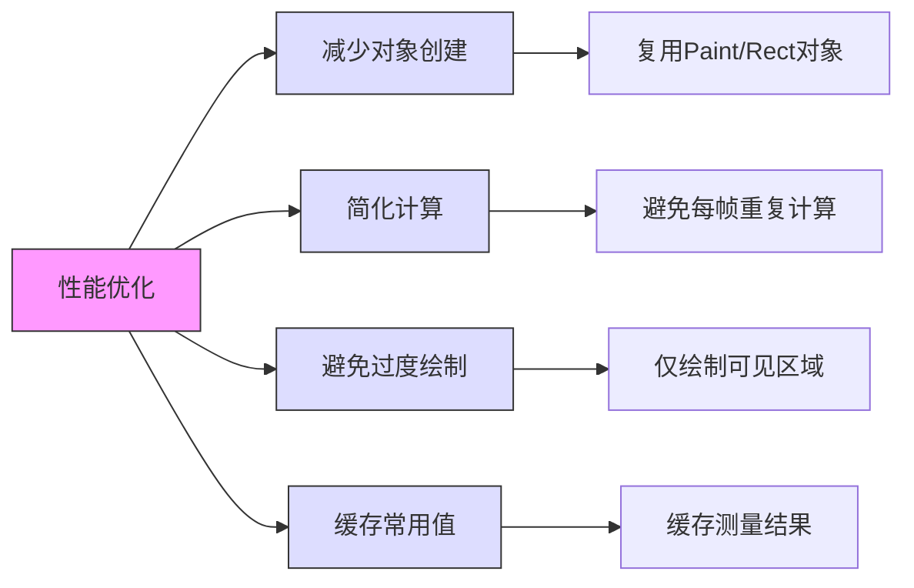

## 总结

ItemDecoration是RecyclerView提供的强大机制，它允许开发者以非侵入方式为列表项添加各种视觉效果和布局调整。通过合理实现ItemDecoration，可以实现分割线、间距、边框、高亮效果、粘性标题等各种UI需求，同时保持代码的清晰分离。

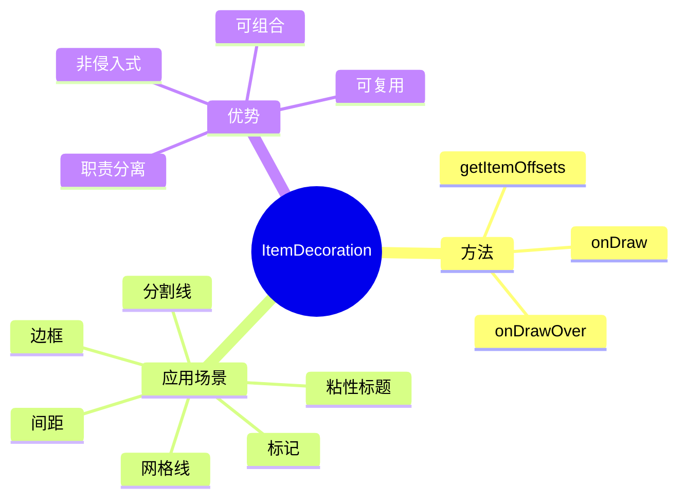

在下一篇文章中，我们将详细探讨如何实现自定义分割线以及ItemDecoration的绘制顺序。 