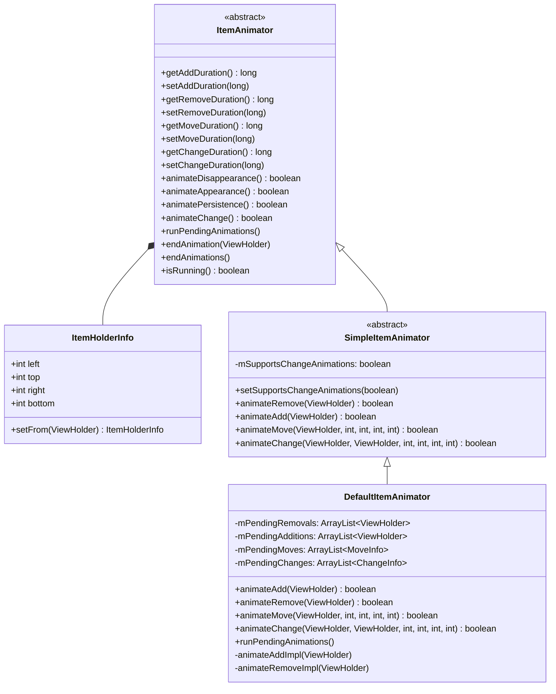
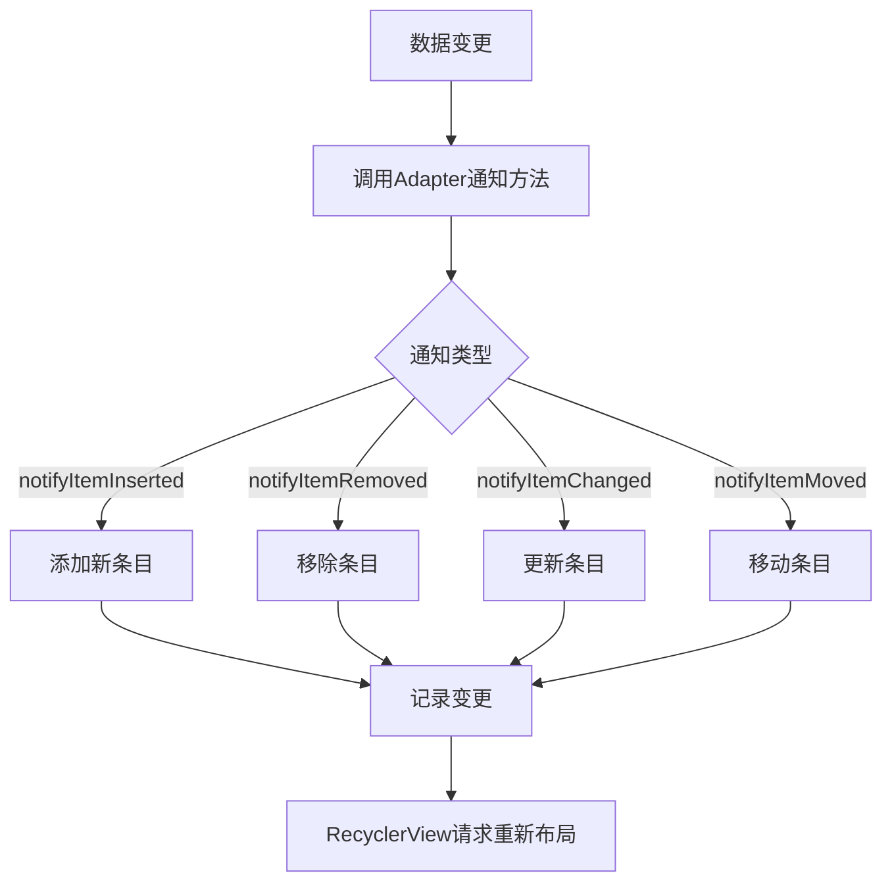
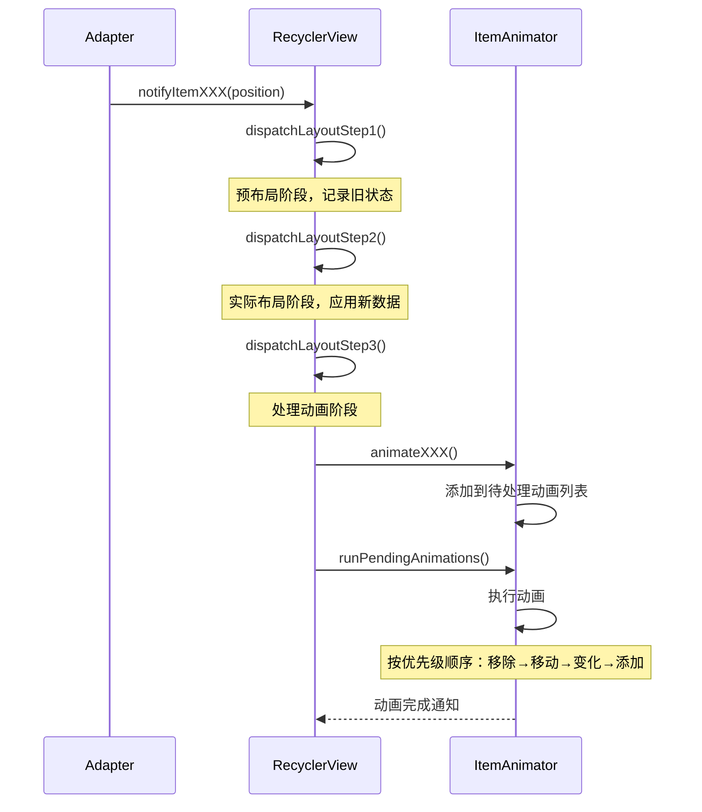
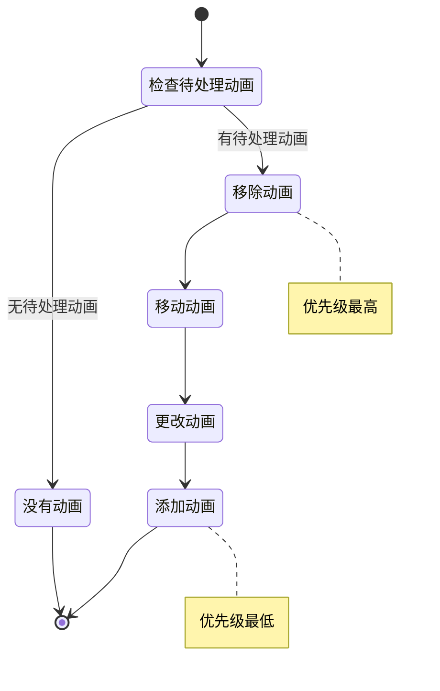
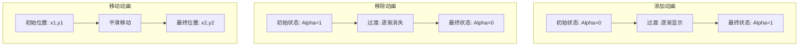

# RecyclerView动画实现原理

## 概述

RecyclerView提供了丰富的动画效果支持，这是其相比ListView等早期控件的一大优势。RecyclerView通过ItemAnimator机制，为条目的添加、移除、移动和更新等操作提供了流畅的过渡动画，极大提升了用户体验。本文将深入分析RecyclerView的动画实现原理，包括框架设计、执行流程和自定义方法。

## 动画的基础架构

RecyclerView的动画系统主要由以下几个部分组成：

1. **ItemAnimator**：抽象基类，定义了动画的基本接口
2. **SimpleItemAnimator**：ItemAnimator的抽象实现，提供了基础功能
3. **DefaultItemAnimator**：默认的动画实现
4. **RecyclerView.ItemAnimator.ItemHolderInfo**：保存条目动画前后状态的信息类
5. **ViewInfoStore**：管理视图状态信息的存储器

以下是这些类之间的关系：

```
ItemAnimator (抽象类)
    ↑
SimpleItemAnimator (抽象类)
    ↑
DefaultItemAnimator (具体实现)
```

下面是动画系统类关系的图表：



## 动画的触发机制

RecyclerView中的动画是由数据变化触发的。当Adapter数据发生变化并通知RecyclerView时，RecyclerView会计算布局差异，并据此触发相应的动画。

### 1. 数据变化通知

```java
// 整体数据变化
adapter.notifyDataSetChanged();

// 局部数据变化
adapter.notifyItemInserted(position);
adapter.notifyItemRemoved(position);
adapter.notifyItemChanged(position);
adapter.notifyItemMoved(fromPosition, toPosition);

// 范围数据变化
adapter.notifyItemRangeInserted(positionStart, itemCount);
adapter.notifyItemRangeRemoved(positionStart, itemCount);
adapter.notifyItemRangeChanged(positionStart, itemCount);
```

### 2. 状态追踪

当通知RecyclerView数据变化时，它会记录变化前的视图状态。在布局阶段，它会比较新旧状态，确定需要执行哪些动画：

```java
// RecyclerView源码中的简化逻辑
void recordPreLayoutInformation(State state, ViewHolder viewHolder, 
                               int changeFlags, List<Object> payload) {
    // 记录动画前的状态
    ItemHolderInfo info = obtainHolderInfo();
    info.setFrom(viewHolder);
    
    if ((changeFlags & FLAG_CHANGED) != 0) {
        mViewInfoStore.addToPreLayout(viewHolder, info);
    } else if ((changeFlags & FLAG_REMOVED) != 0) {
        mViewInfoStore.addToPreLayout(viewHolder, info);
    } else if ((changeFlags & FLAG_ADDED) != 0) {
        // 新增的条目不需要记录前状态
    }
}
```

下面是动画触发流程的图表：



## 动画的执行流程

RecyclerView的动画执行流程大致分为以下几个步骤：

### 1. 预布局阶段（Pre-Layout）

在这个阶段，RecyclerView会先以旧数据布局，并记录现有视图的状态：

```java
// 预布局阶段的简化逻辑
void dispatchLayoutStep1() {
    mState.mIsPrelayout = true;
    // 保存旧的视图状态
    saveOldPositions();
    // 执行预布局
    mLayout.onLayoutChildren(mRecycler, mState);
    // 记录视图信息，用于后续动画
    recordAnimationInfoIfNeeded();
}
```

### 2. 实际布局阶段（Real Layout）

在这个阶段，RecyclerView使用新数据进行布局：

```java
// 实际布局阶段的简化逻辑
void dispatchLayoutStep2() {
    mState.mIsPrelayout = false;
    // 使用新数据布局
    mLayout.onLayoutChildren(mRecycler, mState);
    // 更新视图状态
    updateChildrenAfterLayout();
}
```

### 3. 动画执行阶段

根据预布局和实际布局的差异，执行相应的动画：

```java
// 动画执行阶段的简化逻辑
void dispatchLayoutStep3() {
    // 处理动画
    for (ViewHolder holder : mViewInfoStore.getInfoForAnimation()) {
        ItemHolderInfo preInfo = mViewInfoStore.getPreInfo(holder);
        ItemHolderInfo postInfo = mViewInfoStore.getPostInfo(holder);
        
        if (preInfo == null && postInfo != null) {
            // 添加动画
            animateAppearance(holder, null, postInfo);
        } else if (preInfo != null && postInfo == null) {
            // 移除动画
            animateDisappearance(holder, preInfo, null);
        } else if (preInfo != null && postInfo != null) {
            // 变化或移动动画
            animateChange(holder, preInfo, postInfo);
        }
    }
    
    // 启动并执行所有动画
    mItemAnimator.runPendingAnimations();
}
```

下面是动画执行流程的图表：



## ItemAnimator接口设计

RecyclerView.ItemAnimator是一个抽象类，定义了以下主要方法：

```java
public abstract class ItemAnimator {
    // 设置/获取动画持续时间
    public abstract long getAddDuration();
    public abstract void setAddDuration(long addDuration);
    public abstract long getRemoveDuration();
    public abstract void setRemoveDuration(long removeDuration);
    public abstract long getMoveDuration();
    public abstract void setMoveDuration(long moveDuration);
    public abstract long getChangeDuration();
    public abstract void setChangeDuration(long changeDuration);
    
    // 创建动画 - 返回true表示将处理此动画
    public abstract boolean animateDisappearance(ViewHolder viewHolder, 
                            ItemHolderInfo preLayoutInfo, ItemHolderInfo postLayoutInfo);
    public abstract boolean animateAppearance(ViewHolder viewHolder, 
                            ItemHolderInfo preLayoutInfo, ItemHolderInfo postLayoutInfo);
    public abstract boolean animatePersistence(ViewHolder viewHolder, 
                            ItemHolderInfo preLayoutInfo, ItemHolderInfo postLayoutInfo);
    public abstract boolean animateChange(ViewHolder oldHolder, ViewHolder newHolder, 
                            ItemHolderInfo preLayoutInfo, ItemHolderInfo postLayoutInfo);
    
    // 执行等待中的动画
    public abstract void runPendingAnimations();
    
    // 结束动画
    public abstract void endAnimation(ViewHolder item);
    public abstract void endAnimations();
    
    // 是否正在执行动画
    public abstract boolean isRunning();
    
    // 获取状态信息
    public ItemHolderInfo recordPreLayoutInformation(State state, ViewHolder viewHolder, 
                            int changeFlags, List<Object> payloads) {
        return obtainHolderInfo().setFrom(viewHolder);
    }
    
    public ItemHolderInfo recordPostLayoutInformation(State state, ViewHolder viewHolder) {
        return obtainHolderInfo().setFrom(viewHolder);
    }
    
    // 用于派生类创建自定义ItemHolderInfo
    public ItemHolderInfo obtainHolderInfo() {
        return new ItemHolderInfo();
    }
    
    // 保存动画前后信息的类
    public static class ItemHolderInfo {
        public int left, top, right, bottom;
        
        public ItemHolderInfo setFrom(ViewHolder holder) {
            View view = holder.itemView;
            left = view.getLeft();
            top = view.getTop();
            right = view.getRight();
            bottom = view.getBottom();
            return this;
        }
    }
}
```

## SimpleItemAnimator基础实现

SimpleItemAnimator是ItemAnimator的一个抽象实现，提供了一些基础功能：

```java
public abstract class SimpleItemAnimator extends RecyclerView.ItemAnimator {
    // 动画是否更改条目的布局参数
    private boolean mSupportsChangeAnimations = true;
    
    // 设置是否支持更改动画
    public void setSupportsChangeAnimations(boolean supportsChangeAnimations) {
        mSupportsChangeAnimations = supportsChangeAnimations;
    }
    
    // 简化的动画接口
    public boolean animateRemove(ViewHolder holder) {
        return false;
    }
    
    public boolean animateAdd(ViewHolder holder) {
        return false;
    }
    
    public boolean animateMove(ViewHolder holder, int fromX, int fromY, int toX, int toY) {
        return false;
    }
    
    public boolean animateChange(ViewHolder oldHolder, ViewHolder newHolder, 
                                int fromLeft, int fromTop, int toLeft, int toTop) {
        return false;
    }
    
    // 派生于基类的实现
    @Override
    public boolean animateDisappearance(ViewHolder viewHolder, ItemHolderInfo preLayoutInfo, 
                                      ItemHolderInfo postLayoutInfo) {
        int oldLeft = preLayoutInfo.left;
        int oldTop = preLayoutInfo.top;
        
        View disappearingItemView = viewHolder.itemView;
        int newLeft = postLayoutInfo == null ? disappearingItemView.getLeft() : postLayoutInfo.left;
        int newTop = postLayoutInfo == null ? disappearingItemView.getTop() : postLayoutInfo.top;
        
        if (!viewHolder.isRemoved() && (oldLeft != newLeft || oldTop != newTop)) {
            // 先移动再移除
            disappearingItemView.layout(newLeft, newTop, 
                                      newLeft + disappearingItemView.getWidth(), 
                                      newTop + disappearingItemView.getHeight());
            return animateMove(viewHolder, oldLeft, oldTop, newLeft, newTop);
        } else {
            // 直接移除
            return animateRemove(viewHolder);
        }
    }
    
    // 其他方法的实现类似...
}
```

## DefaultItemAnimator实现分析

DefaultItemAnimator是RecyclerView的默认动画实现，它提供了四种基本动画：添加、移除、移动和更改。以下是其核心实现分析：

### 1. 动画列表管理

DefaultItemAnimator维护了几个待处理的动画列表：

```java
public class DefaultItemAnimator extends SimpleItemAnimator {
    private ArrayList<ViewHolder> mPendingRemovals = new ArrayList<>();
    private ArrayList<ViewHolder> mPendingAdditions = new ArrayList<>();
    private ArrayList<MoveInfo> mPendingMoves = new ArrayList<>();
    private ArrayList<ChangeInfo> mPendingChanges = new ArrayList<>();
    
    // 存储正在执行的动画
    private ArrayList<ArrayList<ViewHolder>> mAdditionsList = new ArrayList<>();
    private ArrayList<ArrayList<MoveInfo>> mMovesList = new ArrayList<>();
    private ArrayList<ArrayList<ChangeInfo>> mChangesList = new ArrayList<>();
    
    // 动画信息类
    private static class MoveInfo {
        public ViewHolder holder;
        public int fromX, fromY, toX, toY;
        
        MoveInfo(ViewHolder holder, int fromX, int fromY, int toX, int toY) {
            this.holder = holder;
            this.fromX = fromX;
            this.fromY = fromY;
            this.toX = toX;
            this.toY = toY;
        }
    }
    
    private static class ChangeInfo {
        public ViewHolder oldHolder, newHolder;
        public int fromX, fromY, toX, toY;
        
        ChangeInfo(ViewHolder oldHolder, ViewHolder newHolder) {
            this.oldHolder = oldHolder;
            this.newHolder = newHolder;
        }
        
        ChangeInfo(ViewHolder oldHolder, ViewHolder newHolder, 
                 int fromX, int fromY, int toX, int toY) {
            this(oldHolder, newHolder);
            this.fromX = fromX;
            this.fromY = fromY;
            this.toX = toX;
            this.toY = toY;
        }
    }
}
```

### 2. 动画创建方法

以添加动画为例，DefaultItemAnimator的实现如下：

```java
@Override
public boolean animateAdd(final ViewHolder holder) {
    resetAnimation(holder);
    // 初始状态设为透明
    holder.itemView.setAlpha(0);
    // 添加到待处理列表
    mPendingAdditions.add(holder);
    return true;
}
```

### 3. 执行动画

DefaultItemAnimator在runPendingAnimations中按顺序执行动画：

```java
@Override
public void runPendingAnimations() {
    boolean removalsPending = !mPendingRemovals.isEmpty();
    boolean movesPending = !mPendingMoves.isEmpty();
    boolean changesPending = !mPendingChanges.isEmpty();
    boolean additionsPending = !mPendingAdditions.isEmpty();
    
    if (!removalsPending && !movesPending && !additionsPending && !changesPending) {
        // 没有待处理的动画，直接返回
        return;
    }
    
    // 1. 执行移除动画
    for (ViewHolder holder : mPendingRemovals) {
        animateRemoveImpl(holder);
    }
    mPendingRemovals.clear();
    
    // 2. 执行移动动画
    if (movesPending) {
        final ArrayList<MoveInfo> moves = new ArrayList<>(mPendingMoves);
        mMovesList.add(moves);
        mPendingMoves.clear();
        Runnable mover = new Runnable() {
            @Override
            public void run() {
                for (MoveInfo moveInfo : moves) {
                    animateMoveImpl(moveInfo.holder, 
                                  moveInfo.fromX, moveInfo.fromY, 
                                  moveInfo.toX, moveInfo.toY);
                }
                moves.clear();
                mMovesList.remove(moves);
            }
        };
        if (removalsPending) {
            // 在移除动画完成后执行
            View view = moves.get(0).holder.itemView;
            ViewCompat.postOnAnimationDelayed(view, mover, getRemoveDuration());
        } else {
            mover.run();
        }
    }
    
    // 3. 执行更改动画
    // 类似移动动画的处理...
    
    // 4. 执行添加动画
    if (additionsPending) {
        final ArrayList<ViewHolder> additions = new ArrayList<>(mPendingAdditions);
        mAdditionsList.add(additions);
        mPendingAdditions.clear();
        Runnable adder = new Runnable() {
            @Override
            public void run() {
                for (ViewHolder holder : additions) {
                    animateAddImpl(holder);
                }
                additions.clear();
                mAdditionsList.remove(additions);
            }
        };
        if (removalsPending || movesPending || changesPending) {
            // 在前面动画完成后执行
            long removeDuration = removalsPending ? getRemoveDuration() : 0;
            long moveDuration = movesPending ? getMoveDuration() : 0;
            long changeDuration = changesPending ? getChangeDuration() : 0;
            long delay = removeDuration + Math.max(moveDuration, changeDuration);
            View view = additions.get(0).itemView;
            ViewCompat.postOnAnimationDelayed(view, adder, delay);
        } else {
            adder.run();
        }
    }
}
```

下面是动画执行顺序的图表：



### 4. 具体的动画实现

DefaultItemAnimator使用ViewPropertyAnimator API实现具体的动画效果：

```java
// 添加动画实现
private void animateAddImpl(final ViewHolder holder) {
    final View view = holder.itemView;
    final ViewPropertyAnimator animation = view.animate();
    mAddAnimations.add(holder);
    animation.alpha(1).setDuration(getAddDuration())
            .setListener(new AnimatorListenerAdapter() {
                @Override
                public void onAnimationStart(Animator animator) {
                    dispatchAddStarting(holder);
                }
                
                @Override
                public void onAnimationCancel(Animator animator) {
                    view.setAlpha(1);
                }
                
                @Override
                public void onAnimationEnd(Animator animator) {
                    animation.setListener(null);
                    dispatchAddFinished(holder);
                    mAddAnimations.remove(holder);
                    dispatchFinishedWhenDone();
                }
            }).start();
}

// 移除动画实现
private void animateRemoveImpl(final ViewHolder holder) {
    final View view = holder.itemView;
    final ViewPropertyAnimator animation = view.animate();
    mRemoveAnimations.add(holder);
    animation.setDuration(getRemoveDuration())
            .alpha(0).setListener(new AnimatorListenerAdapter() {
                @Override
                public void onAnimationStart(Animator animator) {
                    dispatchRemoveStarting(holder);
                }
                
                @Override
                public void onAnimationEnd(Animator animator) {
                    animation.setListener(null);
                    view.setAlpha(1);
                    dispatchRemoveFinished(holder);
                    mRemoveAnimations.remove(holder);
                    dispatchFinishedWhenDone();
                }
            }).start();
}

// 移动和更改动画的实现类似...
```

## 动画的触发与执行过程

让我们以添加新条目为例，来看一下完整的动画触发和执行过程：

1. **通知数据变化**：`adapter.notifyItemInserted(position)`
2. **预布局**：RecyclerView执行预布局，记录当前视图状态
3. **实际布局**：使用新数据进行布局，新条目被添加
4. **创建动画**：调用`ItemAnimator.animateAppearance`，进而调用`SimpleItemAnimator.animateAdd`
5. **准备动画**：DefaultItemAnimator将条目添加到mPendingAdditions列表
6. **执行动画**：在下一帧调用runPendingAnimations，执行添加动画
7. **动画完成**：通知RecyclerView动画已完成，解除对ViewHolder的锁定

下面是添加动画的视觉表示：



## 自定义ItemAnimator

要创建自定义动画效果，可以继承SimpleItemAnimator或DefaultItemAnimator，重写相应的方法：

```java
public class CustomItemAnimator extends SimpleItemAnimator {
    @Override
    public boolean animateRemove(ViewHolder holder) {
        // 实现自定义移除动画
        View view = holder.itemView;
        ViewCompat.animate(view)
                .translationX(view.getWidth())  // 向右滑出
                .alpha(0)                       // 渐隐
                .setDuration(getRemoveDuration())
                .setListener(new DefaultRemoveVpaListener(holder))
                .start();
        return true;
    }
    
    @Override
    public boolean animateAdd(ViewHolder holder) {
        // 实现自定义添加动画
        View view = holder.itemView;
        view.setTranslationY(view.getHeight());  // 初始位置在下方
        view.setAlpha(0);                       // 初始透明
        
        ViewCompat.animate(view)
                .translationY(0)                // 滑入到正常位置
                .alpha(1)                      // 渐显
                .setDuration(getAddDuration())
                .setListener(new DefaultAddVpaListener(holder))
                .start();
        return true;
    }
    
    // 实现其他必要的方法...
}
```

使用自定义动画：

```java
RecyclerView recyclerView = findViewById(R.id.recycler_view);
CustomItemAnimator animator = new CustomItemAnimator();
// 设置动画持续时间
animator.setAddDuration(300);
animator.setRemoveDuration(300);
animator.setMoveDuration(300);
animator.setChangeDuration(300);
// 应用到RecyclerView
recyclerView.setItemAnimator(animator);
```

## 动画的性能考量

RecyclerView动画虽然提升了用户体验，但也可能带来性能问题，特别是在频繁更新大量数据时：

1. **设置适当的动画持续时间**：过长的动画会阻塞新视图的创建和绑定

```java
// 适当缩短动画时间
itemAnimator.setAddDuration(150);
itemAnimator.setRemoveDuration(150);
```

2. **关闭不必要的动画**：某些场景下可能不需要所有类型的动画

```java
// 禁用更改动画（例如，在频繁更新条目内容时）
((SimpleItemAnimator) recyclerView.getItemAnimator()).setSupportsChangeAnimations(false);
```

3. **优化自定义动画**：避免在动画中使用复杂的属性变化或计算

```java
// 避免在动画中执行昂贵的操作
@Override
public boolean animateAdd(ViewHolder holder) {
    // 仅使用简单的透明度动画
    View view = holder.itemView;
    view.setAlpha(0);
    ViewCompat.animate(view).alpha(1).setDuration(getAddDuration()).start();
    return true;
}
```

4. **批量更新优化**：使用DiffUtil处理大量数据变化

```java
DiffUtil.DiffResult result = DiffUtil.calculateDiff(new MyDiffCallback(oldList, newList));
// 替换数据
mItems.clear();
mItems.addAll(newList);
// 一次性分发所有变化通知
result.dispatchUpdatesTo(this);
```

## 总结

RecyclerView的动画系统通过精心设计的架构，实现了流畅的条目动画效果。这一系统的核心是ItemAnimator及其实现类，它们负责创建和执行各种条目动画。理解动画的触发机制、执行流程和自定义方法，有助于开发者充分利用RecyclerView的动画能力，创造更好的用户体验。

通过适当的自定义和优化，可以在保持流畅体验的同时，确保应用性能不受影响。在实际开发中，应根据具体需求，选择合适的动画效果和实现方式，平衡视觉体验与性能消耗。 