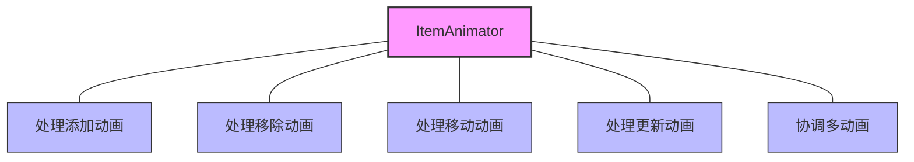
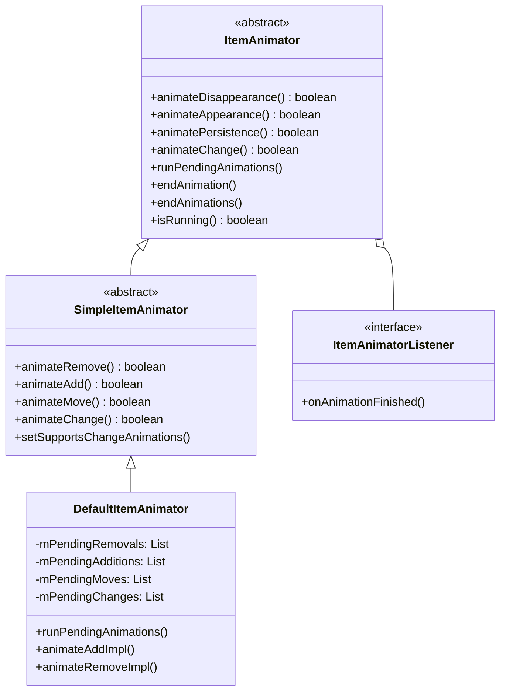
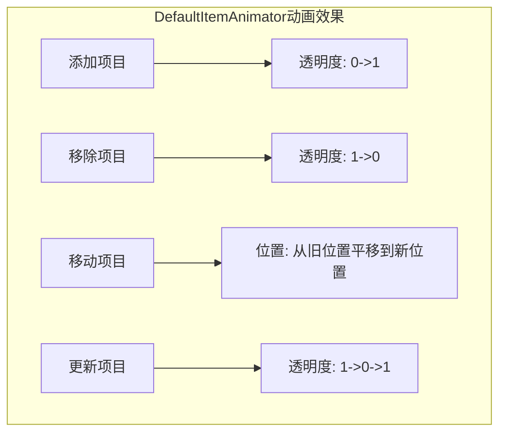
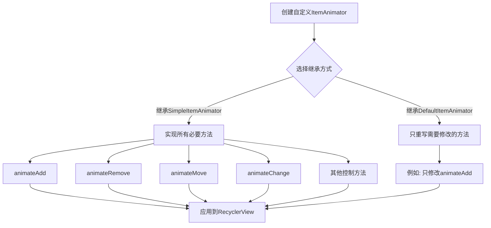
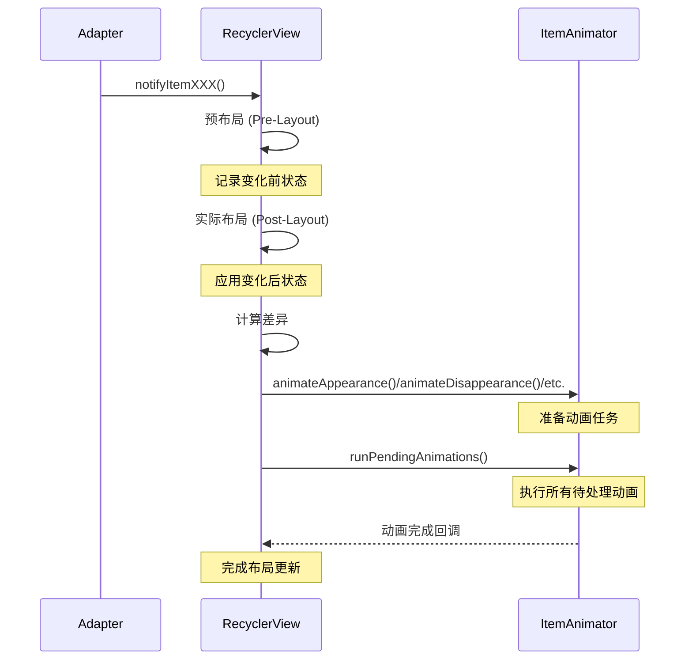
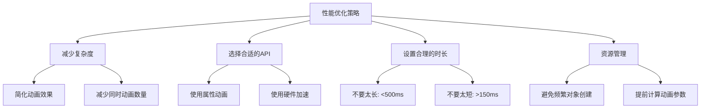
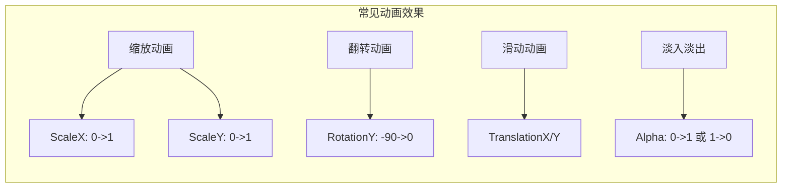

# RecyclerView的ItemAnimator详解

ItemAnimator是RecyclerView架构中负责处理项目动画效果的核心组件，它使列表项的添加、移除、移动和更新等操作能够以平滑过渡的方式呈现。本文将详细介绍ItemAnimator的工作原理、使用方法和实现细节。

## ItemAnimator的核心职责

ItemAnimator的主要职责包括：

1. **处理添加动画**：当新项目插入到RecyclerView中时的动画效果
2. **处理移除动画**：当项目从RecyclerView中移除时的动画效果
3. **处理移动动画**：当项目在RecyclerView中改变位置时的动画效果
4. **处理更新动画**：当项目内容更新时的动画效果
5. **协调多个同时发生的动画**：管理动画之间的时序和冲突

通过这些动画，RecyclerView可以为用户提供更加流畅和直观的交互体验，使数据变化更加自然和易于理解。



## ItemAnimator的基本实现

RecyclerView.ItemAnimator是一个抽象类，它定义了处理各种动画的基本框架。要实现自定义的动画效果，需要理解以下关键概念和方法：

### 核心概念

1. **ItemHolderInfo**：保存ViewHolder状态信息的类，用于计算动画前后状态的差异
2. **AnimatorInfo**：内部使用的类，跟踪正在运行的动画
3. **动画过程**：预动画(pre) -> 动画(animate) -> 结束(end/cancel)

### 关键方法

```java
public abstract class ItemAnimator {
    // 基本动画方法
    public abstract boolean animateDisappearance(@NonNull ViewHolder viewHolder, 
                                           @NonNull ItemHolderInfo preLayoutInfo,
                                           @Nullable ItemHolderInfo postLayoutInfo);

    public abstract boolean animateAppearance(@NonNull ViewHolder viewHolder,
                                        @Nullable ItemHolderInfo preLayoutInfo,
                                        @NonNull ItemHolderInfo postLayoutInfo);

    public abstract boolean animatePersistence(@NonNull ViewHolder viewHolder,
                                         @NonNull ItemHolderInfo preLayoutInfo,
                                         @NonNull ItemHolderInfo postLayoutInfo);

    public abstract boolean animateChange(@NonNull ViewHolder oldHolder,
                                    @NonNull ViewHolder newHolder,
                                    @NonNull ItemHolderInfo preLayoutInfo,
                                    @NonNull ItemHolderInfo postLayoutInfo);

    // 动画控制方法
    public abstract void runPendingAnimations();
    public abstract void endAnimation(ViewHolder item);
    public abstract void endAnimations();
    public abstract boolean isRunning();
    
    // 记录动画开始和结束的监听器
    public interface ItemAnimatorListener {
        void onAnimationFinished(ViewHolder item);
    }
    
    // ...其他方法
}
```



## DefaultItemAnimator

Android提供了DefaultItemAnimator作为RecyclerView的默认动画实现。它为各种操作提供了简单的淡入淡出和平移动画效果。

### 默认动画行为

1. **添加动画**：项目从透明状态淡入
2. **移除动画**：项目淡出直到完全透明
3. **移动动画**：项目从原位置平移到新位置
4. **更新动画**：项目先淡出，更新内容后再淡入

### 使用方法

```java
// 设置默认动画
recyclerView.setItemAnimator(new DefaultItemAnimator());

// 调整动画持续时间
DefaultItemAnimator animator = new DefaultItemAnimator();
animator.setAddDuration(300);
animator.setRemoveDuration(300);
animator.setMoveDuration(300);
animator.setChangeDuration(300);
recyclerView.setItemAnimator(animator);
```



## SimpleItemAnimator

DefaultItemAnimator继承自SimpleItemAnimator，它是一个简化的ItemAnimator实现，提供了更便于子类覆盖的API：

```java
public abstract class SimpleItemAnimator extends RecyclerView.ItemAnimator {
    // 提供更具体的动画方法
    public abstract boolean animateRemove(ViewHolder holder);
    public abstract boolean animateAdd(ViewHolder holder);
    public abstract boolean animateMove(ViewHolder holder, int fromX, int fromY, int toX, int toY);
    public abstract boolean animateChange(ViewHolder oldHolder, ViewHolder newHolder,
                                         int fromLeft, int fromTop, int toLeft, int toTop);
                                         
    // 设置各种动画是否启用
    private boolean mSupportsChangeAnimations = true;
    
    public void setSupportsChangeAnimations(boolean supportsChangeAnimations) {
        mSupportsChangeAnimations = supportsChangeAnimations;
    }
    
    // ...其他方法
}
```

SimpleItemAnimator将复杂的动画过程分解为更简单的单个动画方法，使自定义动画实现更加直观。

## 自定义ItemAnimator

要创建自定义ItemAnimator，通常有两种方法：

### 1. 继承SimpleItemAnimator

这是最常见的方法，只需要实现四个核心动画方法：

```java
public class CustomItemAnimator extends SimpleItemAnimator {
    @Override
    public boolean animateRemove(ViewHolder holder) {
        // 实现移除动画
        // 动画完成时必须调用dispatchRemoveFinished(holder)
        return true; // 返回true表示将处理此动画
    }

    @Override
    public boolean animateAdd(ViewHolder holder) {
        // 实现添加动画
        // 动画完成时必须调用dispatchAddFinished(holder)
        return true;
    }

    @Override
    public boolean animateMove(ViewHolder holder, int fromX, int fromY, int toX, int toY) {
        // 实现移动动画
        // 动画完成时必须调用dispatchMoveFinished(holder)
        return true;
    }

    @Override
    public boolean animateChange(ViewHolder oldHolder, ViewHolder newHolder,
                                int fromLeft, int fromTop, int toLeft, int toTop) {
        // 实现变更动画
        // 动画完成时必须调用dispatchChangeFinished(oldHolder, true)
        // 和dispatchChangeFinished(newHolder, false)
        return true;
    }

    @Override
    public void runPendingAnimations() {
        // 开始执行所有等待中的动画
    }

    @Override
    public void endAnimation(ViewHolder item) {
        // 结束指定项目的所有动画
    }

    @Override
    public void endAnimations() {
        // 结束所有动画
    }

    @Override
    public boolean isRunning() {
        // 返回是否有动画正在运行
        return false;
    }
}
```

### 2. 继承DefaultItemAnimator并修改

如果只需要自定义部分动画行为，可以继承DefaultItemAnimator并覆盖特定方法：

```java
public class ModifiedDefaultItemAnimator extends DefaultItemAnimator {
    @Override
    public boolean animateAdd(RecyclerView.ViewHolder holder) {
        // 自定义添加动画
        holder.itemView.setAlpha(0f);
        holder.itemView.setScaleX(0.5f);
        holder.itemView.setScaleY(0.5f);
        
        AnimatorSet set = new AnimatorSet();
        set.playTogether(
                ObjectAnimator.ofFloat(holder.itemView, View.ALPHA, 1f),
                ObjectAnimator.ofFloat(holder.itemView, View.SCALE_X, 1f),
                ObjectAnimator.ofFloat(holder.itemView, View.SCALE_Y, 1f)
        );
        set.setDuration(getAddDuration());
        set.addListener(new AnimatorListenerAdapter() {
            @Override
            public void onAnimationEnd(Animator animation) {
                dispatchAddFinished(holder);
                dispatchFinishedWhenDone();
            }
        });
        set.start();
        mAddAnimations.add(holder);
        return true;
    }
}
```



## 动画流程详解

理解ItemAnimator的工作流程对于创建自定义动画至关重要：

### 1. 布局与预布局

当数据发生变化时，RecyclerView会执行两次布局：
- **预布局(Pre-Layout)**：收集变化前的视图状态
- **实际布局(Post-Layout)**：应用数据变化后的最终布局

### 2. 记录和计算变化

通过比较预布局和实际布局的信息，RecyclerView确定哪些项目需要动画以及动画的类型。

### 3. 分发动画任务

RecyclerView将不同类型的动画任务分发给ItemAnimator：
- 出现的项目：animateAppearance()
- 消失的项目：animateDisappearance()
- 移动的项目：animatePersistence()
- 变更的项目：animateChange()

### 4. 执行动画

当所有动画任务准备好后，RecyclerView调用runPendingAnimations()来同时启动这些动画。

### 5. 动画完成

当动画完成时，ItemAnimator通知RecyclerView，以便它可以进行必要的清理和更新。



## 性能优化

实现高效的ItemAnimator需要注意以下几点：

1. **避免过度复杂的动画**：复杂动画可能导致卡顿
2. **使用属性动画**：尽量使用ObjectAnimator而非传统的Animation
3. **合理设置动画持续时间**：太长会让用户等待，太短则效果不明显
4. **合理分组动画**：使用AnimatorSet同时执行多个相关动画
5. **避免在动画期间创建新对象**：可能导致内存抖动
6. **考虑硬件加速**：对于复杂动画，确保开启硬件加速



## 常见自定义动画示例

### 1. 缩放动画

```java
public class ScaleInItemAnimator extends SimpleItemAnimator {
    @Override
    public boolean animateAdd(final RecyclerView.ViewHolder holder) {
        holder.itemView.setScaleX(0);
        holder.itemView.setScaleY(0);
        
        return animateAddImpl(holder);
    }
    
    private boolean animateAddImpl(final RecyclerView.ViewHolder holder) {
        ViewCompat.animate(holder.itemView)
                .scaleX(1)
                .scaleY(1)
                .setDuration(300)
                .setInterpolator(new OvershootInterpolator())
                .setListener(new DefaultAddVpaListener(holder))
                .start();
        return true;
    }
    
    // ... 其他必要方法的实现
}
```

### 2. 翻转动画

```java
public class FlipInItemAnimator extends SimpleItemAnimator {
    @Override
    public boolean animateAdd(final RecyclerView.ViewHolder holder) {
        holder.itemView.setRotationY(-90);
        
        return animateAddImpl(holder);
    }
    
    private boolean animateAddImpl(final RecyclerView.ViewHolder holder) {
        ViewCompat.animate(holder.itemView)
                .rotationY(0)
                .setDuration(300)
                .setInterpolator(new DecelerateInterpolator())
                .setListener(new DefaultAddVpaListener(holder))
                .start();
        return true;
    }
    
    // ... 其他必要方法的实现
}
```



## 注意事项与最佳实践

1. **始终维护动画列表**：跟踪所有正在运行的动画，以便在需要时结束它们
2. **正确实现isRunning()**：此方法对于RecyclerView决定何时进行下一步操作很重要
3. **始终调用动画完成回调**：如dispatchAddFinished()，即使动画被取消也要调用
4. **考虑预先计算**：在runPendingAnimations()中预先计算所有动画的属性
5. **处理动画冲突**：当一个ViewHolder受多种动画影响时，决定优先级
6. **避免阻塞主线程**：确保动画计算不会占用过多CPU时间

## 总结

ItemAnimator是RecyclerView架构中负责为列表项添加流畅过渡效果的关键组件。通过合理实现和使用ItemAnimator，可以大大提升RecyclerView的用户体验，使数据变化的可视化更加直观和自然。无论是使用默认动画还是创建自定义动画，了解ItemAnimator的工作原理都是实现高质量列表UI的基础。

在下一篇文章中，我们将深入分析DefaultItemAnimator的实现细节，探讨其内部的动画实现机制。 