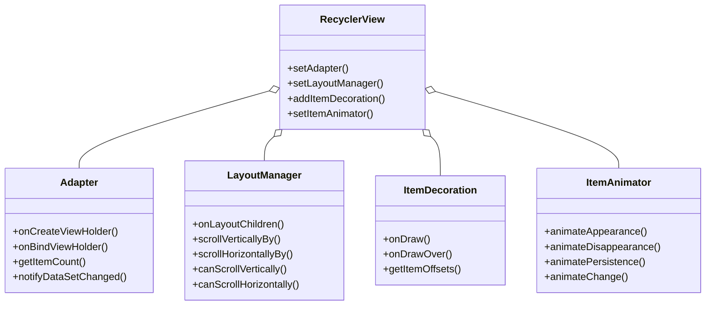
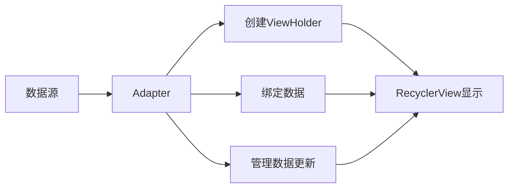
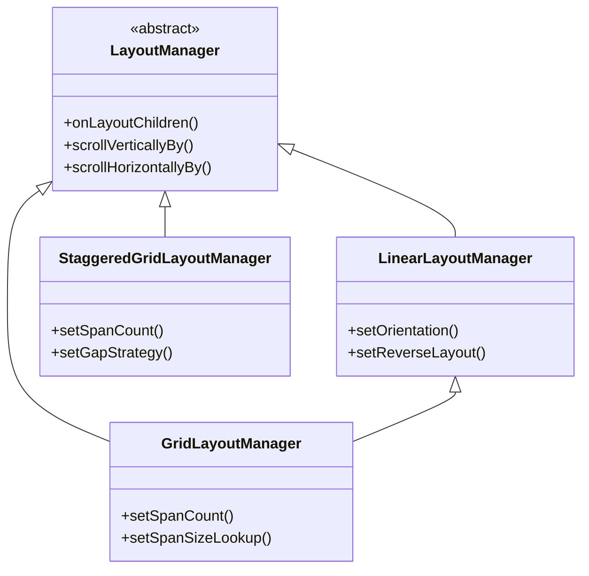
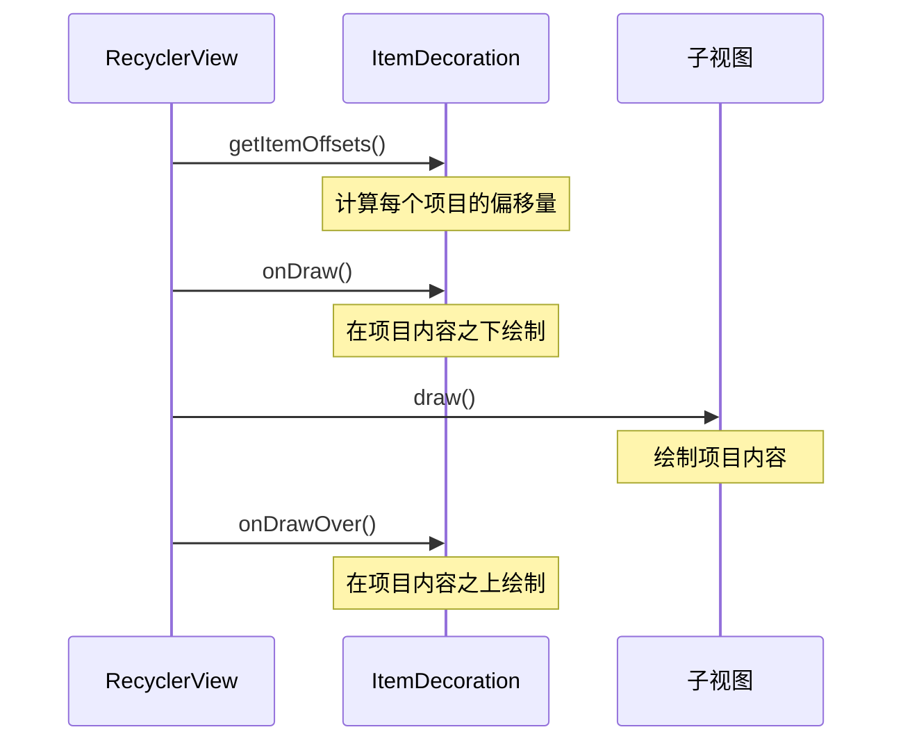
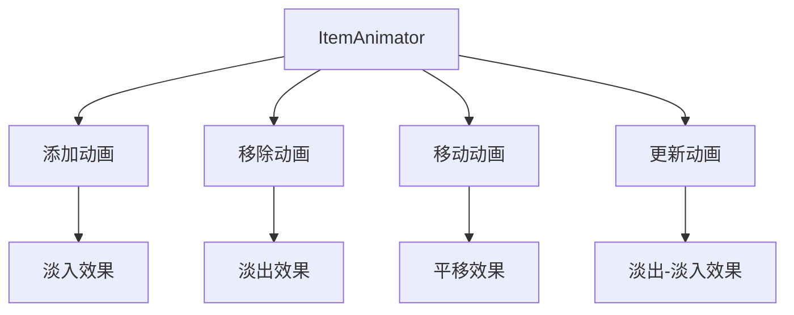
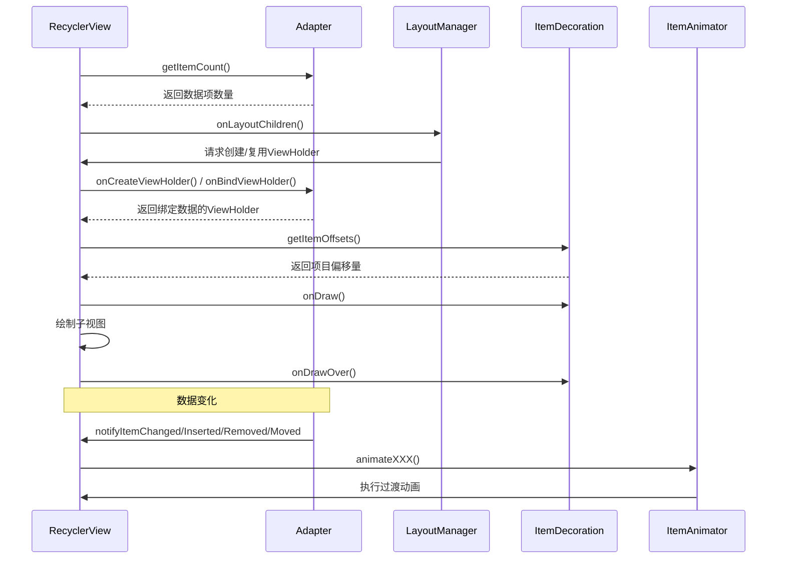
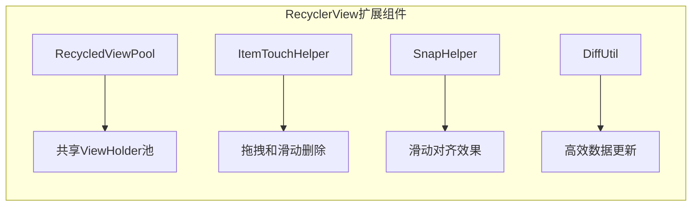

# RecyclerView核心组件介绍

RecyclerView的强大和灵活性主要来源于其组件化设计。每个核心组件都有明确的职责，它们相互配合形成了一个高效的列表显示系统。本文将概述这些核心组件及其基本功能。

## 主要组件概述

RecyclerView通过以下几个核心组件实现其功能：

### 1. Adapter（适配器）

Adapter是连接数据源与RecyclerView的桥梁，负责：
- 创建ViewHolder实例
- 将数据绑定到ViewHolder
- 返回数据集大小
- 通知数据变化

Adapter采用了适配器设计模式，将各种不同类型的数据源（如List、Array、Cursor等）提供给RecyclerView使用，同时负责管理ViewHolder的创建和数据绑定过程。

### 2. LayoutManager（布局管理器）

LayoutManager负责决定RecyclerView中的子视图如何排列，主要功能包括：
- 测量和定位子视图
- 决定何时回收不可见视图
- 管理子视图的添加和移除
- 处理滚动行为

Android提供了三种标准的LayoutManager实现：
- LinearLayoutManager：线性布局（垂直或水平）
- GridLayoutManager：网格布局
- StaggeredGridLayoutManager：瀑布流布局

### 3. ItemDecoration（项目装饰器）

ItemDecoration允许在RecyclerView的每个Item周围添加特殊的绘制和布局偏移，常用于：
- 绘制分割线
- 添加间距或边距
- 为特定项添加突出显示或背景
- 实现组头和组尾效果

ItemDecoration通过覆盖onDraw()、onDrawOver()和getItemOffsets()方法来实现自定义的装饰效果。

### 4. ItemAnimator（项目动画器）

ItemAnimator负责管理添加、移除、移动或更新项目时的动画效果：
- 控制项目出现和消失的动画
- 处理项目位置改变的过渡效果
- 管理动画持续时间和插值器
- 协调多个同时发生的动画

默认的DefaultItemAnimator提供了基本的淡入淡出和平移动画，开发者可以通过继承ItemAnimator类创建自定义动画效果。

## 组件间协作

这些组件协同工作的流程大致如下：

1. RecyclerView通过Adapter获取数据集大小和类型信息
2. LayoutManager决定何时创建新的ViewHolder或复用现有的ViewHolder
3. Adapter负责创建ViewHolder并将数据绑定到ViewHolder
4. ItemDecoration为Item添加额外的绘制和空间
5. 当数据变化时，ItemAnimator处理Item的过渡动画

通过这种组件化设计，RecyclerView实现了高度的可定制性和可扩展性，开发者可以替换或自定义任何一个组件来满足特定需求，而不需要修改其他组件。

## 扩展组件

除了上述核心组件外，RecyclerView还提供了一些扩展组件：

- **RecycledViewPool**：用于在多个RecyclerView之间共享ViewHolder
- **ItemTouchHelper**：用于实现拖拽和滑动删除功能
- **SnapHelper**：用于实现滑动对齐（如ViewPager效果）
- **DiffUtil**：用于高效计算数据集变化和更新UI

在接下来的章节中，我们将详细介绍每个核心组件的工作原理和实现细节。 