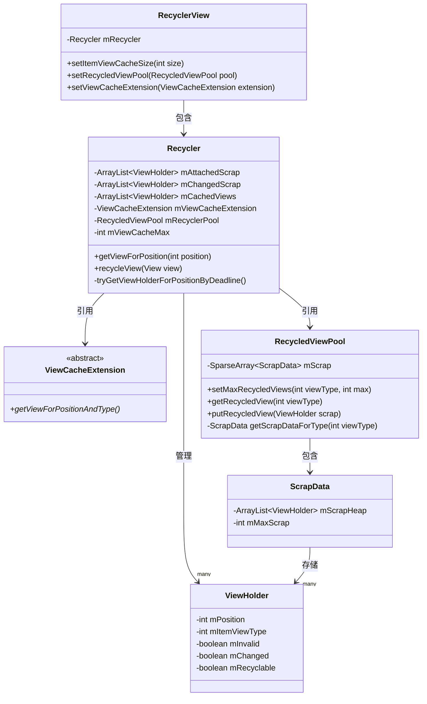
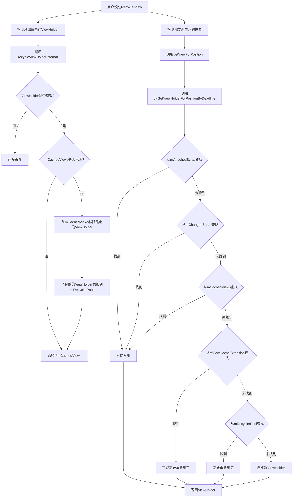

# RecyclerView的四级缓存结构 - 缓存结构概览

RecyclerView之所以能高效地展示大量数据，关键在于其精心设计的多级缓存结构。本部分将介绍RecyclerView缓存结构的概览。

## 缓存结构概览

RecyclerView的缓存体系由四个层次组成，按照优先级从高到低依次为：

1. **mAttachedScrap和mChangedScrap**：临时缓存屏幕上可见的ViewHolder，用于布局过程中的临时detach和复用
2. **mCachedViews**：一级缓存，默认大小为2，存储最近被移出屏幕的ViewHolder
3. **mViewCacheExtension**：二级缓存，开发者自定义的缓存逻辑
4. **mRecyclerPool**：三级缓存，回收池，按照viewType分组存储ViewHolder

这四级缓存各有特点，相互配合，共同提高了RecyclerView的性能和响应速度。

### 缓存结构类图

### 滚动场景下的缓存处理流程图

在后续章节中，我们将详细分析每一级缓存的特点、使用场景和实现原理。 