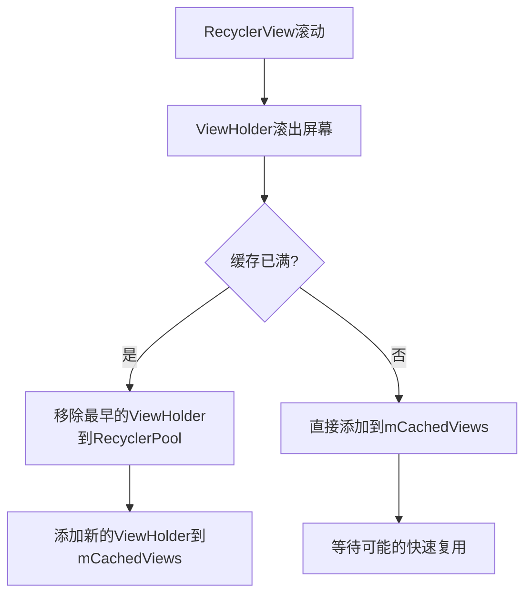
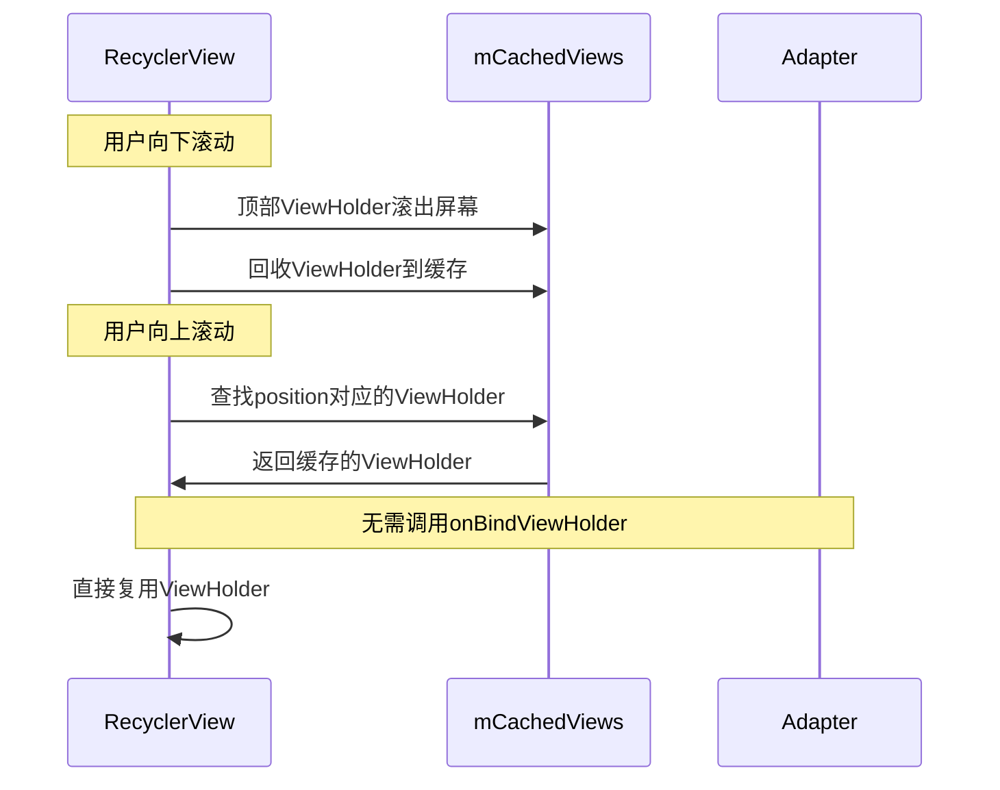
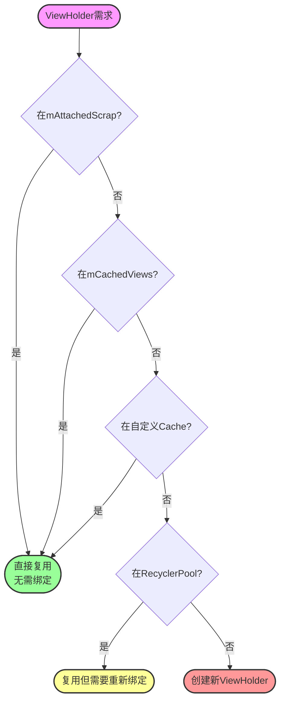
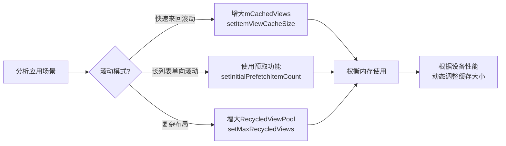
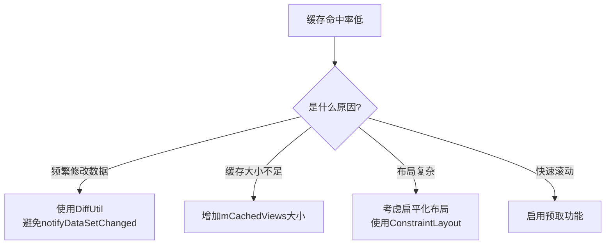
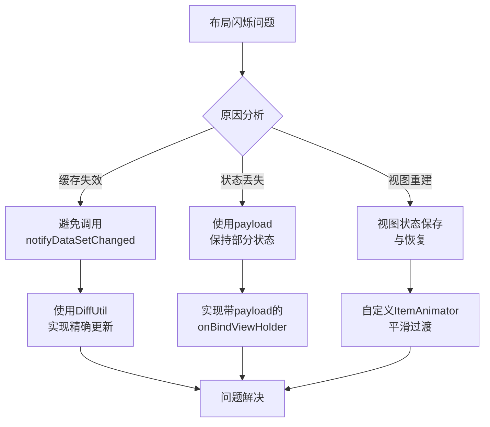
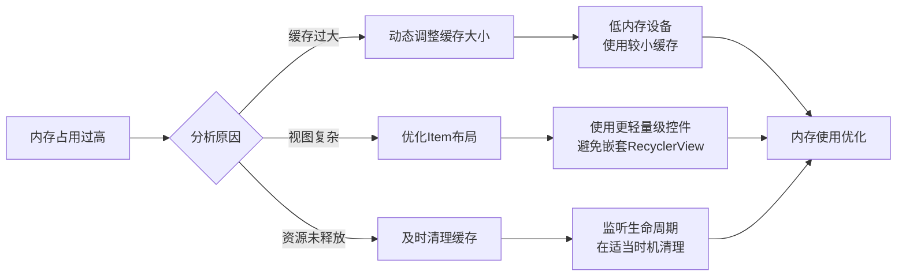

# RecyclerView的四级缓存结构 - 第二级缓存

## 第二级缓存：mCachedViews

### 特点

- 存储最近滚出屏幕的ViewHolder
- 默认大小为2，可以通过`setViewCacheSize()`方法修改
- 按照position索引，可以直接复用而无需重新绑定数据
- 遵循FIFO（先进先出）原则



### 使用场景

这一级缓存主要用于快速的来回滚动场景：

- 当用户向下滚动，顶部的ViewHolder被回收到mCachedViews
- 当用户向上滚动回到顶部，直接从mCachedViews获取之前的ViewHolder
- 无需重新绑定数据，提高滚动性能




### 源码分析

#### 定义

在RecyclerView内部类Recycler中，mCachedViews被定义为ArrayList：

```java
public final class Recycler {
    // 第一级缓存
    final ArrayList<ViewHolder> mAttachedScrap = new ArrayList<>();
    ArrayList<ViewHolder> mChangedScrap = null;

    // 第二级缓存
    final ArrayList<ViewHolder> mCachedViews = new ArrayList<ViewHolder>();

    // 缓存大小相关
    private int mRequestedCacheMax = DEFAULT_CACHE_SIZE;
    int mViewCacheMax = DEFAULT_CACHE_SIZE;

    // 默认缓存大小为2
    static final int DEFAULT_CACHE_SIZE = 2;
    
    // ...其他代码
}
```


#### 缓存大小设置

```java
/**
 * 设置分离的、有效视图的最大保留数量，以便后续使用
 *
 * @param viewCount 在将视图发送到共享池之前保留的视图数量
 */
public void setViewCacheSize(int viewCount) {
    mRequestedCacheMax = viewCount;
    updateViewCacheSize();
}

// 更新缓存大小，并处理溢出的缓存
void updateViewCacheSize() {
    int extraCache = mLayout != null ? mLayout.mPrefetchMaxCountObserved : 0;
    mViewCacheMax = mRequestedCacheMax + extraCache;

    // 处理超出缓存大小的视图
    for (int i = mCachedViews.size() - 1;
            i >= 0 && mCachedViews.size() > mViewCacheMax; i--) {
        recycleCachedViewAt(i);
    }
}
```


#### ViewHolder缓存机制

```java
// 回收ViewHolder并可能添加到mCachedViews
void recycleViewHolderInternal(ViewHolder holder) {
    // ...前面的代码
    
    if (forceRecycle || holder.isRecyclable()) {
        if (mViewCacheMax > 0
                && !holder.hasAnyOfTheFlags(ViewHolder.FLAG_INVALID
                | ViewHolder.FLAG_REMOVED
                | ViewHolder.FLAG_UPDATE
                | ViewHolder.FLAG_ADAPTER_POSITION_UNKNOWN)) {
            // 当缓存已满时，移除最老的缓存项
            int cachedViewSize = mCachedViews.size();
            if (cachedViewSize >= mViewCacheMax && cachedViewSize > 0) {
                recycleCachedViewAt(0);
                cachedViewSize--;
            }

            int targetCacheIndex = cachedViewSize;
            if (ALLOW_THREAD_GAP_WORK
                    && cachedViewSize > 0
                    && !mPrefetchRegistry.lastPrefetchIncludedPosition(holder.mPosition)) {
                // 添加视图时，跳过最近预取的视图
                int cacheIndex = cachedViewSize - 1;
                while (cacheIndex >= 0) {
                    int cachedPos = mCachedViews.get(cacheIndex).mPosition;
                    if (!mPrefetchRegistry.lastPrefetchIncludedPosition(cachedPos)) {
                        break;
                    }
                    cacheIndex--;
                }
                targetCacheIndex = cacheIndex + 1;
            }
            // 将ViewHolder添加到mCachedViews中
            mCachedViews.add(targetCacheIndex, holder);
            cached = true;
        }
        if (!cached) {
            // 如果不能添加到mCachedViews，添加到RecycledViewPool
            addViewHolderToRecycledViewPool(holder, true);
            recycled = true;
        }
    }
    // ...后面的代码
}
```


#### 从缓存获取ViewHolder

```java
// 根据位置获取缓存的ViewHolder
ViewHolder getScrapOrHiddenOrCachedHolderForPosition(int position, boolean dryRun) {
    // 先尝试从mAttachedScrap获取...
    
    // 搜索第一级缓存mCachedViews
    final int cacheSize = mCachedViews.size();
    for (int i = 0; i < cacheSize; i++) {
        final ViewHolder holder = mCachedViews.get(i);
        // 跳过被标记为从scrap返回的或者失效的holder
        if (!holder.isInvalid() && holder.getLayoutPosition() == position
                && !holder.isAttachedToTransitionOverlay()) {
            if (!dryRun) {
                mCachedViews.remove(i);
            }
            if (sVerboseLoggingEnabled) {
                Log.d(TAG, "getScrapOrHiddenOrCachedHolderForPosition(" + position
                        + ") found match in cache: " + holder);
            }
            return holder;
        }
    }
    return null;
}

// 根据ID获取缓存的ViewHolder
ViewHolder getScrapOrCachedViewForId(long id, int type, boolean dryRun) {
    // 先尝试从mAttachedScrap获取...
    
    // 搜索第一级缓存
    final int cacheSize = mCachedViews.size();
    for (int i = cacheSize - 1; i >= 0; i--) {
        final ViewHolder holder = mCachedViews.get(i);
        if (holder.getItemId() == id && !holder.isAttachedToTransitionOverlay()) {
            if (type == holder.getItemViewType()) {
                if (!dryRun) {
                    mCachedViews.remove(i);
                }
                return holder;
            } else if (!dryRun) {
                recycleCachedViewAt(i);
                return null;
            }
        }
    }
    return null;
}
```


#### 回收单个缓存项

```java
/**
 * 回收缓存的视图并从列表中移除。视图添加到缓存中当且仅当它们是可回收的，
 * 所以此方法不再检查这一点。
 * 
 * 一个小例外是当视图没有动画引用但transient状态为true时（由于ItemAnimator外部创建的动画）。
 * 在这种情况下，适配器可能选择回收它。从RecyclerView的角度看，视图仍然是可回收的，
 * 因为适配器希望这样做。
 *
 * @param cachedViewIndex 缓存视图列表中的索引
 */
void recycleCachedViewAt(int cachedViewIndex) {
    if (sVerboseLoggingEnabled) {
        Log.d(TAG, "Recycling cached view at index " + cachedViewIndex);
    }
    ViewHolder viewHolder = mCachedViews.get(cachedViewIndex);
    if (sVerboseLoggingEnabled) {
        Log.d(TAG, "CachedViewHolder to be recycled: " + viewHolder);
    }
    addViewHolderToRecycledViewPool(viewHolder, true);
    mCachedViews.remove(cachedViewIndex);
}
```


#### 清空缓存

```java
/**
 * 清空所有缓存视图。RecycledViewPool中的视图将保留。
 */
public void clear() {
    mAttachedScrap.clear();
    recycleAndClearCachedViews();
}

void recycleAndClearCachedViews() {
    final int count = mCachedViews.size();
    for (int i = count - 1; i >= 0; i--) {
        recycleCachedViewAt(i);
    }
    mCachedViews.clear();
    if (ALLOW_THREAD_GAP_WORK) {
        mPrefetchRegistry.clearPrefetchPositions();
    }
}
```


### mCachedViews 与其他缓存层级的关系

1. **与第一级缓存(mAttachedScrap)的关系**：
   - mAttachedScrap存储布局过程中暂时分离的ViewHolder，布局完成后可以直接复用
   - mCachedViews存储已经滚出屏幕但可能很快会再次需要的ViewHolder
   - 复用查找顺序：先查mAttachedScrap，再查mCachedViews

2. **与第三级缓存(mViewCacheExtension)的关系**：
   - 当mCachedViews中找不到所需ViewHolder时，会尝试从mViewCacheExtension中查找
   - mViewCacheExtension完全由开发者自定义，可以实现特殊的缓存逻辑

3. **与第四级缓存(mRecyclerPool)的关系**：
   - 当mCachedViews容量已满时，最早进入的ViewHolder会被移到mRecyclerPool
   - mCachedViews中的ViewHolder按position索引，可直接复用不需重新绑定
   - mRecyclerPool中的ViewHolder仅按viewType分类，复用时需要重新绑定数据



## 实际应用优化

### 缓存大小的调整策略

根据不同场景调整mCachedViews的大小可以优化滚动性能：

```java
// 针对快速来回滚动的场景，增加缓存大小
recyclerView.getRecycledViewPool().setMaxRecycledViews(viewType, 10);
recyclerView.setItemViewCacheSize(10); // 默认为2，增加到10

// 对于需要预加载的场景，配合预取功能使用
LinearLayoutManager layoutManager = new LinearLayoutManager(context);
layoutManager.setItemPrefetchEnabled(true);
layoutManager.setInitialPrefetchItemCount(4); // 设置预取数量
recyclerView.setLayoutManager(layoutManager);
```



#### 何时增加缓存大小

- **场景1：快速来回滚动的列表**
  - 当用户频繁在小范围内滚动时，增大缓存可减少重新绑定操作
  - 例如：聊天应用、时间轴列表

- **场景2：Item布局复杂的列表**
  - 当Item创建和绑定成本高时，增大缓存可减少性能损耗
  - 例如：包含复杂图表、多图片的复杂卡片列表

#### 何时不宜增加缓存大小

- **场景1：内存受限的设备**
  - 增大缓存会占用更多内存，低端设备上应谨慎使用
  
- **场景2：列表项非常多且各不相同**
  - 如果列表有成千上万个不同的项，增大缓存可能收益有限

### 常见问题与解决方案

#### 问题1：缓存命中率低



#### 问题2：布局闪烁问题

当从缓存中获取ViewHolder时，有时会出现闪烁现象。这通常是因为：

1. ViewHolder的更新操作没有正确处理
2. 使用了`notifyDataSetChanged()`导致缓存失效

解决方案：

```java
// 使用DiffUtil进行局部更新而非全量刷新
DiffUtil.DiffResult diffResult = DiffUtil.calculateDiff(new MyDiffCallback(oldData, newData));
diffResult.dispatchUpdatesTo(adapter);

// 在Adapter中保持ViewHolder状态
@Override
public void onBindViewHolder(MyViewHolder holder, int position, List<Object> payloads) {
    if (payloads.isEmpty()) {
        onBindViewHolder(holder, position);
    } else {
        // 只更新必要的部分，保持其他视图状态不变
        Bundle o = (Bundle) payloads.get(0);
        // 处理局部更新
    }
}
```



#### 问题3：内存占用过高

过大的缓存可能导致内存问题，特别是Item视图复杂的情况：

```java
// 监听RecyclerView的附加和分离生命周期，管理缓存大小
recyclerView.addOnAttachStateChangeListener(new View.OnAttachStateChangeListener() {
    @Override
    public void onViewAttachedToWindow(View v) {
        // 根据设备性能动态调整缓存大小
        int cacheSize = isLowMemoryDevice() ? 2 : 10;
        recyclerView.setItemViewCacheSize(cacheSize);
    }

    @Override
    public void onViewDetachedFromWindow(View v) {
        // 在不可见时清理缓存
        recyclerView.getRecycledViewPool().clear();
    }
});
```



### 小结：第二级缓存的最佳实践

- **优先考虑DiffUtil**：使用DiffUtil进行精确的数据更新，减少无效的缓存失效
- **根据滚动模式调整**：分析应用的滚动模式，针对性地调整缓存大小
- **注意内存平衡**：在性能和内存占用间找到平衡点
- **结合预取机制**：对于可预见的滚动方向，启用预取机制配合缓存使用