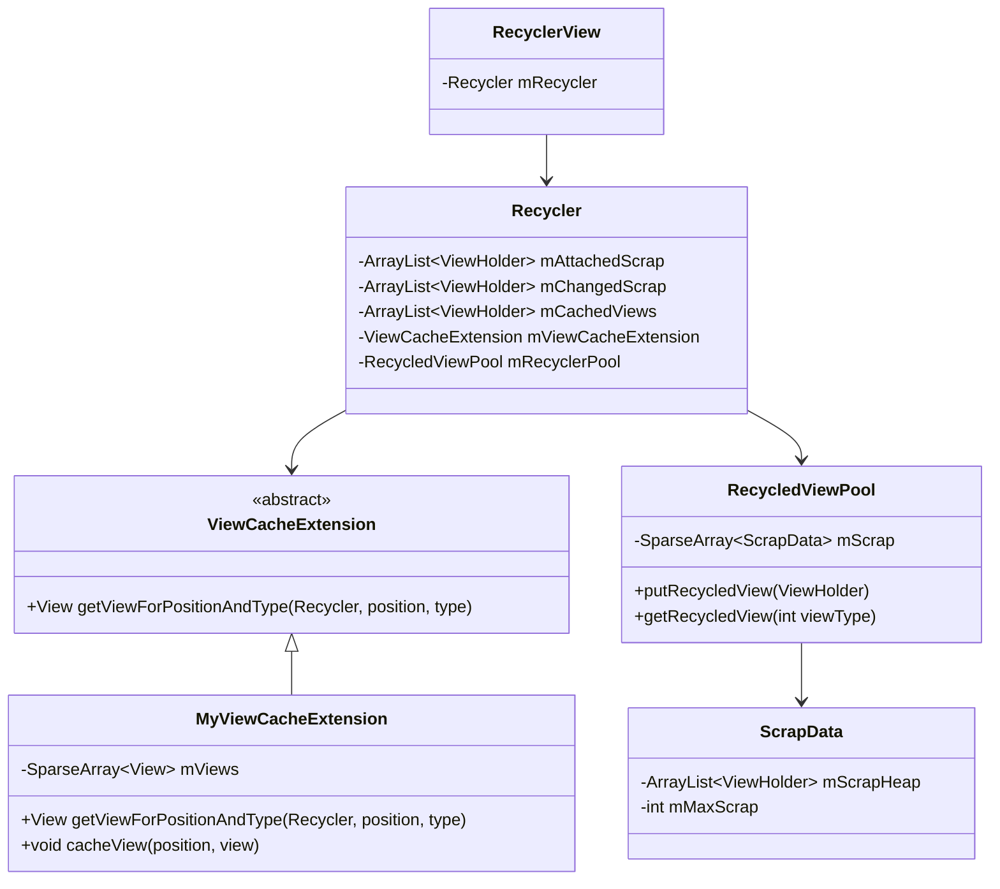
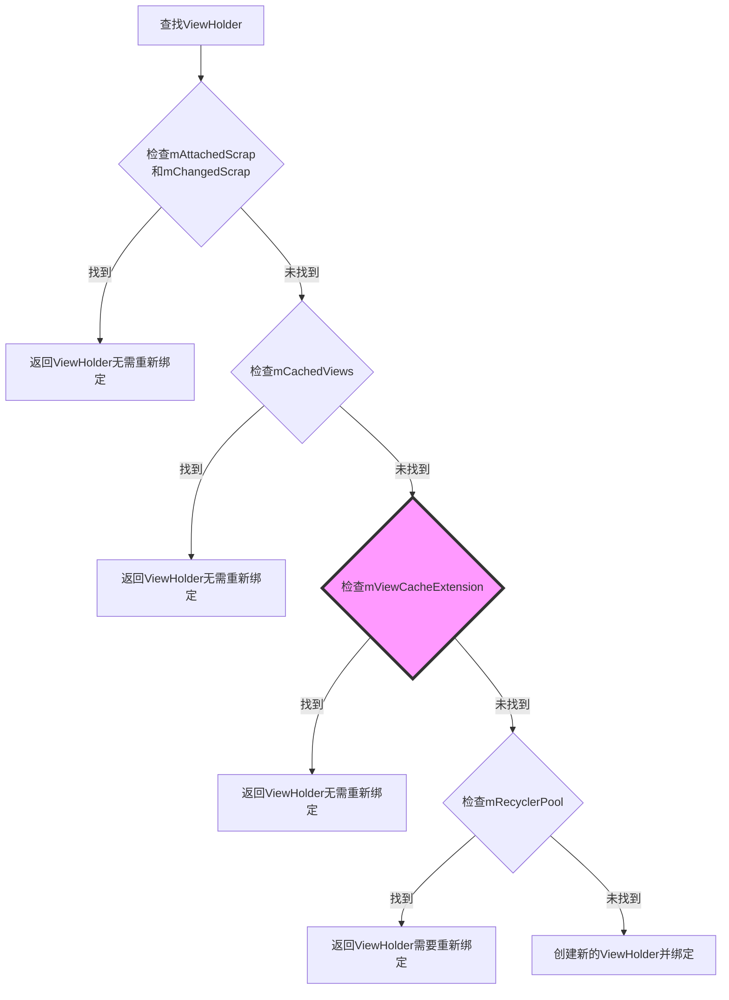
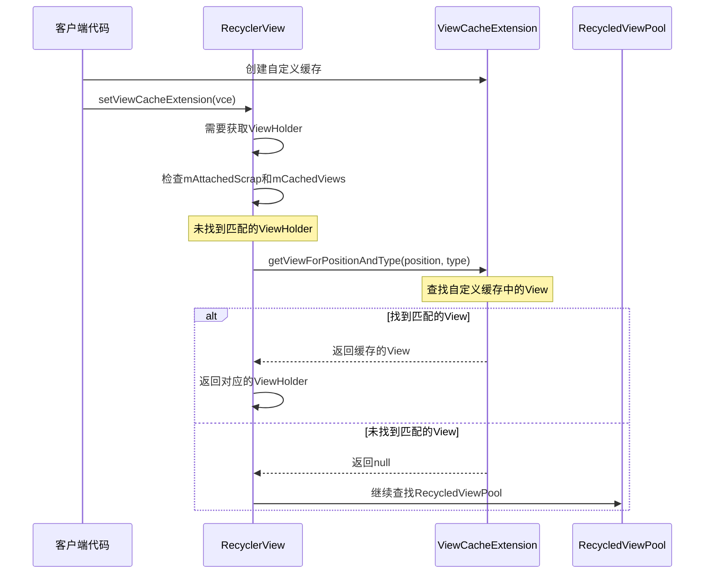

# RecyclerView的四级缓存结构 - 第三级缓存

## 第三级缓存：mViewCacheExtension

### 特点

- 完全由开发者自定义的缓存策略
- 默认为null，需要开发者实现并设置
- 位于mCachedViews和mRecyclerPool之间

### 使用场景

适用于需要特定缓存逻辑的场景，例如：

- 固定位置的Item使用专门的缓存策略
- 特殊类型的Item使用自定义的缓存逻辑
- 需要更大缓存容量但又不想增加mCachedViews大小
- 优化特定位置Item的加载性能
- 实现自定义的缓存淘汰策略

### 四级缓存结构图



### 在缓存体系中的位置



### 源码分析

**定义接口**：

```java
public abstract static class ViewCacheExtension {
    /**
     * 返回一个可以绑定到指定Adapter位置的View
     * 
     * 此方法不应创建新的View，而是返回一个已经创建好的可以被重用的View
     * 如果View被标记为ignored，应该先调用stopIgnoringView()
     * RecyclerView会在必要时重新绑定返回的View
     * 
     * @param recycler 可用于绑定View的Recycler
     * @param position Adapter位置
     * @param type     View类型，由adapter定义
     * @return 绑定到给定位置的View，如果没有可重用的View则返回NULL
     */
    @Nullable
    public abstract View getViewForPositionAndType(@NonNull Recycler recycler, int position, int type);
}
```

**在RecyclerView中的设置方法**：

```java
/**
 * 设置一个新的ViewCacheExtension，供Recycler使用
 *
 * @param extension 要使用的ViewCacheExtension，传null则清除现有的
 * @see ViewCacheExtension#getViewForPositionAndType(Recycler, int, int)
 */
public void setViewCacheExtension(@Nullable ViewCacheExtension extension) {
    mRecycler.setViewCacheExtension(extension);
}
```

**Recycler中设置方法**：

```java
void setViewCacheExtension(ViewCacheExtension extension) {
    mViewCacheExtension = extension;
}
```

**使用示例**：

```java
// 在RecyclerView中设置
recyclerView.setViewCacheExtension(new MyViewCacheExtension());

// 自定义实现
class MyViewCacheExtension extends RecyclerView.ViewCacheExtension {
    private SparseArray<View> mViews = new SparseArray<>();

    @Override
    public View getViewForPositionAndType(RecyclerView.Recycler recycler, int position, int type) {
        return mViews.get(position);
    }

    public void cacheView(int position, View view) {
        mViews.put(position, view);
    }
}
```

**在获取ViewHolder过程中的调用流程**：

```java
ViewHolder tryGetViewHolderForPositionByDeadline(int position, boolean dryRun, long deadlineNs) {
    // ... 其他代码 ...
    
    // 首先尝试从mAttachedScrap和mChangedScrap获取
    holder = getScrapOrHiddenOrCachedHolderForPosition(position, dryRun);
    if (holder != null) {
        return holder;
    }
    
    // 如果Adapter使用了稳定ID，尝试通过ID匹配
    if (mAdapter.hasStableIds()) {
        holder = getScrapOrCachedViewForId(mAdapter.getItemId(position), type, dryRun);
        if (holder != null) {
            holder.mPosition = position;
            fromScrapOrHiddenOrCache = true;
        }
    }
    
    // 尝试从mViewCacheExtension获取
    if (holder == null && mViewCacheExtension != null) {
        // 注意：这里传递的是position，而不是offsetPosition，
        // 因为LayoutManager并不知道offsetPosition
        final View view = mViewCacheExtension
                .getViewForPositionAndType(this, position, type);
        if (view != null) {
            holder = getChildViewHolder(view);
            if (holder == null) {
                throw new IllegalArgumentException("getViewForPositionAndType returned"
                        + " a view which does not have a ViewHolder"
                        + exceptionLabel());
            } else if (holder.shouldIgnore()) {
                throw new IllegalArgumentException("getViewForPositionAndType returned"
                        + " a view that is ignored. You must call stopIgnoring before"
                        + " returning this view." + exceptionLabel());
            }
        }
    }
    
    // 如果仍然未找到，尝试从mRecyclerPool获取
    if (holder == null) { // fallback to pool
        holder = getRecycledViewPool().getRecycledView(type);
        // ... 后续代码 ...
    }
    
    // ... 后续代码 ...
}
```

### ViewCacheExtension的实现注意事项

1. **不要在getViewForPositionAndType中创建新View**
   - 按照设计，该方法应该只返回已经创建好的View，而不应创建新的
   - 创建新View应由RecyclerView的标准机制处理

2. **需自行维护缓存**
   - RecyclerView不会自动将View放入自定义缓存中
   - 开发者需要实现放入缓存和从缓存取出的逻辑

3. **需自行处理缓存失效**
   - 当数据变化时，需要自行处理缓存中失效的View
   - 应考虑监听Adapter的数据变化通知

4. **注意内存泄漏**
   - 自定义缓存可能导致View无法被GC回收
   - 应实现合理的缓存释放策略

### 使用场景示例



### 实际应用示例：固定位置头部视图的优化缓存

以下是一个更加实际的ViewCacheExtension实现，针对列表中固定位置的头部视图进行特殊缓存处理：

```java
/**
 * 自定义缓存扩展，专门处理列表头部的几个固定位置的Item
 * 适用于列表中有固定头部，但这些头部会因滚动频繁移出屏幕又再次显示的场景
 */
public class HeaderViewCacheExtension extends RecyclerView.ViewCacheExtension {
    // 固定头部位置集合
    private final Set<Integer> mHeaderPositions;
    // 缓存固定头部的ViewHolder，按位置索引
    private final SparseArray<View> mHeaderViewCache = new SparseArray<>();
    // 记录每个位置对应的类型
    private final SparseIntArray mPositionTypes = new SparseIntArray();
    // 弱引用持有RecyclerView，避免内存泄漏
    private final WeakReference<RecyclerView> mRecyclerViewRef;
    
    /**
     * 构造函数
     * @param recyclerView RecyclerView实例
     * @param headerPositions 需要特殊缓存的头部位置集合
     */
    public HeaderViewCacheExtension(RecyclerView recyclerView, Set<Integer> headerPositions) {
        mRecyclerViewRef = new WeakReference<>(recyclerView);
        mHeaderPositions = headerPositions;
        
        // 注册数据观察者，处理数据变化时的缓存更新
        recyclerView.getAdapter().registerAdapterDataObserver(new RecyclerView.AdapterDataObserver() {
            @Override
            public void onChanged() {
                // 数据全部变化时，清空所有缓存
                clearCache();
            }
            
            @Override
            public void onItemRangeChanged(int positionStart, int itemCount) {
                // 数据部分变化时，清除对应位置的缓存
                for (int i = positionStart; i < positionStart + itemCount; i++) {
                    if (mHeaderPositions.contains(i)) {
                        removeFromCache(i);
                    }
                }
            }
            
            // 其他数据变化方法也需要实现...
        });
    }
    
    @Override
    public View getViewForPositionAndType(RecyclerView.Recycler recycler, int position, int type) {
        // 只处理指定的头部位置
        if (!mHeaderPositions.contains(position)) {
            return null;
        }
        
        // 类型不匹配，可能是数据变化导致，清除缓存
        if (mPositionTypes.get(position, -1) != type && mPositionTypes.get(position, -1) != -1) {
            removeFromCache(position);
            return null;
        }
        
        // 从缓存中获取
        View cachedView = mHeaderViewCache.get(position);
        if (cachedView != null) {
            // 确保View不在RecyclerView中
            RecyclerView recyclerView = mRecyclerViewRef.get();
            if (recyclerView != null && recyclerView.indexOfChild(cachedView) != -1) {
                // 如果View仍在RecyclerView中，不应该从缓存返回
                mHeaderViewCache.remove(position);
                return null;
            }
            
            // 保存类型信息
            mPositionTypes.put(position, type);
            return cachedView;
        }
        
        return null;
    }
    
    /**
     * 将View放入缓存
     * 需要在适当的时机调用，例如在onViewDetachedFromWindow中
     */
    public void cacheHeaderView(int position, View view) {
        if (mHeaderPositions.contains(position)) {
            RecyclerView.ViewHolder holder = RecyclerView.getChildViewHolderInt(view);
            if (holder != null) {
                mHeaderViewCache.put(position, view);
                mPositionTypes.put(position, holder.getItemViewType());
            }
        }
    }
    
    /**
     * 从缓存中移除指定位置的View
     */
    public void removeFromCache(int position) {
        mHeaderViewCache.remove(position);
        mPositionTypes.delete(position);
    }
    
    /**
     * 清空所有缓存
     */
    public void clearCache() {
        mHeaderViewCache.clear();
        mPositionTypes.clear();
    }
}
```

**使用方式**：

```java
// 创建一个包含头部位置的集合
Set<Integer> headerPositions = new HashSet<>();
headerPositions.add(0);  // 第一个位置是头部
headerPositions.add(1);  // 第二个位置也是头部

// 创建自定义缓存扩展
HeaderViewCacheExtension headerCache = new HeaderViewCacheExtension(recyclerView, headerPositions);

// 设置到RecyclerView
recyclerView.setViewCacheExtension(headerCache);

// 在Adapter中处理ViewHolder分离事件，将头部ViewHolder放入缓存
public class MyAdapter extends RecyclerView.Adapter<MyViewHolder> {
    // ...其他代码...
    
    @Override
    public void onViewDetachedFromWindow(@NonNull MyViewHolder holder) {
        super.onViewDetachedFromWindow(holder);
        
        // 当ViewHolder从窗口分离时，尝试放入自定义缓存
        headerCache.cacheHeaderView(holder.getBindingAdapterPosition(), holder.itemView);
    }
}
```

通过自定义ViewCacheExtension，开发者可以实现针对特定需求的缓存策略，弥补RecyclerView默认缓存机制的不足，进一步优化列表性能。
