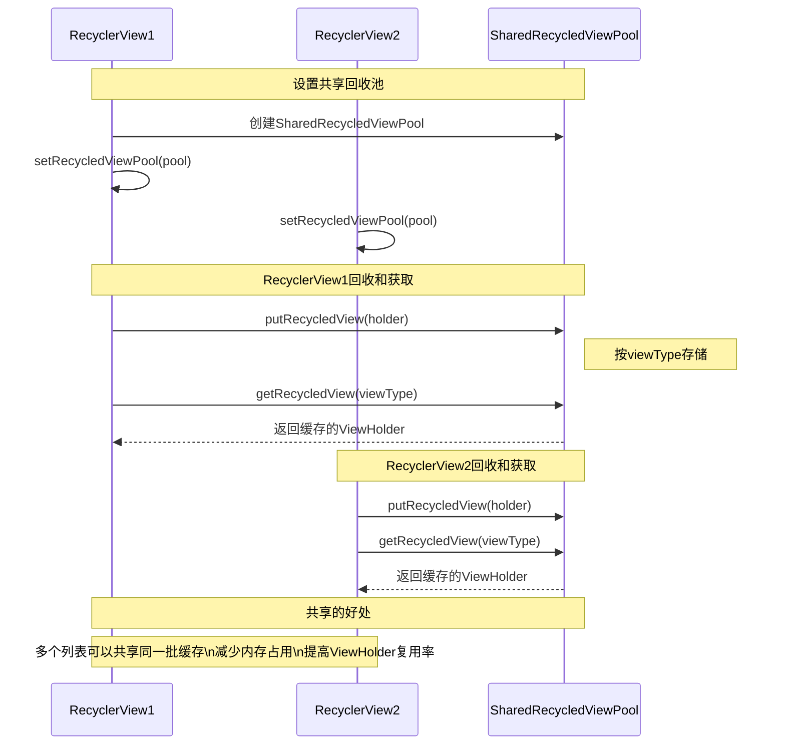
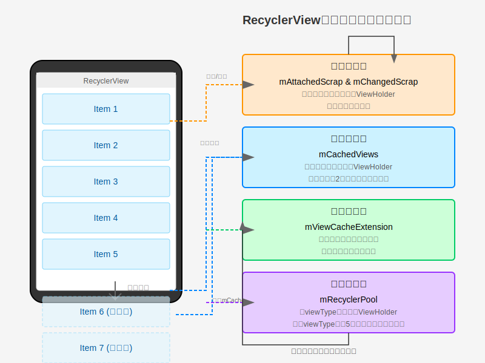
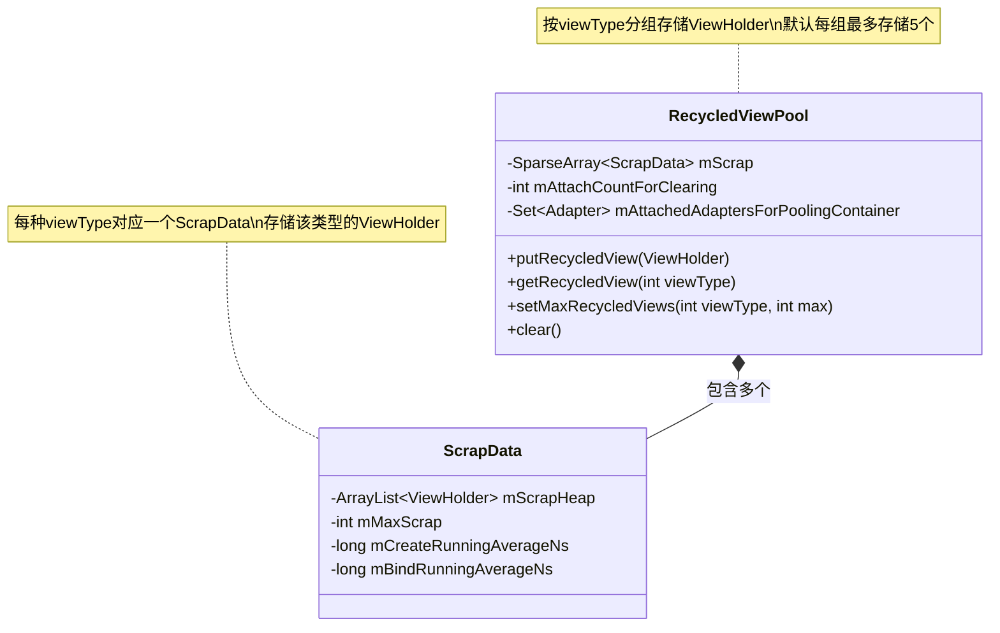
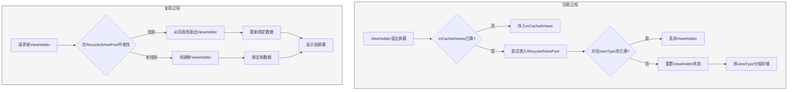

# RecyclerView的四级缓存结构 - 第四级缓存

## 第四级缓存：mRecyclerPool

### 特点

- 按照viewType分组存储ViewHolder
- 每个viewType默认缓存5个ViewHolder，可通过`setMaxRecycledViews()`调整
- 从回收池取出的ViewHolder需要重新绑定数据
- 可以在多个RecyclerView之间共享

### 使用场景

适用于大量数据的列表，以及多个RecyclerView共享缓存的场景：

- 普通的长列表滚动，当mCachedViews已满
- 多个列表使用相同布局的ViewHolder，可共享缓存提高效率
- 列表数据变化较大，需要重新绑定数据的场景

### 多个RecyclerView共享回收池的工作流程



## 手机屏幕与四级缓存的关系

下图直观展示了RecyclerView中显示的Item与四级缓存之间的关系：



如上图所示，当用户滚动RecyclerView时：

1. 屏幕上的ViewHolder先被临时存储在第一级缓存（mAttachedScrap和mChangedScrap）中
2. 当Item滚出屏幕时，其ViewHolder会被存入第二级缓存（mCachedViews）
3. 如果需要更多缓存，可以通过自定义的第三级缓存（mViewCacheExtension）实现
4. 最后，第四级缓存（mRecyclerPool）存储不同类型的ViewHolder，供需要时使用

各级缓存协同工作，确保了RecyclerView的高效滚动和显示。 

## RecycledViewPool源码分析

下面是RecycledViewPool的核心源码实现，帮助我们更深入理解其工作原理：

### 类结构定义

```java
public static class RecycledViewPool {
    // 每种ViewType默认最大缓存数量
    private static final int DEFAULT_MAX_SCRAP = 5;

    /**
     * 用于跟踪池化的ViewHolder和创建/绑定时间元数据
     */
    static class ScrapData {
        // 存储ViewHolder的ArrayList
        final ArrayList<ViewHolder> mScrapHeap = new ArrayList<>();
        // 该类型最大的缓存数量，默认为5
        int mMaxScrap = DEFAULT_MAX_SCRAP;
        // 用于记录创建和绑定时间的平均值(用于预取机制)
        long mCreateRunningAverageNs = 0;
        long mBindRunningAverageNs = 0;
    }

    // 按viewType存储对应的ScrapData，key为viewType，value为ScrapData
    SparseArray<ScrapData> mScrap = new SparseArray<>();
    
    // 记录连接到此池的RecyclerView数量，用于清理判断
    int mAttachCountForClearing = 0;
    
    // 连接到池的适配器集合，用于PoolingContainer释放
    Set<Adapter<?>> mAttachedAdaptersForPoolingContainer =
            Collections.newSetFromMap(new IdentityHashMap<>());
}
```

### 核心方法实现

#### 1. 添加ViewHolder到回收池

```java
public void putRecycledView(ViewHolder scrap) {
    // 获取ViewHolder的viewType
    final int viewType = scrap.getItemViewType();
    // 获取对应viewType的缓存列表
    final ArrayList<ViewHolder> scrapHeap = getScrapDataForType(viewType).mScrapHeap;
    // 检查是否已达到最大容量
    if (mScrap.get(viewType).mMaxScrap <= scrapHeap.size()) {
        // 如果已达到最大容量，释放资源并返回
        PoolingContainer.callPoolingContainerOnRelease(scrap.itemView);
        return;
    }
    if (sDebugAssertionsEnabled && scrapHeap.contains(scrap)) {
        throw new IllegalArgumentException("this scrap item already exists");
    }
    // 重置ViewHolder的内部状态
    scrap.resetInternal();
    // 添加到缓存列表中
    scrapHeap.add(scrap);
}
```

这个方法将ViewHolder添加到对应viewType的回收池中。如果回收池已满，则直接丢弃这个ViewHolder。否则，重置ViewHolder状态后加入缓存。

#### 2. 从回收池获取ViewHolder

```java
@Nullable
public ViewHolder getRecycledView(int viewType) {
    // 获取对应viewType的ScrapData
    final ScrapData scrapData = mScrap.get(viewType);
    if (scrapData != null && !scrapData.mScrapHeap.isEmpty()) {
        final ArrayList<ViewHolder> scrapHeap = scrapData.mScrapHeap;
        // 从末尾获取ViewHolder（后进先出）
        for (int i = scrapHeap.size() - 1; i >= 0; i--) {
            if (!scrapHeap.get(i).isAttachedToTransitionOverlay()) {
                return scrapHeap.remove(i);
            }
        }
    }
    return null;
}
```

该方法从回收池中获取指定viewType的ViewHolder。采用后进先出(LIFO)策略，从列表末尾开始搜索第一个未附加到过渡覆盖层的ViewHolder并返回。

#### 3. 获取ScrapData

```java
private ScrapData getScrapDataForType(int viewType) {
    // 尝试获取viewType对应的ScrapData
    ScrapData scrapData = mScrap.get(viewType);
    // 如果不存在，则创建一个新的
    if (scrapData == null) {
        scrapData = new ScrapData();
        mScrap.put(viewType, scrapData);
    }
    return scrapData;
}
```

此方法用于获取特定viewType的ScrapData对象。如果该viewType的ScrapData不存在，则创建一个新的并存入mScrap中。

#### 4. 设置最大缓存数量

```java
public void setMaxRecycledViews(int viewType, int max) {
    // 获取对应viewType的ScrapData
    ScrapData scrapData = getScrapDataForType(viewType);
    // 设置最大缓存数量
    scrapData.mMaxScrap = max;
    final ArrayList<ViewHolder> scrapHeap = scrapData.mScrapHeap;
    // 如果当前缓存超过设定的最大值，移除多余的ViewHolder
    while (scrapHeap.size() > max) {
        scrapHeap.remove(scrapHeap.size() - 1);
    }
}
```

该方法允许为指定的viewType设置自定义的最大缓存数量，并在必要时移除多余的ViewHolder。

#### 5. 回收池的连接和断开连接

```java
void attach() {
    mAttachCountForClearing++;
}

void detach() {
    mAttachCountForClearing--;
}

void onAdapterChanged(Adapter<?> oldAdapter, Adapter<?> newAdapter,
        boolean compatibleWithPrevious) {
    if (oldAdapter != null) {
        detach();
    }
    if (!compatibleWithPrevious && mAttachCountForClearing == 0) {
        clear();
    }
    if (newAdapter != null) {
        attach();
    }
}
```

这些方法管理回收池与RecyclerView的连接状态。当没有RecyclerView连接到回收池，且适配器不兼容时，会清空回收池。

### 工作原理图解

以下是RecycledViewPool的内部结构示意图：



### ViewHolder回收与复用流程

以下流程图展示了ViewHolder在RecycledViewPool中的回收与复用过程：



通过这种结构，RecycledViewPool能够高效地按viewType管理和复用ViewHolder对象，实现多个RecyclerView之间的缓存共享。 