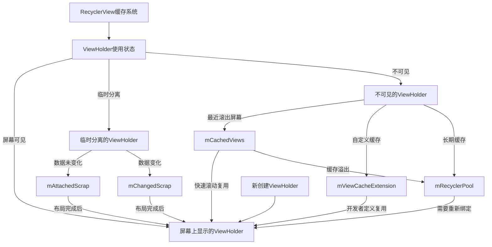
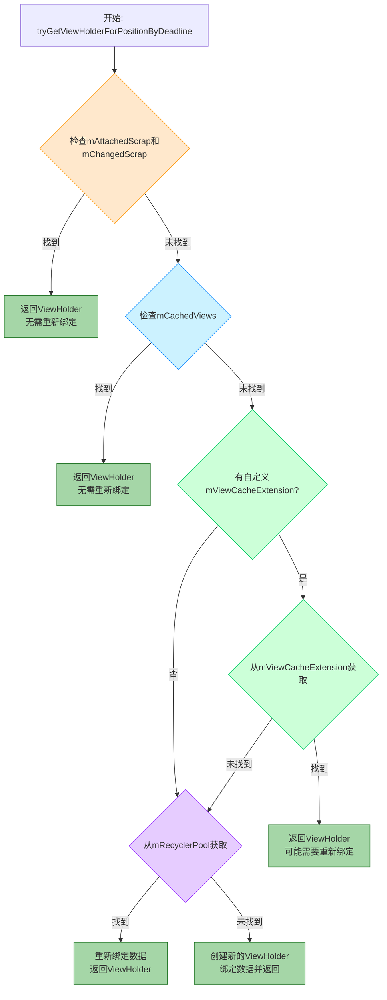
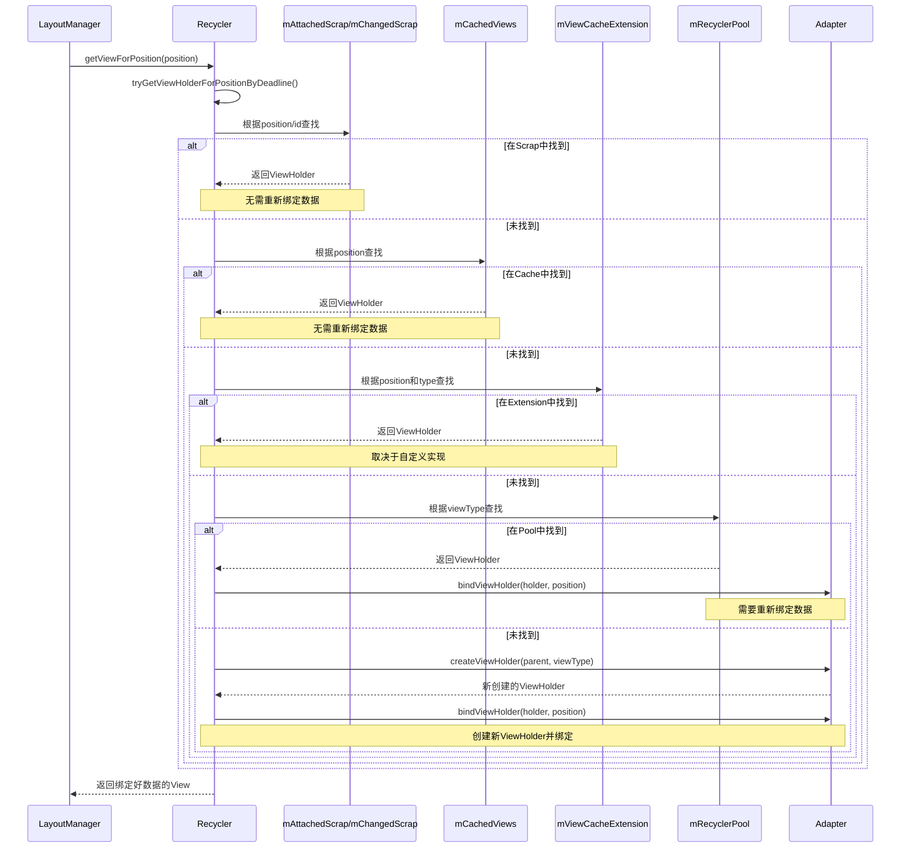
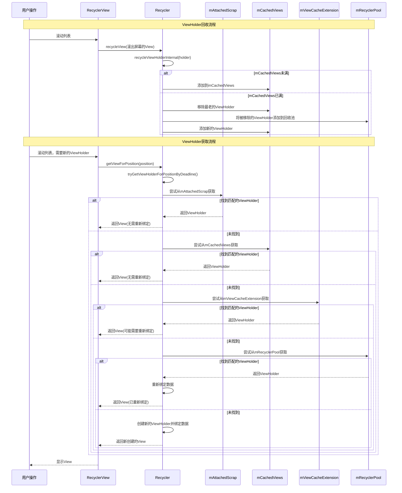
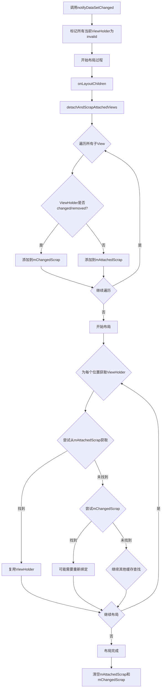
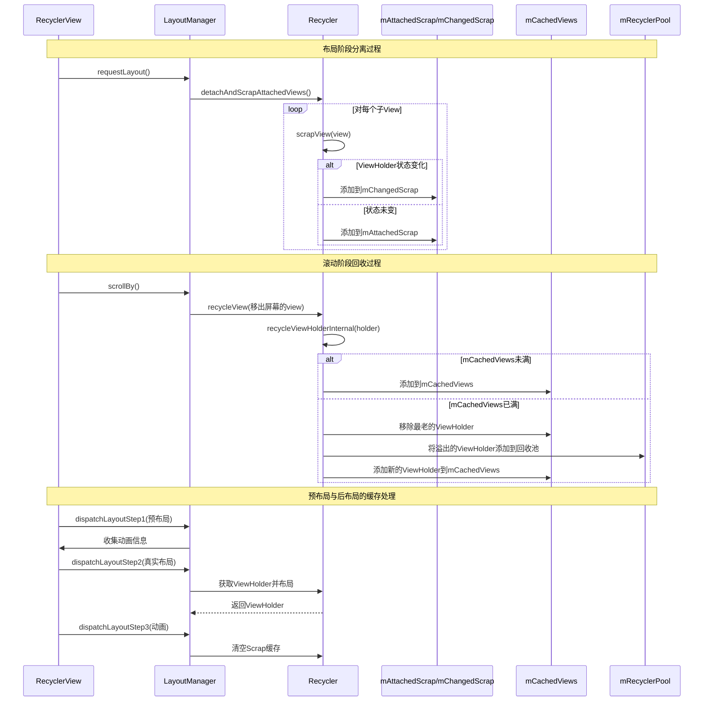
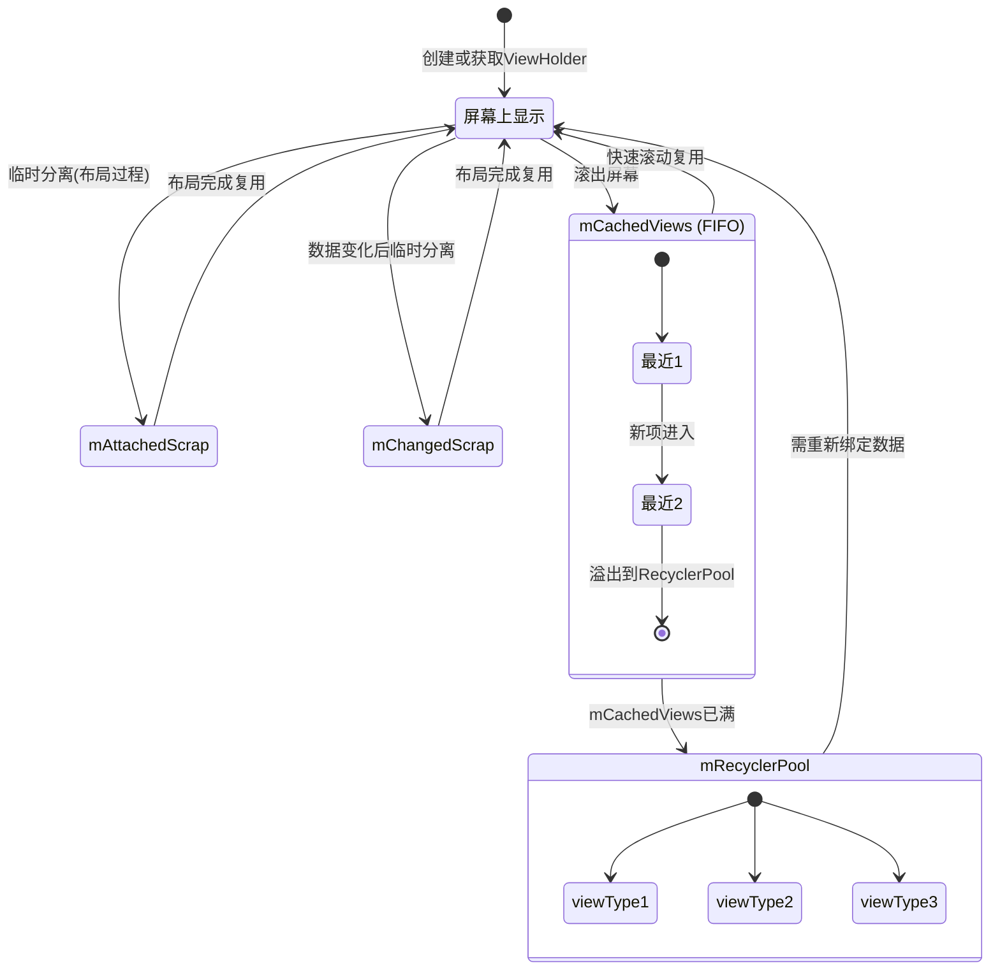
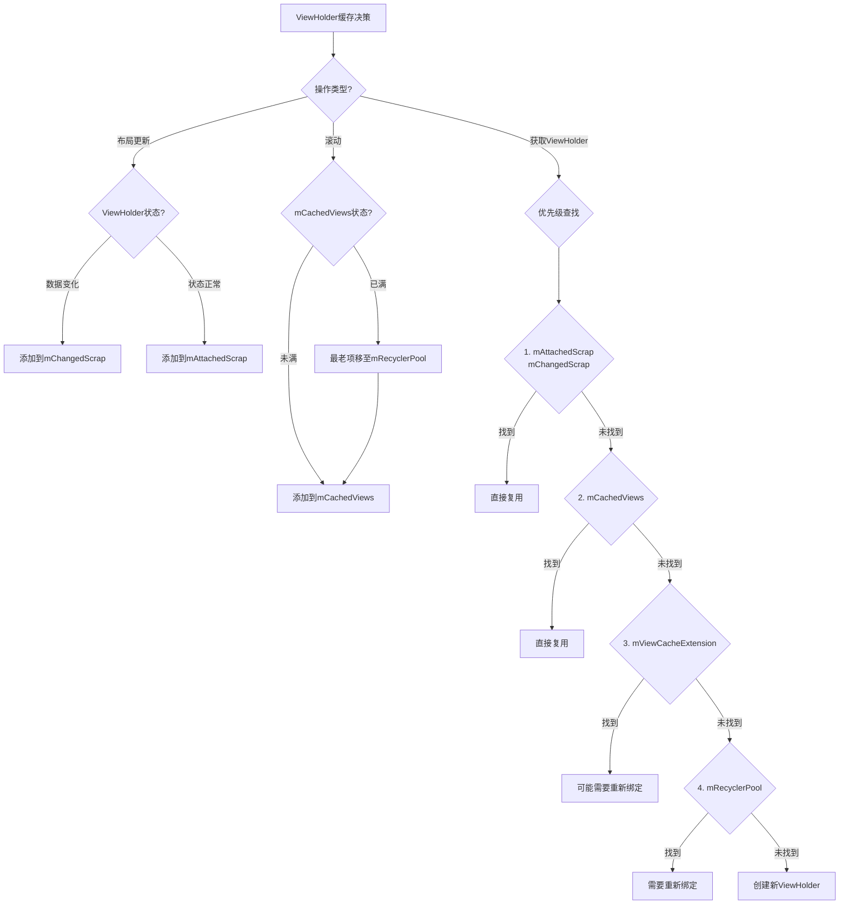

# RecyclerView的四级缓存结构 - 缓存流程图与总结

## 完整的缓存处理流程图

## 缓存流程图

下面是RecyclerView获取ViewHolder的整体流程图：

## 详细的四级缓存查找时序图

### ViewHolder缓存与回收的时序图

## 数据更新场景下的缓存处理流程

## 分离与回收工作流程时序图

## ViewHolder状态变化与缓存迁移图

## 不同操作对应缓存处理的决策树

## 缓存级别对比

| 缓存级别 | 存储位置                            | 默认大小          | 是否需要重新绑定 | 索引方式        | 生命周期             |
| ---- | ------------------------------- | ------------- | -------- | ----------- | ---------------- |
| 第一级  | mAttachedScrap mChangedScrap | 当前屏幕显示的View数量 | 否        | position/id | 布局过程中临时存在        |
| 第二级  | mCachedViews                    | 2             | 否        | position    | 滚动时至被挤出缓存        |
| 第三级  | mViewCacheExtension             | 自定义           | 自定义      | 自定义         | 自定义              |
| 第四级  | mRecyclerPool                   | 每种viewType 5个 | 是        | viewType    | 直到RecyclerView销毁 |

## 总结

RecyclerView的四级缓存结构是其高效性能的核心所在。通过多层次的缓存策略，RecyclerView在保持高性能的同时，也实现了灵活的可定制性。理解这个缓存体系对于优化RecyclerView性能和解决相关问题至关重要。

在下一节中，我们将详细分析ViewHolder的回收与复用流程，进一步深入理解RecyclerView的内部工作机制。 