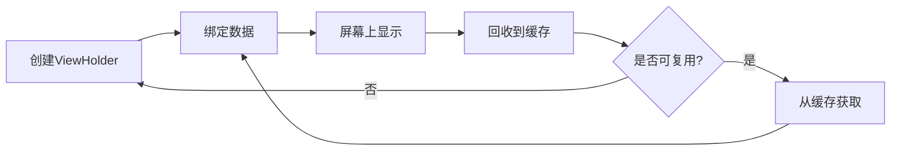
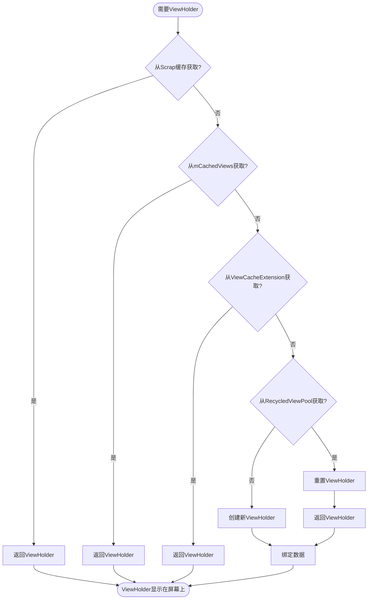
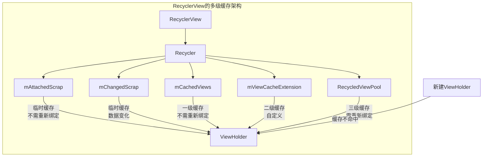

# ViewHolder回收复用流程

RecyclerView的高效滑动表现很大程度上归功于其精心设计的ViewHolder回收复用流程。本节将详细分析ViewHolder从创建到回收再到复用的完整生命周期和流程。

## ViewHolder的生命周期

在RecyclerView中，ViewHolder的生命周期大致可以分为以下几个阶段：

1. **创建**：通过Adapter的`createViewHolder`方法创建新的ViewHolder
2. **绑定**：通过Adapter的`bindViewHolder`方法将数据绑定到ViewHolder
3. **展示**：ViewHolder对应的itemView在屏幕上显示
4. **回收**：当ViewHolder滑出屏幕时被回收到缓存
5. **复用**：当需要显示新的item时，从缓存中取出ViewHolder并重新绑定数据



## 详细回收复用流程分析

### 1. ViewHolder的获取流程

当RecyclerView需要为某个位置显示一个ViewHolder时，会按照以下顺序尝试获取：

#### 步骤1：从Scrap缓存中获取

首先尝试从`mAttachedScrap`和`mChangedScrap`中获取。这些ViewHolder是临时被移除但仍然附加在RecyclerView上的。

```java
ViewHolder getScrapOrHiddenOrCachedHolderForPosition(int position, boolean dryRun) {
    final int scrapCount = mAttachedScrap.size();
    // 首先在mAttachedScrap中查找
    for (int i = 0; i < scrapCount; i++) {
        final ViewHolder holder = mAttachedScrap.get(i);
        if (!holder.wasReturnedFromScrap() && holder.getLayoutPosition() == position
                && !holder.isInvalid() && (mState.mInPreLayout || !holder.isRemoved())) {
            holder.addFlags(ViewHolder.FLAG_RETURNED_FROM_SCRAP);
            return holder;
        }
    }
    // 然后检查隐藏的视图
    // ...
    // 最后检查一级缓存mCachedViews
    for (int i = 0; i < mCachedViews.size(); i++) {
        final ViewHolder holder = mCachedViews.get(i);
        if (!holder.isInvalid() && holder.getLayoutPosition() == position) {
            if (!dryRun) {
                mCachedViews.remove(i);
            }
            return holder;
        }
    }
    return null;
}
```

#### 步骤2：从自定义缓存扩展中获取

如果开发者实现了ViewCacheExtension，会尝试从中获取ViewHolder：

```java
if (mViewCacheExtension != null) {
    View view = mViewCacheExtension.getViewForPositionAndType(position, type);
    if (view != null) {
        ViewHolder holder = getChildViewHolder(view);
        // ...处理并返回holder
    }
}
```

#### 步骤3：从RecycledViewPool中获取

如果前两步没有找到合适的ViewHolder，则尝试从RecycledViewPool中获取：

```java
holder = getRecycledViewPool().getRecycledView(type);
if (holder != null) {
    holder.resetInternal();
    // 进行一些必要的重置操作
    return holder;
}
```

#### 步骤4：创建新的ViewHolder

如果以上步骤都没有找到合适的ViewHolder，则通过Adapter创建新的ViewHolder：

```java
holder = mAdapter.createViewHolder(RecyclerView.this, type);
```

#### 步骤5：绑定数据

最后，无论是复用的还是新创建的ViewHolder，都需要进行数据绑定：

```java
mAdapter.bindViewHolder(holder, offsetPosition);
```



### 2. ViewHolder的回收流程

当ViewHolder滑出屏幕或RecyclerView进行重新布局时，会按照以下步骤回收ViewHolder：

#### 临时回收（Scrap）

在布局过程中的临时回收，通常发生在RecyclerView的`onLayout`方法中：

```java
void scrapView(View view) {
    final ViewHolder holder = getChildViewHolderInt(view);
    if (holder.hasAnyOfTheFlags(ViewHolder.FLAG_REMOVED | ViewHolder.FLAG_INVALID)
            || !holder.isUpdated() || canReuseUpdatedViewHolder(holder)) {
        // 未变化或可复用的ViewHolder放入mAttachedScrap
        holder.setScrapContainer(this, false);
        mAttachedScrap.add(holder);
    } else {
        // 变化的ViewHolder放入mChangedScrap
        if (mChangedScrap == null) {
            mChangedScrap = new ArrayList<>();
        }
        holder.setScrapContainer(this, true);
        mChangedScrap.add(holder);
    }
}
```

#### 正式回收

当ViewHolder确实需要被回收时，会调用`recycleViewHolderInternal`方法：

```java
void recycleViewHolderInternal(ViewHolder holder) {
    // 检查ViewHolder是否可回收
    if (!holder.isRecyclable()) {
        return;
    }
    
    // 判断是否满足放入mCachedViews的条件
    if (mViewCacheMax > 0 && !holder.hasAnyOfTheFlags(
            ViewHolder.FLAG_INVALID | ViewHolder.FLAG_REMOVED | ViewHolder.FLAG_UPDATE)) {
        // 检查mCachedViews是否已满
        if (mCachedViews.size() >= mViewCacheMax && !mCachedViews.isEmpty()) {
            // 如果已满，先将最旧的一个移到RecycledViewPool
            recycleCachedViewAt(0);
        }
        // 添加到mCachedViews
        mCachedViews.add(holder);
    } else {
        // 不满足条件，直接添加到RecycledViewPool
        addViewHolderToRecycledViewPool(holder);
    }
}
```

#### 添加到RecycledViewPool

当ViewHolder不能放入mCachedViews或从mCachedViews被挤出时，会被添加到RecycledViewPool：

```java
void addViewHolderToRecycledViewPool(ViewHolder holder, boolean dispatchRecycled) {
    // 清除各种引用和标记
    clearNestedRecyclerViewIfNotNested(holder);
    // ... 其他清理操作
    
    if (dispatchRecycled) {
        dispatchViewRecycled(holder);
    }
    
    // 清除holder的所有引用
    holder.mOwnerRecyclerView = null;
    // 将holder添加到RecycledViewPool
    getRecycledViewPool().putRecycledView(holder);
}
```

## 回收复用过程中的视图状态管理

在回收复用过程中，视图的状态管理是一个重要的环节，它直接影响到列表滑动时的流畅度和用户体验。

### 视图状态的保留

1. **从mAttachedScrap和mCachedViews中获取的ViewHolder**：
   - 这些ViewHolder的所有状态（包括用户输入、动画状态等）都会被保留
   - 不需要重新调用`onBindViewHolder`方法

2. **从RecycledViewPool中获取的ViewHolder**：
   - 这些ViewHolder会被重置
   - 需要重新调用`onBindViewHolder`方法绑定数据
   - 需要重新设置所有的状态

### ViewHolder的标志位

RecyclerView使用一系列的标志位来标记ViewHolder的状态，这些标志位影响ViewHolder的回收和复用策略：

```java
public static class ViewHolder {
    // 表示ViewHolder无效，需要重新绑定数据
    static final int FLAG_INVALID = 1 << 0;
    // 表示ViewHolder已从数据集中移除
    static final int FLAG_REMOVED = 1 << 1;
    // 表示ViewHolder的数据已更新
    static final int FLAG_UPDATE = 1 << 2;
    // 表示ViewHolder从scrap缓存中返回
    static final int FLAG_RETURNED_FROM_SCRAP = 1 << 16;
    // 表示ViewHolder不能被回收
    static final int FLAG_IGNORE = 1 << 7;
    // ... 其他标志位
}
```

这些标志位在回收复用过程中起着关键作用，决定了ViewHolder的去向和处理方式。



## 回收复用流程的性能优化

RecyclerView的回收复用流程经过精心设计，已经非常高效。但在实际开发中，我们仍可以通过以下方式进一步优化：

1. **预取（Prefetch）**：
   - RecyclerView的GapWorker会在空闲时间预取即将显示的ViewHolder
   - 这可以减少滑动时的卡顿

2. **视图类型控制**：
   - 合理设计ViewType，减少ViewType的数量
   - 这可以提高RecycledViewPool中ViewHolder的复用率

3. **共享RecycledViewPool**：
   - 对于具有相同item布局的多个RecyclerView，可以共享RecycledViewPool
   - 这可以减少ViewHolder的创建次数

4. **自定义缓存扩展**：
   - 实现ViewCacheExtension，添加自定义的缓存逻辑
   - 这可以针对特定场景优化缓存策略

## 总结

RecyclerView的ViewHolder回收复用流程是其高效运行的核心。通过多级缓存结构和精细的状态管理，RecyclerView实现了ViewHolder的高效复用，大大提升了列表的滑动性能和内存使用效率。

理解这一流程不仅有助于我们更好地使用RecyclerView，还能帮助我们在实际开发中针对性地进行性能优化，打造更加流畅的列表体验。 