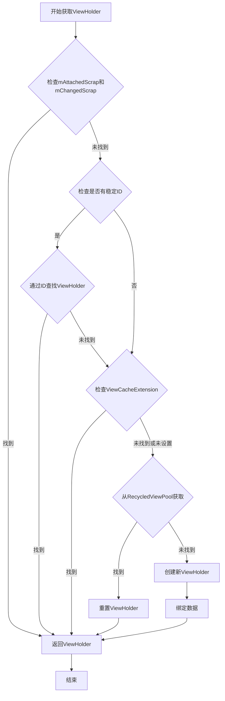
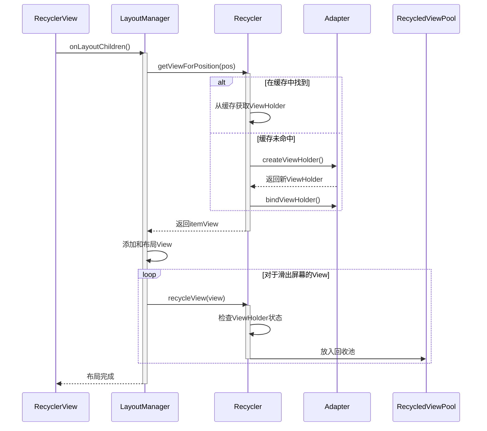

# Recycler工作原理

RecyclerView的回收复用机制核心在于其内部的Recycler类，它是整个回收复用系统的管理者。本节将深入分析Recycler类的工作原理，包括其内部结构和工作流程。

## Recycler类概述

Recycler是RecyclerView的内部类，作为ViewHolder的回收和复用管理器，主要负责：

1. 管理多级缓存结构
2. 回收不再使用的ViewHolder
3. 在需要新视图时提供可复用的ViewHolder
4. 协调ViewHolder的创建和绑定过程

Recycler类的定义如下：

```java
public final class Recycler {
    // 用于存储仍附加在RecyclerView但标记为删除的ViewHolder
    final ArrayList<ViewHolder> mAttachedScrap = new ArrayList<>();
    // 用于存储已附加但发生了变化的ViewHolder
    ArrayList<ViewHolder> mChangedScrap = null;
    // 一级缓存，存储最近离开屏幕的ViewHolder
    final ArrayList<ViewHolder> mCachedViews = new ArrayList<ViewHolder>();
    // 二级缓存，开发者自定义缓存逻辑
    private ViewCacheExtension mViewCacheExtension;
    // 三级缓存，回收池
    RecycledViewPool mRecyclerPool;
    // 一级缓存的最大容量，默认为2
    private int mViewCacheMax = DEFAULT_CACHE_SIZE;
    // 默认的一级缓存大小
    private static final int DEFAULT_CACHE_SIZE = 2;
    // ... 其他字段和方法
}
```

```mermaid
classDiagram
    class RecyclerView {
        -Recycler mRecycler
        +setAdapter()
        +setLayoutManager()
    }
    
    class Recycler {
        -ArrayList~ViewHolder~ mAttachedScrap
        -ArrayList~ViewHolder~ mChangedScrap
        -ArrayList~ViewHolder~ mCachedViews
        -ViewCacheExtension mViewCacheExtension
        -RecycledViewPool mRecyclerPool
        -int mViewCacheMax
        +getViewForPosition()
        +recycleView()
        +clear()
    }
    
    class ViewHolder {
        +itemView: View
        +position: int
        +id: long
        +itemViewType: int
        +isRecyclable()
        +resetInternal()
    }
    
    class RecycledViewPool {
        -SparseArray~ScrapData~ mScrap
        +putRecycledView()
        +getRecycledView()
        +clear()
    }
    
    class ViewCacheExtension {
        <<abstract>>
        +getViewForPositionAndType()
    }
    
    RecyclerView *-- Recycler : 内部类
    Recycler o-- ViewHolder : 管理
    Recycler o-- RecycledViewPool : 引用
    Recycler o-- ViewCacheExtension : 可选引用
    RecycledViewPool *-- "ScrapData" : 内部类
```

## Recycler核心方法

Recycler类中几个核心方法决定了RecyclerView的回收复用流程：

### 1. getViewForPosition

`getViewForPosition`方法是获取ViewHolder的入口方法：

```java
public View getViewForPosition(int position) {
    return getViewForPosition(position, false);
}

View getViewForPosition(int position, boolean dryRun) {
    return tryGetViewHolderForPositionByDeadline(position, dryRun, FOREVER_NS).itemView;
}
```

这个方法实际上调用了`tryGetViewHolderForPositionByDeadline`方法，这是整个获取ViewHolder流程的核心方法。

### 2. tryGetViewHolderForPositionByDeadline

这个方法名虽长，但非常准确地描述了其功能 - 尝试在截止时间前为指定位置获取ViewHolder。它的流程如下：

1. 检查是否有与位置匹配的Scrap ViewHolder
2. 检查一级缓存mCachedViews
3. 检查自定义缓存mViewCacheExtension
4. 检查回收池mRecyclerPool
5. 如果以上都没有合适的ViewHolder，则创建新的ViewHolder

源码精简版如下：

```java
ViewHolder tryGetViewHolderForPositionByDeadline(int position, boolean dryRun, long deadlineNs) {
    // 1. 从mAttachedScrap或mChangedScrap中获取
    ViewHolder holder = getScrapOrHiddenOrCachedHolderForPosition(position, dryRun);
    if (holder != null) {
        return holder;
    }
    
    // 2. 获取不到时，找Adapter中viewType对应的ViewHolder
    final int type = mAdapter.getItemViewType(offsetPosition);
    
    // 3. 从缓存中查找匹配viewType的ViewHolder
    if (mAdapter.hasStableIds()) {
        holder = getScrapOrCachedViewForId(mAdapter.getItemId(offsetPosition), type, dryRun);
        if (holder != null) {
            return holder;
        }
    }
    
    // 4. 尝试从ViewCacheExtension中获取
    if (mViewCacheExtension != null) {
        View view = mViewCacheExtension.getViewForPositionAndType(position, type);
        if (view != null) {
            // 转换为ViewHolder并返回
            return holder;
        }
    }
    
    // 5. 从RecycledViewPool中获取
    holder = getRecycledViewPool().getRecycledView(type);
    if (holder != null) {
        // 重置ViewHolder并返回
        return holder;
    }
    
    // 6. 创建新的ViewHolder
    holder = mAdapter.createViewHolder(RecyclerView.this, type);
    
    // 7. 绑定数据
    mAdapter.bindViewHolder(holder, offsetPosition);
    
    return holder;
}
```



### 3. recycleView与scrapView

Recycler负责两种主要的回收操作：

1. **scrapView**：临时移除但很快会被复用的视图，存入mAttachedScrap或mChangedScrap
2. **recycleView**：确实离开屏幕的视图，存入缓存或回收池

```java
void recycleViewHolderInternal(ViewHolder holder) {
    // 判断是否可以被缓存
    if (holder.isRecyclable()) {
        if (mViewCacheMax > 0 && !holder.hasAnyOfTheFlags(
                ViewHolder.FLAG_INVALID | ViewHolder.FLAG_REMOVED | ViewHolder.FLAG_UPDATE)) {
            // 如果mCachedViews已满，先移除最老的缓存到RecyclerPool
            if (mCachedViews.size() >= mViewCacheMax && !mCachedViews.isEmpty()) {
                recycleCachedViewAt(0);
            }
            // 添加到mCachedViews
            mCachedViews.add(holder);
        } else {
            // 否则直接添加到RecyclerPool
            addViewHolderToRecycledViewPool(holder);
        }
    }
}
```

## Recycler与LayoutManager的协作

Recycler并不直接决定何时回收和获取ViewHolder，这由LayoutManager控制。LayoutManager在布局和滑动过程中，会调用Recycler的相关方法来实现ViewHolder的回收和复用。

主要协作流程：
1. **布局过程**：LayoutManager调用`getViewForPosition`获取需要展示的ViewHolder
2. **滑动过程**：
   - 对于新进入屏幕的区域，LayoutManager调用`getViewForPosition`获取ViewHolder
   - 对于滑出屏幕的ViewHolder，LayoutManager调用`recycleView`进行回收

## 总结

Recycler作为RecyclerView的核心组件，通过精心设计的多级缓存结构和高效的获取复用流程，实现了ViewHolder的高效回收与复用，是RecyclerView高性能的关键所在。

在下一节中，我们将详细分析Recycler的四级缓存结构的具体实现和工作机制。 

