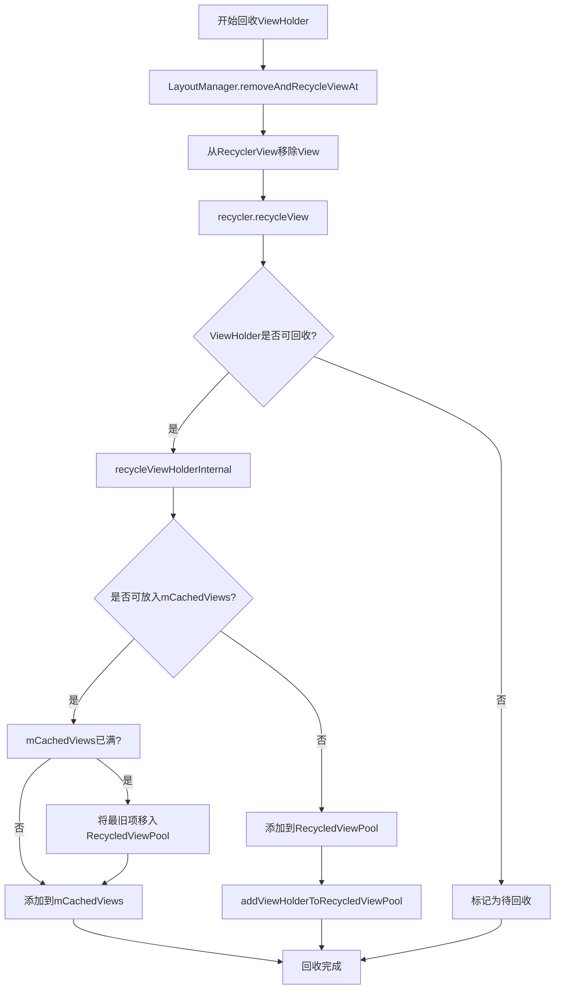
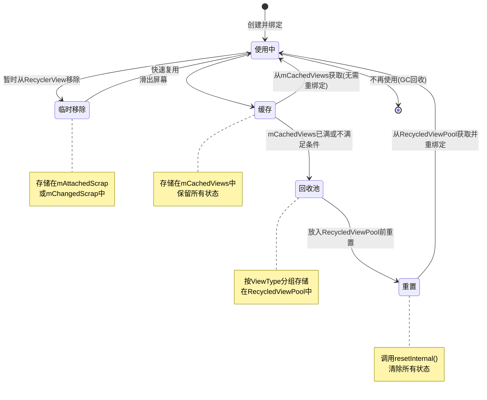

# ViewHolder回收过程

本节将深入分析RecyclerView中ViewHolder的回收过程，特别关注ViewHolder是如何从可见区域被回收到RecycledViewPool中的。

## ViewHolder回收的触发时机

ViewHolder的回收主要在以下几个场景中触发：

1. **滑动过程中**：当滑动导致某些视图离开可见区域时
2. **数据刷新时**：当调用`notifyDataSetChanged`等方法导致布局重新计算时
3. **布局变化时**：当RecyclerView的尺寸发生变化导致需要重新布局时
4. **移除条目时**：当移除某个条目时，其对应的ViewHolder会被回收

## 回收过程的入口

ViewHolder回收过程的主要入口是`removeAndRecycleViewAt`方法，它由LayoutManager在布局过程中调用：

```java
public void removeAndRecycleViewAt(int index, Recycler recycler) {
    final View view = getChildAt(index);
    removeViewAt(index);
    recycler.recycleView(view);
}
```

这个方法首先将视图从RecyclerView中移除，然后调用Recycler的recycleView方法进行回收。



## 详细回收流程

ViewHolder的回收是一个多步骤的过程，下面详细分析这个过程：

### 1. recycleView方法

回收过程从Recycler的recycleView方法开始：

```java
public void recycleView(View view) {
    // 获取视图对应的ViewHolder
    ViewHolder holder = getChildViewHolderInt(view);
    // 检查ViewHolder是否被标记为不可回收
    if (holder.isRecyclable()) {
        // 如果可回收，调用内部回收方法
        recycleViewHolderInternal(holder);
    } else {
        // 如果不可回收，标记为需要回收
        holder.addFlags(ViewHolder.FLAG_PENDING_RECYCLE);
    }
}
```

这个方法首先获取视图对应的ViewHolder，然后检查它是否可回收，如果可回收就调用内部回收方法，否则只是标记它为待回收状态。

### 2. 检查是否可回收

ViewHolder的`isRecyclable`方法用于检查ViewHolder是否可回收：

```java
public final boolean isRecyclable() {
    // 检查不可回收的计数器和标志位
    return !hasAnyOfTheFlags(FLAG_IGNORE | FLAG_INVALID | FLAG_ADAPTER_POSITION_UNKNOWN)
            && !isAttachedToTransitionOverlay();
}
```

一个ViewHolder在以下情况下被认为是不可回收的：
- 被标记为忽略（FLAG_IGNORE）
- 被标记为无效（FLAG_INVALID）
- 适配器位置未知（FLAG_ADAPTER_POSITION_UNKNOWN）
- 被附加到过渡覆盖层上

开发者可以通过调用`setIsRecyclable(false)`方法来临时阻止ViewHolder被回收，这通常用于保持动画效果或者用户交互状态。

### 3. 内部回收处理

如果ViewHolder可回收，会调用`recycleViewHolderInternal`方法进行实际的回收：

```java
void recycleViewHolderInternal(ViewHolder holder) {
    // 各种检查...
    
    // 判断是否可以放入一级缓存mCachedViews
    boolean cached = false;
    if (mViewCacheMax > 0 && !holder.hasAnyOfTheFlags(ViewHolder.FLAG_INVALID 
            | ViewHolder.FLAG_REMOVED | ViewHolder.FLAG_UPDATE | ViewHolder.FLAG_ADAPTED_POSITION)) {
        // 如果mCachedViews已满，先移除最老的一个
        int cachedViewSize = mCachedViews.size();
        if (cachedViewSize >= mViewCacheMax && cachedViewSize > 0) {
            recycleCachedViewAt(0);
            cachedViewSize--;
        }
        
        // 添加到mCachedViews
        mCachedViews.add(holder);
        cached = true;
    }
    
    if (!cached) {
        // 如果不能放入mCachedViews，放入RecycledViewPool
        addViewHolderToRecycledViewPool(holder, true);
    }
}
```

这个方法决定ViewHolder的去向：
1. 判断ViewHolder是否满足放入mCachedViews的条件
2. 如果满足，且mCachedViews未满，则放入mCachedViews
3. 如果mCachedViews已满，先移除最老的ViewHolder到RecycledViewPool，再放入新的
4. 如果不满足放入mCachedViews的条件，直接放入RecycledViewPool

### 4. 放入RecycledViewPool

当ViewHolder需要放入RecycledViewPool时，会调用`addViewHolderToRecycledViewPool`方法：

```java
void addViewHolderToRecycledViewPool(ViewHolder holder, boolean dispatchRecycled) {
    // 清除ViewHolder在RecyclerView中的引用
    clearNestedRecyclerViewIfNotNested(holder);
    
    // 清除ItemView的转场信息
    if (holder.itemView.getParent() != null) {
        holder.itemView.setAccessibilityDelegate(null);
    }
    
    // 通知Adapter该ViewHolder已经被回收
    if (dispatchRecycled) {
        dispatchViewRecycled(holder);
    }
    
    // 清除ViewHolder对RecyclerView的引用
    holder.mOwnerRecyclerView = null;
    
    // 将ViewHolder放入RecycledViewPool
    getRecycledViewPool().putRecycledView(holder);
}
```

这个方法完成以下工作：
1. 清除嵌套的RecyclerView（如果有）
2. 清除ItemView的转场信息和无障碍委托
3. 通知Adapter该ViewHolder已经被回收
4. 清除ViewHolder对RecyclerView的引用
5. 调用RecycledViewPool的putRecycledView方法放入ViewHolder

### 5. putRecycledView方法

最后，ViewHolder通过RecycledViewPool的putRecycledView方法被正式放入回收池：

```java
public void putRecycledView(ViewHolder scrap) {
    final int viewType = scrap.getItemViewType();
    // 获取对应ViewType的ScrapData
    final ArrayList<ViewHolder> scrapHeap = getScrapDataForType(viewType).mScrapHeap;
    // 检查是否已达到最大容量
    if (mScrap.get(viewType).mMaxScrap <= scrapHeap.size()) {
        return; // 如果已达到最大容量，直接丢弃
    }
    // 重置ViewHolder的状态
    scrap.resetInternal();
    // 添加到对应ViewType的列表中
    scrapHeap.add(scrap);
}
```

这个方法完成以下工作：
1. 获取ViewHolder的ViewType
2. 获取对应ViewType的ScrapData和ViewHolder列表
3. 检查该ViewType的缓存是否已达到最大容量，如果是则直接丢弃
4. 重置ViewHolder的所有状态
5. 将ViewHolder添加到对应ViewType的列表中

## ViewHolder状态的重置

在放入RecycledViewPool前，ViewHolder的状态会被完全重置，这是通过`resetInternal`方法完成的：

```java
void resetInternal() {
    // 重置所有标志位
    mFlags = 0;
    // 重置位置信息
    mPosition = NO_POSITION;
    mOldPosition = NO_POSITION;
    mItemId = NO_ID;
    mPreLayoutPosition = NO_POSITION;
    // 重置可回收计数
    mIsRecyclableCount = 0;
    // 清除阴影持有者引用
    mShadowedHolder = null;
    mShadowingHolder = null;
    // 清除有效载荷
    clearPayload();
    // 重置无障碍状态
    mWasImportantForAccessibilityBeforeHidden = ViewCompat.IMPORTANT_FOR_ACCESSIBILITY_AUTO;
    mPendingAccessibilityState = PENDING_ACCESSIBILITY_STATE_NOT_SET;
    // 清除嵌套RecyclerView
    clearNestedRecyclerViewIfNotNested(this);
}
```

这个重置过程确保了ViewHolder不会保留之前的状态，这样在下次使用时能够重新绑定数据而不会出现状态混乱。



## 回收过程中的优化

RecyclerView的回收过程包含了一些优化策略：

### 1. 一级缓存的优先使用

mCachedViews作为一级缓存，优先接收离开屏幕的ViewHolder。从一级缓存获取的ViewHolder无需重新绑定数据，可以直接复用，这大大提高了性能。

### 2. LRU缓存策略

mCachedViews使用类似LRU（最近最少使用）的缓存策略，当缓存满时，会移除最老的ViewHolder。这种策略确保了最近使用的ViewHolder有更高的优先级被保留在缓存中。

### 3. 按ViewType分组存储

RecycledViewPool按ViewType分组存储ViewHolder，这确保了在获取ViewHolder时不会出现类型不匹配的情况，提高了复用的成功率。

### 4. 缓存容量控制

每种ViewType的缓存容量可以单独配置，这使得开发者可以根据实际情况为不同类型的ViewHolder分配不同的缓存空间。

## 回收过程中的问题和解决方案

在实际开发中，ViewHolder回收可能会遇到一些问题：

### 1. 回收后状态保留问题

从RecycledViewPool获取的ViewHolder会被重置，但如果开发者在`onBindViewHolder`中没有正确处理所有状态，可能会导致状态混乱。

**解决方案**：
- 在`onBindViewHolder`中完全重置视图状态
- 使用`setHasStableIds(true)`并实现`getItemId`方法
- 对于需要保持状态的视图，可以通过自定义状态恢复机制

### 2. 自定义视图的回收问题

一些自定义视图可能持有资源或引用，这些资源在视图被回收时可能没有被正确释放。

**解决方案**：
- 实现`onViewRecycled`方法，在其中释放资源
- 使用`setHasTransientState(false)`确保视图可以被回收
- 使用弱引用持有外部对象

## 总结

ViewHolder的回收过程是RecyclerView高效运行的关键环节。通过多级缓存结构和精细的状态管理，RecyclerView实现了ViewHolder的高效回收与复用。

理解这一过程不仅有助于我们更好地使用RecyclerView，还能帮助我们在实际开发中解决与回收相关的问题，优化列表的性能和内存使用。在下一节中，我们将分析ViewHolder从RecycledViewPool中获取的过程。 