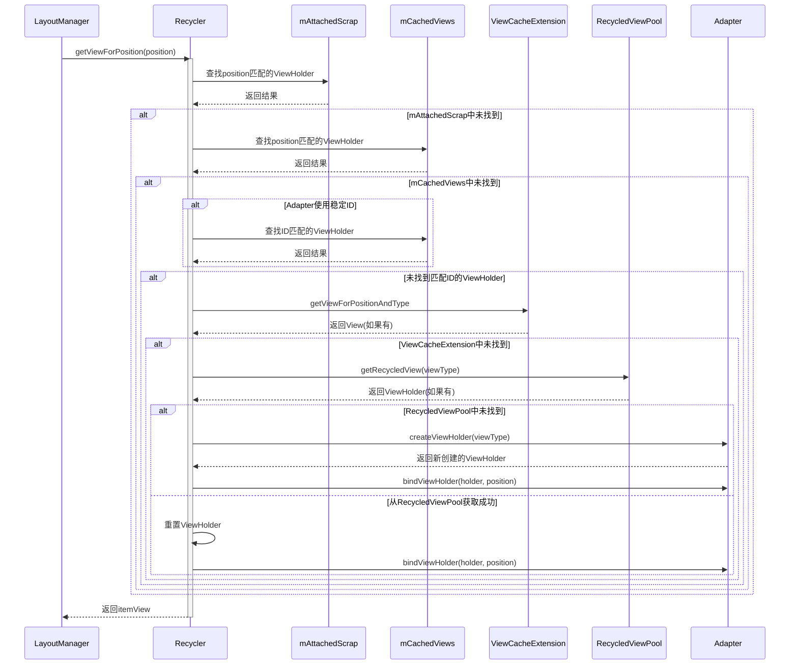
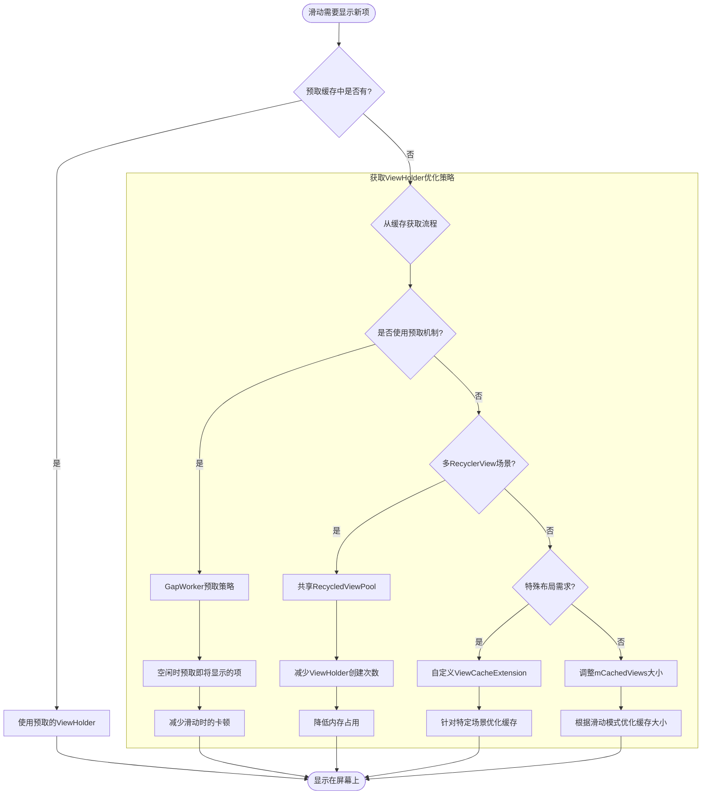

# ViewHolder获取过程

本节将深入分析RecyclerView从RecycledViewPool中获取ViewHolder的过程，包括获取的时机、流程以及相关的优化策略。

## ViewHolder获取的触发时机

RecyclerView需要获取ViewHolder的主要场景有：

1. **初始布局**：RecyclerView首次显示时，需要为可见区域创建ViewHolder
2. **滑动填充**：滑动过程中，新进入可见区域的位置需要ViewHolder
3. **数据更新**：当数据发生变化导致布局变化时，可能需要新的ViewHolder
4. **插入项目**：向列表中插入新项目时，需要为新项目创建ViewHolder

## 获取流程的入口

ViewHolder获取流程的入口是LayoutManager的`getViewForPosition`方法，该方法最终调用Recycler的`getViewForPosition`：

```java
public View getViewForPosition(int position) {
    return getViewForPosition(position, false);
}

View getViewForPosition(int position, boolean dryRun) {
    return tryGetViewHolderForPositionByDeadline(position, dryRun, FOREVER_NS).itemView;
}
```

这个方法实际上委托给了`tryGetViewHolderForPositionByDeadline`方法，这是整个获取流程的核心方法。



## 详细获取流程

### 1. tryGetViewHolderForPositionByDeadline方法

这个方法是获取ViewHolder的核心，它按照一定的优先级尝试从不同的缓存中获取ViewHolder：

```java
ViewHolder tryGetViewHolderForPositionByDeadline(int position, boolean dryRun, long deadlineNs) {
    ViewHolder holder = null;
    
    // 1. 尝试从mAttachedScrap或mChangedScrap中获取
    holder = getScrapOrHiddenOrCachedHolderForPosition(position, dryRun);
    if (holder != null) {
        return holder;
    }
    
    // 2. 尝试从mCachedViews中获取
    // 这部分逻辑包含在getScrapOrHiddenOrCachedHolderForPosition方法中
    
    // 3. 获取该位置对应的视图类型
    final int type = mAdapter.getItemViewType(position);
    
    // 4. 如果Adapter使用稳定ID，尝试通过ID匹配
    if (mAdapter.hasStableIds()) {
        holder = getScrapOrCachedViewForId(mAdapter.getItemId(position), type, dryRun);
        if (holder != null) {
            // 更新位置
            holder.mPosition = position;
            return holder;
        }
    }
    
    // 5. 从ViewCacheExtension中获取
    if (mViewCacheExtension != null) {
        View view = mViewCacheExtension.getViewForPositionAndType(position, type);
        if (view != null) {
            holder = getChildViewHolder(view);
            // 检查是否有效
            if (holder != null) {
                return holder;
            }
        }
    }
    
    // 6. 从RecycledViewPool中获取
    holder = getRecycledViewPool().getRecycledView(type);
    if (holder != null) {
        // 重置ViewHolder
        holder.resetInternal();
        // 更新一些标志位和状态
        holder.mPosition = position;
        return holder;
    }
    
    // 7. 如果以上都没有找到合适的ViewHolder，创建新的
    holder = mAdapter.createViewHolder(RecyclerView.this, type);
    
    // 8. 绑定数据
    if (!dryRun) {
        mAdapter.bindViewHolder(holder, position);
    }
    
    return holder;
}
```

从上面的代码可以看出，ViewHolder的获取过程遵循一个明确的优先级顺序，从高到低依次为：
1. mAttachedScrap和mChangedScrap（临时移除但仍在RecyclerView上的ViewHolder）
2. mCachedViews（一级缓存，最近移出屏幕的ViewHolder）
3. ViewCacheExtension（自定义缓存扩展）
4. RecycledViewPool（回收池，按ViewType分组存储的ViewHolder）
5. 创建新的ViewHolder

### 2. 从RecycledViewPool获取ViewHolder

当前面几级缓存都没有找到合适的ViewHolder时，会尝试从RecycledViewPool中获取。这是通过调用RecycledViewPool的`getRecycledView`方法实现的：

```java
public ViewHolder getRecycledView(int viewType) {
    final ScrapData scrapData = mScrap.get(viewType);
    if (scrapData != null && !scrapData.mScrapHeap.isEmpty()) {
        final ArrayList<ViewHolder> scrapHeap = scrapData.mScrapHeap;
        // 从列表末尾获取一个ViewHolder
        for (int i = scrapHeap.size() - 1; i >= 0; i--) {
            if (!scrapHeap.get(i).isAttachedToTransitionOverlay()) {
                return scrapHeap.remove(i);
            }
        }
    }
    return null;
}
```

这个方法的工作流程如下：
1. 获取指定ViewType的ScrapData
2. 检查ScrapData是否存在且其mScrapHeap不为空
3. 如果存在可用的ViewHolder，从列表末尾开始查找一个未被附加到过渡覆盖层的ViewHolder
4. 找到后将其从列表中移除并返回
5. 如果没有找到合适的ViewHolder，返回null

### 3. 重置和准备ViewHolder

从RecycledViewPool获取的ViewHolder需要进行一系列的准备工作才能被复用：

```java
if (holder != null) {
    // 重置ViewHolder的内部状态
    holder.resetInternal();
    
    // 设置新的位置信息
    holder.mPosition = position;
    holder.mOldPosition = NO_POSITION;
    holder.mPreLayoutPosition = NO_POSITION;
    
    // 清除临时标志位
    holder.clearReturnedFromScrapFlag();
    holder.clearTmpDetachFlag();
    
    // 其他准备工作...
    
    return holder;
}
```

这些准备工作包括：
1. 重置ViewHolder的内部状态（这在放入RecycledViewPool时已经做过一次）
2. 设置新的位置信息
3. 清除各种临时标志位
4. 准备接收新的数据绑定

### 4. 绑定数据

从RecycledViewPool获取的ViewHolder需要重新绑定数据，这是通过Adapter的`bindViewHolder`方法完成的：

```java
mAdapter.bindViewHolder(holder, position);
```

这个方法会调用开发者实现的`onBindViewHolder`方法，将数据绑定到ViewHolder。

## 获取过程中的优化策略

RecyclerView的ViewHolder获取过程包含了多种优化策略：

### 1. 多级缓存结构

RecyclerView的多级缓存结构是其高效运行的关键：
- **mAttachedScrap和mChangedScrap**：用于临时移除但很快会重新使用的ViewHolder，完全避免了绑定开销
- **mCachedViews**：一级缓存，存储最近离开屏幕的ViewHolder，不需要重新绑定数据
- **mViewCacheExtension**：允许开发者实现自定义的缓存逻辑
- **RecycledViewPool**：最后的兜底，按ViewType分组存储ViewHolder，需要重新绑定数据

这种多级缓存结构确保了ViewHolder能够以最小的开销被复用。

### 2. 预取机制

RecyclerView的GapWorker实现了一种预取机制，可以在空闲时间预先创建和绑定即将进入可见区域的ViewHolder：

```java
void prefetchPositionWithDeadline(int position, long deadlineNs) {
    // 尝试预取指定位置的ViewHolder
    ViewHolder holder = tryGetViewHolderForPositionByDeadline(position, true, deadlineNs);
    if (holder != null) {
        // 如果成功获取，放入预取缓存
        prefetchItemHolderInternal(holder.getItemViewType(), deadlineNs);
    }
}
```

这种预取机制可以减少滑动过程中的卡顿，提供更流畅的用户体验。

### 3. 共享RecycledViewPool

对于包含多个RecyclerView的界面，可以共享同一个RecycledViewPool，这可以减少内存使用并提高复用效率：

```java
RecycledViewPool sharedPool = new RecycledViewPool();
recyclerView1.setRecycledViewPool(sharedPool);
recyclerView2.setRecycledViewPool(sharedPool);
```

这在Tab布局、ViewPager中包含多个RecyclerView的场景尤其有用。

## 获取过程中的常见问题

### 1. 类型不匹配

当使用多种ViewType时，可能会出现类型不匹配的问题：

```java
@Override
public int getItemViewType(int position) {
    // 错误示例：返回动态计算的值而非固定的类型
    return position % 3;
}
```

这会导致ViewHolder无法正确复用，因为RecycledViewPool是按ViewType分组存储的。

**解决方案**：
- 确保getItemViewType返回的是固定的、有限的类型值
- 对于动态内容，应当在onBindViewHolder中处理，而不是创建新的ViewType

### 2. 视图状态未正确重置

从RecycledViewPool获取的ViewHolder需要重新绑定数据，如果onBindViewHolder没有正确处理所有状态，可能会导致视图状态混乱：

```java
@Override
public void onBindViewHolder(ViewHolder holder, int position) {
    // 错误示例：只更新部分状态
    holder.textView.setText(data.get(position).getText());
    // 忘记更新其他状态，如选中状态、可见性等
}
```

**解决方案**：
- 在onBindViewHolder中完整地设置所有视图状态
- 使用ViewHolder的resetBinding方法重置视图状态

### 3. 自定义缓存扩展不当

不当实现的ViewCacheExtension可能导致性能问题或视图状态错误：

```java
// 错误示例：缓存扩展永远返回同一个ViewHolder
mRecyclerView.setViewCacheExtension(new ViewCacheExtension() {
    @Override
    public View getViewForPositionAndType(int position, int type) {
        if (position == 0 && type == HEADER_TYPE) {
            return cachedHeader; // 总是返回同一个缓存的头部视图
        }
        return null;
    }
});
```

**解决方案**：
- 确保ViewCacheExtension正确处理视图的状态和生命周期
- 避免返回已经被回收或正在使用的ViewHolder
- 对于特殊需求，考虑使用setHasFixedSize或自定义LayoutManager

## 总结

RecyclerView从RecycledViewPool获取ViewHolder的过程是一个多级缓存查找的过程。这种设计既保证了性能，又提供了足够的灵活性，使RecyclerView能够高效地处理各种列表展示需求。

理解这一过程对于优化RecyclerView性能和解决复用相关的问题至关重要。通过合理配置缓存参数、实现正确的Adapter方法和利用预取机制，可以进一步提升RecyclerView的性能，为用户提供更加流畅的列表体验。 

