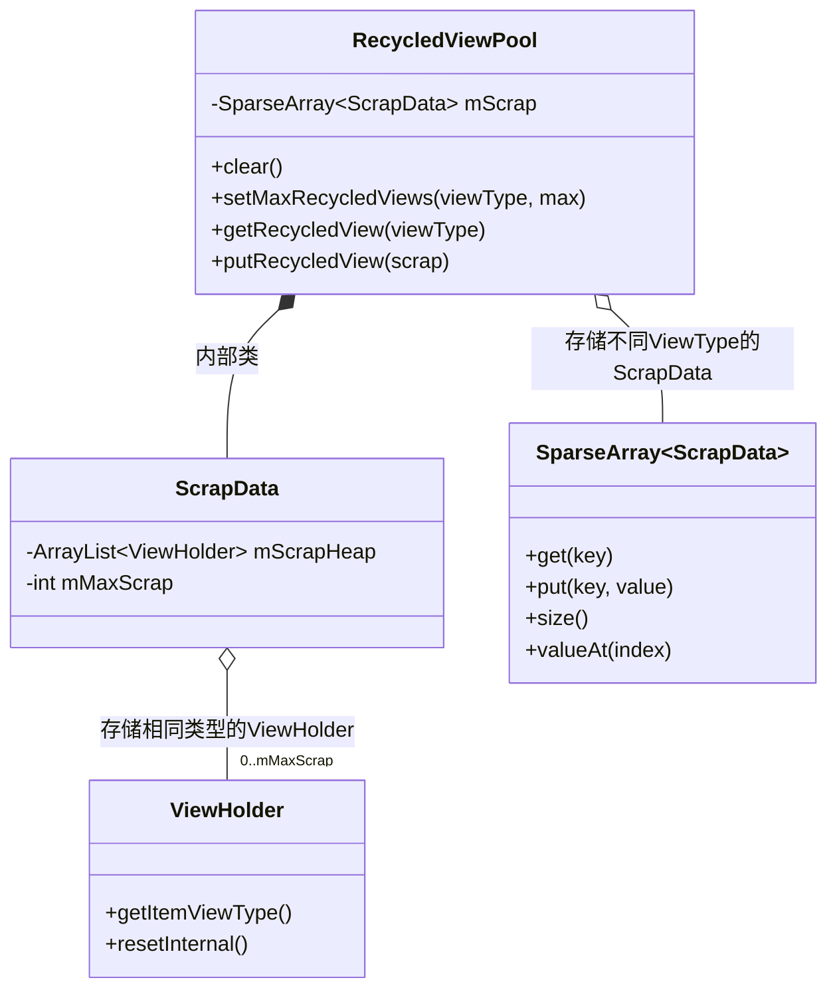
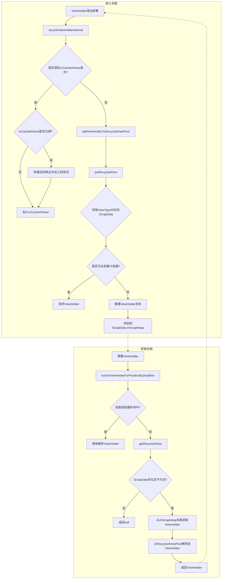

# RecycledViewPool分析

RecycledViewPool是RecyclerView缓存机制中的最后一级缓存，也是唯一一个可以被多个RecyclerView共享的缓存。本节将详细分析RecycledViewPool的实现原理和工作机制。

## RecycledViewPool概述

RecycledViewPool是一个用于存储和管理废弃ViewHolder的类，它按照ViewType对ViewHolder进行分组存储。其主要特点有：

1. **按ViewType分组**：不同类型的ViewHolder存储在不同的池中
2. **可配置容量**：每种ViewType的池容量可以单独配置
3. **可共享**：多个RecyclerView可以共享同一个RecycledViewPool
4. **需要重绑定**：从RecycledViewPool获取的ViewHolder需要重新绑定数据



## RecycledViewPool源码分析

### 类结构

RecycledViewPool的类结构相对简单：

```java
public static class RecycledViewPool {
    // 内部类，用于存储每种ViewType的回收池信息
    static class ScrapData {
        // 存储ViewHolder的ArrayList
        final ArrayList<ViewHolder> mScrapHeap = new ArrayList<>();
        // 该类型ViewHolder的最大缓存数量，默认为5
        int mMaxScrap = DEFAULT_MAX_SCRAP;
    }

    // 默认每种类型的ViewHolder最大缓存数量
    private static final int DEFAULT_MAX_SCRAP = 5;
    
    // 存储所有ViewType对应的ScrapData，key为viewType，value为ScrapData
    SparseArray<ScrapData> mScrap = new SparseArray<>();
    
    // ... 其他方法
}
```

RecycledViewPool内部使用一个SparseArray来存储不同ViewType的ScrapData，每个ScrapData包含一个ArrayList用于存储对应类型的ViewHolder，以及一个表示最大缓存数量的整数。

### 核心方法

RecycledViewPool提供了以下几个核心方法：

#### 1. 清空池

```java
public void clear() {
    for (int i = 0; i < mScrap.size(); i++) {
        ScrapData data = mScrap.valueAt(i);
        data.mScrapHeap.clear();
    }
}
```

这个方法会清空所有类型的ViewHolder缓存。

#### 2. 设置最大缓存数量

```java
public void setMaxRecycledViews(int viewType, int max) {
    ScrapData scrapData = getScrapDataForType(viewType);
    scrapData.mMaxScrap = max;
    final ArrayList<ViewHolder> scrapHeap = scrapData.mScrapHeap;
    // 如果当前缓存数量超过新的最大值，移除多余的ViewHolder
    while (scrapHeap.size() > max) {
        scrapHeap.remove(scrapHeap.size() - 1);
    }
}
```

这个方法允许开发者为指定类型的ViewHolder设置最大缓存数量。如果当前缓存的数量超过了新设置的最大值，会移除多余的ViewHolder。

#### 3. 获取ViewHolder

```java
public ViewHolder getRecycledView(int viewType) {
    final ScrapData scrapData = mScrap.get(viewType);
    if (scrapData != null && !scrapData.mScrapHeap.isEmpty()) {
        final ArrayList<ViewHolder> scrapHeap = scrapData.mScrapHeap;
        // 从列表末尾获取一个ViewHolder（LIFO策略）
        return scrapHeap.remove(scrapHeap.size() - 1);
    }
    return null;
}
```

这个方法尝试从RecycledViewPool中获取指定类型的ViewHolder。如果对应类型的缓存为空，将返回null。注意，RecycledViewPool采用的是LIFO（后进先出）策略，从列表末尾取出最近放入的ViewHolder。

#### 4. 放入ViewHolder

```java
public void putRecycledView(ViewHolder scrap) {
    final int viewType = scrap.getItemViewType();
    final ArrayList<ViewHolder> scrapHeap = getScrapDataForType(viewType).mScrapHeap;
    if (mScrap.get(viewType).mMaxScrap <= scrapHeap.size()) {
        return; // 如果已达到最大容量，直接丢弃
    }
    // 重置ViewHolder的各种状态
    scrap.resetInternal();
    // 添加到ScrapHeap末尾
    scrapHeap.add(scrap);
}
```

这个方法将一个ViewHolder放入RecycledViewPool。首先检查对应类型的缓存是否已达到最大容量，如果已达到则直接丢弃该ViewHolder。否则，重置ViewHolder的各种状态后，将其添加到缓存列表的末尾。

#### 5. 获取ScrapData

```java
private ScrapData getScrapDataForType(int viewType) {
    ScrapData scrapData = mScrap.get(viewType);
    if (scrapData == null) {
        scrapData = new ScrapData();
        mScrap.put(viewType, scrapData);
    }
    return scrapData;
}
```

这是一个内部方法，用于获取或创建指定ViewType的ScrapData。如果该ViewType的ScrapData不存在，会创建一个新的并放入mScrap。

## RecycledViewPool的工作机制

### 1. ViewHolder的存储结构

RecycledViewPool使用SparseArray<ScrapData>来存储不同类型的ViewHolder。每个ScrapData包含一个ArrayList来存储ViewHolder，以及一个表示最大缓存数量的整数。这种设计有以下优点：

1. **高效查找**：SparseArray针对key为int类型的场景进行了优化，查找效率高
2. **类型隔离**：不同类型的ViewHolder存储在不同的列表中，避免了不必要的类型检查
3. **容量定制**：可以为不同类型的ViewHolder设置不同的最大缓存数量

### 2. 缓存策略

RecycledViewPool使用LIFO（后进先出）的缓存策略：

1. **放入**：新的ViewHolder放入列表末尾
2. **取出**：从列表末尾取出ViewHolder

这种策略的好处是能够优先复用最近被回收的ViewHolder，这些ViewHolder可能还保留在CPU缓存中，访问速度更快。

### 3. 视图重置

从RecycledViewPool中取出的ViewHolder需要重新绑定数据，因为在放入RecycledViewPool时，ViewHolder的状态已经被重置：

```java
void resetInternal() {
    // 重置各种标志位
    mFlags = 0;
    mPosition = NO_POSITION;
    mOldPosition = NO_POSITION;
    mItemId = NO_ID;
    mPreLayoutPosition = NO_POSITION;
    mIsRecyclableCount = 0;
    mShadowedHolder = null;
    mShadowingHolder = null;
    // 清除所有绑定的数据
    clearPayload();
    mWasImportantForAccessibilityBeforeHidden = ViewCompat.IMPORTANT_FOR_ACCESSIBILITY_AUTO;
    mPendingAccessibilityState = PENDING_ACCESSIBILITY_STATE_NOT_SET;
    clearNestedRecyclerViewIfNotNested(this);
}
```

这个重置过程确保了ViewHolder不会保留之前绑定的数据和状态，避免了数据混乱。



## RecycledViewPool的优化使用

### 1. 共享RecycledViewPool

在需要多个RecyclerView展示相同类型的item的场景，可以通过共享RecycledViewPool来优化内存使用：

```java
RecycledViewPool sharedPool = new RecycledViewPool();
recyclerView1.setRecycledViewPool(sharedPool);
recyclerView2.setRecycledViewPool(sharedPool);
```

典型应用场景包括：
- ViewPager中的多个RecyclerView
- NestedScrollView中的多个RecyclerView
- 嵌套的RecyclerView结构

### 2. 预创建ViewHolder

在某些场景下，可以在RecyclerView初始化时提前创建并缓存ViewHolder，减少滑动过程中的创建开销：

```java
RecycledViewPool pool = new RecycledViewPool();
// 设置类型0的最大缓存数量为10
pool.setMaxRecycledViews(0, 10);

// 预创建5个ViewHolder
for (int i = 0; i < 5; i++) {
    ViewHolder holder = adapter.createViewHolder(recyclerView, 0);
    pool.putRecycledView(holder);
}

recyclerView.setRecycledViewPool(pool);
```

### 3. 根据需求调整缓存容量

不同类型的ViewHolder可能有不同的创建成本和使用频率。可以根据实际需求调整不同类型的缓存容量：

```java
RecycledViewPool pool = recyclerView.getRecycledViewPool();
// 为复杂的item类型分配更多的缓存空间
pool.setMaxRecycledViews(COMPLEX_ITEM_TYPE, 10);
// 为简单的item类型分配较少的缓存空间
pool.setMaxRecycledViews(SIMPLE_ITEM_TYPE, 3);
```

## 总结

RecycledViewPool作为RecyclerView缓存体系的最后一级缓存，通过按ViewType分组存储和管理废弃的ViewHolder，提供了一种高效的视图复用机制。它的可共享特性使其在处理多个RecyclerView的场景中尤为重要。

理解RecycledViewPool的工作原理和使用方法，有助于我们更好地优化RecyclerView的性能，特别是在复杂列表和多RecyclerView场景中。在下一节中，我们将深入分析RecycledViewPool中ViewHolder的回收与获取过程的细节。 