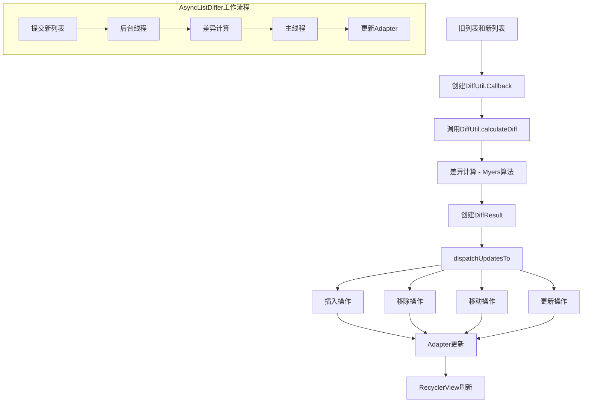
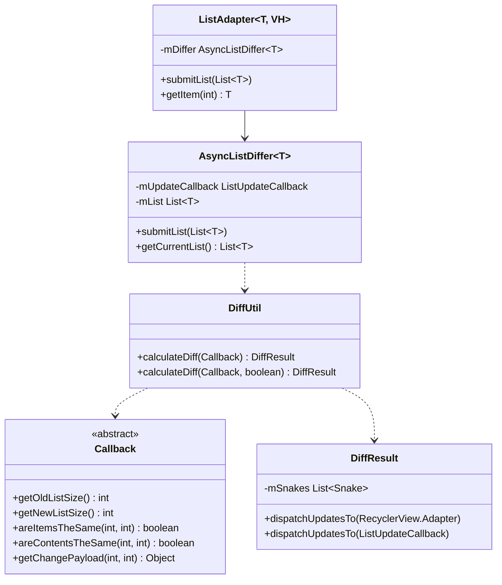

# DiffUtil工作原理

在RecyclerView的性能优化中，高效处理数据集变化是一个核心问题。DiffUtil是Android支持库中提供的一个工具类，用于计算两个列表之间的差异，并输出将一个列表转换为另一个列表所需的最小更新操作。本章将深入分析DiffUtil的工作原理，包括其算法实现、性能特性以及最佳实践。

## DiffUtil简介

DiffUtil是一个基于Eugene W. Myers差分算法的实用工具类，它能够：

- 计算两个列表之间的差异
- 生成将旧列表转换为新列表所需的最小更新操作集合
- 配合RecyclerView的Adapter使用，实现高效的列表更新

相比于`notifyDataSetChanged()`，使用DiffUtil更新列表具有以下优势：

- 只更新发生变化的Item，而不是刷新整个列表
- 自动计算并触发适当的Item动画（添加、移除、移动）
- 在后台线程执行差异计算，不阻塞UI线程

## DiffUtil工作流程图





## 核心类和接口

### DiffUtil

主类，提供计算两个列表差异的静态方法：

```java
public class DiffUtil {
    // 计算差异，返回DiffResult
    public static DiffResult calculateDiff(Callback callback) {...}
    
    // 计算差异，并设置是否检测移动
    public static DiffResult calculateDiff(Callback callback, boolean detectMoves) {...}
    
    // 其他方法...
}
```

### DiffUtil.Callback

抽象类，定义了DiffUtil执行差异计算所需的方法：

```java
public abstract static class Callback {
    // 获取旧列表大小
    public abstract int getOldListSize();
    
    // 获取新列表大小
    public abstract int getNewListSize();
    
    // 判断两个项是否代表同一个对象
    public abstract boolean areItemsTheSame(int oldItemPosition, int newItemPosition);
    
    // 判断两个项的内容是否相同
    public abstract boolean areContentsTheSame(int oldItemPosition, int newItemPosition);
    
    // 当内容不同时，提供改变的详细负载信息（可选实现）
    @Nullable
    public Object getChangePayload(int oldItemPosition, int newItemPosition) {
        return null;
    }
}
```

### DiffUtil.DiffResult

保存差异计算结果，并提供将结果分发到RecyclerView.Adapter的方法：

```java
public class DiffResult {
    // 将计算结果分发到adapter
    public void dispatchUpdatesTo(RecyclerView.Adapter adapter) {...}
    
    // 将计算结果分发到自定义的更新回调
    public void dispatchUpdatesTo(ListUpdateCallback updateCallback) {...}
}
```

### ListUpdateCallback

定义了处理列表更新操作的回调接口：

```java
public interface ListUpdateCallback {
    // 处理项插入
    void onInserted(int position, int count);
    
    // 处理项移除
    void onRemoved(int position, int count);
    
    // 处理项移动
    void onMoved(int fromPosition, int toPosition);
    
    // 处理项更新
    void onChanged(int position, int count, @Nullable Object payload);
}
```

## 差异计算算法

DiffUtil使用的是Eugene W. Myers的差分算法，这是一种解决"最长公共子序列"(LCS)问题的高效算法。

### 算法原理

1. **基本概念**：
   - 编辑脚本：将旧列表转换为新列表所需的操作序列
   - 编辑图：表示所有可能转换路径的图
   - 最优编辑路径：最小操作数的转换路径

2. **算法步骤**：
   - 构建编辑图，旧列表为x轴，新列表为y轴
   - 对角线移动表示两个元素相同
   - 水平移动表示删除旧列表中的元素
   - 垂直移动表示插入新列表中的元素
   - 使用广度优先搜索找到最优编辑路径

### 源码分析

DiffUtil中差异计算的核心方法`calculateDiff`的实现：

```java
public static DiffResult calculateDiff(Callback callback, boolean detectMoves) {
    // 获取两个列表的大小
    final int oldSize = callback.getOldListSize();
    final int newSize = callback.getNewListSize();
    
    // 创建存储编辑脚本的列表
    List<Snake> snakes = new ArrayList<>();
    
    // 用于存储前向路径和后向路径
    List<Range> stack = new ArrayList<>();
    stack.add(new Range(0, oldSize, 0, newSize));
    
    // 计算路径D的最大长度
    final int max = oldSize + newSize;
    // 分配2D编辑距离数组
    final int[] forward = new int[max * 2];
    final int[] backward = new int[max * 2];
    
    // 分割搜索空间
    List<Range> rangePool = new ArrayList<>();
    while (!stack.isEmpty()) {
        // 获取下一个要处理的范围
        Range range = stack.remove(stack.size() - 1);
        // 计算该范围内的最优路径
        Snake snake = diffPartial(callback, forward, backward, range.oldListStart,
                range.oldListEnd, range.newListStart, range.newListEnd, snakes);
        
        // 如果找到蛇（对角线移动），继续处理蛇前后的范围
        if (snake != null) {
            if (snake.size > 0) {
                snakes.add(snake);
            }
            // 添加前面的范围
            if (snake.x > range.oldListStart && snake.y > range.newListStart) {
                Range newRange = rangePool.isEmpty() ? new Range() : rangePool.remove(
                        rangePool.size() - 1);
                newRange.oldListStart = range.oldListStart;
                newRange.newListStart = range.newListStart;
                newRange.oldListEnd = snake.x;
                newRange.newListEnd = snake.y;
                stack.add(newRange);
            }
            // 添加后面的范围
            if (range.oldListEnd > snake.x + snake.size
                    && range.newListEnd > snake.y + snake.size) {
                Range newRange = rangePool.isEmpty() ? new Range() : rangePool.remove(
                        rangePool.size() - 1);
                newRange.oldListStart = snake.x + snake.size;
                newRange.newListStart = snake.y + snake.size;
                newRange.oldListEnd = range.oldListEnd;
                newRange.newListEnd = range.newListEnd;
                stack.add(newRange);
            }
        }
        // 回收Range对象
        rangePool.add(range);
    }
    
    // 对蛇（编辑脚本）按位置排序
    Collections.sort(snakes, SNAKE_COMPARATOR);
    
    // 创建最终结果
    return new DiffResult(callback, snakes, forward, backward, detectMoves);
}
```

其中`diffPartial`方法实现了Myers算法的核心逻辑，用于在给定范围内查找最优编辑路径。

## DiffResult实现

DiffResult类负责存储差异计算结果，并提供将结果转换为适配器更新操作的功能。

### 数据结构

DiffResult内部使用以下数据结构存储差异信息：

```java
public class DiffResult {
    // 原始列表大小
    private final int mOldListSize;
    // 新列表大小
    private final int mNewListSize;
    // 编辑脚本
    private final List<Snake> mSnakes;
    // 旧项位置到新项位置的映射
    private final int[] mOldItemStatuses;
    // 新项位置到旧项位置的映射
    private final int[] mNewItemStatuses;
    // 是否检测移动
    private final boolean mDetectMoves;
    
    // ...
}
```

### 分发更新

DiffResult将差异结果转换为RecyclerView.Adapter可识别的更新操作：

```java
public void dispatchUpdatesTo(final RecyclerView.Adapter adapter) {
    // 使用AdapterListUpdateCallback作为适配器
    dispatchUpdatesTo(new AdapterListUpdateCallback(adapter));
}

public void dispatchUpdatesTo(ListUpdateCallback updateCallback) {
    // 批处理操作的帮助类
    BatchingListUpdateCallback batchingCallback = new BatchingListUpdateCallback(updateCallback);
    
    // 遍历编辑脚本，生成更新操作
    int posOld = 0;
    int posNew = 0;
    for (int i = 0; i < mSnakes.size(); i++) {
        Snake snake = mSnakes.get(i);
        // 发送删除操作
        for (int j = posOld; j < snake.x; j++) {
            batchingCallback.onRemoved(posNew, 1);
        }
        // 发送插入操作
        for (int j = posNew; j < snake.y; j++) {
            batchingCallback.onInserted(j, 1);
        }
        // 发送更新操作（如果有内容变化）
        for (int k = 0; k < snake.size; k++) {
            int oldItemPos = snake.x + k;
            int newItemPos = snake.y + k;
            if (!mCallback.areContentsTheSame(oldItemPos, newItemPos)) {
                Object payload = mCallback.getChangePayload(oldItemPos, newItemPos);
                batchingCallback.onChanged(newItemPos, 1, payload);
            }
        }
        // 更新位置指针
        posOld = snake.x + snake.size;
        posNew = snake.y + snake.size;
    }
    
    // 结束批处理
    batchingCallback.dispatchLastEvent();
}
```

## 性能考量

DiffUtil的性能特点：

1. **时间复杂度**：
   - 最坏情况下为O(N²)，当两个列表完全不同时
   - 平均情况下为O(N)，当列表有一定相似性时

2. **空间复杂度**：
   - O(N²)，用于存储编辑图

3. **性能优化**：
   - 使用分割搜索空间策略减少内存使用
   - 通过只比较引用相等性来提高初始阶段性能

4. **适用场景**：
   - 适合中小型列表（几百个元素）
   - 对于大型列表，建议在后台线程执行差异计算

## AsyncListDiffer

为了避免在主线程执行昂贵的差异计算，Android提供了AsyncListDiffer类，实现了异步差异计算。

### 基本原理

AsyncListDiffer的工作原理：

1. 接收新的数据列表
2. 在后台线程中执行差异计算
3. 在主线程上将结果分发到适配器

### 核心实现

```java
public class AsyncListDiffer<T> {
    private final ListUpdateCallback mUpdateCallback;
    private final AsyncDifferConfig<T> mConfig;
    
    // 当前列表
    private List<T> mList;
    
    // 提交新列表
    public void submitList(final List<T> newList) {
        final List<T> oldList = mList;
        if (newList == oldList) {
            // 相同列表，无需更新
            return;
        }
        
        // 快速判断是否为空列表
        if (newList == null || oldList == null) {
            if (newList == null) {
                // 新列表为空，删除所有项
                mUpdateCallback.onRemoved(0, oldList.size());
                mList = null;
            } else {
                // 旧列表为空，插入所有项
                mUpdateCallback.onInserted(0, newList.size());
                mList = newList;
            }
            return;
        }
        
        // 在后台线程执行差异计算
        mConfig.getBackgroundThreadExecutor().execute(new Runnable() {
            @Override
            public void run() {
                // 计算差异
                final DiffResult result = DiffUtil.calculateDiff(new DiffUtil.Callback() {
                    @Override
                    public int getOldListSize() {
                        return oldList.size();
                    }
                    
                    @Override
                    public int getNewListSize() {
                        return newList.size();
                    }
                    
                    @Override
                    public boolean areItemsTheSame(int oldItemPosition, int newItemPosition) {
                        return mConfig.getDiffCallback().areItemsTheSame(
                                oldList.get(oldItemPosition), newList.get(newItemPosition));
                    }
                    
                    @Override
                    public boolean areContentsTheSame(int oldItemPosition, int newItemPosition) {
                        return mConfig.getDiffCallback().areContentsTheSame(
                                oldList.get(oldItemPosition), newList.get(newItemPosition));
                    }
                    
                    @Nullable
                    @Override
                    public Object getChangePayload(int oldItemPosition, int newItemPosition) {
                        return mConfig.getDiffCallback().getChangePayload(
                                oldList.get(oldItemPosition), newList.get(newItemPosition));
                    }
                });
                
                // 在主线程分发结果
                mConfig.getMainThreadExecutor().execute(new Runnable() {
                    @Override
                    public void run() {
                        mList = newList;
                        result.dispatchUpdatesTo(mUpdateCallback);
                    }
                });
            }
        });
    }
    
    // 获取当前列表
    public List<T> getCurrentList() {
        return mList == null ? Collections.emptyList() : mList;
    }
}
```

### ListAdapter

为了进一步简化AsyncListDiffer的使用，Android提供了ListAdapter类，它是RecyclerView.Adapter的子类，内置了AsyncListDiffer：

```java
public abstract class ListAdapter<T, VH extends RecyclerView.ViewHolder> 
        extends RecyclerView.Adapter<VH> {
    
    private final AsyncListDiffer<T> mDiffer;
    
    protected ListAdapter(DiffUtil.ItemCallback<T> diffCallback) {
        mDiffer = new AsyncListDiffer<>(new AdapterListUpdateCallback(this),
                new AsyncDifferConfig.Builder<T>(diffCallback).build());
    }
    
    public void submitList(List<T> list) {
        mDiffer.submitList(list);
    }
    
    protected T getItem(int position) {
        return mDiffer.getCurrentList().get(position);
    }
    
    @Override
    public int getItemCount() {
        return mDiffer.getCurrentList().size();
    }
}
```

## 最佳实践

### 实现Callback

```java
public class MyDiffCallback extends DiffUtil.Callback {
    private final List<Item> mOldList;
    private final List<Item> mNewList;
    
    public MyDiffCallback(List<Item> oldList, List<Item> newList) {
        mOldList = oldList;
        mNewList = newList;
    }
    
    @Override
    public int getOldListSize() {
        return mOldList.size();
    }
    
    @Override
    public int getNewListSize() {
        return mNewList.size();
    }
    
    // 判断是否是同一个item
    @Override
    public boolean areItemsTheSame(int oldItemPosition, int newItemPosition) {
        return mOldList.get(oldItemPosition).getId() == mNewList.get(newItemPosition).getId();
    }
    
    // 判断内容是否相同
    @Override
    public boolean areContentsTheSame(int oldItemPosition, int newItemPosition) {
        Item oldItem = mOldList.get(oldItemPosition);
        Item newItem = mNewList.get(newItemPosition);
        return oldItem.getTitle().equals(newItem.getTitle()) 
                && oldItem.getDescription().equals(newItem.getDescription());
    }
    
    // 提供变化的详细信息，实现部分更新
    @Nullable
    @Override
    public Object getChangePayload(int oldItemPosition, int newItemPosition) {
        Item oldItem = mOldList.get(oldItemPosition);
        Item newItem = mNewList.get(newItemPosition);
        
        Bundle diff = new Bundle();
        
        if (!oldItem.getTitle().equals(newItem.getTitle())) {
            diff.putString("title", newItem.getTitle());
        }
        
        if (!oldItem.getDescription().equals(newItem.getDescription())) {
            diff.putString("description", newItem.getDescription());
        }
        
        return diff.size() == 0 ? null : diff;
    }
}
```

### 使用DiffUtil更新列表

```java
public void updateList(List<Item> newList) {
    // 计算差异
    DiffUtil.DiffResult diffResult = DiffUtil.calculateDiff(
            new MyDiffCallback(mItems, newList), true);
    
    // 更新数据
    mItems.clear();
    mItems.addAll(newList);
    
    // 分发更新
    diffResult.dispatchUpdatesTo(this);
}
```

### 使用AsyncListDiffer

```java
public class MyAdapter extends RecyclerView.Adapter<MyViewHolder> {
    private final AsyncListDiffer<Item> mDiffer;
    
    public MyAdapter() {
        mDiffer = new AsyncListDiffer<>(this, new DiffUtil.ItemCallback<Item>() {
            @Override
            public boolean areItemsTheSame(Item oldItem, Item newItem) {
                return oldItem.getId() == newItem.getId();
            }
            
            @Override
            public boolean areContentsTheSame(Item oldItem, Item newItem) {
                return oldItem.getTitle().equals(newItem.getTitle())
                        && oldItem.getDescription().equals(newItem.getDescription());
            }
        });
    }
    
    public void submitList(List<Item> newList) {
        mDiffer.submitList(newList);
    }
    
    @Override
    public int getItemCount() {
        return mDiffer.getCurrentList().size();
    }
    
    @Override
    public void onBindViewHolder(MyViewHolder holder, int position) {
        Item item = mDiffer.getCurrentList().get(position);
        holder.bind(item);
    }
}
```

### 使用ListAdapter

```java
public class MyListAdapter extends ListAdapter<Item, MyViewHolder> {
    public MyListAdapter() {
        super(new DiffUtil.ItemCallback<Item>() {
            @Override
            public boolean areItemsTheSame(Item oldItem, Item newItem) {
                return oldItem.getId() == newItem.getId();
            }
            
            @Override
            public boolean areContentsTheSame(Item oldItem, Item newItem) {
                return oldItem.getTitle().equals(newItem.getTitle())
                        && oldItem.getDescription().equals(newItem.getDescription());
            }
        });
    }
    
    @Override
    public MyViewHolder onCreateViewHolder(ViewGroup parent, int viewType) {
        // 创建ViewHolder
    }
    
    @Override
    public void onBindViewHolder(MyViewHolder holder, int position) {
        Item item = getItem(position);
        holder.bind(item);
    }
}

// 使用
myListAdapter.submitList(newList);
```

## 性能优化技巧

1. **使用唯一标识符**：
   - 确保`areItemsTheSame`方法使用高效且唯一的标识符

2. **避免昂贵的比较**：
   - 在`areContentsTheSame`中避免复杂计算或深层对象比较

3. **利用局部更新**：
   - 实现`getChangePayload`方法实现部分内容更新

4. **使用后台线程**：
   - 对于大型列表，总是使用AsyncListDiffer或ListAdapter

5. **避免频繁更新**：
   - 合并短时间内的多次更新
   - 使用防抖技术处理快速连续的数据变化

## 总结

DiffUtil是RecyclerView生态系统中的一个强大工具，通过高效计算列表差异并提供最小更新操作，显著提升了RecyclerView的性能和用户体验。它的核心优势在于：

1. **高效更新**：只更新变化的部分，避免整个列表的重绘
2. **平滑动画**：自动处理添加、删除、移动等操作的动画效果
3. **异步计算**：通过AsyncListDiffer和ListAdapter在后台线程计算差异
4. **高度可定制**：支持自定义比较逻辑和局部更新

掌握DiffUtil的工作原理和使用方法，是优化RecyclerView性能的关键步骤之一。在实际应用中，应根据列表大小、更新频率和业务需求，选择适当的差异计算策略，以达到最佳的性能和用户体验。

在下一节中，我们将介绍AsyncListDiffer和ListAdapter的具体实现，探讨如何更高效地在实际应用中使用差异计算工具。 