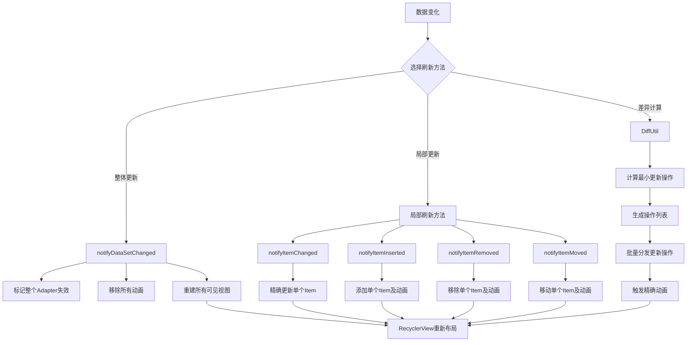
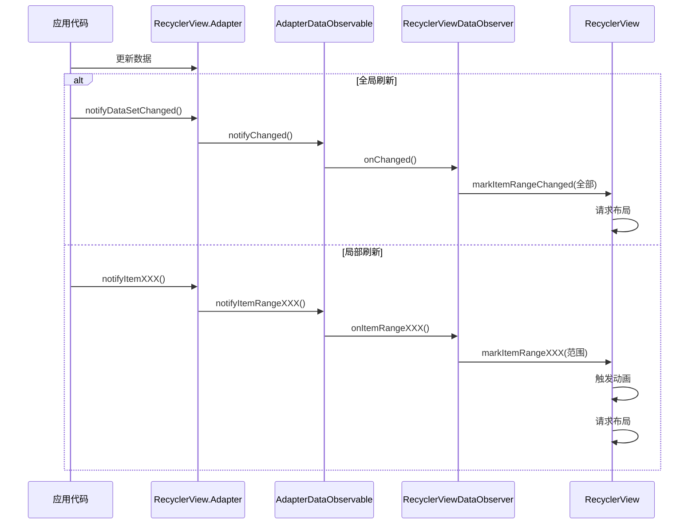

# RecyclerView数据刷新机制

RecyclerView的数据刷新机制是其性能优化的重要方面，合理使用数据刷新机制可以显著提高列表的流畅度和响应速度。本章将深入分析RecyclerView的数据刷新机制，包括不同的刷新方法、DiffUtil工具类的实现原理以及性能优化建议。

## 数据刷新的重要性

在实际应用中，列表的数据经常需要动态更新，例如：
- 网络请求加载新数据
- 用户操作引起的数据变化（如添加、删除、修改）
- 筛选、排序导致的数据重组

高效的数据刷新机制能够：
- 减少不必要的视图创建和绑定操作
- 提供平滑的视觉过渡效果
- 降低CPU和内存占用
- 提升用户体验

## RecyclerView数据刷新方法概览

RecyclerView.Adapter提供了以下几种数据刷新方法：

1. **全局刷新**
   - `notifyDataSetChanged()`：刷新整个列表

2. **局部刷新**
   - `notifyItemChanged(int position)`：刷新指定位置的Item
   - `notifyItemRangeChanged(int positionStart, int itemCount)`：刷新一个范围内的Item
   - `notifyItemInserted(int position)`：通知插入了一个Item
   - `notifyItemRangeInserted(int positionStart, int itemCount)`：通知插入了一个范围的Item
   - `notifyItemRemoved(int position)`：通知移除了一个Item
   - `notifyItemRangeRemoved(int positionStart, int itemCount)`：通知移除了一个范围的Item
   - `notifyItemMoved(int fromPosition, int toPosition)`：通知一个Item位置的移动

## RecyclerView数据刷新流程图





## 全局刷新与局部刷新的区别

### 全局刷新（notifyDataSetChanged）

```java
// 数据变化后
adapter.notifyDataSetChanged();
```

**工作原理**：
- 认为所有数据都已更改，重新绑定所有可见Item
- 无法识别具体的数据变化类型（插入、删除、更新）
- 不会触发默认的Item动画效果

**适用场景**：
- 大量数据同时变化
- 无法确定具体哪些数据变化
- 视觉效果不是主要考虑因素

**缺点**：
- 性能较差，会重新绑定所有可见Item
- 无法展示动画效果，用户体验较差
- 可能导致滚动位置重置

### 局部刷新

```java
// 更新单个Item
adapter.notifyItemChanged(position);

// 插入单个Item
adapter.notifyItemInserted(position);

// 移除单个Item
adapter.notifyItemRemoved(position);

// 移动Item位置
adapter.notifyItemMoved(fromPosition, toPosition);
```

**工作原理**：
- 精确标识数据变化的类型和位置
- 只重新绑定受影响的Item
- 触发相应的Item动画效果

**适用场景**：
- 单个或少量Item变化
- 需要平滑的视觉过渡效果
- 希望保持滚动位置

**优点**：
- 性能更好，只刷新必要的Item
- 提供平滑的动画效果
- 保持滚动位置

## 局部刷新的实现原理

局部刷新的实现基于观察者模式：

1. Adapter中调用notify方法通知数据变化
2. 内部的AdapterDataObservable将通知分发给所有观察者
3. RecyclerView的内部观察者接收通知并处理相应的逻辑
4. 根据通知类型（插入、删除、更新），更新内部状态和UI

以`notifyItemInserted`为例，其内部实现流程：

```java
// 在Adapter中
public final void notifyItemInserted(int position) {
    mObservable.notifyItemRangeInserted(position, 1);
}

// 在AdapterDataObservable中
public void notifyItemRangeInserted(int positionStart, int itemCount) {
    for (int i = mObservers.size() - 1; i >= 0; i--) {
        mObservers.get(i).onItemRangeInserted(positionStart, itemCount);
    }
}

// 在RecyclerView的内部观察者中
void onItemRangeInserted(int positionStart, int itemCount) {
    // 更新内部状态
    // 计算受影响的视图
    // 请求布局更新
    // 触发Item动画
}
```

## 位置变化与刷新的问题

当使用局部刷新方法时，需要注意维护正确的位置信息：

```java
// 移除Item后，之后的Item位置都向前移动了
dataList.remove(position);
adapter.notifyItemRemoved(position);

// 插入Item后，之后的Item位置都向后移动了
dataList.add(position, newItem);
adapter.notifyItemInserted(position);
```

如果处理不当，可能导致以下问题：
- 位置不匹配导致的IndexOutOfBoundsException
- 错误的Item被更新
- 视觉效果异常

为了避免这些问题，需要确保数据集和通知方法的一致性，或者使用更高级的工具如DiffUtil来处理复杂的数据变化。

## 本章内容概览

在接下来的小节中，我们将详细探讨以下内容：

1. **Adapter数据更新**：
   - notifyDataSetChanged的问题及解决方案
   - 局部刷新方法的正确使用

2. **DiffUtil工作原理**：
   - 差异计算算法的实现
   - AsyncListDiffer的使用与原理

通过这些分析，我们将全面理解RecyclerView的数据刷新机制，掌握高效更新列表数据的最佳实践。 