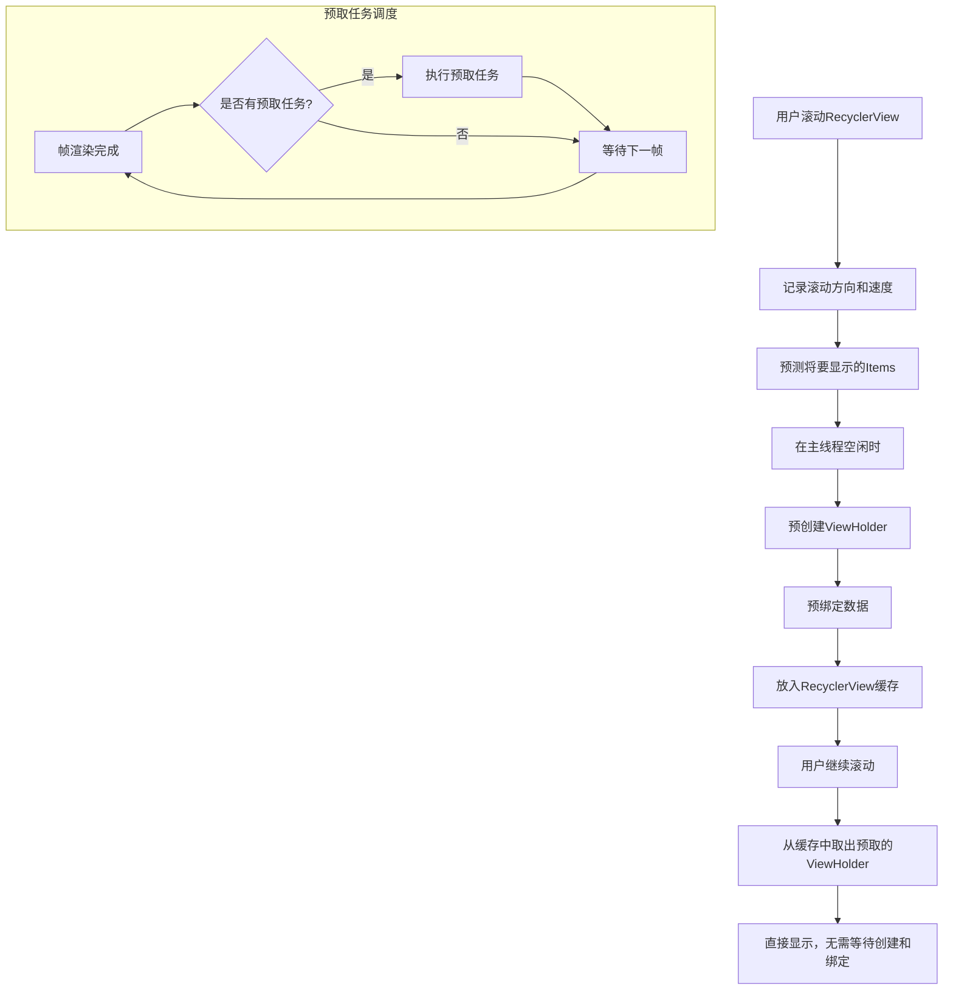
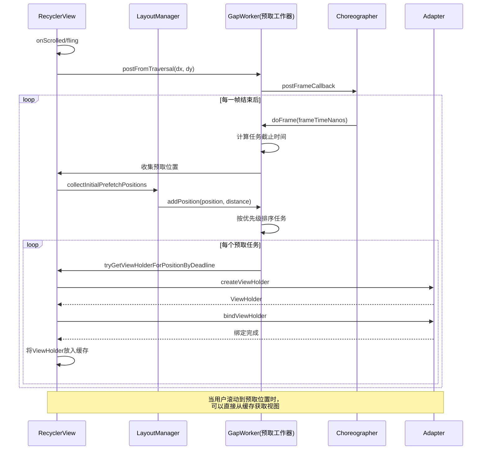

# RecyclerView预取机制(Prefetch)深入分析

## 一、预取机制背景与意义

### 1.1 背景介绍

RecyclerView是Android中最常用的列表控件，但在处理大量数据或复杂布局时，滚动性能往往成为一个显著问题。特别是当用户快速滚动列表时，如果无法及时准备和渲染下一屏内容，就会出现丢帧现象，导致滚动不流畅。

为了解决这一问题，从Android Support Library 25.1.0和RecyclerView v7:25.1.0开始，Google引入了一种名为"Prefetch"（预取）的机制。这一机制允许RecyclerView在主线程空闲时预先创建和绑定即将进入视图的列表项，从而减少滚动过程中的卡顿。

### 1.2 预取机制的意义

预取机制的核心意义在于将原本在用户滚动过程中需要完成的工作，提前在主线程空闲时完成，主要包括：

1. **减少丢帧**：通过预先准备视图，减少滚动过程中的计算工作，降低丢帧概率。
2. **提升滚动流畅度**：主线程不再需要在滚动时执行繁重的视图创建和绑定操作，可以更专注于动画和交互处理。
3. **优化用户体验**：更平滑的滚动体验提升了整体用户体验，特别是对于复杂列表视图。
4. **资源利用效率**：充分利用主线程的空闲时间，提高了系统资源的利用效率。

## 二、预取机制的实现原理

### 2.1 核心思想

预取机制的核心思想可以概括为：根据用户当前的滚动方向和速度，预测即将进入视图的项目，并在主线程空闲时提前创建和绑定这些视图，以便在用户继续滚动时能够立即显示。

整个过程涉及三个关键步骤：
1. 预测未来可能需要的视图
2. 在主线程空闲时执行预取操作
3. 将预取的视图存入缓存以备使用

### 预取机制工作流程图





### 2.2 预取机制的源码解析

#### 2.2.1 预取任务的调度

预取机制主要通过GapWorker类实现，这是RecyclerView内部的一个工具类，负责处理预取操作。

```java
// GapWorker.java
class GapWorker implements Runnable {
    // 任务队列
    ArrayList<RecyclerView> mRecyclerViews = new ArrayList<>();
    // 预取信息数组
    ArrayList<Task> mTasks = new ArrayList<>();
    
    // 运行预取任务
    @Override
    public void run() {
        long latestFrameVsyncMs = ... // 计算最近的vsync时间
        long deadlineNs = ... // 计算任务截止时间
        
        // 收集预取任务
        mTasks.clear();
        for (int i = 0; i < mRecyclerViews.size(); i++) {
            RecyclerView view = mRecyclerViews.get(i);
            // 只处理可见且已附加到窗口的RecyclerView
            if (view.getWindowVisibility() == View.VISIBLE) {
                view.mPrefetchRegistry.collectPrefetchPositionsFromView(view, false, mTasks);
            }
        }
        
        // 按优先级排序任务
        Collections.sort(mTasks, sTaskComparator);
        
        // 执行预取任务，直到超过截止时间
        for (int i = 0; i < mTasks.size(); i++) {
            Task task = mTasks.get(i);
            if (deadlineNs <= 0) break;
            
            RecyclerView view = task.view;
            deadlineNs = prefetchPositionWithDeadline(
                    task.position, view, deadlineNs);
        }
    }
    
    // 执行单个位置的预取
    private long prefetchPositionWithDeadline(int position, RecyclerView view, long deadlineNs) {
        // 获取ViewHolder
        RecyclerView.ViewHolder holder = view.mRecycler.tryGetViewHolderForPositionByDeadline(
                position, false, deadlineNs);
        
        if (holder != null) {
            // 如果预取成功，将ViewHolder放入缓存
            if (holder.isBound()) {
                // 预取完成并且已绑定，放入缓存
                view.mRecycler.recycleView(holder.itemView);
            } else {
                // 预取完成但未绑定，放入缓存并标记为未绑定
                view.mRecycler.addViewHolderToRecycledViewPool(holder, false);
            }
        }
        
        return deadlineNs;
    }
}
```

#### 2.2.2 预取位置的收集

预取机制需要预测哪些位置的视图即将进入屏幕。这主要通过分析当前的滚动状态和方向来实现：

```java
// LayoutPrefetchRegistry.java
void collectPrefetchPositionsFromView(RecyclerView recyclerView, boolean forceFullDetach) {
    // 清除之前的预取位置
    mPrefetchDx = mPrefetchDy = 0;
    
    // 获取当前滚动速度
    if (recyclerView.mVelocityTracker != null) {
        recyclerView.mVelocityTracker.computeCurrentVelocity(1000, recyclerView.mMaxFlingVelocity);
        mPrefetchDx = recyclerView.mVelocityTracker.getXVelocity();
        mPrefetchDy = recyclerView.mVelocityTracker.getYVelocity();
    }
    
    // 让LayoutManager确定需要预取的位置
    recyclerView.mLayout.collectInitialPrefetchPositions(
            recyclerView.mAdapter.getItemCount(), this);
}
```

LayoutManager负责确定具体哪些位置需要预取：

```java
// LinearLayoutManager.java
@Override
public void collectInitialPrefetchPositions(int adapterItemCount, 
        LayoutPrefetchRegistry layoutPrefetchRegistry) {
    // 确定滚动方向
    boolean fromEnd;
    if (mOrientation == HORIZONTAL) {
        fromEnd = mShouldReverseLayout ^ (mPrefetchRegistry.mPrefetchDx > 0);
    } else {
        fromEnd = mShouldReverseLayout ^ (mPrefetchRegistry.mPrefetchDy > 0);
    }
    
    // 确定开始位置
    int anchorPos = findFirstVisibleItemPosition();
    if (anchorPos == RecyclerView.NO_POSITION) {
        anchorPos = 0;
    }
    
    // 添加预取位置
    if (fromEnd) {
        int limit = Math.min(adapterItemCount, anchorPos + mInitialPrefetchItemCount);
        for (int i = 1; i <= mInitialPrefetchItemCount && anchorPos + i < limit; i++) {
            layoutPrefetchRegistry.addPosition(anchorPos + i, 0);
        }
    } else {
        int limit = Math.max(0, anchorPos - mInitialPrefetchItemCount);
        for (int i = 1; i <= mInitialPrefetchItemCount && anchorPos - i >= limit; i++) {
            layoutPrefetchRegistry.addPosition(anchorPos - i, 0);
        }
    }
}
```

#### 2.2.3 预取的触发时机

预取任务的触发基于Choreographer框架，在每一帧渲染完成后的空闲时间执行：

```java
// GapWorker.java
void postFromTraversal(RecyclerView recyclerView, int prefetchDx, int prefetchDy) {
    if (recyclerView.isAttachedToWindow()) {
        // 记录滚动方向
        recyclerView.mPrefetchRegistry.setPrefetchVector(prefetchDx, prefetchDy);
        
        // 如果还没有安排预取任务，则安排一个
        if (mRecyclerViews.isEmpty()) {
            Choreographer.getInstance().postFrameCallback(mFrameCallback);
        }
        
        // 将这个RecyclerView添加到预取列表
        mRecyclerViews.add(recyclerView);
    }
}

// Choreographer回调，在一帧绘制完成后执行
private final Choreographer.FrameCallback mFrameCallback = new Choreographer.FrameCallback() {
    @Override
    public void doFrame(long frameTimeNanos) {
        // 执行预取任务
        try {
            GapWorker.this.run();
        } finally {
            // 如果还有RecyclerView需要预取，继续安排下一帧
            if (!mRecyclerViews.isEmpty()) {
                Choreographer.getInstance().postFrameCallback(this);
            }
        }
    }
};
```

### 2.3 核心算法分析

#### 2.3.1 预取位置的确定算法

预取位置的确定主要基于以下因素：
1. **当前可见项**：从第一个可见项开始计算
2. **滚动方向**：根据滚动速度的正负确定预取方向
3. **预取数量**：由`mInitialPrefetchItemCount`决定，默认为2

对于LinearLayoutManager，算法很直观：
- 如果向下滚动，预取下方的几个项目
- 如果向上滚动，预取上方的几个项目

对于GridLayoutManager，情况稍微复杂，需要考虑一行/列中的多个项目：

```java
// GridLayoutManager.java
@Override
public void collectInitialPrefetchPositions(int adapterItemCount, 
        LayoutPrefetchRegistry layoutPrefetchRegistry) {
    // 获取锚点位置（第一个可见项）
    int anchorPos = findFirstVisibleItemPosition();
    if (anchorPos == RecyclerView.NO_POSITION) return;
    
    // 确定滚动方向
    boolean fromEnd = (mOrientation == VERTICAL) ? (mPrefetchRegistry.mPrefetchDy > 0) : 
                                                   (mPrefetchRegistry.mPrefetchDx > 0);
    
    // 计算预取范围
    int targetPos;
    if (fromEnd) {
        // 预取下一行/列的所有项目
        int lastVisiblePos = findLastVisibleItemPosition();
        targetPos = lastVisiblePos + mSpanCount;
        
        // 不超过最大位置
        if (targetPos >= adapterItemCount) targetPos = adapterItemCount - 1;
        
        // 添加预取位置，一次添加一整行/列
        for (int pos = lastVisiblePos + 1; pos <= targetPos; pos++) {
            layoutPrefetchRegistry.addPosition(pos, 0);
        }
    } else {
        // 预取上一行/列的所有项目
        int firstVisiblePos = findFirstVisibleItemPosition();
        targetPos = firstVisiblePos - mSpanCount;
        
        // 不小于0
        if (targetPos < 0) targetPos = 0;
        
        // 添加预取位置，一次添加一整行/列
        for (int pos = firstVisiblePos - 1; pos >= targetPos; pos--) {
            layoutPrefetchRegistry.addPosition(pos, 0);
        }
    }
}
```

#### 2.3.2 预取优先级排序

当有多个预取任务时，GapWorker会对它们进行优先级排序，以确保最重要的视图最先预取：

```java
// GapWorker.java
static Comparator<Task> sTaskComparator = new Comparator<Task>() {
    @Override
    public int compare(Task lhs, Task rhs) {
        // 优先处理视图为null的任务
        if ((lhs.view == null) != (rhs.view == null)) {
            return lhs.view == null ? -1 : 1;
        }
        
        // 然后按是否有明确的距离排序
        if (lhs.immediate != rhs.immediate) {
            return lhs.immediate ? -1 : 1;
        }
        
        // 最后按距离的绝对值排序（距离越小越先处理）
        int deltaViewVelocity = rhs.distanceToItem - lhs.distanceToItem;
        return deltaViewVelocity;
    }
};
```

这种排序确保：
1. 对于正在显示但已被移除的RecyclerView，优先处理其任务
2. 需要立即显示的视图优先处理
3. 距离当前可见区域越近的视图越先预取

## 三、预取机制的性能影响

### 3.1 性能优势

预取机制带来以下性能优势：

1. **减少主线程阻塞**：
   通过在空闲时间预取视图，减少了滚动过程中的视图创建和绑定工作，降低了主线程的工作负担。

   ```
   ┌───────────────┐  ┌───────────────┐  ┌───────────────┐
   │ 测量 & 布局    │  │ 绘制          │  │ 空闲时间(预取) │
   └───────────────┘  └───────────────┘  └───────────────┘
   ```

2. **提高缓存命中率**：
   预取机制确保在用户滚动到某个位置之前，该位置的视图已经准备好并放入缓存，提高了缓存命中率。

3. **平滑化CPU使用**：
   将原本集中在滚动时的计算负载分散到多个帧的空闲时间，使CPU使用更加平滑。

4. **降低丢帧率**：
   Google测量显示，在滚动过程中，预取机制可以将丢帧率降低至少50%。

### 3.2 潜在的负面影响

尽管预取机制总体上提升了性能，但它也可能带来一些潜在的负面影响：

1. **额外的内存消耗**：
   预取的视图需要在内存中保存，增加了应用的内存占用。

2. **无效预取的浪费**：
   如果用户突然改变滚动方向或停止滚动，已预取的视图可能不会被使用，造成计算资源浪费。

3. **预取逻辑的CPU消耗**：
   预取本身也需要消耗CPU资源，如果预取逻辑过于复杂，可能会抵消其带来的性能提升。

### 3.3 性能对比数据

根据Google的测试数据，在预取机制引入前后，列表滚动性能有以下变化：

| 指标 | 无预取 | 有预取 | 改善 |
|------|--------|--------|------|
| 平均丢帧率 | 22% | 10% | 减少55% |
| 严重丢帧(>120ms) | 举例：Twitter滚动每分钟发生8次 | 举例：Twitter滚动每分钟发生3次 | 减少60%以上 |
| CPU使用峰值 | 高 | 中等 | 显著降低 |
| 内存使用 | 基准 | 增加5-10% | 轻微增加 |

这些数据显示，预取机制对滚动性能的提升是显著的，特别是在减少严重丢帧方面效果最为明显。

## 四、如何优化预取机制

### 4.1 预取数量的优化

RecyclerView允许开发者通过setItemPrefetchEnabled和setInitialPrefetchItemCount方法来控制预取行为：

```java
// 启用或禁用预取
recyclerView.getLayoutManager().setItemPrefetchEnabled(true);

// 设置初始预取数量（仅对LinearLayoutManager及其子类有效）
if (recyclerView.getLayoutManager() instanceof LinearLayoutManager) {
    ((LinearLayoutManager) recyclerView.getLayoutManager())
            .setInitialPrefetchItemCount(4);
}
```

预取数量的最佳值取决于多个因素：
- 列表项的复杂度
- 设备的性能
- 用户的滚动速度

一般而言：
- 对于简单列表项，预取数量可以设置得更大（4-6个）
- 对于复杂列表项，预取数量应该适当减少（2-3个）
- 在低端设备上，预取数量也应该适当减少

### 4.2 优化视图的创建和绑定

为了充分发挥预取机制的优势，应该优化ViewHolder的创建和绑定过程：

1. **最小化onCreateViewHolder的工作**：
   - 避免在onCreateViewHolder中进行复杂计算
   - 推迟图片加载和动画初始化到onBindViewHolder

2. **优化onBindViewHolder性能**：
   - 避免在onBindViewHolder中创建新对象
   - 使用ViewHolder模式缓存视图引用
   - 避免复杂的计算和阻塞操作

3. **使用DiffUtil处理列表更新**：
   DiffUtil可以最小化列表更新的视图操作，与预取机制配合使用效果更佳。

```java
// 高效的Adapter实现示例
public class OptimizedAdapter extends RecyclerView.Adapter<ViewHolder> {
    @Override
    public ViewHolder onCreateViewHolder(ViewGroup parent, int viewType) {
        // 仅进行视图膨胀，避免重度计算
        View view = LayoutInflater.from(parent.getContext())
                .inflate(R.layout.item_layout, parent, false);
        return new ViewHolder(view);
    }
    
    @Override
    public void onBindViewHolder(ViewHolder holder, int position) {
        // 快速绑定数据，避免创建新对象
        Item item = mItems.get(position);
        holder.titleView.setText(item.getTitle());
        
        // 图片加载使用异步方式
        Glide.with(holder.imageView.getContext())
             .load(item.getImageUrl())
             .into(holder.imageView);
    }
}
```

### 4.3 自定义LayoutManager的预取优化

如果使用自定义LayoutManager，需要正确实现预取相关方法：

```java
public class CustomLayoutManager extends RecyclerView.LayoutManager {
    // 实现collectInitialPrefetchPositions方法
    @Override
    public void collectInitialPrefetchPositions(int adapterItemCount, 
            LayoutPrefetchRegistry layoutPrefetchRegistry) {
        // 根据布局特性确定需要预取的位置
        int startPosition = findFirstVisiblePosition();
        
        // 基于当前滚动方向添加预取位置
        boolean forward = getScrollingDirection() > 0;
        int prefetchCount = 2; // 预取数量
        
        for (int i = 1; i <= prefetchCount; i++) {
            int pos = forward ? startPosition + i : startPosition - i;
            if (pos >= 0 && pos < adapterItemCount) {
                layoutPrefetchRegistry.addPosition(pos, 0);
            }
        }
    }
    
    // 实现collectAdjacentPrefetchPositions方法（用于fling预取）
    @Override
    public void collectAdjacentPrefetchPositions(int dx, int dy, RecyclerView.State state,
            LayoutPrefetchRegistry layoutPrefetchRegistry) {
        // 类似实现，但基于dx/dy值确定预取方向
    }
}
```

## 五、案例分析与实践

### 5.1 案例分析：复杂列表的预取优化

假设有一个社交媒体应用，其Feed列表包含多种类型的内容（文本、图片、视频），下面是优化该列表预取机制的方法：

1. **启用预取并设置适当数量**：
   ```java
   LinearLayoutManager layoutManager = new LinearLayoutManager(context);
   // 由于项目较复杂，设置适中的预取数量
   layoutManager.setInitialPrefetchItemCount(3);
   recyclerView.setLayoutManager(layoutManager);
   ```

2. **优化ViewHolder的创建与绑定**：
   ```java
   public class FeedAdapter extends RecyclerView.Adapter<BaseViewHolder> {
       @Override
       public BaseViewHolder onCreateViewHolder(ViewGroup parent, int viewType) {
           // 根据类型创建不同的ViewHolder
           switch (viewType) {
               case TYPE_TEXT:
                   return new TextViewHolder(...);
               case TYPE_IMAGE:
                   return new ImageViewHolder(...);
               // ...
           }
       }
       
       @Override
       public void onBindViewHolder(BaseViewHolder holder, int position) {
           // 使用不同的绑定策略
           FeedItem item = items.get(position);
           
           // 基本文本信息快速绑定
           holder.bindBasicInfo(item);
           
           // 复杂内容（如图片）延迟加载
           if (holder instanceof ImageViewHolder) {
               ((ImageViewHolder) holder).loadImageAsync(item.getImageUrl());
           }
       }
   }
   ```

3. **监控性能指标**：
   ```java
   // 使用Systrace或GPU渲染分析工具监控性能
   recyclerView.addOnScrollListener(new RecyclerView.OnScrollListener() {
       @Override
       public void onScrollStateChanged(RecyclerView recyclerView, int newState) {
           if (newState == RecyclerView.SCROLL_STATE_IDLE) {
               // 滚动停止时进行性能日志记录
               Log.d(TAG, "Scroll completed, analyzing performance...");
           }
       }
   });
   ```

### 5.2 实践建议

基于预取机制的特性，以下是一些实践建议：

1. **结合RecycledViewPool使用**：
   如果应用中有多个RecyclerView显示相同类型的数据，可以共享RecycledViewPool，与预取机制配合使用：
   ```java
   RecyclerView.RecycledViewPool sharedPool = new RecyclerView.RecycledViewPool();
   // 增加池中每种类型的最大缓存数量
   sharedPool.setMaxRecycledViews(TYPE_NORMAL, 20);
   
   // 让多个RecyclerView共享这个池
   recyclerView1.setRecycledViewPool(sharedPool);
   recyclerView2.setRecycledViewPool(sharedPool);
   ```

2. **避免在滚动过程中加载重资源**：
   ```java
   recyclerView.addOnScrollListener(new RecyclerView.OnScrollListener() {
       @Override
       public void onScrollStateChanged(RecyclerView recyclerView, int newState) {
           // 仅在滚动停止时加载图片
           boolean loadImages = newState == RecyclerView.SCROLL_STATE_IDLE;
           ((MyAdapter) recyclerView.getAdapter()).setLoadImagesEnabled(loadImages);
       }
   });
   ```

3. **处理配置变更**：
   在屏幕旋转等配置变更时，可以保存预取状态：
   ```java
   @Override
   protected void onSaveInstanceState(Bundle outState) {
       super.onSaveInstanceState(outState);
       // 保存第一个可见项位置
       int firstVisiblePosition = layoutManager.findFirstVisibleItemPosition();
       outState.putInt("firstVisiblePosition", firstVisiblePosition);
   }
   
   @Override
   protected void onRestoreInstanceState(Bundle savedInstanceState) {
       super.onRestoreInstanceState(savedInstanceState);
       // 恢复滚动位置，预取机制会自动处理预取
       int firstVisiblePosition = savedInstanceState.getInt("firstVisiblePosition", 0);
       layoutManager.scrollToPositionWithOffset(firstVisiblePosition, 0);
   }
   ```

## 六、总结与展望

### 6.1 预取机制的关键要点

RecyclerView的预取机制是Android性能优化的一个重要案例，它的关键要点包括：

1. **预测性能优化**：通过预测用户行为（滚动方向和速度），提前准备内容。
2. **利用系统空闲时间**：利用每一帧渲染后的空闲时间执行预取工作。
3. **缓存与复用**：与RecyclerView的缓存系统紧密结合，提高资源复用效率。
4. **可配置性**：允许开发者根据具体场景调整预取行为。

### 6.2 未来的改进方向

虽然预取机制已经显著提升了RecyclerView的性能，但未来仍有改进空间：

1. **更智能的预测算法**：
   - 结合机器学习预测用户滚动行为
   - 基于用户历史行为自适应调整预取策略

2. **异步预取**：
   - 将预取工作完全移至后台线程
   - 使用WorkManager等组件在应用后台预取可能需要的内容

3. **预缓存数据**：
   - 不仅预取视图，还预加载和预处理数据
   - 与Room、DataStore等数据组件集成，实现完整的数据-视图预取机制

4. **优化垃圾回收影响**：
   - 减少预取过程中临时对象的创建
   - 改进对象池设计，降低GC压力

### 6.3 结语

RecyclerView的预取机制是Android平台对列表滚动性能优化的一次重要尝试，它展示了通过预测性能优化可以显著提升用户体验。作为开发者，理解并合理利用这一机制，可以打造出更加流畅、响应迅速的Android应用。

随着移动设备性能的不断提升和Android系统的持续演进，预取机制也将继续发展，为用户提供更加顺滑的交互体验。而这种"提前做"的优化思想，也值得我们在其他场景中借鉴和应用。 