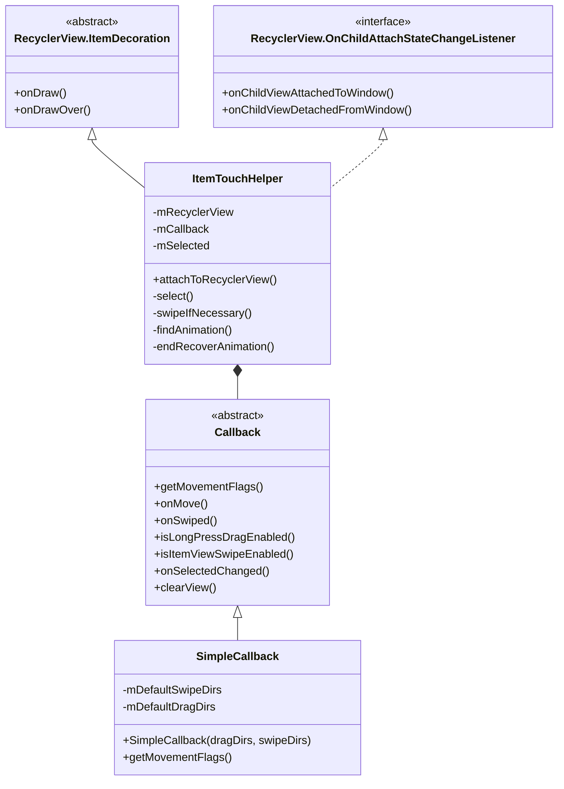
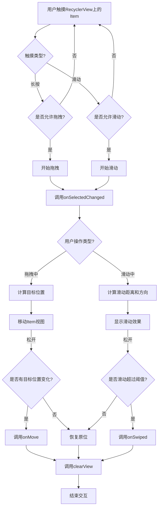
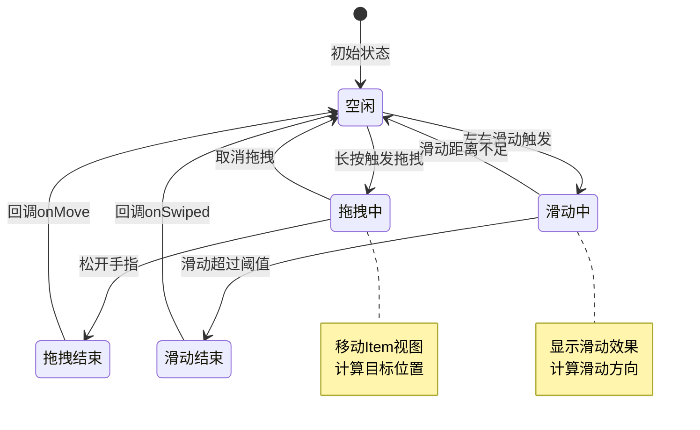

# ItemTouchHelper深入解析

在RecyclerView的众多扩展功能中，ItemTouchHelper是一个非常强大的工具类，它为RecyclerView提供了拖拽排序和滑动删除等交互功能。本章将深入分析ItemTouchHelper的实现原理和使用方法，帮助开发者更好地理解和应用这一组件。

## ItemTouchHelper概述

ItemTouchHelper是RecyclerView库提供的一个实用工具类，它继承自RecyclerView.ItemDecoration并实现了RecyclerView.OnChildAttachStateChangeListener接口。通过这个类，开发者可以轻松实现以下功能：

- **拖拽排序**：用户长按并拖动Item改变其在列表中的位置
- **滑动删除**：用户左右滑动Item将其从列表中删除
- **自定义交互行为**：根据需求定制拖拽和滑动的视觉效果和触发条件

ItemTouchHelper的基本用法如下：

```java
ItemTouchHelper itemTouchHelper = new ItemTouchHelper(new ItemTouchHelper.Callback() {
    // 实现必要的回调方法
});
itemTouchHelper.attachToRecyclerView(recyclerView);
```

## ItemTouchHelper类结构和工作流程







## 核心工作原理

ItemTouchHelper的工作原理可以分为以下几个方面：

### 1. 手势检测

ItemTouchHelper通过拦截RecyclerView的触摸事件来检测用户的手势动作：

```java
@Override
public boolean onInterceptTouchEvent(RecyclerView rv, MotionEvent event) {
    // 检测用户手势，如长按、滑动等
    // 根据手势类型触发相应的操作
}
```

当用户进行长按或滑动操作时，ItemTouchHelper会结合Callback中定义的规则判断是否应该触发拖拽或滑动操作。

### 2. 移动标志位系统

ItemTouchHelper使用一个巧妙的标志位系统来表示支持的拖拽和滑动方向：

```java
// 在Callback中定义
public static int makeMovementFlags(int dragFlags, int swipeFlags) {
    return makeFlag(ACTION_STATE_IDLE, swipeFlags | dragFlags) |
            makeFlag(ACTION_STATE_SWIPE, swipeFlags) |
            makeFlag(ACTION_STATE_DRAG, dragFlags);
}
```

通过这个标志位系统，开发者可以为不同的ViewHolder定义不同的交互规则，例如：

```java
@Override
public int getMovementFlags(RecyclerView recyclerView, ViewHolder viewHolder) {
    // 支持上下拖拽和左右滑动
    int dragFlags = ItemTouchHelper.UP | ItemTouchHelper.DOWN;
    int swipeFlags = ItemTouchHelper.START | ItemTouchHelper.END;
    return makeMovementFlags(dragFlags, swipeFlags);
}
```

### 3. 视觉反馈

ItemTouchHelper通过操作Item的视图属性（如平移、旋转、缩放）来提供视觉反馈：

```java
void moveIfNecessary(ViewHolder viewHolder) {
    // 计算新位置
    // 更新视图的属性
    // 触发动画
}
```

同时，开发者可以通过重写Callback中的方法来自定义视觉效果：

```java
@Override
public void onSelectedChanged(ViewHolder viewHolder, int actionState) {
    // 当Item被选中进行拖拽或滑动时的视觉效果
}

@Override
public void clearView(RecyclerView recyclerView, ViewHolder viewHolder) {
    // 当拖拽或滑动结束时恢复Item的视觉状态
}
```

### 4. 数据同步

ItemTouchHelper会在用户操作完成后调用Callback中的onMove或onSwiped方法，开发者需要在这些方法中更新数据集并刷新Adapter：

```java
@Override
public boolean onMove(RecyclerView recyclerView, ViewHolder source, ViewHolder target) {
    // 获取源位置和目标位置
    int fromPosition = source.getAdapterPosition();
    int toPosition = target.getAdapterPosition();
    
    // 更新数据集
    Collections.swap(dataList, fromPosition, toPosition);
    
    // 刷新Adapter
    adapter.notifyItemMoved(fromPosition, toPosition);
    
    return true;
}

@Override
public void onSwiped(ViewHolder viewHolder, int direction) {
    // 获取滑动的Item位置
    int position = viewHolder.getAdapterPosition();
    
    // 从数据集中移除
    dataList.remove(position);
    
    // 刷新Adapter
    adapter.notifyItemRemoved(position);
}
```

## 使用ItemTouchHelper的最佳实践

1. **创建自定义的Callback类**：
   - 为了更好地组织代码和复用逻辑，通常会创建一个继承自ItemTouchHelper.Callback的自定义类

2. **管理状态和视觉效果**：
   - 在拖拽或滑动状态变化时，提供明确的视觉反馈
   - 使用高亮、阴影、缩放等效果增强用户体验

3. **优化性能**：
   - 避免在拖拽过程中频繁创建对象
   - 使用局部更新而非整体刷新

4. **处理边界情况**：
   - 处理GridLayoutManager和StaggeredGridLayoutManager的特殊情况
   - 考虑Item类型不同的场景

## 本章内容概览

在接下来的小节中，我们将详细探讨以下内容：

1. **拖拽与滑动删除**：
   - 回调接口设计分析
   - 事件处理流程解析

2. **自定义交互行为**：
   - 拖拽效果定制技巧
   - 滑动阈值设置方法

通过这些分析，我们将全面理解ItemTouchHelper的工作机制，掌握如何实现和定制拖拽排序、滑动删除等高级交互功能。 