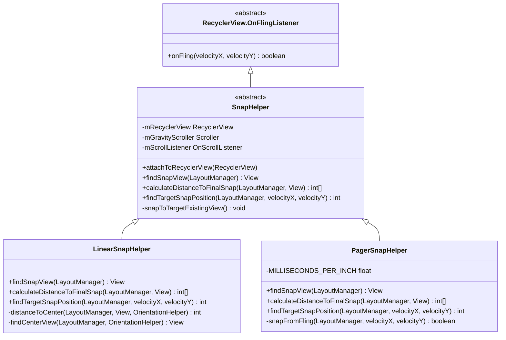
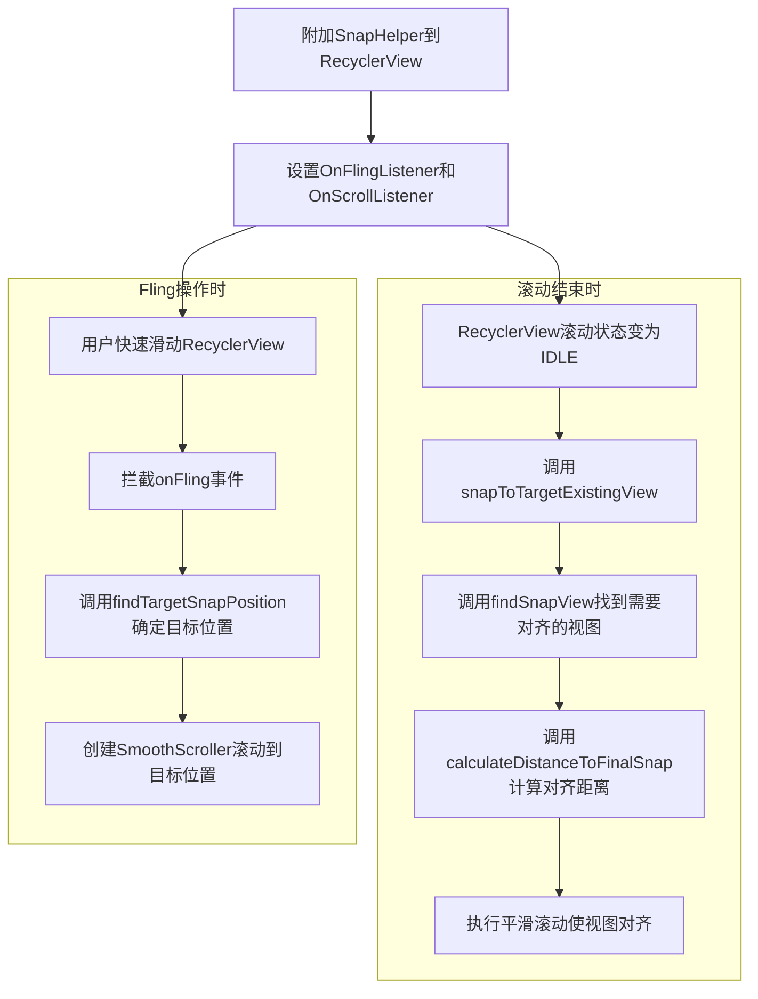
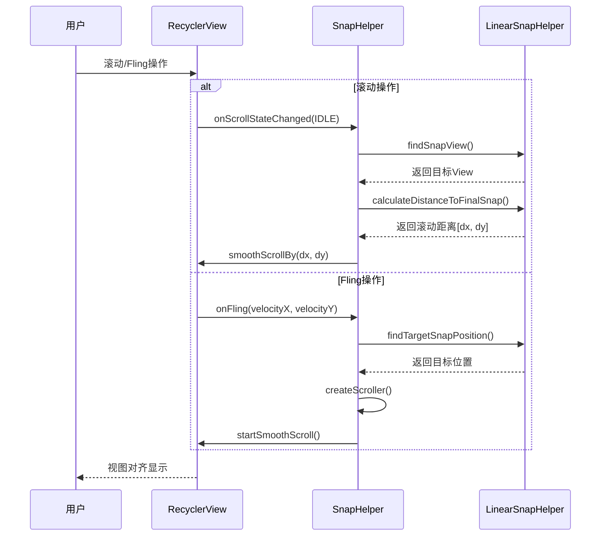

# SnapHelper机制解析

SnapHelper是RecyclerView提供的一个辅助类，用于实现列表项的对齐效果。它可以使RecyclerView在滚动停止时，将某个Item自动对齐到特定位置，例如居中显示或对齐到边缘。本章将深入分析SnapHelper的工作原理、实现机制以及自定义SnapHelper的方法。

## SnapHelper简介

SnapHelper是一个抽象类，用于处理RecyclerView的滚动操作，使Item能够对齐到指定位置。它主要提供以下功能：

- 在滚动结束时将Item对齐到指定位置
- 处理快速滑动(fling)操作，使其停止在合适的位置
- 支持水平和垂直方向的对齐

Android支持库提供了两个SnapHelper的具体实现：

1. **LinearSnapHelper**：将Item对齐到中心位置
2. **PagerSnapHelper**：类似ViewPager的效果，一次只能滚动一页

## SnapHelper的使用

使用SnapHelper非常简单，只需要创建一个实例并将其附加到RecyclerView：

```java
// 使用LinearSnapHelper
RecyclerView recyclerView = findViewById(R.id.recycler_view);
LinearLayoutManager layoutManager = new LinearLayoutManager(this, LinearLayoutManager.HORIZONTAL, false);
recyclerView.setLayoutManager(layoutManager);
recyclerView.setAdapter(new MyAdapter());

LinearSnapHelper snapHelper = new LinearSnapHelper();
snapHelper.attachToRecyclerView(recyclerView);

// 使用PagerSnapHelper
PagerSnapHelper pagerSnapHelper = new PagerSnapHelper();
pagerSnapHelper.attachToRecyclerView(recyclerView);
```

## SnapHelper的类层次结构与工作流程







## SnapHelper的核心原理

### 基本工作流程

SnapHelper的工作流程可以概括为以下几个步骤：

1. 通过`attachToRecyclerView()`方法附加到RecyclerView
2. 监听RecyclerView的滚动和fling事件
3. 计算需要对齐的目标Item的位置
4. 计算滚动距离，使目标Item对齐到指定位置
5. 执行平滑滚动，完成对齐

### 源码分析

#### 1. 附加到RecyclerView

```java
public void attachToRecyclerView(@Nullable RecyclerView recyclerView) 
        throws IllegalStateException {
    if (mRecyclerView == recyclerView) {
        return; // 已经附加到该RecyclerView，无需重复操作
    }
    if (mRecyclerView != null) {
        destroyCallbacks();
    }
    mRecyclerView = recyclerView;
    if (mRecyclerView != null) {
        setupCallbacks();
        mGravityScroller = new Scroller(mRecyclerView.getContext(),
                new DecelerateInterpolator());
        snapToTargetExistingView();
    }
}
```

这个方法完成以下工作：
- 保存RecyclerView的引用
- 设置回调监听
- 创建一个用于平滑滚动的Scroller
- 对现有视图执行对齐操作

#### 2. 设置回调

```java
private void setupCallbacks() throws IllegalStateException {
    if (mRecyclerView.getOnFlingListener() != null) {
        throw new IllegalStateException("An OnFlingListener is already set.");
    }
    mRecyclerView.addOnScrollListener(mScrollListener);
    mRecyclerView.setOnFlingListener(this);
}
```

SnapHelper实现了OnFlingListener接口，并添加了一个滚动监听器。这使得它能够拦截fling操作并监控滚动状态。

#### 3. 处理fling操作

```java
@Override
public boolean onFling(int velocityX, int velocityY) {
    RecyclerView.LayoutManager layoutManager = mRecyclerView.getLayoutManager();
    if (layoutManager == null) {
        return false;
    }
    RecyclerView.Adapter adapter = mRecyclerView.getAdapter();
    if (adapter == null) {
        return false;
    }
    int minFlingVelocity = mRecyclerView.getMinFlingVelocity();
    return (Math.abs(velocityY) > minFlingVelocity || Math.abs(velocityX) > minFlingVelocity)
            && snapFromFling(layoutManager, velocityX, velocityY);
}
```

当fling操作发生且速度超过最小阈值时，SnapHelper会调用`snapFromFling`方法处理对齐。

#### 4. fling后对齐逻辑

```java
private boolean snapFromFling(@NonNull RecyclerView.LayoutManager layoutManager, int velocityX,
        int velocityY) {
    if (!(layoutManager instanceof RecyclerView.SmoothScroller.ScrollVectorProvider)) {
        return false;
    }

    RecyclerView.SmoothScroller smoothScroller = createScroller(layoutManager);
    if (smoothScroller == null) {
        return false;
    }

    int targetPosition = findTargetSnapPosition(layoutManager, velocityX, velocityY);
    if (targetPosition == RecyclerView.NO_POSITION) {
        return false;
    }

    smoothScroller.setTargetPosition(targetPosition);
    layoutManager.startSmoothScroll(smoothScroller);
    return true;
}
```

这个方法执行以下操作：
- 检查LayoutManager是否支持提供滚动向量
- 创建一个平滑滚动器
- 计算目标对齐位置
- 启动平滑滚动到目标位置

#### 5. 滚动监听器

```java
private final RecyclerView.OnScrollListener mScrollListener =
        new RecyclerView.OnScrollListener() {
    @Override
    public void onScrollStateChanged(RecyclerView recyclerView, int newState) {
        if (newState == RecyclerView.SCROLL_STATE_IDLE && mRecyclerView != null) {
            snapToTargetExistingView();
        }
    }
};
```

当滚动状态变为IDLE（停止滚动）时，SnapHelper会调用`snapToTargetExistingView`方法，将当前视图对齐到目标位置。

#### 6. 对齐现有视图

```java
void snapToTargetExistingView() {
    if (mRecyclerView == null) {
        return;
    }
    RecyclerView.LayoutManager layoutManager = mRecyclerView.getLayoutManager();
    if (layoutManager == null) {
        return;
    }
    View targetView = findSnapView(layoutManager);
    if (targetView == null) {
        return;
    }
    int[] snapDistance = calculateDistanceToFinalSnap(layoutManager, targetView);
    if (snapDistance[0] != 0 || snapDistance[1] != 0) {
        mRecyclerView.smoothScrollBy(snapDistance[0], snapDistance[1]);
    }
}
```

这个方法包含以下步骤：
- 查找需要对齐的目标视图
- 计算目标视图到对齐位置的距离
- 执行平滑滚动以完成对齐

### 核心抽象方法

SnapHelper定义了三个核心抽象方法，需要子类实现：

#### 1. findSnapView

```java
@Nullable
public abstract View findSnapView(RecyclerView.LayoutManager layoutManager);
```

此方法负责找到当前应该对齐的视图。在滚动停止时，SnapHelper会调用此方法确定哪个视图应该被对齐。

#### 2. calculateDistanceToFinalSnap

```java
public abstract int[] calculateDistanceToFinalSnap(@NonNull RecyclerView.LayoutManager layoutManager,
        @NonNull View targetView);
```

此方法计算目标视图到对齐位置的距离。返回一个包含x和y方向距离的数组。

#### 3. findTargetSnapPosition

```java
public abstract int findTargetSnapPosition(RecyclerView.LayoutManager layoutManager,
        int velocityX, int velocityY);
```

此方法根据fling速度确定应该滚动到哪个位置。用于处理快速滑动操作。

## LinearSnapHelper实现分析

LinearSnapHelper是SnapHelper的一个具体实现，它将Item对齐到RecyclerView的中心位置。

### findSnapView实现

```java
@Override
public View findSnapView(RecyclerView.LayoutManager layoutManager) {
    if (layoutManager instanceof LinearLayoutManager) {
        // 如果是垂直方向
        if (layoutManager.canScrollVertically()) {
            return findCenterView(layoutManager, getVerticalHelper(layoutManager));
        } 
        // 如果是水平方向
        else if (layoutManager.canScrollHorizontally()) {
            return findCenterView(layoutManager, getHorizontalHelper(layoutManager));
        }
    }
    return null;
}

private View findCenterView(RecyclerView.LayoutManager layoutManager,
        OrientationHelper helper) {
    int childCount = layoutManager.getChildCount();
    if (childCount == 0) {
        return null;
    }

    View closestChild = null;
    final int center = helper.getStartAfterPadding() + helper.getTotalSpace() / 2;
    int absClosest = Integer.MAX_VALUE;

    for (int i = 0; i < childCount; i++) {
        final View child = layoutManager.getChildAt(i);
        int childCenter = helper.getDecoratedStart(child) + 
                (helper.getDecoratedMeasurement(child) / 2);
        int absDistance = Math.abs(childCenter - center);

        if (absDistance < absClosest) {
            absClosest = absDistance;
            closestChild = child;
        }
    }
    return closestChild;
}
```

这个方法查找最接近RecyclerView中心点的Item视图。它计算每个子视图的中心点与RecyclerView中心点的距离，返回距离最小的那个。

### calculateDistanceToFinalSnap实现

```java
@Override
public int[] calculateDistanceToFinalSnap(@NonNull RecyclerView.LayoutManager layoutManager,
        @NonNull View targetView) {
    int[] out = new int[2];
    if (layoutManager.canScrollHorizontally()) {
        out[0] = distanceToCenter(layoutManager, targetView,
                getHorizontalHelper(layoutManager));
    } else {
        out[0] = 0;
    }

    if (layoutManager.canScrollVertically()) {
        out[1] = distanceToCenter(layoutManager, targetView,
                getVerticalHelper(layoutManager));
    } else {
        out[1] = 0;
    }
    return out;
}

private int distanceToCenter(@NonNull RecyclerView.LayoutManager layoutManager,
        @NonNull View targetView, OrientationHelper helper) {
    final int childCenter = helper.getDecoratedStart(targetView) +
            (helper.getDecoratedMeasurement(targetView) / 2);
    final int containerCenter = helper.getStartAfterPadding() + helper.getTotalSpace() / 2;
    return childCenter - containerCenter;
}
```

该方法计算目标视图到RecyclerView中心的距离，分别计算水平和垂直方向上的距离。

### findTargetSnapPosition实现

```java
@Override
public int findTargetSnapPosition(RecyclerView.LayoutManager layoutManager, int velocityX,
        int velocityY) {
    if (!(layoutManager instanceof RecyclerView.SmoothScroller.ScrollVectorProvider)) {
        return RecyclerView.NO_POSITION;
    }

    final int itemCount = layoutManager.getItemCount();
    if (itemCount == 0) {
        return RecyclerView.NO_POSITION;
    }

    final View currentView = findSnapView(layoutManager);
    if (currentView == null) {
        return RecyclerView.NO_POSITION;
    }

    final int currentPosition = layoutManager.getPosition(currentView);
    if (currentPosition == RecyclerView.NO_POSITION) {
        return RecyclerView.NO_POSITION;
    }

    RecyclerView.SmoothScroller.ScrollVectorProvider vectorProvider =
            (RecyclerView.SmoothScroller.ScrollVectorProvider) layoutManager;
    
    // 获取滚动向量
    PointF vectorForEnd = vectorProvider.computeScrollVectorForPosition(itemCount - 1);
    if (vectorForEnd == null) {
        return RecyclerView.NO_POSITION;
    }

    int hDeltaJump = 0;
    if (layoutManager.canScrollHorizontally()) {
        hDeltaJump = estimateNextPositionDiffForFling(layoutManager,
                getHorizontalHelper(layoutManager), velocityX, 0);
        if (vectorForEnd.x < 0) {
            hDeltaJump = -hDeltaJump;
        }
    }

    int vDeltaJump = 0;
    if (layoutManager.canScrollVertically()) {
        vDeltaJump = estimateNextPositionDiffForFling(layoutManager,
                getVerticalHelper(layoutManager), 0, velocityY);
        if (vectorForEnd.y < 0) {
            vDeltaJump = -vDeltaJump;
        }
    }

    int deltaJump = layoutManager.canScrollVertically() ? vDeltaJump : hDeltaJump;
    if (deltaJump == 0) {
        return RecyclerView.NO_POSITION;
    }

    int targetPos = currentPosition + deltaJump;
    if (targetPos < 0) {
        targetPos = 0;
    }
    if (targetPos >= itemCount) {
        targetPos = itemCount - 1;
    }
    return targetPos;
}
```

该方法根据fling速度计算目标位置。它先估算滚动距离可以跨越多少个Item，然后根据当前位置计算目标位置。

## PagerSnapHelper实现分析

PagerSnapHelper是SnapHelper的另一个实现，它提供类似ViewPager的分页效果，一次只能滚动一页。

### 与LinearSnapHelper的主要区别

PagerSnapHelper与LinearSnapHelper的主要区别在于：

1. **滚动限制**：PagerSnapHelper会确保一次只能滚动一个Item
2. **判断标准**：它使用更严格的标准决定是否需要对齐
3. **触发阈值**：它有更高的触发fling的速度阈值

### findTargetSnapPosition实现

```java
@Override
public int findTargetSnapPosition(RecyclerView.LayoutManager layoutManager, int velocityX,
        int velocityY) {
    // 类似LinearSnapHelper的实现，但有一些差异
    // ...
    
    if (layoutManager.canScrollHorizontally()) {
        // 水平方向只移动一个位置
        if (velocityX > 0) {
            targetPos = currentPosition + 1;
        } else {
            targetPos = currentPosition - 1;
        }
    } else if (layoutManager.canScrollVertically()) {
        // 垂直方向只移动一个位置
        if (velocityY > 0) {
            targetPos = currentPosition + 1;
        } else {
            targetPos = currentPosition - 1;
        }
    }
    
    // ...
    return targetPos;
}
```

PagerSnapHelper的`findTargetSnapPosition`实现更简单，它根据速度方向决定是向前还是向后移动一个位置。

### 额外的fling限制

PagerSnapHelper重写了`snapFromFling`方法，添加了额外的速度阈值检查：

```java
@Override
protected boolean snapFromFling(@NonNull RecyclerView.LayoutManager layoutManager, int velocityX,
        int velocityY) {
    if (!(layoutManager instanceof RecyclerView.SmoothScroller.ScrollVectorProvider)) {
        return false;
    }

    // 添加最小fling速度阈值检查
    int MIN_VELOCITY_FOR_SNAP = 400; // 示例值
    if (Math.abs(velocityX) < MIN_VELOCITY_FOR_SNAP 
            && Math.abs(velocityY) < MIN_VELOCITY_FOR_SNAP) {
        return false;
    }
    
    // 其余逻辑与父类相似
    // ...
}
```

这个阈值确保只有足够快的滑动才会触发翻页，提供更接近ViewPager的体验。

## 自定义SnapHelper

在实际应用中，有时候我们需要自定义SnapHelper来实现特定的对齐效果，例如对齐到左边、右边或特定比例位置。

### 自定义SnapHelper的步骤

1. **继承SnapHelper抽象类**
2. **实现三个核心抽象方法**：
   - `findSnapView`
   - `calculateDistanceToFinalSnap`
   - `findTargetSnapPosition`
3. **根据需要重写其他方法**，如`createScroller`、`snapFromFling`等

### 示例：StartSnapHelper（左对齐）

以下是一个简单的StartSnapHelper实现，它将Item对齐到RecyclerView的起始位置：

```java
public class StartSnapHelper extends SnapHelper {
    
    private OrientationHelper mHorizontalHelper;
    private OrientationHelper mVerticalHelper;
    
    @Nullable
    @Override
    public int[] calculateDistanceToFinalSnap(@NonNull RecyclerView.LayoutManager layoutManager,
            @NonNull View targetView) {
        int[] out = new int[2];
        if (layoutManager.canScrollHorizontally()) {
            out[0] = distanceToStart(targetView, getHorizontalHelper(layoutManager));
        } else {
            out[0] = 0;
        }

        if (layoutManager.canScrollVertically()) {
            out[1] = distanceToStart(targetView, getVerticalHelper(layoutManager));
        } else {
            out[1] = 0;
        }
        return out;
    }

    private int distanceToStart(View targetView, OrientationHelper helper) {
        return helper.getDecoratedStart(targetView) - helper.getStartAfterPadding();
    }

    @Nullable
    @Override
    public View findSnapView(RecyclerView.LayoutManager layoutManager) {
        if (!(layoutManager instanceof LinearLayoutManager)) {
            return null;
        }
        
        if (layoutManager.canScrollHorizontally()) {
            return findStartView(layoutManager, getHorizontalHelper(layoutManager));
        } else if (layoutManager.canScrollVertically()) {
            return findStartView(layoutManager, getVerticalHelper(layoutManager));
        }
        return null;
    }

    private View findStartView(RecyclerView.LayoutManager layoutManager,
            OrientationHelper helper) {
        if (!(layoutManager instanceof LinearLayoutManager)) {
            return null;
        }
        
        LinearLayoutManager linearLayoutManager = (LinearLayoutManager) layoutManager;
        int firstChild = linearLayoutManager.findFirstVisibleItemPosition();
        
        // 特殊情况处理
        if (firstChild == RecyclerView.NO_POSITION) {
            return null;
        }
        
        // 如果第一个可见Item已经完全可见，则选择它
        View firstVisibleChild = layoutManager.findViewByPosition(firstChild);
        if (helper.getDecoratedEnd(firstVisibleChild) >= helper.getDecoratedMeasurement(firstVisibleChild)) {
            return firstVisibleChild;
        }
        
        // 否则使用下一个Item
        if (linearLayoutManager.findLastCompletelyVisibleItemPosition() 
                == layoutManager.getItemCount() - 1) {
            return null;
        }
        
        return layoutManager.findViewByPosition(firstChild + 1);
    }

    @Override
    public int findTargetSnapPosition(RecyclerView.LayoutManager layoutManager, int velocityX,
            int velocityY) {
        // 实现类似LinearSnapHelper的逻辑，但目标是起始位置
        // ...
    }
    
    private OrientationHelper getHorizontalHelper(RecyclerView.LayoutManager layoutManager) {
        if (mHorizontalHelper == null || mHorizontalHelper.getLayoutManager() != layoutManager) {
            mHorizontalHelper = OrientationHelper.createHorizontalHelper(layoutManager);
        }
        return mHorizontalHelper;
    }

    private OrientationHelper getVerticalHelper(RecyclerView.LayoutManager layoutManager) {
        if (mVerticalHelper == null || mVerticalHelper.getLayoutManager() != layoutManager) {
            mVerticalHelper = OrientationHelper.createVerticalHelper(layoutManager);
        }
        return mVerticalHelper;
    }
}
```

## SnapHelper的应用场景

### 1. 横向滚动列表中心对齐

适用于横向滚动的卡片列表，使当前选中的卡片居中显示。

```java
RecyclerView recyclerView = findViewById(R.id.recycler_view);
LinearLayoutManager layoutManager = 
        new LinearLayoutManager(this, LinearLayoutManager.HORIZONTAL, false);
recyclerView.setLayoutManager(layoutManager);
recyclerView.setAdapter(new CardAdapter());

LinearSnapHelper snapHelper = new LinearSnapHelper();
snapHelper.attachToRecyclerView(recyclerView);
```

### 2. 轮播图或ViewPager效果

使用PagerSnapHelper实现类似ViewPager的一页一页滚动效果。

```java
RecyclerView recyclerView = findViewById(R.id.recycler_view);
LinearLayoutManager layoutManager = 
        new LinearLayoutManager(this, LinearLayoutManager.HORIZONTAL, false);
recyclerView.setLayoutManager(layoutManager);
recyclerView.setAdapter(new BannerAdapter());

PagerSnapHelper snapHelper = new PagerSnapHelper();
snapHelper.attachToRecyclerView(recyclerView);
```

### 3. 选择器效果

使用自定义SnapHelper实现选择器效果，如日期选择器、时间选择器等。

```java
RecyclerView recyclerView = findViewById(R.id.recycler_view);
LinearLayoutManager layoutManager = 
        new LinearLayoutManager(this, LinearLayoutManager.VERTICAL, false);
recyclerView.setLayoutManager(layoutManager);
recyclerView.setAdapter(new DatePickerAdapter());

CenterSnapHelper snapHelper = new CenterSnapHelper();
snapHelper.attachToRecyclerView(recyclerView);
```

## 使用SnapHelper的注意事项

1. **LayoutManager兼容性**：
   - SnapHelper主要设计用于LinearLayoutManager和其子类
   - 对于GridLayoutManager和StaggeredGridLayoutManager，可能需要自定义特定行为

2. **单一实例**：
   - 一个RecyclerView只能附加一个OnFlingListener，因此只能使用一个SnapHelper
   - 尝试附加第二个SnapHelper会抛出IllegalStateException

3. **性能考虑**：
   - 复杂的对齐计算可能影响滚动性能
   - 在`findSnapView`和`calculateDistanceToFinalSnap`方法中避免昂贵操作

4. **可访问性**：
   - 使用SnapHelper时，考虑可访问性，确保用户能理解选中状态
   - 可以为当前对齐Item设置内容描述或其他可访问性属性

## 总结

SnapHelper是RecyclerView的一个强大扩展，它提供了灵活的Item对齐功能。通过理解其工作原理并根据需要自定义，我们可以实现各种滚动对齐效果，提升用户体验。

核心要点：
- SnapHelper处理RecyclerView的滚动和fling操作，实现Item对齐
- LinearSnapHelper和PagerSnapHelper是两个内置实现，分别提供中心对齐和分页效果
- 自定义SnapHelper需要实现三个核心方法：`findSnapView`、`calculateDistanceToFinalSnap`和`findTargetSnapPosition`
- SnapHelper适用于多种应用场景，如卡片列表、轮播图、选择器等

在下一节中，我们将探讨对齐效果的具体实现，深入分析PagerSnapHelper和LinearSnapHelper的源码。 