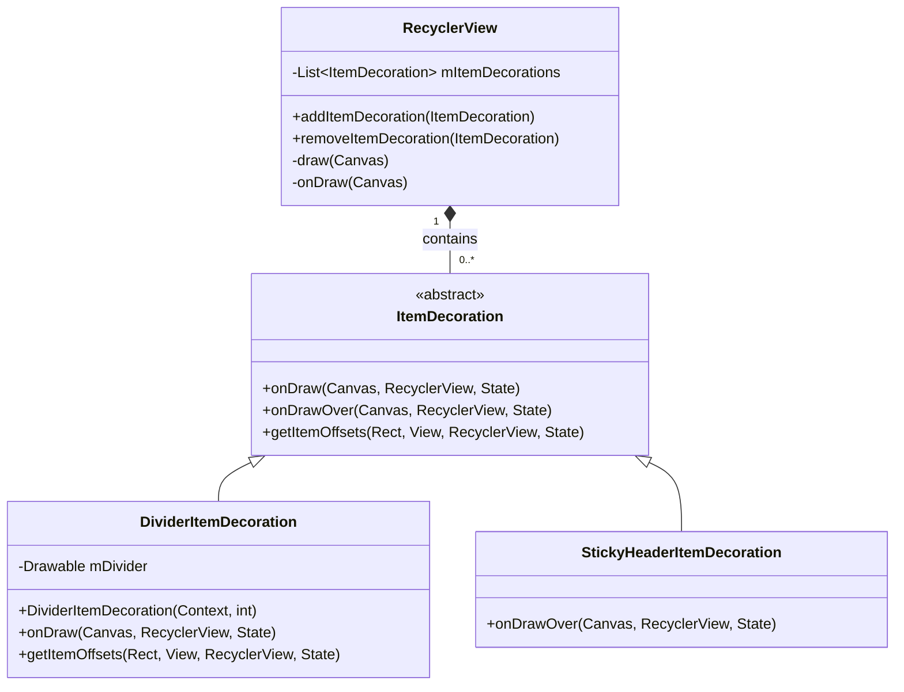
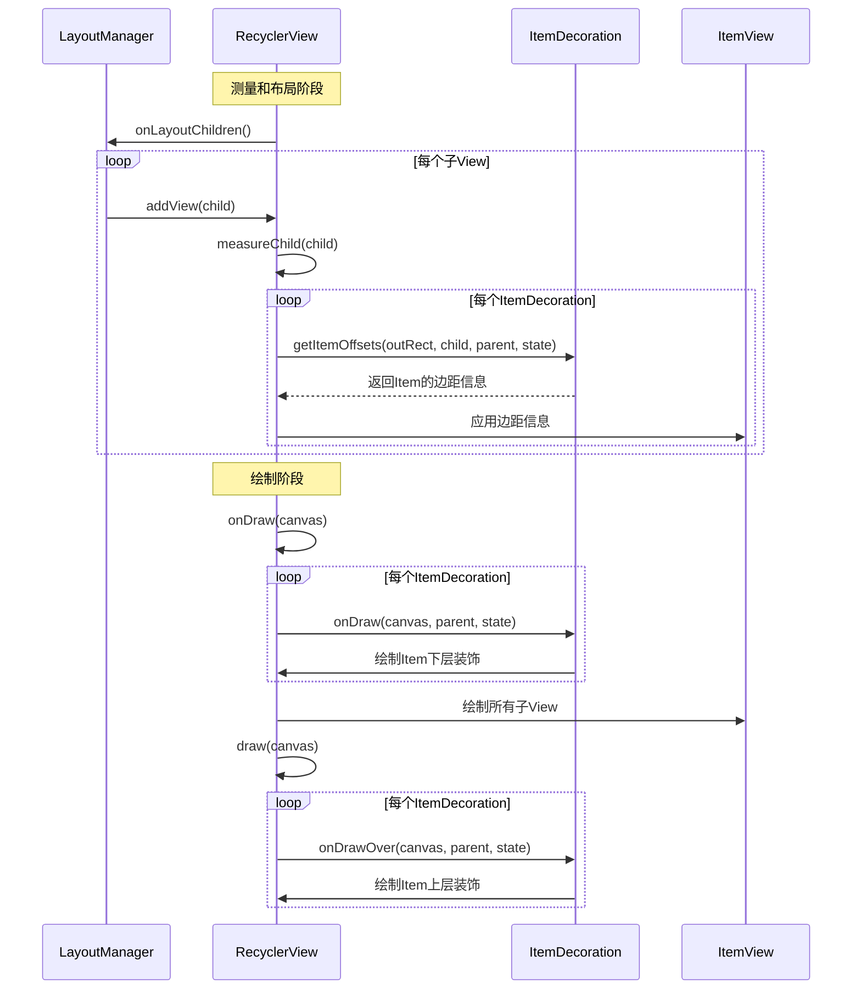
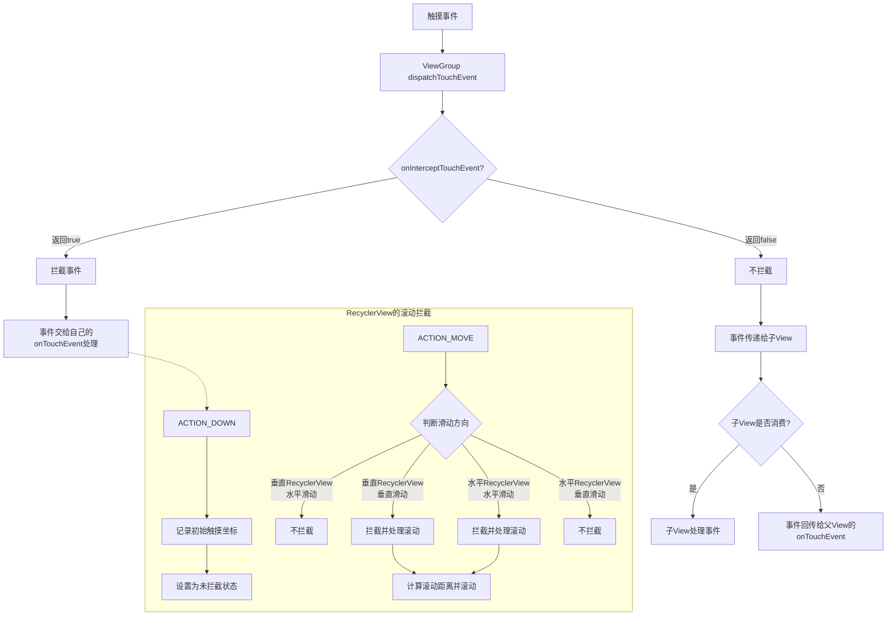
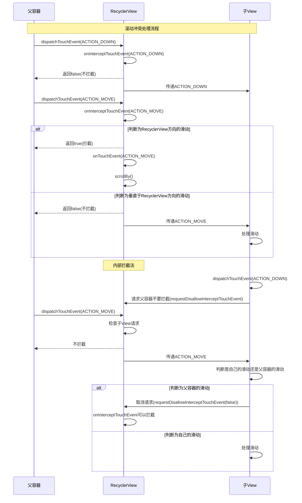

# ItemDecoration与滚动拦截机制深入分析

RecyclerView提供了丰富的扩展功能，以支持各种复杂的UI交互需求。本章将深入分析两个强大的扩展机制：ItemDecoration（装饰器）和滚动拦截机制。这两个机制可以帮助开发者实现各种自定义视觉效果和精细的手势控制。

## 一、ItemDecoration装饰器

### 1.1 ItemDecoration简介

ItemDecoration是RecyclerView提供的一个强大的机制，用于在不修改Adapter的情况下，为列表项添加额外的装饰效果。这些装饰效果包括但不限于：

- 分割线（Divider）
- 边距（Margin）
- 组头组尾（Headers & Footers）
- 高亮效果
- 背景装饰
- 徽章（Badge）

ItemDecoration的设计理念体现了"装饰器模式"，它允许我们在不修改原有对象结构的情况下，动态地向其添加新的职责。

### 1.2 ItemDecoration的工作原理

ItemDecoration是一个抽象类，它定义了三个关键方法：

```java
public abstract static class ItemDecoration {
    // 绘制在item内容之下的装饰
    public void onDraw(Canvas c, RecyclerView parent, State state) {
        onDraw(c, parent);
    }
    
    // 绘制在item内容之上的装饰
    public void onDrawOver(Canvas c, RecyclerView parent, State state) {
        onDrawOver(c, parent);
    }
    
    // 为item设置偏移量，即边距
    public void getItemOffsets(Rect outRect, View view, RecyclerView parent, State state) {
        getItemOffsets(outRect, ((LayoutParams) view.getLayoutParams()).getViewLayoutPosition(),
                parent);
    }
    
    // 兼容旧版本的方法
    @Deprecated
    public void onDraw(Canvas c, RecyclerView parent) {}
    
    @Deprecated
    public void onDrawOver(Canvas c, RecyclerView parent) {}
    
    @Deprecated
    public void getItemOffsets(Rect outRect, int itemPosition, RecyclerView parent) {
        outRect.set(0, 0, 0, 0);
    }
}
```

这三个方法在RecyclerView的绘制流程中被调用：

1. **getItemOffsets**: 在测量和布局阶段被调用，用于为每个Item设置偏移量（Offset），相当于为Item添加了边距。
2. **onDraw**: 在RecyclerView绘制子项内容之前被调用，用于绘制位于Item内容下层的装饰。
3. **onDrawOver**: 在RecyclerView绘制完所有子项内容后被调用，用于绘制位于Item内容上层的装饰。





### 1.3 ItemDecoration在RecyclerView绘制流程中的位置

```java
// RecyclerView.java的draw方法（简化版）
@Override
public void draw(Canvas c) {
    super.draw(c);

    final int count = mItemDecorations.size();
    for (int i = 0; i < count; i++) {
        mItemDecorations.get(i).onDrawOver(c, this, mState);
    }
    // ...
}

// RecyclerView.java的onDraw方法（简化版）
@Override
public void onDraw(Canvas c) {
    super.onDraw(c);

    final int count = mItemDecorations.size();
    for (int i = 0; i < count; i++) {
        mItemDecorations.get(i).onDraw(c, this, mState);
    }
}
```

从源码可以看出，RecyclerView维护了一个ItemDecoration的列表，并在适当的时机调用它们的相应方法。这种设计允许添加多个ItemDecoration，它们会按照添加的顺序被执行。

### 1.4 常见的ItemDecoration实现

#### 1.4.1 DividerItemDecoration

RecyclerView支持库提供了一个基本的分割线实现：DividerItemDecoration。它可以为线性布局的RecyclerView添加简单的分割线。

```java
RecyclerView recyclerView = findViewById(R.id.recycler_view);
LinearLayoutManager layoutManager = new LinearLayoutManager(this);
recyclerView.setLayoutManager(layoutManager);

// 添加分割线
DividerItemDecoration dividerItemDecoration = 
    new DividerItemDecoration(recyclerView.getContext(), layoutManager.getOrientation());
recyclerView.addItemDecoration(dividerItemDecoration);
```

#### 1.4.2 自定义分割线

尽管DividerItemDecoration可以满足基本需求，但在实际应用中，我们常常需要自定义分割线以满足特定的UI需求。以下是一个自定义分割线的例子：

```java
public class CustomDividerItemDecoration extends RecyclerView.ItemDecoration {
    private Paint mPaint;
    private int mDividerHeight;

    public CustomDividerItemDecoration(int color, int dividerHeight) {
        mPaint = new Paint();
        mPaint.setColor(color);
        mPaint.setStyle(Paint.Style.FILL);
        mDividerHeight = dividerHeight;
    }

    @Override
    public void getItemOffsets(Rect outRect, View view, RecyclerView parent, RecyclerView.State state) {
        super.getItemOffsets(outRect, view, parent, state);
        int position = parent.getChildAdapterPosition(view);
        // 为最后一项之外的所有项目底部添加空间
        if (position != parent.getAdapter().getItemCount() - 1) {
            outRect.bottom = mDividerHeight;
        }
    }

    @Override
    public void onDraw(Canvas c, RecyclerView parent, RecyclerView.State state) {
        int left = parent.getPaddingLeft();
        int right = parent.getWidth() - parent.getPaddingRight();

        int childCount = parent.getChildCount();
        for (int i = 0; i < childCount - 1; i++) {
            View child = parent.getChildAt(i);
            RecyclerView.LayoutParams params = (RecyclerView.LayoutParams) child.getLayoutParams();
            
            int top = child.getBottom() + params.bottomMargin;
            int bottom = top + mDividerHeight;
            
            c.drawRect(left, top, right, bottom, mPaint);
        }
    }
}
```

#### 1.4.3 网格布局的分割线

对于GridLayoutManager，我们需要绘制横向和纵向的分割线：

```java
public class GridDividerItemDecoration extends RecyclerView.ItemDecoration {
    private int mDividerWidth;
    private Paint mPaint;
    private int mSpanCount;

    public GridDividerItemDecoration(int spanCount, int dividerWidth, int color) {
        mSpanCount = spanCount;
        mDividerWidth = dividerWidth;
        mPaint = new Paint();
        mPaint.setColor(color);
    }

    @Override
    public void getItemOffsets(Rect outRect, View view, RecyclerView parent, RecyclerView.State state) {
        int position = parent.getChildAdapterPosition(view);
        int column = position % mSpanCount;
        
        outRect.left = column * mDividerWidth / mSpanCount;
        outRect.right = mDividerWidth - (column + 1) * mDividerWidth / mSpanCount;
        
        if (position >= mSpanCount) {
            outRect.top = mDividerWidth;
        }
    }

    @Override
    public void onDraw(Canvas c, RecyclerView parent, RecyclerView.State state) {
        drawHorizontal(c, parent);
        drawVertical(c, parent);
    }

    private void drawHorizontal(Canvas c, RecyclerView parent) {
        // 绘制横向分割线
        // ...
    }

    private void drawVertical(Canvas c, RecyclerView parent) {
        // 绘制纵向分割线
        // ...
    }
}
```

### 1.5 ItemDecoration的高级应用

#### 1.5.1 悬浮标题（Sticky Header）

ItemDecoration不仅可以用于绘制简单的分割线，还可以实现更复杂的效果，如悬浮标题（Sticky Header）。

```java
public class StickyHeaderItemDecoration extends RecyclerView.ItemDecoration {
    private StickyHeaderInterface mListener;
    
    public StickyHeaderItemDecoration(StickyHeaderInterface listener) {
        mListener = listener;
    }

    @Override
    public void onDrawOver(Canvas c, RecyclerView parent, RecyclerView.State state) {
        super.onDrawOver(c, parent, state);
        
        View topChild = parent.getChildAt(0);
        if (topChild == null) {
            return;
        }
        
        int topChildPosition = parent.getChildAdapterPosition(topChild);
        if (topChildPosition == RecyclerView.NO_POSITION) {
            return;
        }
        
        View currentHeader = mListener.getHeaderViewForPosition(topChildPosition);
        fixLayoutSize(parent, currentHeader);
        
        int contactPoint = currentHeader.getBottom();
        View childInContact = getChildInContact(parent, contactPoint);
        
        if (childInContact != null && mListener.isHeader(parent.getChildAdapterPosition(childInContact))) {
            moveHeader(c, currentHeader, childInContact);
            return;
        }
        
        drawHeader(c, currentHeader);
    }
    
    private void drawHeader(Canvas c, View header) {
        c.save();
        c.translate(0, 0);
        header.draw(c);
        c.restore();
    }
    
    private void moveHeader(Canvas c, View currentHeader, View nextHeader) {
        c.save();
        c.translate(0, nextHeader.getTop() - currentHeader.getHeight());
        currentHeader.draw(c);
        c.restore();
    }
    
    private View getChildInContact(RecyclerView parent, int contactPoint) {
        // 查找接触点处的视图
        // ...
    }
    
    private void fixLayoutSize(RecyclerView parent, View view) {
        // 确保视图尺寸正确
        // ...
    }
    
    public interface StickyHeaderInterface {
        boolean isHeader(int position);
        View getHeaderViewForPosition(int position);
    }
}
```

#### 1.5.2 高亮当前选中项

ItemDecoration还可以用于实现选中项高亮效果：

```java
public class SelectedItemDecoration extends RecyclerView.ItemDecoration {
    private Paint mPaint;
    private int mSelectedPosition = -1;
    
    public SelectedItemDecoration(int highlightColor) {
        mPaint = new Paint();
        mPaint.setColor(highlightColor);
        mPaint.setStyle(Paint.Style.FILL);
    }
    
    public void setSelectedPosition(int position) {
        mSelectedPosition = position;
    }
    
    @Override
    public void onDrawOver(Canvas c, RecyclerView parent, RecyclerView.State state) {
        if (mSelectedPosition < 0) {
            return;
        }
        
        for (int i = 0; i < parent.getChildCount(); i++) {
            View child = parent.getChildAt(i);
            int position = parent.getChildAdapterPosition(child);
            
            if (position == mSelectedPosition) {
                c.drawRect(child.getLeft(), child.getTop(), child.getRight(), child.getBottom(), mPaint);
                break;
            }
        }
    }
}
```

### 1.6 ItemDecoration的优化

使用ItemDecoration时，需要注意以下几点以优化性能：

1. **避免在onDraw和onDrawOver中创建对象**：这些方法会在每次绘制时被调用，频繁创建对象会导致GC频繁触发，影响性能。

2. **使用clipRect减少绘制区域**：在绘制大量装饰物时，可以使用Canvas的clipRect方法限制绘制区域，提高绘制效率。

3. **合理使用invalidate**：当装饰效果需要更新时，可以使用RecyclerView的invalidateItemDecorations()方法，而不是完全重绘RecyclerView。

4. **合理组织多个ItemDecoration**：当需要多种装饰效果时，可以考虑将它们合并到一个ItemDecoration中，减少绘制过程中的方法调用。

## 二、滚动拦截机制





### 2.1 触摸事件分发机制回顾

## 三、总结

RecyclerView的ItemDecoration和滚动拦截机制是其强大扩展能力的体现。通过这两个机制，开发者可以实现丰富的UI效果和复杂的交互行为。

### 3.1 ItemDecoration机制的特点

1. **灵活性**：可以绘制各种装饰效果，从简单的分割线到复杂的悬浮标题
2. **不侵入性**：不需要修改Adapter的实现
3. **可组合性**：可以添加多个ItemDecoration，它们会按顺序被调用
4. **性能优化**：通过invalidateItemDecorations()方法可以只更新装饰效果，而不影响列表内容

### 3.2 滚动拦截机制的特点

1. **精细控制**：可以精确控制事件的分发和处理
2. **可扩展性**：OnItemTouchListener接口允许自定义事件处理
3. **嵌套滚动支持**：通过NestedScrollingChild接口支持与其他滚动容器协同工作
4. **组件化**：ItemTouchHelper结合了装饰和事件处理，提供了完整的拖拽和滑动删除功能

通过深入理解这两个机制，开发者可以充分发挥RecyclerView的潜力，实现更丰富、更流畅的用户界面和交互体验。

在下一章中，我们将探讨RecyclerView的性能优化技巧，以及如何利用这些扩展机制实现更复杂的需求。 